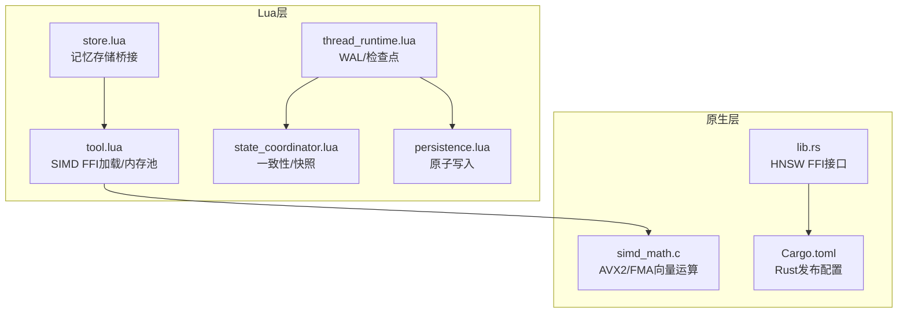
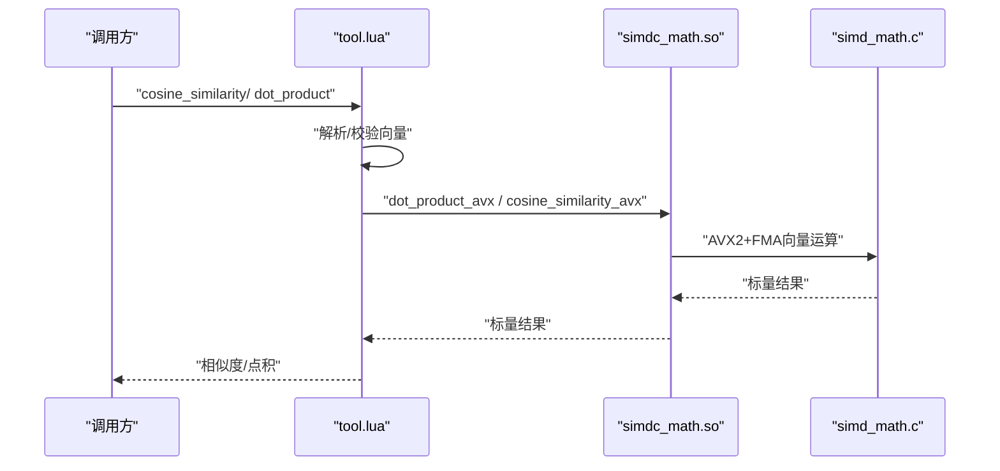
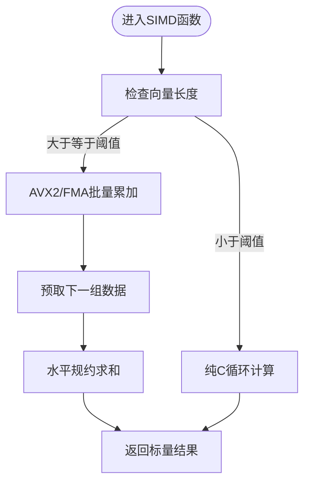
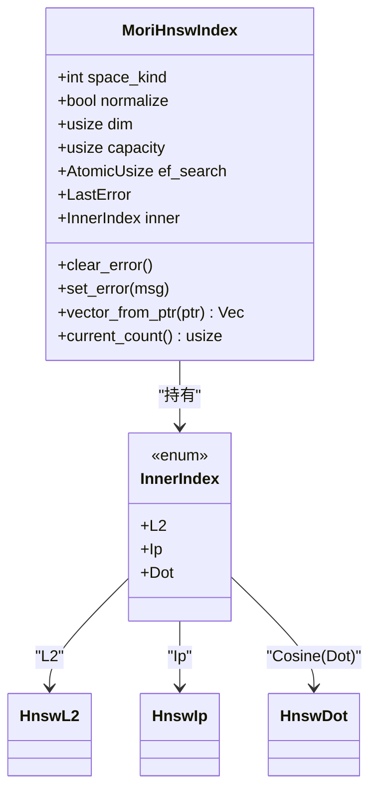
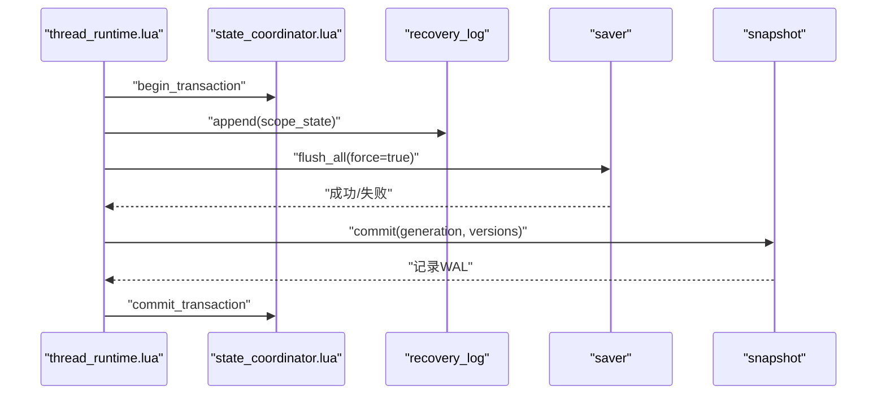
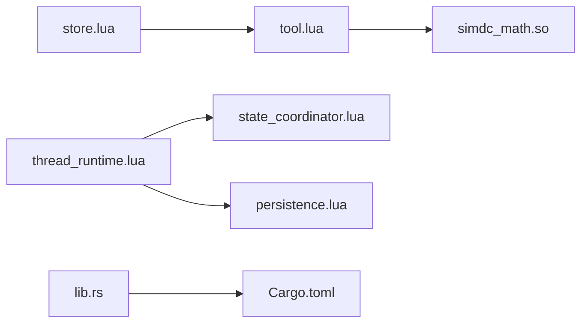

# 性能优化与调优

<cite>
**本文引用的文件**
- [simd_math.c](file://mori_memory/native/simdc_math/simd_math.c)
- [tool.lua](file://mori_memory/module/tool.lua)
- [build_simdc_math.sh](file://mori_memory/scripts/build_simdc_math.sh)
- [build_hnsw_module.sh](file://mori_memory/scripts/build_hnsw_module.sh)
- [Cargo.toml](file://mori_memory/native/hnsw/rust/Cargo.toml)
- [lib.rs](file://mori_memory/native/hnsw/rust/src/lib.rs)
- [thread_runtime.lua](file://mori_memory/module/runtime/thread_runtime.lua)
- [state_coordinator.lua](file://mori_memory/module/state_coordinator.lua)
- [persistence.lua](file://mori_memory/module/persistence.lua)
- [store.lua](file://mori_memory/module/memory/store.lua)
- [20260324_benchmark_rationality_and_memory_gaps.md](file://mori_memory/docs/20260324_benchmark_rationality_and_memory_gaps.md)
- [20260324_level3_benchmark_conclusions_and_next_steps.md](file://mori_memory/docs/20260324_level3_benchmark_conclusions_and_next_steps.md)
- [manifest.json](file://mori_memory/benchmarks/converted/manifest.json)
</cite>

## 目录
1. [简介](#简介)
2. [项目结构](#项目结构)
3. [核心组件](#核心组件)
4. [架构总览](#架构总览)
5. [详细组件分析](#详细组件分析)
6. [依赖分析](#依赖分析)
7. [性能考量](#性能考量)
8. [故障排查指南](#故障排查指南)
9. [结论](#结论)
10. [附录](#附录)

## 简介
本文件面向Mori记忆系统的性能优化与调优，聚焦以下主题：
- 内存池与批量操作：LuaJIT FFI内存池、SIMD加速数学库的批量化调用。
- 缓存策略：原子写入与检查点一致性保障、持久化与WAL配合。
- Rust原生模块编译与优化：AVX2/FMA编译选项、Rust LTO/单编译单元优化。
- SIMD数学库优化：向量化内积与余弦相似度，减少访存与提升吞吐。
- 性能调优指南：参数配置、硬件要求、监控指标与基准测试实践。

## 项目结构
围绕性能优化的关键目录与文件：
- 原生SIMD数学库：native/simdc_math/simd_math.c 与构建脚本 scripts/build_simdc_math.sh
- Rust HNSW索引FFI：native/hnsw/rust/ 与构建脚本 scripts/build_hnsw_module.sh
- Lua侧工具与内存池：mori_memory/module/tool.lua
- 运行时与一致性：module/runtime/thread_runtime.lua、module/state_coordinator.lua
- 原子持久化：module/persistence.lua
- 记忆存储桥接：module/memory/store.lua
- 基准与结论：docs/*.md、benchmarks/converted/manifest.json

**图表来源**
- [tool.lua:1-120](file://mori_memory/module/tool.lua#L1-L120)
- [simd_math.c:1-146](file://mori_memory/native/simdc_math/simd_math.c#L1-L146)
- [lib.rs:1-120](file://mori_memory/native/hnsw/rust/src/lib.rs#L1-L120)
- [Cargo.toml:1-16](file://mori_memory/native/hnsw/rust/Cargo.toml#L1-L16)
- [thread_runtime.lua:1-120](file://mori_memory/module/runtime/thread_runtime.lua#L1-L120)
- [state_coordinator.lua:1-120](file://mori_memory/module/state_coordinator.lua#L1-L120)
- [persistence.lua:1-97](file://mori_memory/module/persistence.lua#L1-L97)
- [store.lua:1-100](file://mori_memory/module/memory/store.lua#L1-L100)

**章节来源**
- [build_simdc_math.sh:1-15](file://mori_memory/scripts/build_simdc_math.sh#L1-L15)
- [build_hnsw_module.sh:1-16](file://mori_memory/scripts/build_hnsw_module.sh#L1-L16)
- [Cargo.toml:1-16](file://mori_memory/native/hnsw/rust/Cargo.toml#L1-L16)

## 核心组件
- SIMD数学库（AVX2/FMA）：提供向量化点积与余弦相似度，支持批量化与预取优化，降低访存与提升吞吐。
- LuaJIT FFI内存池：在tool.lua中通过池化分配float数组，避免频繁GC与临时对象分配。
- 原子持久化与WAL：persistence.lua提供原子替换与写入封装，thread_runtime.lua与state_coordinator.lua结合WAL与检查点保障一致性。
- Rust HNSW FFI：lib.rs导出HNSW检索接口，Cargo.toml启用LTO与单编译单元优化，提升索引构建与查询性能。
- 记忆存储桥接：store.lua将Lua层与底层topic_graph对接，提供批量检索与向量存储接口。

**章节来源**
- [simd_math.c:17-62](file://mori_memory/native/simdc_math/simd_math.c#L17-L62)
- [tool.lua:44-725](file://mori_memory/module/tool.lua#L44-L725)
- [persistence.lua:25-94](file://mori_memory/module/persistence.lua#L25-L94)
- [thread_runtime.lua:110-152](file://mori_memory/module/runtime/thread_runtime.lua#L110-L152)
- [state_coordinator.lua:144-207](file://mori_memory/module/state_coordinator.lua#L144-L207)
- [lib.rs:242-591](file://mori_memory/native/hnsw/rust/src/lib.rs#L242-L591)
- [Cargo.toml:9-15](file://mori_memory/native/hnsw/rust/Cargo.toml#L9-L15)
- [store.lua:45-51](file://mori_memory/module/memory/store.lua#L45-L51)

## 架构总览
Mori记忆系统的性能优化围绕“Lua层工具+原生层加速”的双栈设计展开。Lua侧通过FFI加载原生库，利用SIMD指令与内存池减少分配与访存；原生层通过编译优化与算法向量化提升吞吐；运行时通过WAL与检查点保障一致性，避免回滚带来的重复计算。

**图表来源**
- [tool.lua:618-725](file://mori_memory/module/tool.lua#L618-L725)
- [simd_math.c:17-145](file://mori_memory/native/simdc_math/simd_math.c#L17-L145)

## 详细组件分析

### SIMD数学库与内存池
- 向量化实现要点
  - 使用AVX2与FMA指令，每轮处理8个float累加，减少循环开销。
  - 采用预取指令缓解缓存未命中，提升大向量处理吞吐。
  - 对小向量回退纯C循环，保证通用性与正确性。
- LuaJIT内存池
  - 通过池化分配float数组，避免频繁分配与GC压力。
  - 在tool.lua中维护scratch缓冲区，按维度复用，降低分配次数。
- 性能收益
  - 向量化显著降低访存与ALU占用，适合大规模相似度计算与检索前的预处理。

**图表来源**
- [simd_math.c:17-62](file://mori_memory/native/simdc_math/simd_math.c#L17-L62)
- [tool.lua:49-725](file://mori_memory/module/tool.lua#L49-L725)

**章节来源**
- [simd_math.c:1-146](file://mori_memory/native/simdc_math/simd_math.c#L1-L146)
- [tool.lua:44-725](file://mori_memory/module/tool.lua#L44-L725)

### Rust HNSW FFI与编译优化
- 接口设计
  - 提供创建、加载、保存、插入、搜索、设置ef等完整接口。
  - 支持L2、内积、余弦三种距离空间，按需选择normalize策略。
- 编译优化
  - Cargo.toml启用LTO、单编译单元与最高优化等级，减少函数调用开销与提升整体吞吐。
- 性能影响
  - 发布构建显著降低索引构建与查询的CPU占用，适合高并发检索场景。

**图表来源**
- [lib.rs:17-31](file://mori_memory/native/hnsw/rust/src/lib.rs#L17-L31)
- [lib.rs:173-211](file://mori_memory/native/hnsw/rust/src/lib.rs#L173-L211)
- [Cargo.toml:9-15](file://mori_memory/native/hnsw/rust/Cargo.toml#L9-L15)

**章节来源**
- [lib.rs:242-591](file://mori_memory/native/hnsw/rust/src/lib.rs#L242-L591)
- [Cargo.toml:1-16](file://mori_memory/native/hnsw/rust/Cargo.toml#L1-L16)

### 原子持久化与一致性保障
- 原子写入
  - 通过临时文件+原子替换，避免部分写入导致的数据损坏。
  - 写入回调模式，集中处理打开/关闭/错误与回滚。
- 运行时与状态协调
  - thread_runtime.lua维护WAL、检查点与提交时机，避免丢失。
  - state_coordinator.lua提供版本向量与事务一致性校验，必要时自动创建一致检查点。
- 性能权衡
  - 原子写入与WAL增加I/O，但换取可靠性；可通过批量提交与异步刷盘优化。

**图表来源**
- [thread_runtime.lua:125-152](file://mori_memory/module/runtime/thread_runtime.lua#L125-L152)
- [state_coordinator.lua:75-131](file://mori_memory/module/state_coordinator.lua#L75-L131)
- [state_coordinator.lua:144-207](file://mori_memory/module/state_coordinator.lua#L144-L207)

**章节来源**
- [persistence.lua:25-94](file://mori_memory/module/persistence.lua#L25-L94)
- [thread_runtime.lua:173-201](file://mori_memory/module/runtime/thread_runtime.lua#L173-L201)
- [state_coordinator.lua:144-207](file://mori_memory/module/state_coordinator.lua#L144-L207)

### 记忆存储桥接与批量检索
- 接口职责
  - store.lua向上层提供批量检索、向量存储与预加载接口，屏蔽底层细节。
  - 与topic_graph交互，支持快速相似度检索与向量维度查询。
- 批量优化
  - 结合SIMD与HNSW，批量检索时尽量复用内存池与预取策略，降低冷启动开销。

**章节来源**
- [store.lua:45-51](file://mori_memory/module/memory/store.lua#L45-L51)
- [store.lua:73-97](file://mori_memory/module/memory/store.lua#L73-L97)

## 依赖分析
- Lua侧依赖原生库：tool.lua依赖simdc_math.so提供的AVX2函数。
- 原生层依赖：HNSW FFI依赖Rust库与hnsw_rs，编译配置由Cargo.toml控制。
- 运行时依赖：thread_runtime.lua与state_coordinator.lua共同依赖持久化与快照模块。

**图表来源**
- [tool.lua:10-47](file://mori_memory/module/tool.lua#L10-L47)
- [lib.rs:1-10](file://mori_memory/native/hnsw/rust/src/lib.rs#L1-L10)
- [Cargo.toml:1-16](file://mori_memory/native/hnsw/rust/Cargo.toml#L1-L16)
- [thread_runtime.lua:1-13](file://mori_memory/module/runtime/thread_runtime.lua#L1-L13)
- [state_coordinator.lua:1-13](file://mori_memory/module/state_coordinator.lua#L1-L13)
- [persistence.lua:1-10](file://mori_memory/module/persistence.lua#L1-L10)
- [store.lua:1-3](file://mori_memory/module/memory/store.lua#L1-L3)

**章节来源**
- [tool.lua:10-47](file://mori_memory/module/tool.lua#L10-L47)
- [lib.rs:1-10](file://mori_memory/native/hnsw/rust/src/lib.rs#L1-L10)
- [Cargo.toml:1-16](file://mori_memory/native/hnsw/rust/Cargo.toml#L1-L16)
- [thread_runtime.lua:1-13](file://mori_memory/module/runtime/thread_runtime.lua#L1-L13)
- [state_coordinator.lua:1-13](file://mori_memory/module/state_coordinator.lua#L1-L13)
- [persistence.lua:1-10](file://mori_memory/module/persistence.lua#L1-L10)
- [store.lua:1-3](file://mori_memory/module/memory/store.lua#L1-L3)

## 性能考量
- 编译与链接优化
  - C/C++：使用-O3、-mavx2、-mfma，启用共享库与数学库链接。
  - Rust：启用LTO、单编译单元与最高优化等级，减少函数调用开销。
- 内存与缓存
  - LuaJIT FFI池化分配，避免频繁GC；SIMD批量化减少访存。
  - HNSW查询时合理设置ef_search，兼顾召回与延迟。
- I/O与一致性
  - 原子写入与WAL降低数据损坏风险；批量提交与异步刷盘平衡吞吐与可靠性。
- 基准与监控
  - 基于仓库中的benchmark文档与数据清单，评估不同任务场景下的召回率、精度与稳定性。
  - 监控指标建议：检索延迟、吞吐、WAL序列号、检查点生成频率、持久化耗时。

**章节来源**
- [build_simdc_math.sh:10-12](file://mori_memory/scripts/build_simdc_math.sh#L10-L12)
- [build_hnsw_module.sh:12-13](file://mori_memory/scripts/build_hnsw_module.sh#L12-L13)
- [Cargo.toml:9-15](file://mori_memory/native/hnsw/rust/Cargo.toml#L9-L15)
- [thread_runtime.lua:110-123](file://mori_memory/module/runtime/thread_runtime.lua#L110-L123)
- [state_coordinator.lua:260-292](file://mori_memory/module/state_coordinator.lua#L260-L292)
- [20260324_benchmark_rationality_and_memory_gaps.md:1-585](file://mori_memory/docs/20260324_benchmark_rationality_and_memory_gaps.md#L1-L585)
- [20260324_level3_benchmark_conclusions_and_next_steps.md:1-514](file://mori_memory/docs/20260324_level3_benchmark_conclusions_and_next_steps.md#L1-L514)
- [manifest.json:1-13](file://mori_memory/benchmarks/converted/manifest.json#L1-L13)

## 故障排查指南
- SIMD库加载失败
  - 现象：SIMDC_AVAILABLE为false，SIMDC_LOAD_ERROR记录错误。
  - 排查：确认simdc_math.so已构建且路径正确；检查平台是否支持AVX2/FMA。
- HNSW接口异常
  - 现象：创建/加载/搜索返回失败或空结果。
  - 排查：核对维度、最大容量、ef_search设置；查看全局/实例错误信息。
- 原子写入失败
  - 现象：临时文件残留或替换失败。
  - 排查：检查父目录权限、磁盘空间；确认原子替换流程未被外部进程干扰。
- 检查点不一致
  - 现象：WAL序列不连续或模块版本不匹配。
  - 排查：运行一致性验证，必要时自动创建一致检查点；检查saver与snapshot状态。

**章节来源**
- [tool.lua:31-42](file://mori_memory/module/tool.lua#L31-L42)
- [lib.rs:222-240](file://mori_memory/native/hnsw/rust/src/lib.rs#L222-L240)
- [persistence.lua:25-94](file://mori_memory/module/persistence.lua#L25-L94)
- [state_coordinator.lua:210-258](file://mori_memory/module/state_coordinator.lua#L210-L258)

## 结论
Mori记忆系统的性能优化以“原生加速+Lua层工具+运行时一致性”为核心路径。通过SIMD向量化、Rust发布优化、原子写入与WAL、以及LuaJIT内存池，系统在高吞吐检索与大规模向量计算场景下具备良好可扩展性。建议在生产环境优先启用发布构建、合理设置ef_search与检查点间隔，并结合基准测试与监控指标持续迭代。

## 附录
- 构建脚本
  - C/C++ SIMD数学库：scripts/build_simdc_math.sh
  - Rust HNSW模块：scripts/build_hnsw_module.sh
- 基准与数据
  - 基准文档：docs/20260324_benchmark_rationality_and_memory_gaps.md、docs/20260324_level3_benchmark_conclusions_and_next_steps.md
  - 数据清单：benchmarks/converted/manifest.json

**章节来源**
- [build_simdc_math.sh:1-15](file://mori_memory/scripts/build_simdc_math.sh#L1-L15)
- [build_hnsw_module.sh:1-16](file://mori_memory/scripts/build_hnsw_module.sh#L1-L16)
- [20260324_benchmark_rationality_and_memory_gaps.md:1-585](file://mori_memory/docs/20260324_benchmark_rationality_and_memory_gaps.md#L1-L585)
- [20260324_level3_benchmark_conclusions_and_next_steps.md:1-514](file://mori_memory/docs/20260324_level3_benchmark_conclusions_and_next_steps.md#L1-L514)
- [manifest.json:1-13](file://mori_memory/benchmarks/converted/manifest.json#L1-L13)