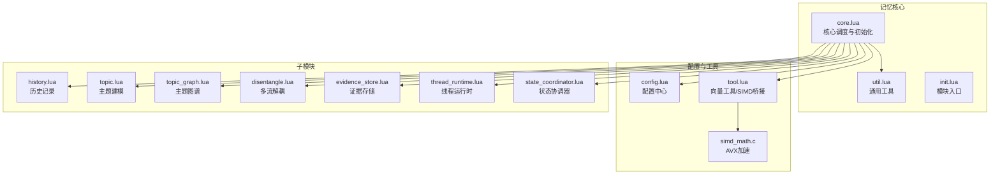
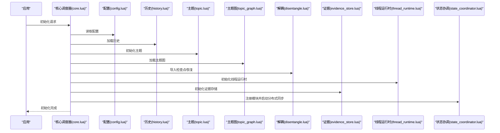
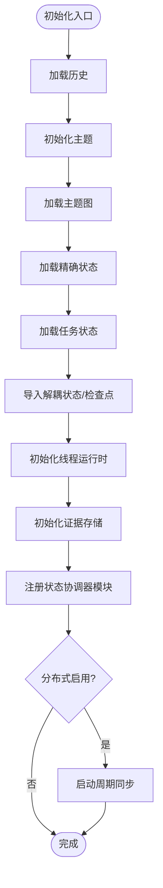
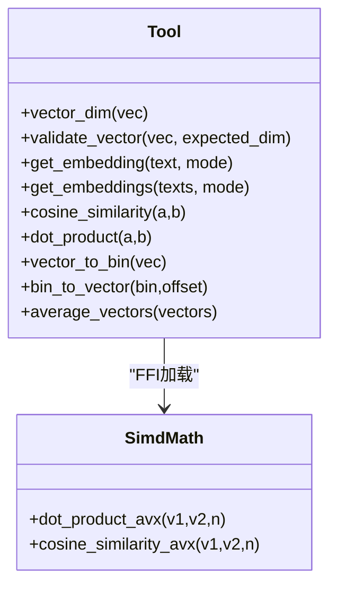
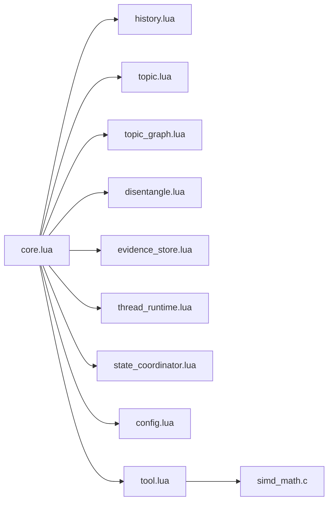

# 记忆核心架构

<cite>
**本文档引用的文件**
- [mori_memory/core.lua](file://mori_memory/mori_memory/core.lua)
- [mori_memory/init.lua](file://mori_memory/mori_memory/init.lua)
- [mori_memory/util.lua](file://mori_memory/mori_memory/util.lua)
- [module/config.lua](file://mori_memory/module/config.lua)
- [module/tool.lua](file://mori_memory/module/tool.lua)
- [module/evidence/evidence_store.lua](file://mori_memory/module/evidence/evidence_store.lua)
- [module/state_coordinator.lua](file://mori_memory/module/state_coordinator.lua)
- [module/runtime/thread_runtime.lua](file://mori_memory/module/runtime/thread_runtime.lua)
- [module/memory/disentangle.lua](file://mori_memory/module/memory/disentangle.lua)
- [module/memory/topic_graph.lua](file://mori_memory/module/memory/topic_graph.lua)
- [module/memory/history.lua](file://mori_memory/module/memory/history.lua)
- [native/simdc_math/simd_math.c](file://mori_memory/native/simdc_math/simd_math.c)
</cite>

## 目录
1. [简介](#简介)
2. [项目结构](#项目结构)
3. [核心组件](#核心组件)
4. [架构总览](#架构总览)
5. [详细组件分析](#详细组件分析)
6. [依赖关系分析](#依赖关系分析)
7. [性能考量](#性能考量)
8. [故障排查指南](#故障排查指南)
9. [结论](#结论)
10. [附录](#附录)

## 简介
本文件面向Mori记忆系统的核心架构，聚焦LuaJIT实现的记忆核心设计与工程实践，涵盖模块化架构、初始化流程、嵌入向量处理机制等关键主题。文档旨在帮助开发者快速理解记忆核心的工作原理、扩展方式与最佳实践。

## 项目结构
记忆核心位于mori_memory子树，采用“模块化+分层”的组织方式：
- 核心入口与公共工具：mori_memory/core.lua、mori_memory/init.lua、mori_memory/util.lua
- 配置中心：module/config.lua
- 工具与向量化：module/tool.lua（含SIMD加速）、native/simdc_math/simd_math.c
- 子模块：history、topic、topic_graph、disentangle、evidence_store、thread_runtime、state_coordinator等
- 运行时与持久化：module/runtime、module/state_coordinator、module/memory/*.lua

图表来源
- [mori_memory/core.lua:1-800](file://mori_memory/mori_memory/core.lua#L1-L800)
- [mori_memory/init.lua:1-3](file://mori_memory/mori_memory/init.lua#L1-L3)
- [mori_memory/util.lua:1-153](file://mori_memory/mori_memory/util.lua#L1-L153)
- [module/config.lua:1-680](file://mori_memory/module/config.lua#L1-L680)
- [module/tool.lua:1-800](file://mori_memory/module/tool.lua#L1-L800)
- [module/evidence/evidence_store.lua:1-603](file://mori_memory/module/evidence/evidence_store.lua#L1-L603)
- [module/state_coordinator.lua:1-302](file://mori_memory/module/state_coordinator.lua#L1-L302)
- [module/runtime/thread_runtime.lua:1-260](file://mori_memory/module/runtime/thread_runtime.lua#L1-L260)
- [module/memory/disentangle.lua:1-800](file://mori_memory/module/memory/disentangle.lua#L1-L800)
- [module/memory/topic_graph.lua:1-800](file://mori_memory/module/memory/topic_graph.lua#L1-L800)
- [module/memory/history.lua:1-195](file://mori_memory/module/memory/history.lua#L1-L195)
- [native/simdc_math/simd_math.c:1-146](file://mori_memory/native/simdc_math/simd_math.c#L1-L146)

章节来源
- [mori_memory/core.lua:1-800](file://mori_memory/mori_memory/core.lua#L1-L800)
- [mori_memory/init.lua:1-3](file://mori_memory/mori_memory/init.lua#L1-L3)
- [mori_memory/util.lua:1-153](file://mori_memory/mori_memory/util.lua#L1-L153)
- [module/config.lua:1-680](file://mori_memory/module/config.lua#L1-L680)
- [module/tool.lua:1-800](file://mori_memory/module/tool.lua#L1-L800)
- [module/evidence/evidence_store.lua:1-603](file://mori_memory/module/evidence/evidence_store.lua#L1-L603)
- [module/state_coordinator.lua:1-302](file://mori_memory/module/state_coordinator.lua#L1-L302)
- [module/runtime/thread_runtime.lua:1-260](file://mori_memory/module/runtime/thread_runtime.lua#L1-L260)
- [module/memory/disentangle.lua:1-800](file://mori_memory/module/memory/disentangle.lua#L1-L800)
- [module/memory/topic_graph.lua:1-800](file://mori_memory/module/memory/topic_graph.lua#L1-L800)
- [module/memory/history.lua:1-195](file://mori_memory/module/memory/history.lua#L1-L195)
- [native/simdc_math/simd_math.c:1-146](file://mori_memory/native/simdc_math/simd_math.c#L1-L146)

## 核心组件
- 核心调度器（core.lua）：负责模块初始化、嵌入向量生成与校验、安全阈值控制、运行时检查点与WAL、证据存储初始化、状态协调注册等。
- 配置中心（config.lua）：集中管理记忆核心参数（如向量维度、主题图谱参数、多流解耦参数、分布式开关等），支持策略配置与路径解析。
- 工具与向量（tool.lua + simd_math.c）：提供向量维度校验、余弦相似度、批量嵌入、二进制编解码、SIMD加速（AVX/FMA）等能力。
- 子模块：
  - history：历史对话持久化与转储。
  - topic_graph：主题图谱、主题聚类、精确匹配、趋势候选等。
  - disentangle：多流解耦、动态阈值、TTL清理、控制器与象限策略。
  - evidence_store：证据存储（已提交块、演员本地、范围聚合、趋势候选、主题投影）。
  - thread_runtime：线程运行时、路由选择、pending/孤儿状态管理、提交时机与WAL。
  - state_coordinator：版本向量、事务、一致性检查点、快照与恢复日志。

章节来源
- [mori_memory/core.lua:1-800](file://mori_memory/mori_memory/core.lua#L1-L800)
- [module/config.lua:1-680](file://mori_memory/module/config.lua#L1-L680)
- [module/tool.lua:1-800](file://mori_memory/module/tool.lua#L1-L800)
- [native/simdc_math/simd_math.c:1-146](file://mori_memory/native/simdc_math/simd_math.c#L1-L146)
- [module/evidence/evidence_store.lua:1-603](file://mori_memory/module/evidence/evidence_store.lua#L1-L603)
- [module/runtime/thread_runtime.lua:1-260](file://mori_memory/module/runtime/thread_runtime.lua#L1-L260)
- [module/state_coordinator.lua:1-302](file://mori_memory/module/state_coordinator.lua#L1-L302)
- [module/memory/disentangle.lua:1-800](file://mori_memory/module/memory/disentangle.lua#L1-L800)
- [module/memory/topic_graph.lua:1-800](file://mori_memory/module/memory/topic_graph.lua#L1-L800)
- [module/memory/history.lua:1-195](file://mori_memory/module/memory/history.lua#L1-L195)

## 架构总览
记忆核心采用“核心调度器 + 多子模块 + 工具层”的分层架构。核心调度器负责：
- 模块初始化顺序与依赖注入
- 嵌入向量生成与维度校验
- 安全阈值与来源标签格式化
- 线程运行时与证据存储初始化
- 状态协调与分布式同步
- 检查点与WAL管理

图表来源
- [mori_memory/core.lua:227-327](file://mori_memory/mori_memory/core.lua#L227-L327)
- [module/config.lua:1-680](file://mori_memory/module/config.lua#L1-L680)
- [module/memory/history.lua:67-115](file://mori_memory/module/memory/history.lua#L67-L115)
- [module/memory/topic_graph.lua:1-800](file://mori_memory/module/memory/topic_graph.lua#L1-L800)
- [module/memory/disentangle.lua:1-800](file://mori_memory/module/memory/disentangle.lua#L1-L800)
- [module/runtime/thread_runtime.lua:221-243](file://mori_memory/module/runtime/thread_runtime.lua#L221-L243)
- [module/evidence/evidence_store.lua:585-601](file://mori_memory/module/evidence/evidence_store.lua#L585-L601)
- [module/state_coordinator.lua:144-207](file://mori_memory/module/state_coordinator.lua#L144-L207)

## 详细组件分析

### 核心调度器（core.lua）
- 初始化流程
  - 顺序加载历史、主题、主题图、精确状态、任务状态、多流解耦状态导入与恢复、线程运行时初始化、证据存储初始化、状态协调器注册、分布式同步启动。
  - 错误处理：任一阶段失败均抛出错误；线程运行时与证据存储初始化失败仅打印警告并继续。
- 嵌入向量处理
  - 默认嵌入器优先使用tool.lua中的函数（按模式选择query/passage），若未找到则回退到默认实现；对返回向量进行维度校验与非空检查。
  - 向量维度校验：优先从主题图模块获取期望维度，其次使用工具层校验。
- 安全与来源控制
  - 基于配置的阈值判断（召回、历史、主题、写入）；来源标签格式化；作用域锚定与前缀策略。
- 运行时与WAL
  - 线程运行时检查点保存、WAL追加、序列号维护、触发GC。
- 证据存储
  - 初始化证据存储实例并调用initialize，支持已提交块、演员本地、范围聚合、趋势候选、主题投影等管理器。

图表来源
- [mori_memory/core.lua:227-327](file://mori_memory/mori_memory/core.lua#L227-L327)

章节来源
- [mori_memory/core.lua:1-800](file://mori_memory/mori_memory/core.lua#L1-L800)

### 配置中心（config.lua）
- 默认设置覆盖策略：默认配置、策略配置、路径解析（相对路径解析为绝对路径）。
- 参数覆盖：深度合并策略，支持策略配置切换与重置。
- 路径解析：支持基础目录设置与相对路径拼接。
- 记忆核心专用配置：向量维度、主题图参数、多流解耦参数、分布式开关、安全阈值等。

章节来源
- [module/config.lua:1-680](file://mori_memory/module/config.lua#L1-L680)

### 工具与向量（tool.lua + simd_math.c）
- 向量工具
  - 维度校验、向量平均、字符串与二进制编解码、批量嵌入（query/passage）。
  - 余弦相似度与点积计算，支持SIMD加速（AVX/FMA）。
- SIMD加速
  - 通过FFI加载原生库，提供dot_product_avx与cosine_similarity_avx，显著提升大规模向量运算性能。
- UTF-8清洗与Lua表解析：保证输入文本与配置的健壮性。

图表来源
- [module/tool.lua:1-800](file://mori_memory/module/tool.lua#L1-L800)
- [native/simdc_math/simd_math.c:1-146](file://mori_memory/native/simdc_math/simd_math.c#L1-L146)

章节来源
- [module/tool.lua:1-800](file://mori_memory/module/tool.lua#L1-L800)
- [native/simdc_math/simd_math.c:1-146](file://mori_memory/native/simdc_math/simd_math.c#L1-L146)

### 证据存储（evidence_store.lua）
- 组件职责
  - 已提交块管理：索引与清理、按条件检索。
  - 演员本地证据：按演员组织、限制容量。
  - 范围聚合：按范围统计交互、主题分布、活跃度。
  - 趋势候选：支持置信度计算、最小支持度过滤、索引维护。
  - 主题投影：基于主题数据创建证据投影，带新鲜度与相关性评分。
- 接口设计：统一add/retrieve接口，便于上层组合使用。

章节来源
- [module/evidence/evidence_store.lua:1-603](file://mori_memory/module/evidence/evidence_store.lua#L1-L603)

### 线程运行时（thread_runtime.lua）
- 路由边界管理：委托给disentangle模块执行路由选择，并记录状态。
- pending状态管理：统一处理pending操作。
- orphan状态检测与处理：检测并处理孤儿线程。
- ambient状态维护：维护环境上下文。
- 提交时机控制：根据配置的间隔决定是否提交检查点。
- WAL管理：将scope状态写入预写日志。
- 初始化与关闭：加载检查点、重放WAL、最终提交并清理。

章节来源
- [module/runtime/thread_runtime.lua:1-260](file://mori_memory/module/runtime/thread_runtime.lua#L1-L260)

### 多流解耦（disentangle.lua）
- 功能要点
  - 流式路由与分配：基于动态阈值、回复线索、提及、头像等启发式。
  - TTL清理：过期pending消息与空闲线程的孤儿化。
  - 内存压力与GC：监控内存使用，按阈值触发GC。
  - 控制器与象限策略：两轴控制器（人口压力、互动拓扑）驱动路由决策。
- 与工具层协作：利用tool.lua提供的向量相似度与批处理能力。

章节来源
- [module/memory/disentangle.lua:1-800](file://mori_memory/module/memory/disentangle.lua#L1-L800)

### 主题图（topic_graph.lua）
- 功能要点
  - 主题节点与边管理、向量维度校验、归一化。
  - Facet词槽提取与权重归一化、精确匹配与趋势候选。
  - 运行时记忆窗口与TTL清理、快照与持久化路径解析。
- 与工具层协作：cosine_similarity、向量平均、二进制编解码。

章节来源
- [module/memory/topic_graph.lua:1-800](file://mori_memory/module/memory/topic_graph.lua#L1-L800)

### 历史记录（history.lua）
- 功能要点
  - 历史文件加载与转储、版本头与快照生成号校验。
  - 字段转义/反转义、按轮次读取与解析。
  - 与持久化模块配合，确保原子写入与一致性。

章节来源
- [module/memory/history.lua:1-195](file://mori_memory/module/memory/history.lua#L1-L195)

### 状态协调器（state_coordinator.lua）
- 功能要点
  - 版本向量：模块版本追踪与一致性校验。
  - 事务管理：开始/提交/回滚，版本快照与冲突检测。
  - 一致性检查点：原子保存、快照生成、WAL记录。
  - 自动维护：定期验证与自动创建检查点。
  - 模块注册：在核心初始化时注册各模块。

章节来源
- [module/state_coordinator.lua:1-302](file://mori_memory/module/state_coordinator.lua#L1-L302)

## 依赖关系分析
- 模块内聚与耦合
  - core.lua高内聚地协调多个子模块，但通过接口抽象降低耦合（如embedder回调、工具层函数）。
  - tool.lua与native层通过FFI桥接，保持工具层API稳定。
- 外部依赖
  - Python嵌入管道（通过tool.lua间接调用）：用于生成embedding。
  - FFI与SIMD库：加速向量运算。
- 循环依赖
  - 未发现直接循环依赖；核心通过延迟require与回调避免强耦合。

图表来源
- [mori_memory/core.lua:1-800](file://mori_memory/mori_memory/core.lua#L1-L800)
- [module/tool.lua:1-800](file://mori_memory/module/tool.lua#L1-L800)
- [native/simdc_math/simd_math.c:1-146](file://mori_memory/native/simdc_math/simd_math.c#L1-L146)

章节来源
- [mori_memory/core.lua:1-800](file://mori_memory/mori_memory/core.lua#L1-L800)
- [module/tool.lua:1-800](file://mori_memory/module/tool.lua#L1-L800)
- [native/simdc_math/simd_math.c:1-146](file://mori_memory/native/simdc_math/simd_math.c#L1-L146)

## 性能考量
- SIMD加速：tool.lua通过FFI加载AVX实现的点积与余弦相似度，显著提升大规模向量运算性能。
- 内存压力控制：disentangle模块内置内存监控与GC触发策略，结合TTL清理降低内存占用。
- 向量维度校验：在生成与使用阶段均进行维度校验，避免无效计算与潜在崩溃。
- 批量嵌入：提供批量embedding接口，减少跨语言调用开销。
- 写前日志（WAL）与原子保存：通过WAL与状态协调器的检查点机制保障持久化一致性与可恢复性。

## 故障排查指南
- 初始化失败
  - 症状：core.lua在某模块load/init时报错。
  - 排查：查看core.lua中的ensure_init错误堆栈，确认对应模块的load/init返回值与错误信息。
- 嵌入向量异常
  - 症状：向量为空或维度不匹配。
  - 排查：检查tool.lua的validate_vector与topic_graph的expected_vector_dim；确认嵌入器可用且返回非空向量。
- 分布式同步问题
  - 症状：分布式节点未同步或同步失败。
  - 排查：检查config.lua中distributed.enabled与节点配置；查看state_coordinator的start_periodic_sync与verify_recovery_state结果。
- 线程运行时提交失败
  - 症状：检查点保存或WAL重置失败。
  - 排查：查看thread_runtime.lua中的execute_commit与append_to_wal返回值与错误信息；确认磁盘空间与权限。
- 内存压力与GC
  - 症状：频繁GC或内存持续增长。
  - 排查：检查disentangle的memory_limits与gc_control配置；观察periodic_cleanup与trigger_gc_if_needed触发频率。

章节来源
- [mori_memory/core.lua:227-327](file://mori_memory/mori_memory/core.lua#L227-L327)
- [module/tool.lua:160-170](file://mori_memory/module/tool.lua#L160-L170)
- [module/state_coordinator.lua:144-207](file://mori_memory/module/state_coordinator.lua#L144-L207)
- [module/runtime/thread_runtime.lua:125-152](file://mori_memory/module/runtime/thread_runtime.lua#L125-L152)
- [module/memory/disentangle.lua:142-166](file://mori_memory/module/memory/disentangle.lua#L142-L166)

## 结论
Mori记忆核心通过清晰的模块化设计与严格的初始化流程，实现了从历史记录、主题建模到多流解耦与证据存储的完整闭环。借助SIMD加速与向量维度校验，系统在性能与稳定性方面具备良好表现。开发者可通过配置中心与工具层扩展嵌入器与向量处理策略，同时利用状态协调器与线程运行时保障一致性与可恢复性。

## 附录
- 嵌入向量生成与验证流程（代码路径）
  - 默认嵌入器：[mori_memory/core.lua:52-96](file://mori_memory/mori_memory/core.lua#L52-L96)
  - 工具层校验：[module/tool.lua:160-170](file://mori_memory/module/tool.lua#L160-L170)
  - 主题图维度校验：[module/memory/topic_graph.lua:154-171](file://mori_memory/module/memory/topic_graph.lua#L154-L171)
- 初始化流程（代码路径）
  - 核心初始化：[mori_memory/core.lua:227-327](file://mori_memory/mori_memory/core.lua#L227-L327)
  - 历史加载：[module/memory/history.lua:67-115](file://mori_memory/module/memory/history.lua#L67-L115)
  - 线程运行时初始化：[module/runtime/thread_runtime.lua:221-243](file://mori_memory/module/runtime/thread_runtime.lua#L221-L243)
  - 证据存储初始化：[module/evidence/evidence_store.lua:585-601](file://mori_memory/module/evidence/evidence_store.lua#L585-L601)
- 分布式与一致性（代码路径）
  - 状态协调器：[module/state_coordinator.lua:144-207](file://mori_memory/module/state_coordinator.lua#L144-L207)
  - 配置中心：[module/config.lua:321-326](file://mori_memory/module/config.lua#L321-L326)