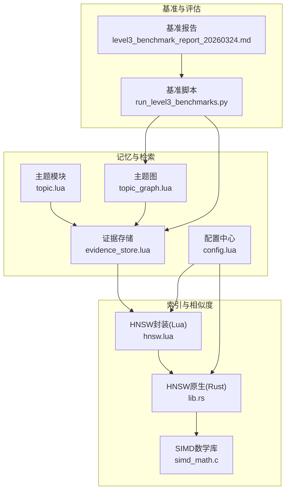
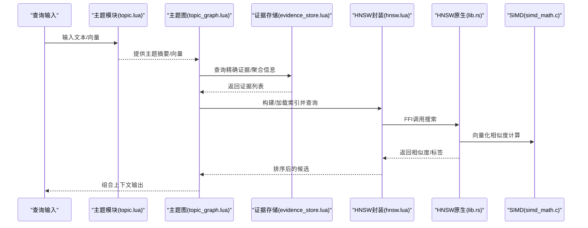
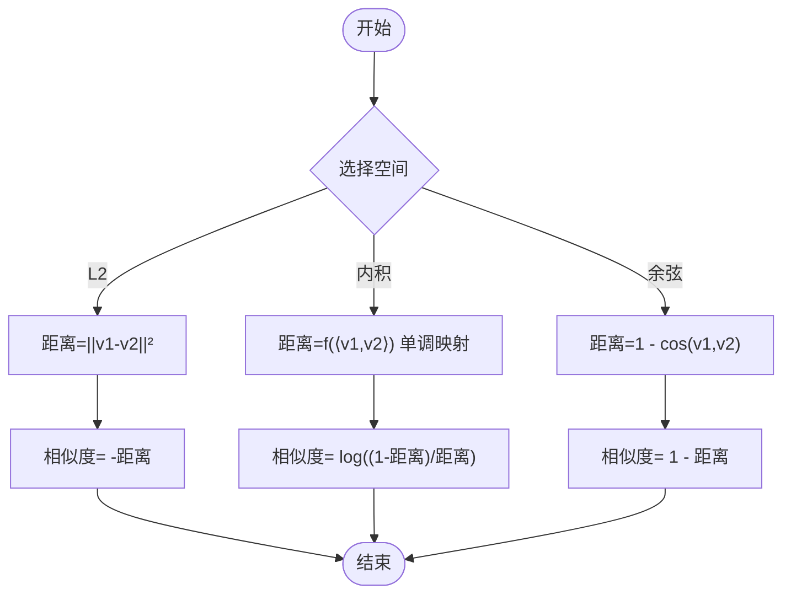
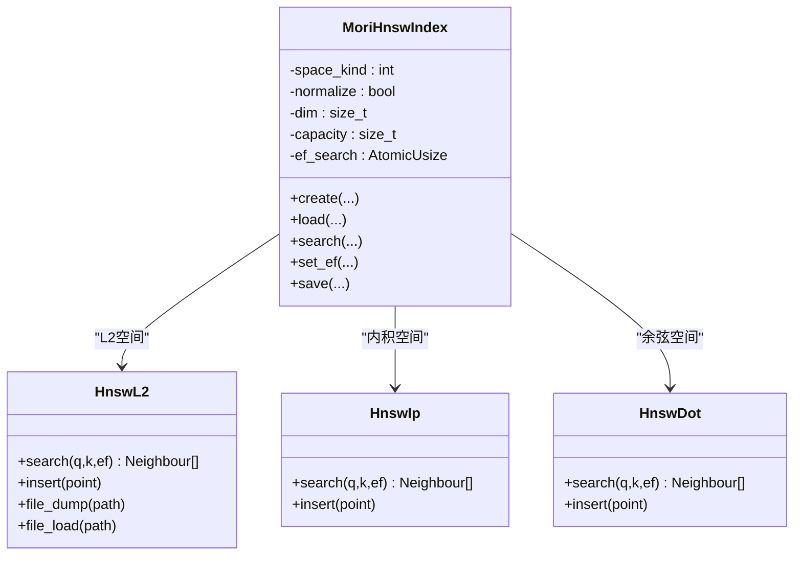
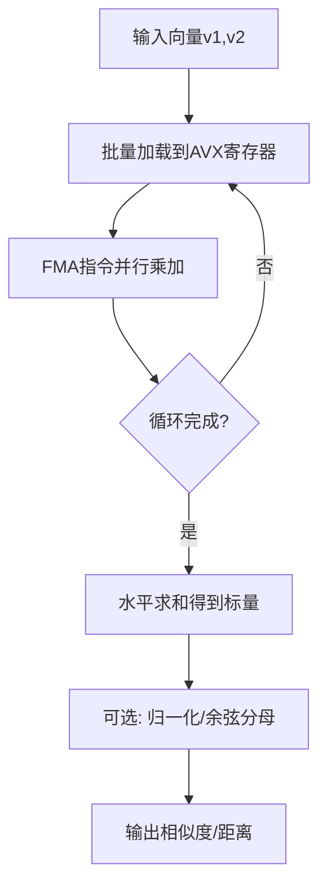
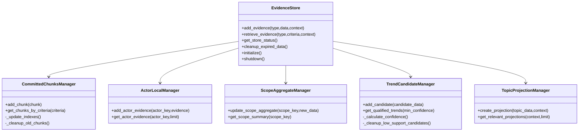
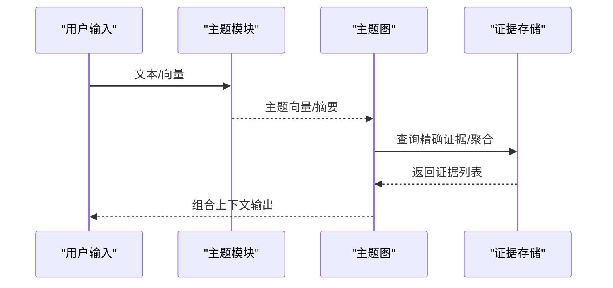
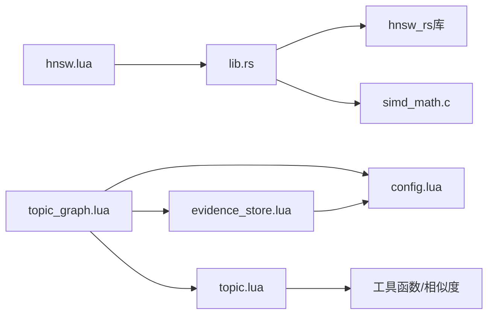

# 记忆检索算法

<cite>
**本文档引用的文件**
- [evidence_store.lua](file://mori_memory/module/evidence/evidence_store.lua)
- [hnsw.lua](file://mori_memory/module/hnsw.lua)
- [lib.rs](file://mori_memory/native/hnsw/rust/src/lib.rs)
- [simd_math.c](file://mori_memory/native/simdc_math/simd_math.c)
- [config.lua](file://mori_memory/module/config.lua)
- [topic.lua](file://mori_memory/module/memory/topic.lua)
- [topic_graph.lua](file://mori_memory/module/memory/topic_graph.lua)
- [run_level3_benchmarks.py](file://mori_memory/scripts/run_level3_benchmarks.py)
- [level3_benchmark_report_20260324.md](file://mori_memory/benchmarks/results/level3_benchmark_report_20260324.md)
</cite>

## 目录
1. [简介](#简介)
2. [项目结构](#项目结构)
3. [核心组件](#核心组件)
4. [架构总览](#架构总览)
5. [详细组件分析](#详细组件分析)
6. [依赖关系分析](#依赖关系分析)
7. [性能考量](#性能考量)
8. [故障排查指南](#故障排查指南)
9. [结论](#结论)
10. [附录](#附录)

## 简介
本文件面向Mori的记忆检索算法，系统性阐述以下内容：
- 向量相似度计算的实现原理与选择（余弦相似度、内积、欧氏距离），以及在HNSW中的映射与优化。
- HNSW（分层可导航小世界）图索引的实现细节、构建流程、搜索策略与参数调优。
- SIMD数学库的优化技术（向量化计算、内存预取、并行处理）在点积与余弦相似度中的应用。
- 证据存储（Evidence Store）工作机制，包括多模态证据融合、相关性评分与排序。
- 基准测试数据与性能报告，帮助开发者理解检索效率与调优方向。

## 项目结构
围绕记忆检索的关键模块与文件如下：
- 证据存储：mori_memory/module/evidence/evidence_store.lua
- HNSW封装：mori_memory/module/hnsw.lua
- HNSW原生实现：mori_memory/native/hnsw/rust/src/lib.rs
- SIMD数学库：mori_memory/native/simdc_math/simd_math.c
- 配置中心：mori_memory/module/config.lua
- 主题与主题图：mori_memory/module/memory/topic.lua, mori_memory/module/memory/topic_graph.lua
- 基准脚本与报告：mori_memory/scripts/run_level3_benchmarks.py, mori_memory/benchmarks/results/level3_benchmark_report_20260324.md

**图表来源**
- [evidence_store.lua:1-603](file://mori_memory/module/evidence/evidence_store.lua#L1-L603)
- [hnsw.lua:1-310](file://mori_memory/module/hnsw.lua#L1-L310)
- [lib.rs:1-592](file://mori_memory/native/hnsw/rust/src/lib.rs#L1-L592)
- [simd_math.c:1-146](file://mori_memory/native/simdc_math/simd_math.c#L1-L146)
- [config.lua:1-680](file://mori_memory/module/config.lua#L1-L680)
- [topic.lua:1-800](file://mori_memory/module/memory/topic.lua#L1-L800)
- [topic_graph.lua:1-800](file://mori_memory/module/memory/topic_graph.lua#L1-L800)
- [run_level3_benchmarks.py:1-860](file://mori_memory/scripts/run_level3_benchmarks.py#L1-L860)
- [level3_benchmark_report_20260324.md:1-322](file://mori_memory/benchmarks/results/level3_benchmark_report_20260324.md#L1-L322)

**章节来源**
- [evidence_store.lua:1-603](file://mori_memory/module/evidence/evidence_store.lua#L1-L603)
- [hnsw.lua:1-310](file://mori_memory/module/hnsw.lua#L1-L310)
- [lib.rs:1-592](file://mori_memory/native/hnsw/rust/src/lib.rs#L1-L592)
- [simd_math.c:1-146](file://mori_memory/native/simdc_math/simd_math.c#L1-L146)
- [config.lua:1-680](file://mori_memory/module/config.lua#L1-L680)
- [topic.lua:1-800](file://mori_memory/module/memory/topic.lua#L1-L800)
- [topic_graph.lua:1-800](file://mori_memory/module/memory/topic_graph.lua#L1-L800)
- [run_level3_benchmarks.py:1-860](file://mori_memory/scripts/run_level3_benchmarks.py#L1-L860)
- [level3_benchmark_report_20260324.md:1-322](file://mori_memory/benchmarks/results/level3_benchmark_report_20260324.md#L1-L322)

## 核心组件
- 证据存储（Evidence Store）：统一管理committed chunks、演员本地证据、范围聚合、趋势候选与主题投影，提供按条件检索与排序。
- HNSW索引：通过Lua封装FFI调用Rust实现的HNSW，支持L2、内积、余弦三种距离空间，并提供搜索、容量、计数等查询接口。
- SIMD数学库：提供AVX向量化实现的点积与余弦相似度，包含内存预取与分块计算，提升大规模向量运算性能。
- 主题与主题图：主题聚类与摘要、主题图的精确匹配与语义检索结合，支撑检索与上下文编排。
- 配置中心：集中管理检索参数（如HNSW参数、主题图参数、exact匹配参数等）。

**章节来源**
- [evidence_store.lua:490-603](file://mori_memory/module/evidence/evidence_store.lua#L490-L603)
- [hnsw.lua:54-310](file://mori_memory/module/hnsw.lua#L54-L310)
- [lib.rs:1-592](file://mori_memory/native/hnsw/rust/src/lib.rs#L1-L592)
- [simd_math.c:1-146](file://mori_memory/native/simdc_math/simd_math.c#L1-L146)
- [topic.lua:1-800](file://mori_memory/module/memory/topic.lua#L1-L800)
- [topic_graph.lua:1-800](file://mori_memory/module/memory/topic_graph.lua#L1-L800)
- [config.lua:133-140](file://mori_memory/module/config.lua#L133-L140)

## 架构总览
检索链路从输入查询开始，经过主题与主题图的语义/精确检索，结合证据存储的多模态证据，最终由HNSW进行高效相似度检索与排序。

**图表来源**
- [topic.lua:659-794](file://mori_memory/module/memory/topic.lua#L659-L794)
- [topic_graph.lua:1-800](file://mori_memory/module/memory/topic_graph.lua#L1-L800)
- [evidence_store.lua:539-563](file://mori_memory/module/evidence/evidence_store.lua#L539-L563)
- [hnsw.lua:288-307](file://mori_memory/module/hnsw.lua#L288-L307)
- [lib.rs:497-554](file://mori_memory/native/hnsw/rust/src/lib.rs#L497-L554)
- [simd_math.c:17-145](file://mori_memory/native/simdc_math/simd_math.c#L17-L145)

## 详细组件分析

### 向量相似度与HNSW空间映射
- 距离空间定义：支持L2（欧氏距离）、内积（最大内积等价于负指数距离映射）、余弦（1-余弦）。
- Lua侧相似度转换：根据空间类型将底层距离转换为相似度，便于统一排序与打分。
- Rust侧距离实现：
  - L2：直接非负距离。
  - 内积：通过严格单调的指数映射，确保最大内积等价于最小距离。
  - 余弦：使用标准余弦距离。
- SIMD加速：在Rust侧通过FFI调用SIMD实现的点积/余弦，减少循环开销与内存访问延迟。

**图表来源**
- [hnsw.lua:146-160](file://mori_memory/module/hnsw.lua#L146-L160)
- [lib.rs:193-211](file://mori_memory/native/hnsw/rust/src/lib.rs#L193-L211)

**章节来源**
- [hnsw.lua:146-160](file://mori_memory/module/hnsw.lua#L146-L160)
- [lib.rs:193-211](file://mori_memory/native/hnsw/rust/src/lib.rs#L193-L211)
- [simd_math.c:17-145](file://mori_memory/native/simdc_math/simd_math.c#L17-L145)

### HNSW索引实现与参数调优
- 创建与加载：Lua通过FFI加载原生模块，创建或加载索引，支持设置ef_search、容量扩展（预留）、删除标记（原生不支持）。
- 搜索流程：Lua将查询向量打包为C数组，调用Rust实现的search，返回标签与距离，再转换为相似度。
- 参数要点：
  - m：每层最大连接数，影响图稠密度与查询精度。
  - ef_construction：构建时探索宽度，越大质量越高但构建成本高。
  - ef_search：查询时探索宽度，直接影响召回与速度权衡。
  - max_elements：容量上限，超过后需重建或替换策略（原生不支持resize）。
- 配置入口：通过配置中心的topic_hnsw段落统一注入。

**图表来源**
- [lib.rs:17-31](file://mori_memory/native/hnsw/rust/src/lib.rs#L17-L31)
- [lib.rs:243-288](file://mori_memory/native/hnsw/rust/src/lib.rs#L243-L288)
- [lib.rs:497-554](file://mori_memory/native/hnsw/rust/src/lib.rs#L497-L554)

**章节来源**
- [hnsw.lua:171-217](file://mori_memory/module/hnsw.lua#L171-L217)
- [lib.rs:243-288](file://mori_memory/native/hnsw/rust/src/lib.rs#L243-L288)
- [lib.rs:497-554](file://mori_memory/native/hnsw/rust/src/lib.rs#L497-L554)
- [config.lua:133-140](file://mori_memory/module/config.lua#L133-L140)

### SIMD数学库优化技术
- 向量化计算：使用AVX指令集，每轮处理多个浮点数累加，显著降低循环次数。
- 内存预取：在每次迭代前预取下一段数据，减少缓存未命中带来的延迟。
- 并行处理：通过多寄存器并行累加，提高吞吐量。
- 应用场景：点积与余弦相似度计算，广泛用于HNSW搜索与主题/证据相似度评估。

**图表来源**
- [simd_math.c:17-62](file://mori_memory/native/simdc_math/simd_math.c#L17-L62)
- [simd_math.c:64-145](file://mori_memory/native/simdc_math/simd_math.c#L64-L145)

**章节来源**
- [simd_math.c:1-146](file://mori_memory/native/simdc_math/simd_math.c#L1-L146)

### 证据存储（Evidence Store）机制
- 管理器职责：
  - committed_chunks：已提交的记忆块，支持按演员、范围、时间、内容过滤与相关性排序。
  - actor_local：按演员组织的本地证据，限制数量并返回最新证据。
  - scope_aggregate：按范围聚合的统计信息（演员活动、主题分布、交互模式）。
  - trend_candidates：趋势候选，带支持度、演员集合、置信度计算与索引维护。
  - topic_projection：主题投影，基于上下文计算相关性与新鲜度，支持TTL与排序。
- 统一接口：add_evidence与retrieve_evidence，按类型路由至不同管理器。
- 状态与清理：提供状态统计、定期清理过期数据与资源回收。

**图表来源**
- [evidence_store.lua:26-505](file://mori_memory/module/evidence/evidence_store.lua#L26-L505)

**章节来源**
- [evidence_store.lua:1-603](file://mori_memory/module/evidence/evidence_store.lua#L1-L603)

### 主题与主题图的检索融合
- 主题模块：基于话语对相似度与全局漂移检测进行话题分割，维护头质心、尾窗口与摘要变体，支持分级摘要与持久化。
- 主题图：结合精确匹配（exact match）与语义检索（topic_hnsw），通过反馈权重与先验融合，控制召回与稳定性。
- 与证据存储协作：主题图检索结果可进一步回填证据存储，形成“主题-证据-上下文”的闭环。

**图表来源**
- [topic.lua:659-794](file://mori_memory/module/memory/topic.lua#L659-L794)
- [topic_graph.lua:1-800](file://mori_memory/module/memory/topic_graph.lua#L1-L800)
- [evidence_store.lua:539-563](file://mori_memory/module/evidence/evidence_store.lua#L539-L563)

**章节来源**
- [topic.lua:1-800](file://mori_memory/module/memory/topic.lua#L1-L800)
- [topic_graph.lua:1-800](file://mori_memory/module/memory/topic_graph.lua#L1-L800)
- [config.lua:133-140](file://mori_memory/module/config.lua#L133-L140)

## 依赖关系分析
- Lua层通过FFI绑定Rust实现的HNSW，Rust层依赖hnsw_rs库，底层可选SIMD加速。
- 主题与主题图依赖工具函数（向量校验、相似度计算）与配置中心。
- 证据存储作为检索上游的数据源，被主题图与HNSW共同消费。

**图表来源**
- [hnsw.lua:1-10](file://mori_memory/module/hnsw.lua#L1-L10)
- [lib.rs:1-8](file://mori_memory/native/hnsw/rust/src/lib.rs#L1-L8)
- [topic.lua:1-10](file://mori_memory/module/memory/topic.lua#L1-L10)
- [topic_graph.lua:1-12](file://mori_memory/module/memory/topic_graph.lua#L1-L12)
- [evidence_store.lua:1-14](file://mori_memory/module/evidence/evidence_store.lua#L1-L14)
- [config.lua:1-20](file://mori_memory/module/config.lua#L1-L20)

**章节来源**
- [hnsw.lua:1-10](file://mori_memory/module/hnsw.lua#L1-L10)
- [lib.rs:1-8](file://mori_memory/native/hnsw/rust/src/lib.rs#L1-L8)
- [topic.lua:1-10](file://mori_memory/module/memory/topic.lua#L1-L10)
- [topic_graph.lua:1-12](file://mori_memory/module/memory/topic_graph.lua#L1-L12)
- [evidence_store.lua:1-14](file://mori_memory/module/evidence/evidence_store.lua#L1-L14)
- [config.lua:1-20](file://mori_memory/module/config.lua#L1-L20)

## 性能考量
- HNSW参数调优建议：
  - ef_search：在召回与延迟之间权衡，较大值提升召回但增加延迟。
  - m与ef_construction：增大可提升质量，但显著增加构建成本。
  - 空间选择：余弦适合归一化向量；内积适合特定嵌入；L2适合非归一化场景。
- SIMD优化收益：
  - 在大规模向量点积/余弦计算中显著降低CPU周期。
  - 结合内存预取与分块策略，减少缓存抖动。
- 证据存储与主题图：
  - 控制证据数量与TTL，避免过期数据影响排序。
  - 主题摘要与投影缓存可减少重复计算。

[本节为通用指导，无需特定文件引用]

## 故障排查指南
- HNSW不可用：
  - 检查原生模块加载路径与权限，确认构建产物存在。
  - 查看错误码与错误字符串，定位初始化失败原因。
- 搜索异常：
  - 确认向量维度与索引维度一致，避免维度不匹配。
  - 检查ef_search设置是否过小导致召回不足。
- 相似度异常：
  - 核对空间类型与相似度转换逻辑。
  - 若使用余弦，确保向量已归一化或启用归一化选项。
- 证据检索结果偏差：
  - 检查过滤条件（演员、范围、时间、关键词）是否过于严格。
  - 调整相关性/置信度阈值与排序权重。

**章节来源**
- [hnsw.lua:60-103](file://mori_memory/module/hnsw.lua#L60-L103)
- [lib.rs:223-240](file://mori_memory/native/hnsw/rust/src/lib.rs#L223-L240)
- [evidence_store.lua:101-127](file://mori_memory/module/evidence/evidence_store.lua#L101-L127)

## 结论
- 本方案通过证据存储、主题/主题图与HNSW索引的协同，实现了多模态证据的融合与高效检索。
- SIMD优化与多种距离空间映射，为大规模向量检索提供了性能保障。
- 基准报告揭示了当前实现的优势与局限：在精确证据与线程内延续方面表现良好，但在语义泛化、任务状态抽象与长程对话结构恢复方面仍有改进空间。
- 建议在现有基础上引入状态适配层与对话结构适配器，以补齐任务导向与长程对话的短板。

[本节为总结性内容，无需特定文件引用]

## 附录

### 基准测试与结果概览
- 使用normalized数据集与本地哈希嵌入，评估ROSA Level 3在多会话人物、多轮对话状态、IRC回复链与会议摘要四项任务上的表现。
- 结果显示：在exact证据链路与线程内延续方面具备优势，但在语义泛化、任务状态抽象与回复链恢复方面存在明显短板。

**章节来源**
- [run_level3_benchmarks.py:1-860](file://mori_memory/scripts/run_level3_benchmarks.py#L1-L860)
- [level3_benchmark_report_20260324.md:1-322](file://mori_memory/benchmarks/results/level3_benchmark_report_20260324.md#L1-L322)