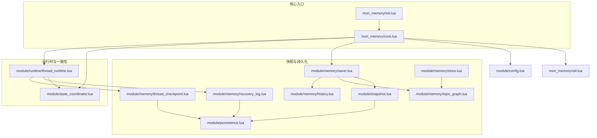
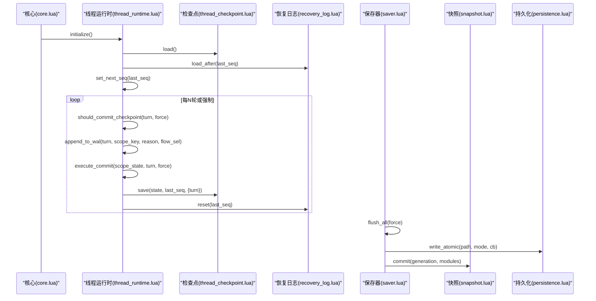
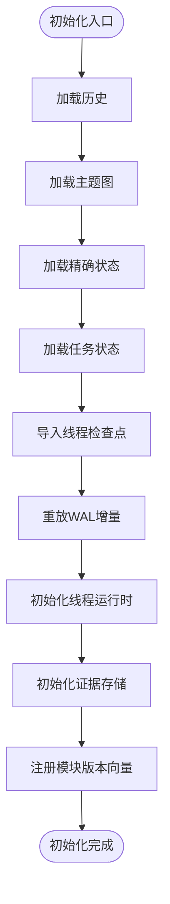
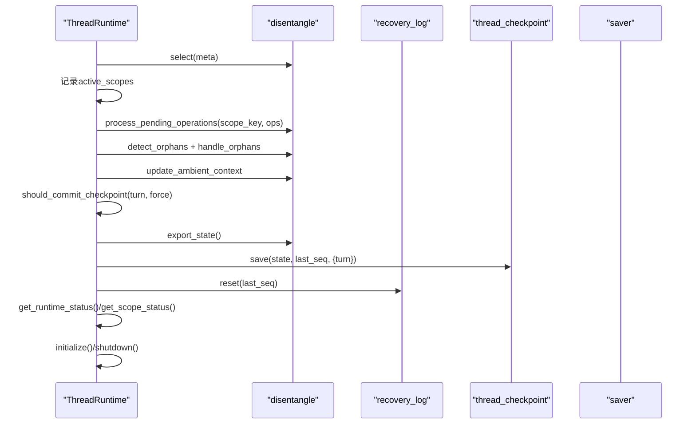
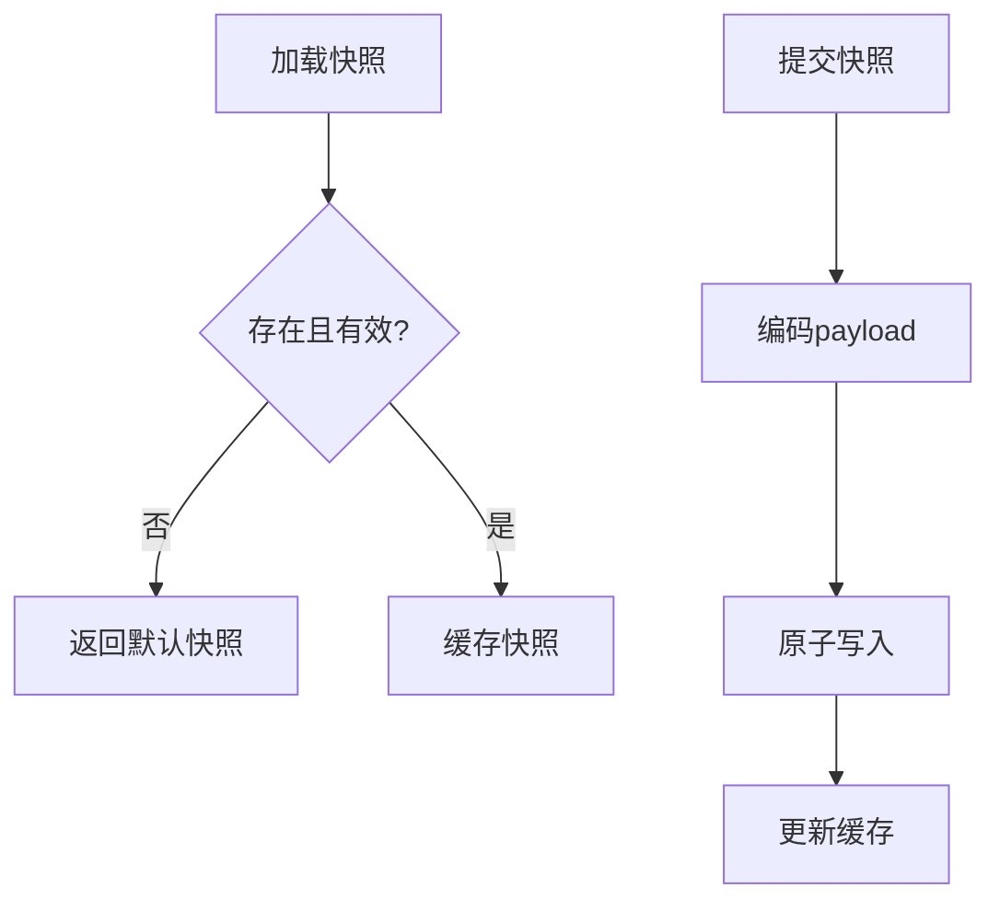
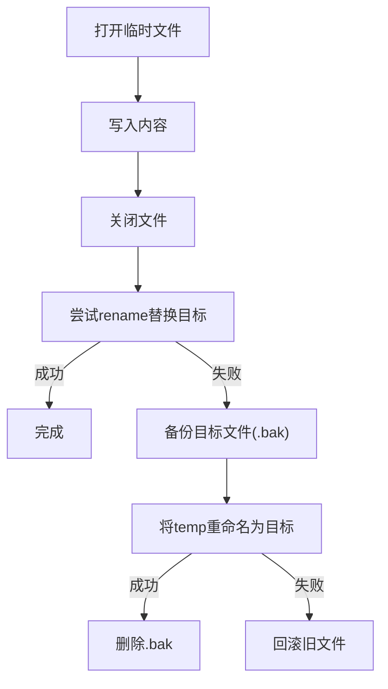
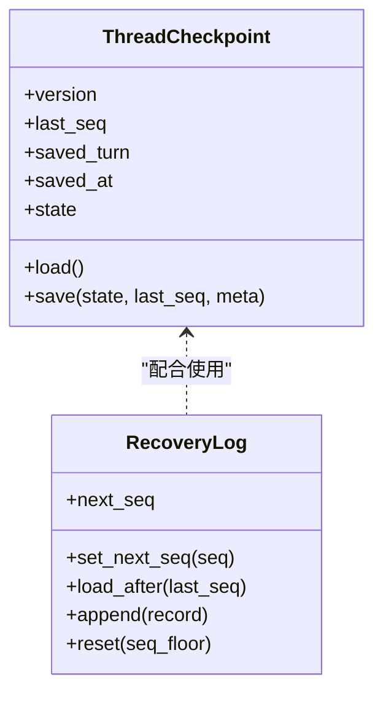
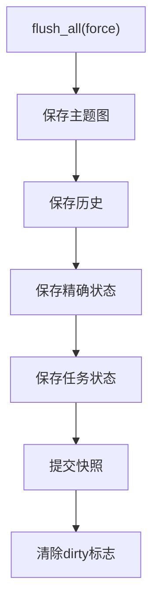
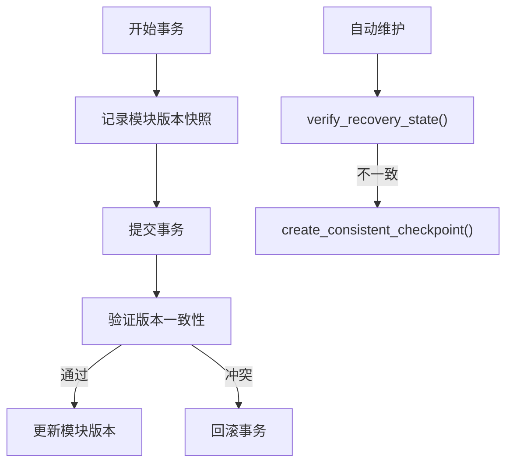
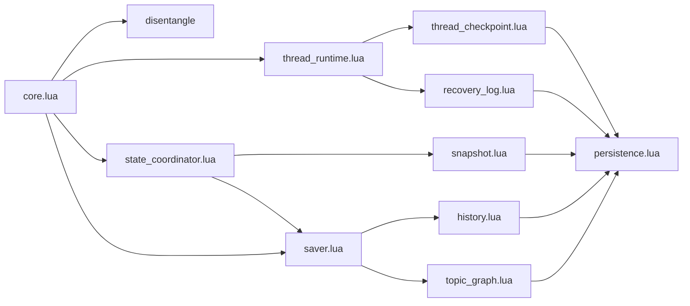

# 记忆生命周期管理

<cite>
**本文引用的文件**
- [core.lua](file://mori_memory/mori_memory/core.lua)
- [thread_runtime.lua](file://mori_memory/module/runtime/thread_runtime.lua)
- [state_coordinator.lua](file://mori_memory/module/state_coordinator.lua)
- [snapshot.lua](file://mori_memory/module/snapshot.lua)
- [persistence.lua](file://mori_memory/module/persistence.lua)
- [thread_checkpoint.lua](file://mori_memory/module/memory/thread_checkpoint.lua)
- [recovery_log.lua](file://mori_memory/module/memory/recovery_log.lua)
- [saver.lua](file://mori_memory/module/memory/saver.lua)
- [store.lua](file://mori_memory/module/memory/store.lua)
- [history.lua](file://mori_memory/module/memory/history.lua)
- [topic_graph.lua](file://mori_memory/module/memory/topic_graph.lua)
- [config.lua](file://mori_memory/module/config.lua)
- [util.lua](file://mori_memory/mori_memory/util.lua)
- [init.lua](file://mori_memory/mori_memory/init.lua)
</cite>

## 目录
1. [简介](#简介)
2. [项目结构](#项目结构)
3. [核心组件](#核心组件)
4. [架构总览](#架构总览)
5. [详细组件分析](#详细组件分析)
6. [依赖关系分析](#依赖关系分析)
7. [性能考量](#性能考量)
8. [故障排除指南](#故障排除指南)
9. [结论](#结论)
10. [附录](#附录)

## 简介
本技术文档围绕Mori的记忆生命周期管理展开，系统性阐述从创建、初始化、更新、查询、过期清理到持久化的完整流程；详解快照（Snapshot）机制与一致性保障；解析线程运行时（Thread Runtime）的检查点（Checkpoint）、崩溃恢复与状态同步；并提供最佳实践与故障排除建议，帮助开发者确保记忆系统的稳定与可靠。

## 项目结构
Mori记忆系统采用模块化分层设计：
- 核心入口与协调：mori_memory/core.lua、mori_memory/init.lua
- 运行时与一致性：module/runtime/thread_runtime.lua、module/state_coordinator.lua
- 快照与持久化：module/snapshot.lua、module/persistence.lua、module/memory/thread_checkpoint.lua、module/memory/recovery_log.lua、module/memory/saver.lua、module/memory/store.lua、module/memory/history.lua、module/memory/topic_graph.lua
- 配置与工具：module/config.lua、mori_memory/util.lua

图示来源
- [init.lua:1-3](file://mori_memory/mori_memory/init.lua#L1-L3)
- [core.lua:1-327](file://mori_memory/mori_memory/core.lua#L1-L327)
- [thread_runtime.lua:1-260](file://mori_memory/module/runtime/thread_runtime.lua#L1-L260)
- [state_coordinator.lua:1-302](file://mori_memory/module/state_coordinator.lua#L1-L302)
- [snapshot.lua:1-112](file://mori_memory/module/snapshot.lua#L1-L112)
- [persistence.lua:1-97](file://mori_memory/module/persistence.lua#L1-L97)
- [thread_checkpoint.lua:1-76](file://mori_memory/module/memory/thread_checkpoint.lua#L1-L76)
- [recovery_log.lua:1-121](file://mori_memory/module/memory/recovery_log.lua#L1-L121)
- [saver.lua:1-67](file://mori_memory/module/memory/saver.lua#L1-L67)
- [store.lua:1-100](file://mori_memory/module/memory/store.lua#L1-L100)
- [history.lua:1-195](file://mori_memory/module/memory/history.lua#L1-L195)
- [topic_graph.lua:1-200](file://mori_memory/module/memory/topic_graph.lua#L1-L200)
- [config.lua:1-680](file://mori_memory/module/config.lua#L1-L680)
- [util.lua:1-153](file://mori_memory/mori_memory/util.lua#L1-L153)

章节来源
- [init.lua:1-3](file://mori_memory/mori_memory/init.lua#L1-L3)
- [core.lua:1-327](file://mori_memory/mori_memory/core.lua#L1-L327)
- [config.lua:1-680](file://mori_memory/module/config.lua#L1-L680)

## 核心组件
- 核心协调器（Core）：负责模块初始化、状态导入导出、线程运行时集成、证据存储初始化、分布式同步等。
- 线程运行时（Thread Runtime）：管理路由、pending状态、孤儿检测、环境上下文、提交时机与执行、WAL追加、状态查询与初始化/关闭。
- 状态协调器（State Coordinator）：版本向量管理、事务一致性校验、一致性检查点创建与恢复验证、自动维护。
- 快照（Snapshot）：生成、加载、版本推进、模块一致性标记。
- 持久化（Persistence）：原子写入与替换，保障并发安全。
- 检查点（Thread Checkpoint）：线程运行时状态的序列化与加载。
- 恢复日志（Recovery Log/WAL）：顺序记录scope状态变更，支持断点续传与重放。
- 保存器（Saver）：原子批量保存topic_graph、history、exact_state、task_state与快照。
- 存储与历史（Store/History/TopicGraph）：主题图与历史文本的读写与版本控制。

章节来源
- [core.lua:227-327](file://mori_memory/mori_memory/core.lua#L227-L327)
- [thread_runtime.lua:16-260](file://mori_memory/module/runtime/thread_runtime.lua#L16-L260)
- [state_coordinator.lua:9-302](file://mori_memory/module/state_coordinator.lua#L9-L302)
- [snapshot.lua:21-112](file://mori_memory/module/snapshot.lua#L21-L112)
- [persistence.lua:25-97](file://mori_memory/module/persistence.lua#L25-L97)
- [thread_checkpoint.lua:13-76](file://mori_memory/module/memory/thread_checkpoint.lua#L13-L76)
- [recovery_log.lua:17-121](file://mori_memory/module/memory/recovery_log.lua#L17-L121)
- [saver.lua:10-67](file://mori_memory/module/memory/saver.lua#L10-L67)
- [store.lua:1-100](file://mori_memory/module/memory/store.lua#L1-L100)
- [history.lua:67-195](file://mori_memory/module/memory/history.lua#L67-L195)
- [topic_graph.lua:55-200](file://mori_memory/module/memory/topic_graph.lua#L55-L200)

## 架构总览
下图展示记忆生命周期的关键交互：初始化加载、运行时提交、WAL记录、原子保存与快照、以及崩溃恢复路径。

图示来源
- [core.lua:227-327](file://mori_memory/mori_memory/core.lua#L227-L327)
- [thread_runtime.lua:111-152](file://mori_memory/module/runtime/thread_runtime.lua#L111-L152)
- [thread_checkpoint.lua:60-73](file://mori_memory/module/memory/thread_checkpoint.lua#L60-L73)
- [recovery_log.lua:84-118](file://mori_memory/module/memory/recovery_log.lua#L84-L118)
- [saver.lua:10-51](file://mori_memory/module/memory/saver.lua#L10-L51)
- [snapshot.lua:88-109](file://mori_memory/module/snapshot.lua#L88-L109)
- [persistence.lua:58-94](file://mori_memory/module/persistence.lua#L58-L94)

## 详细组件分析

### 核心生命周期管理（Core）
- 初始化阶段：按序加载历史、主题图、精确状态、任务状态；导入线程检查点与WAL增量；初始化线程运行时与证据存储；注册模块版本向量；可选开启分布式同步。
- 运行时集成：在核心层桥接disentangle状态导入/导出、WAL重放、线程检查点保存与WAL重置；周期性触发GC。
- 版本控制：通过state_coordinator注册模块版本向量，配合snapshot生成一致性检查点。

图示来源
- [core.lua:227-327](file://mori_memory/mori_memory/core.lua#L227-L327)

章节来源
- [core.lua:227-327](file://mori_memory/mori_memory/core.lua#L227-L327)

### 线程运行时（Thread Runtime）
- 路由与上下文：委托disentangle选择流与组装线程上下文，记录路由时间。
- 状态管理：统一管理pending、orphan检测与处理、ambient上下文维护。
- 提交控制：基于配置的回合间隔判断是否需要提交；执行前先flush_all，导出状态保存检查点，重置WAL。
- WAL：追加scope_state记录，维护last_seq与last_checkpoint_turn；初始化时加载检查点与WAL并设置next_seq。
- 查询与关闭：提供运行时状态查询接口；关闭时强制一次提交并清理状态。

图示来源
- [thread_runtime.lua:24-258](file://mori_memory/module/runtime/thread_runtime.lua#L24-L258)

章节来源
- [thread_runtime.lua:16-260](file://mori_memory/module/runtime/thread_runtime.lua#L16-L260)

### 快照（Snapshot）与一致性
- 结构：包含generation、saved_at、modules（模块版本映射）。
- 加载：若缺失或无效，返回默认快照；缓存最近一次结果。
- 提交：原子写入payload，同时更新缓存；modules字段用于一致性校验。
- 与保存器协作：保存器在flush_all时调用snapshot.commit生成新generation并记录模块版本。

图示来源
- [snapshot.lua:42-109](file://mori_memory/module/snapshot.lua#L42-L109)

章节来源
- [snapshot.lua:21-112](file://mori_memory/module/snapshot.lua#L21-L112)
- [saver.lua:36-46](file://mori_memory/module/memory/saver.lua#L36-L46)

### 持久化（Persistence）与原子写入
- 原子替换：先尝试直接rename，失败则将目标文件.bak备份后再迁移temp文件，成功后删除.bak，失败则回滚。
- 原子写：写入临时文件，成功后通过原子替换替换目标文件，确保写入过程中的数据一致性。

图示来源
- [persistence.lua:25-94](file://mori_memory/module/persistence.lua#L25-L94)

章节来源
- [persistence.lua:25-97](file://mori_memory/module/persistence.lua#L25-L97)

### 检查点（Thread Checkpoint）与恢复日志（WAL）
- 检查点：保存线程运行时状态、序列号、回合号与保存时间；加载时提供默认值。
- 恢复日志：顺序记录scope_state，含seq、turn、kind、scope_key、reason、scope_state；支持按seq过滤与排序；reset通过原子清空实现。

图示来源
- [thread_checkpoint.lua:26-73](file://mori_memory/module/memory/thread_checkpoint.lua#L26-L73)
- [recovery_log.lua:47-118](file://mori_memory/module/memory/recovery_log.lua#L47-L118)

章节来源
- [thread_checkpoint.lua:13-76](file://mori_memory/module/memory/thread_checkpoint.lua#L13-L76)
- [recovery_log.lua:17-121](file://mori_memory/module/memory/recovery_log.lua#L17-L121)

### 保存器（Saver）与模块持久化
- flush_all：按顺序保存topic_graph、history、exact_state、task_state；保存完成后提交快照；失败时标记dirty以便后续重试。
- on_exit：程序退出时触发最终归档保存。

图示来源
- [saver.lua:10-51](file://mori_memory/module/memory/saver.lua#L10-L51)

章节来源
- [saver.lua:1-67](file://mori_memory/module/memory/saver.lua#L1-L67)
- [history.lua:167-192](file://mori_memory/module/memory/history.lua#L167-L192)
- [store.lua:9-11](file://mori_memory/module/memory/store.lua#L9-L11)

### 主题图与历史（TopicGraph/History）
- 主题图：包含状态版本、向量存储、HNSW索引、反馈参数等；提供向量维度校验、相似度计算、批量预加载等能力。
- 历史：采用自定义分隔符的文本格式，带版本头与生成号；加载时校验生成号与期望一致；保存时写入V3头与GEN行。

章节来源
- [topic_graph.lua:15-200](file://mori_memory/module/memory/topic_graph.lua#L15-L200)
- [history.lua:67-195](file://mori_memory/module/memory/history.lua#L67-L195)

### 状态协调器（State Coordinator）
- 版本向量：为每个模块维护版本号、时间戳与依赖；提供版本推进与一致性校验。
- 事务：begin/commit/rollback，提交前验证版本快照无冲突。
- 一致性检查点：触发saver.flush_all，提交snapshot，记录WAL条目。
- 自动维护：定期验证恢复状态，发现不一致时自动创建检查点。

图示来源
- [state_coordinator.lua:75-207](file://mori_memory/module/state_coordinator.lua#L75-L207)

章节来源
- [state_coordinator.lua:9-302](file://mori_memory/module/state_coordinator.lua#L9-L302)

## 依赖关系分析
- 核心依赖：core.lua依赖disentangle、thread_checkpoint、recovery_log、saver、state_coordinator、thread_runtime、evidence_store等模块。
- 运行时依赖：thread_runtime依赖disentangle、thread_checkpoint、recovery_log、saver；负责WAL与检查点的协调。
- 一致性依赖：state_coordinator依赖snapshot、saver、recovery_log；通过版本向量与事务保证多模块一致性。
- 持久化依赖：snapshot、thread_checkpoint、recovery_log、history、topic_graph均依赖persistence实现原子写入。

图示来源
- [core.lua:1-327](file://mori_memory/mori_memory/core.lua#L1-L327)
- [thread_runtime.lua:1-260](file://mori_memory/module/runtime/thread_runtime.lua#L1-L260)
- [state_coordinator.lua:1-302](file://mori_memory/module/state_coordinator.lua#L1-L302)
- [saver.lua:1-67](file://mori_memory/module/memory/saver.lua#L1-L67)
- [snapshot.lua:1-112](file://mori_memory/module/snapshot.lua#L1-L112)
- [persistence.lua:1-97](file://mori_memory/module/persistence.lua#L1-L97)
- [thread_checkpoint.lua:1-76](file://mori_memory/module/memory/thread_checkpoint.lua#L1-L76)
- [recovery_log.lua:1-121](file://mori_memory/module/memory/recovery_log.lua#L1-L121)
- [history.lua:1-195](file://mori_memory/module/memory/history.lua#L1-L195)
- [topic_graph.lua:1-200](file://mori_memory/module/memory/topic_graph.lua#L1-L200)

章节来源
- [core.lua:1-327](file://mori_memory/mori_memory/core.lua#L1-L327)
- [thread_runtime.lua:1-260](file://mori_memory/module/runtime/thread_runtime.lua#L1-L260)
- [state_coordinator.lua:1-302](file://mori_memory/module/state_coordinator.lua#L1-L302)
- [saver.lua:1-67](file://mori_memory/module/memory/saver.lua#L1-L67)
- [snapshot.lua:1-112](file://mori_memory/module/snapshot.lua#L1-L112)
- [persistence.lua:1-97](file://mori_memory/module/persistence.lua#L1-L97)
- [thread_checkpoint.lua:1-76](file://mori_memory/module/memory/thread_checkpoint.lua#L1-L76)
- [recovery_log.lua:1-121](file://mori_memory/module/memory/recovery_log.lua#L1-L121)
- [history.lua:1-195](file://mori_memory/module/memory/history.lua#L1-L195)
- [topic_graph.lua:1-200](file://mori_memory/module/memory/topic_graph.lua#L1-L200)

## 性能考量
- 内存压力与GC：disentangle内置内存监控与GC触发策略，根据配置阈值与最小间隔触发GC，降低峰值内存占用。
- TTL清理：定期清理过期pending消息与闲置线程，防止资源泄漏。
- I/O优化：使用原子写入减少部分写风险；WAL顺序写入，reset采用清空策略；主题图支持批量预加载与向量化操作。
- 版本控制：通过版本向量与一致性检查点，避免跨模块数据不一致导致的重复计算与回滚成本。

章节来源
- [disentangle.lua:127-269](file://mori_memory/module/memory/disentangle.lua#L127-L269)
- [config.lua:228-278](file://mori_memory/module/config.lua#L228-L278)

## 故障排除指南
- 快照缺失或无效
  - 现象：加载快照返回默认值或错误。
  - 排查：确认快照路径与权限；检查编码/解码是否正确；核对模块版本映射。
  - 参考：[snapshot.lua:42-68](file://mori_memory/module/snapshot.lua#L42-L68)
- 历史文件版本不匹配
  - 现象：加载历史时报版本不一致。
  - 排查：确认期望生成号与文件生成号一致；检查header与GEN行格式。
  - 参考：[history.lua:71-104](file://mori_memory/module/memory/history.lua#L71-L104)
- 原子写入失败
  - 现象：持久化写入异常或文件损坏。
  - 排查：检查磁盘空间与权限；确认.bak备份与回滚逻辑是否执行；定位write_callback错误。
  - 参考：[persistence.lua:58-94](file://mori_memory/module/persistence.lua#L58-L94)
- 检查点/恢复日志损坏
  - 现象：无法加载检查点或WAL重放异常。
  - 排查：确认路径resolve正确；检查WAL顺序与去重；必要时重建WAL。
  - 参考：[thread_checkpoint.lua:26-58](file://mori_memory/module/memory/thread_checkpoint.lua#L26-L58)、[recovery_log.lua:47-82](file://mori_memory/module/memory/recovery_log.lua#L47-L82)
- 保存器批量保存失败
  - 现象：flush_all返回失败并标记dirty。
  - 排查：逐项检查topic_graph、history、exact_state、task_state保存函数；重试或降级处理。
  - 参考：[saver.lua:22-51](file://mori_memory/module/memory/saver.lua#L22-L51)
- 线程运行时提交失败
  - 现象：should_commit_checkpoint后保存检查点或重置WAL失败。
  - 排查：确认saver.flush_all返回成功；检查export_state与import_state一致性；查看WAL重置日志。
  - 参考：[thread_runtime.lua:125-152](file://mori_memory/module/runtime/thread_runtime.lua#L125-L152)

章节来源
- [snapshot.lua:42-68](file://mori_memory/module/snapshot.lua#L42-L68)
- [history.lua:71-104](file://mori_memory/module/memory/history.lua#L71-L104)
- [persistence.lua:58-94](file://mori_memory/module/persistence.lua#L58-L94)
- [thread_checkpoint.lua:26-58](file://mori_memory/module/memory/thread_checkpoint.lua#L26-L58)
- [recovery_log.lua:47-82](file://mori_memory/module/memory/recovery_log.lua#L47-L82)
- [saver.lua:22-51](file://mori_memory/module/memory/saver.lua#L22-L51)
- [thread_runtime.lua:125-152](file://mori_memory/module/runtime/thread_runtime.lua#L125-L152)

## 结论
Mori的记忆生命周期管理通过“线程运行时 + 恢复日志 + 检查点 + 快照 + 保存器”的组合，实现了高可用、可恢复、可扩展的记忆系统。核心层负责模块初始化与状态导入导出，运行时层负责回合驱动与提交控制，状态协调器提供跨模块一致性保障，持久化层以原子写入确保数据安全。结合TTL清理与GC策略，系统在稳定性与性能之间取得平衡。建议在生产环境中启用一致性检查点与自动维护，并严格遵循快照与保存器的使用规范。

## 附录
- 最佳实践
  - 定期创建一致性检查点，避免长时间无检查点导致恢复复杂度上升。
  - 使用saver.flush_all进行原子批量保存，避免部分写入。
  - 合理配置checkpoint_interval_turns与TTL参数，平衡性能与可靠性。
  - 在分布式场景下启用分布式同步与版本控制，确保跨节点一致性。
- 常见问题速查
  - 快照/历史版本不一致：核对期望生成号与文件生成号。
  - 原子写失败：检查磁盘权限与.bak回滚路径。
  - 提交失败：确认export_state与import_state一致，WAL重置成功。
  - 内存压力：调整GC阈值与最小间隔，启用TTL清理。