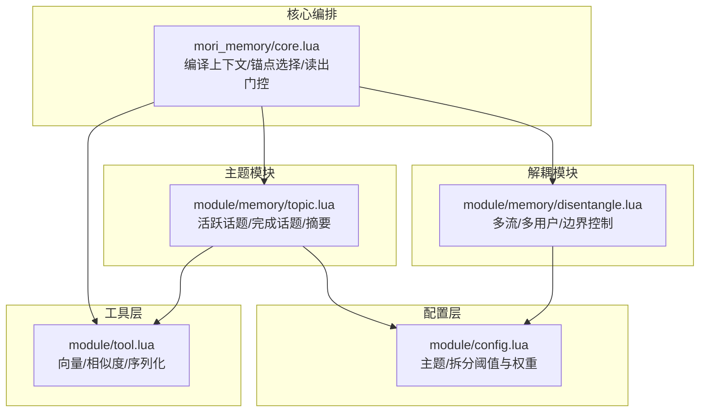
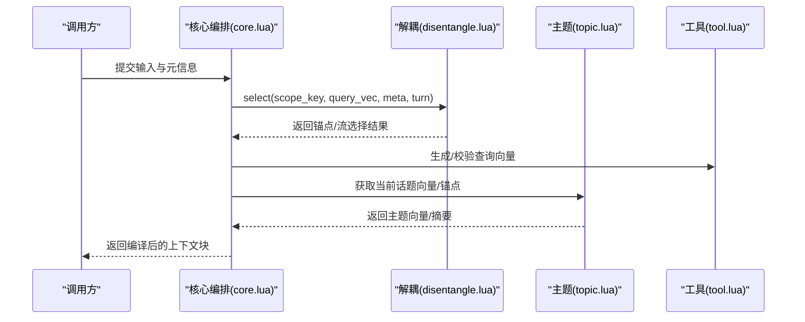
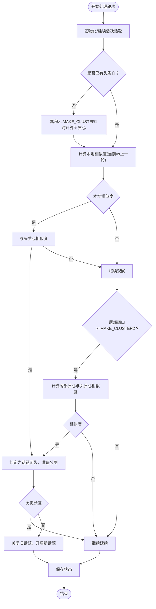
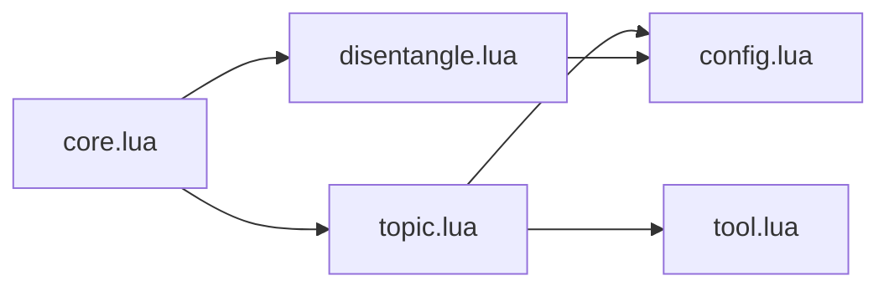

# 主题记忆

<cite>
**本文引用的文件**
- [mori_memory/core.lua](file://mori_memory/mori_memory/core.lua)
- [module/config.lua](file://mori_memory/module/config.lua)
- [module/tool.lua](file://mori_memory/module/tool.lua)
- [module/memory/topic.lua](file://mori_memory/module/memory/topic.lua)
- [module/memory/disentangle.lua](file://mori_memory/module/memory/disentangle.lua)
- [agent_memory_simub.py](file://mori_memory/agent_memory_simub.py)
</cite>

## 目录
1. [简介](#简介)
2. [项目结构](#项目结构)
3. [核心组件](#核心组件)
4. [架构总览](#架构总览)
5. [详细组件分析](#详细组件分析)
6. [依赖关系分析](#依赖关系分析)
7. [性能考量](#性能考量)
8. [故障排查指南](#故障排查指南)
9. [结论](#结论)
10. [附录](#附录)

## 简介
本技术文档围绕“主题记忆（Topic Memory）”展开，系统阐述其核心设计理念与实现机制。主题记忆以“向量聚类 + 话语对相似度检测”为核心，构建自动话题分割与边界判定的机制，结合头质心（head centroid）、尾部滑动窗口、全局漂移检测等算法，形成稳定且可扩展的多轮对话主题建模能力。同时，文档给出数据结构设计、关键配置参数、使用示例与与其他记忆类型的协作关系，并讨论在弹幕直播等高并发、多用户场景下的应用。

## 项目结构
主题记忆位于 mori_memory 子模块中，核心由以下层次构成：
- 配置层：集中管理主题与拆分相关的阈值与权重
- 工具层：提供向量运算、序列化、相似度计算等通用能力
- 主题模块：维护活跃话题状态、完成话题列表、摘要缓存与持久化
- 解耦模块：在多流/多用户场景下进行话题选择与边界强制
- 核心编排：在记忆编译上下文时，选择锚点、注入向量查询与读出门控

图示来源
- [mori_memory/core.lua:1986-2067](file://mori_memory/mori_memory/core.lua#L1986-L2067)
- [module/config.lua:147-166](file://mori_memory/module/config.lua#L147-L166)
- [module/tool.lua:500-725](file://mori_memory/module/tool.lua#L500-L725)
- [module/memory/topic.lua:1-120](file://mori_memory/module/memory/topic.lua#L1-L120)
- [module/memory/disentangle.lua:1-120](file://mori_memory/module/memory/disentangle.lua#L1-L120)

章节来源
- [mori_memory/core.lua:1986-2067](file://mori_memory/mori_memory/core.lua#L1986-L2067)
- [module/config.lua:147-166](file://mori_memory/module/config.lua#L147-L166)
- [module/tool.lua:500-725](file://mori_memory/module/tool.lua#L500-L725)
- [module/memory/topic.lua:1-120](file://mori_memory/module/memory/topic.lua#L1-L120)
- [module/memory/disentangle.lua:1-120](file://mori_memory/module/memory/disentangle.lua#L1-L120)

## 核心组件
- 主题配置（主题阈值与摘要策略）
  - 主题阈值：MAKE_CLUSTER1、MAKE_CLUSTER2、BREAK_LIMIT、CONFIRM_LIMIT、TOPIC_LIMIT、MIN_TOPIC_LENGTH
  - 摘要策略：摘要最大长度、是否允许 LLM 生成、分级摘要权重与压缩比
- 主题模块（活跃话题与完成话题）
  - 活跃话题状态：起始轮次、头质心、向量累积、尾部滑动窗口、上一轮向量、作用域键、摘要缓存
  - 完成话题列表：起止轮次、摘要、整体质心、分级摘要变体
- 工具模块（向量与相似度）
  - 向量平均、余弦相似度、向量二进制编解码、批量嵌入接口
- 解耦模块（多流/多用户/边界控制）
  - 动态阈值、流分配与挂起策略、TTL 清理、控制器轴与象限策略

章节来源
- [module/config.lua:147-166](file://mori_memory/module/config.lua#L147-L166)
- [module/memory/topic.lua:44-62](file://mori_memory/module/memory/topic.lua#L44-L62)
- [module/tool.lua:500-725](file://mori_memory/module/tool.lua#L500-L725)
- [module/memory/disentangle.lua:271-329](file://mori_memory/module/memory/disentangle.lua#L271-L329)

## 架构总览
主题记忆在“记忆编译上下文”阶段参与锚点选择与查询向量生成，随后在“主题模块”中进行话题分割与摘要维护，并与“解耦模块”协同处理多流/多用户场景下的边界与稳定性问题。

图示来源
- [mori_memory/core.lua:1986-2067](file://mori_memory/mori_memory/core.lua#L1986-L2067)
- [module/memory/disentangle.lua:388-400](file://mori_memory/module/memory/disentangle.lua#L388-L400)
- [module/memory/topic.lua:898-940](file://mori_memory/module/memory/topic.lua#L898-L940)
- [module/tool.lua:174-187](file://mori_memory/module/tool.lua#L174-L187)

章节来源
- [mori_memory/core.lua:1986-2067](file://mori_memory/mori_memory/core.lua#L1986-L2067)
- [module/memory/disentangle.lua:388-400](file://mori_memory/module/memory/disentangle.lua#L388-L400)
- [module/memory/topic.lua:898-940](file://mori_memory/module/memory/topic.lua#L898-L940)
- [module/tool.lua:174-187](file://mori_memory/module/tool.lua#L174-L187)

## 详细组件分析

### 主题记忆算法与数据结构

#### 头质心（Head Centroid）建立
- 当活跃话题累积达到 MAKE_CLUSTER1 轮时，对前 MAKE_CLUSTER1 个向量求平均，得到头质心，作为话题“起点”的代表性向量
- 作用：为后续“话语对相似度”与“全局漂移”提供稳定的参考方向

章节来源
- [module/memory/topic.lua:710-718](file://mori_memory/module/memory/topic.lua#L710-L718)

#### 尾部滑动窗口与整体质心
- 尾部滑动窗口：维持最近 MAKE_CLUSTER2 个向量，用于计算尾部质心
- 整体质心：在关闭话题时，对活跃话题所有向量求平均，作为话题的整体表示

章节来源
- [module/memory/topic.lua:52-54](file://mori_memory/module/memory/topic.lua#L52-L54)
- [module/memory/topic.lua:704-708](file://mori_memory/module/memory/topic.lua#L704-L708)
- [module/memory/topic.lua:624-626](file://mori_memory/module/memory/topic.lua#L624-L626)

#### 话语对相似度与话题边界检测
- 话语对相似度：当前轮向量与上一轮向量的余弦相似度
- 边界检测（双重验证）：
  - 局部断裂：若局部相似度低于 BREAK_LIMIT，进一步检查与头质心的相似度是否低于 CONFIRM_LIMIT，若是则判定为话题断裂
  - 全局漂移：若尾部质心与头质心的相似度低于 TOPIC_LIMIT，判定为话题漂移，触发分割
- 最小话题长度：分割前检查历史长度是否小于 MIN_TOPIC_LENGTH，不足则抑制分割

图示来源
- [module/memory/topic.lua:695-780](file://mori_memory/module/memory/topic.lua#L695-L780)
- [module/config.lua:147-166](file://mori_memory/module/config.lua#L147-L166)

章节来源
- [module/memory/topic.lua:695-780](file://mori_memory/module/memory/topic.lua#L695-L780)
- [module/config.lua:147-166](file://mori_memory/module/config.lua#L147-L166)

#### 摘要生成与分级摘要
- 摘要生成：在活跃话题或完成话题需要时，按需生成摘要，并缓存 full/slight/heavy/none 四级摘要
- 分级摘要：通过压缩比生成不同粒度的摘要，便于在不同上下文中灵活使用

章节来源
- [module/memory/topic.lua:102-160](file://mori_memory/module/memory/topic.lua#L102-L160)
- [module/memory/topic.lua:532-619](file://mori_memory/module/memory/topic.lua#L532-L619)

#### 数据结构设计
- 活跃话题状态：包含起始轮次、头质心、向量累积、尾部窗口、上一轮向量、作用域键、摘要缓存与变体
- 完成话题列表：每条记录包含起止轮次、摘要、整体质心与摘要变体
- 主题索引持久化：二进制记录包含版本、数量、活跃状态掩码、向量与话题记录

章节来源
- [module/memory/topic.lua:44-62](file://mori_memory/module/memory/topic.lua#L44-L62)
- [module/memory/topic.lua:303-464](file://mori_memory/module/memory/topic.lua#L303-L464)

### 配置参数详解与调优建议
- 主题阈值
  - MAKE_CLUSTER1：决定何时建立头质心，建议根据对话稳定性与收敛速度调整
  - MAKE_CLUSTER2：决定尾部窗口大小，影响全局漂移检测灵敏度
  - BREAK_LIMIT：局部断裂阈值，越低越敏感，越容易分割
  - CONFIRM_LIMIT：确认阈值，用于区分“断裂”与“追问/补充”
  - TOPIC_LIMIT：全局漂移阈值，越低越保守
  - MIN_TOPIC_LENGTH：分割前的最小长度，防止过早分割
- 摘要策略
  - summary_max_tokens：摘要最大长度，影响生成成本与上下文占用
  - allow_llm_summary：是否允许 LLM 生成摘要
  - summary_variant_weights：分级摘要权重，用于不同场景的优先级
  - summary_compress_ratio_slight/heavy：摘要压缩比例，平衡信息密度与可读性

章节来源
- [module/config.lua:147-166](file://mori_memory/module/config.lua#L147-L166)

### 使用示例与工作流

#### 添加对话轮次
- 输入：轮次、用户文本、向量（或由工具模块生成）、元信息（含作用域键）
- 流程：校验向量维度 → 若存在作用域隔离且跨域则强制分割 → 记录轮次向量与对话文本 → 计算局部相似度与尾部相似度 → 判断是否分割 → 更新活跃话题状态 → 保存持久化

章节来源
- [module/memory/topic.lua:659-794](file://mori_memory/module/memory/topic.lua#L659-L794)

#### 获取话题摘要
- 获取全量摘要：按需生成 full 摘要并缓存
- 获取分级摘要：按需生成 slight/heavy/none 变体，满足不同上下文需求

章节来源
- [module/memory/topic.lua:803-838](file://mori_memory/module/memory/topic.lua#L803-L838)
- [module/memory/topic.lua:532-619](file://mori_memory/module/memory/topic.lua#L532-L619)

#### 多用户/多源场景
- 作用域隔离：当活跃话题存在作用域键且新轮次来自不同作用域时，强制分割
- 解耦模块：在多流/多用户场景下，动态阈值、流分配与挂起策略确保稳定性与一致性

章节来源
- [module/memory/topic.lua:661-673](file://mori_memory/module/memory/topic.lua#L661-L673)
- [module/memory/disentangle.lua:271-329](file://mori_memory/module/memory/disentangle.lua#L271-L329)

### 与其他记忆类型的协作关系
- 与历史记忆（History）协作：主题模块通过历史模块读取对话文本，用于摘要生成与指纹统计
- 与主题图（Topic Graph）协作：主题模块提供话题向量与摘要，主题图用于检索与邻接关系
- 与精确状态（Exact State）协作：在需要精确匹配时，结合主题锚点与精确状态进行检索
- 与任务状态（Task State）协作：在编译上下文时，注入任务状态预览，辅助主题锚点选择

章节来源
- [module/memory/topic.lua:110-130](file://mori_memory/module/memory/topic.lua#L110-L130)
- [mori_memory/core.lua:1986-2067](file://mori_memory/mori_memory/core.lua#L1986-L2067)

### 在弹幕直播场景的应用
- 高并发与多用户：通过解耦模块的动态阈值与 TTL 清理，降低内存压力与延迟
- 作用域隔离：按房间/频道隔离话题，避免跨源污染
- 自适应边界：基于“话语对相似度 + 全局漂移”的双重检测，适配弹幕式碎片化输入

章节来源
- [module/memory/disentangle.lua:127-191](file://mori_memory/module/memory/disentangle.lua#L127-L191)
- [module/memory/topic.lua:661-673](file://mori_memory/module/memory/topic.lua#L661-L673)

## 依赖关系分析
- 主题模块依赖工具模块进行向量运算与相似度计算
- 主题模块依赖配置模块读取阈值与摘要策略
- 核心编排在编译上下文时依赖主题模块与解耦模块，以确定锚点与查询向量
- 解耦模块依赖配置模块的动态阈值与控制器参数

图示来源
- [mori_memory/core.lua:1986-2067](file://mori_memory/mori_memory/core.lua#L1986-L2067)
- [module/memory/topic.lua:1-120](file://mori_memory/module/memory/topic.lua#L1-L120)
- [module/memory/disentangle.lua:1-120](file://mori_memory/module/memory/disentangle.lua#L1-L120)
- [module/config.lua:147-166](file://mori_memory/module/config.lua#L147-L166)
- [module/tool.lua:500-725](file://mori_memory/module/tool.lua#L500-L725)

章节来源
- [mori_memory/core.lua:1986-2067](file://mori_memory/mori_memory/core.lua#L1986-L2067)
- [module/memory/topic.lua:1-120](file://mori_memory/module/memory/topic.lua#L1-L120)
- [module/memory/disentangle.lua:1-120](file://mori_memory/module/memory/disentangle.lua#L1-L120)
- [module/config.lua:147-166](file://mori_memory/module/config.lua#L147-L166)
- [module/tool.lua:500-725](file://mori_memory/module/tool.lua#L500-L725)

## 性能考量
- 向量相似度计算：采用余弦相似度与 SIMD 加速路径，减少计算开销
- 滑动窗口与平均：MAKE_CLUSTER1/2 控制窗口大小，避免过长窗口导致的计算与内存压力
- 摘要生成：按需生成与缓存，避免重复计算；分级摘要支持不同粒度的上下文占用
- 解耦模块：TTL 清理与 GC 触发，保障长时间运行的稳定性

## 故障排查指南
- 向量维度不一致：当查询向量与已持久化记忆维度不一致时，核心编排会禁用向量检索并提示
- 主题索引损坏：topic.bin 加载失败或版本不兼容时，模块会回退为空状态并提示
- 内存压力：解耦模块监控内存使用并在达到阈值时触发 GC

章节来源
- [mori_memory/core.lua:2042-2051](file://mori_memory/mori_memory/core.lua#L2042-L2051)
- [module/memory/topic.lua:373-464](file://mori_memory/module/memory/topic.lua#L373-L464)
- [module/memory/disentangle.lua:127-191](file://mori_memory/module/memory/disentangle.lua#L127-L191)

## 结论
主题记忆通过“头质心 + 尾部滑动窗口 + 话语对相似度 + 全局漂移检测”的组合，实现了稳健的自动话题分割与边界判定。配合解耦模块的动态阈值与 TTL 清理，能够在多流/多用户、高并发的弹幕直播场景中保持稳定性与可扩展性。通过合理的阈值与摘要策略配置，可在准确性与性能之间取得良好平衡。

## 附录
- 示例流程（Python 侧）：在仿真脚本中展示了主题锚点、个人/共享模式、查询/陈述模式的处理方式，可用于理解主题锚点与多用户场景的协作

章节来源
- [agent_memory_simub.py:402-431](file://mori_memory/agent_memory_simub.py#L402-L431)
- [agent_memory_simub.py:641-660](file://mori_memory/agent_memory_simub.py#L641-L660)