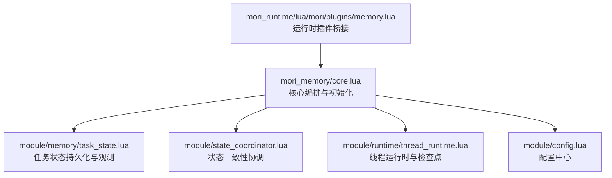
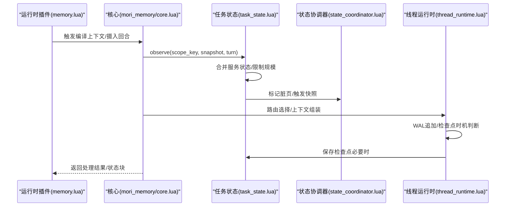
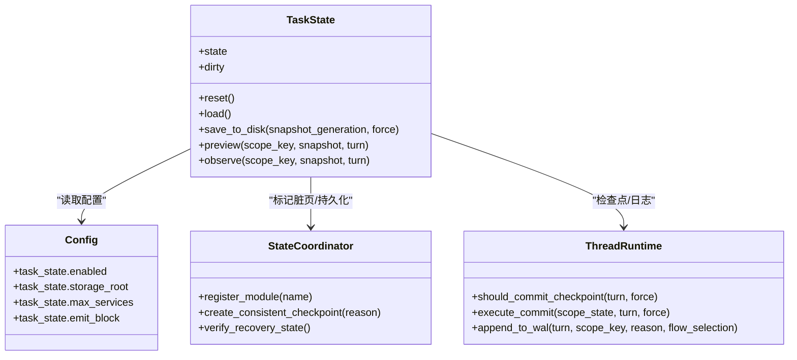
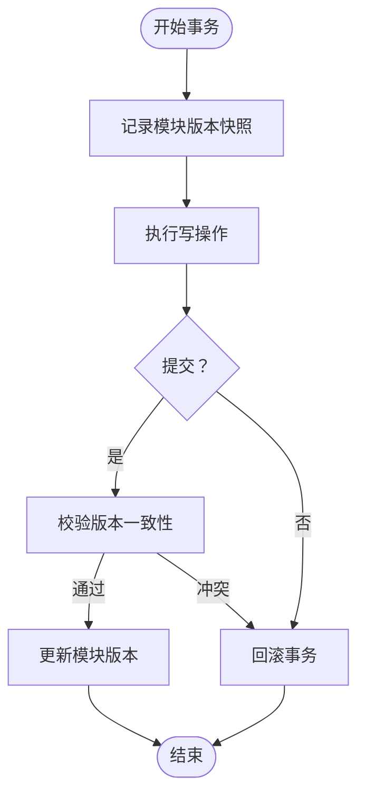
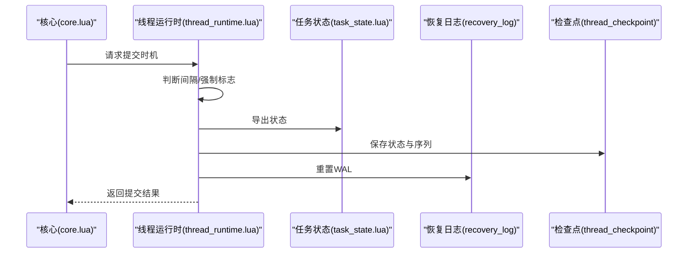
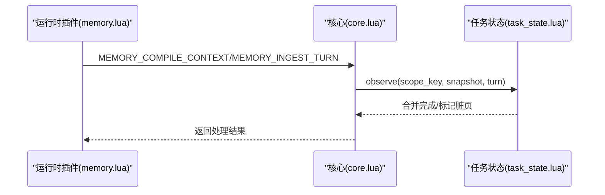
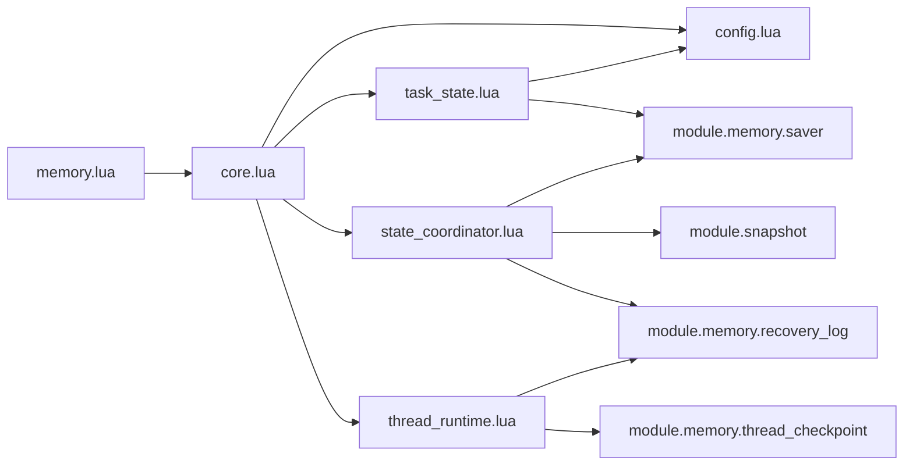

# 任务状态记忆

<cite>
**本文引用的文件**
- [mori_memory/core.lua](file://mori_memory/mori_memory/core.lua)
- [mori_memory.lua](file://mori_memory/mori_memory.lua)
- [task_state.lua](file://mori_memory/module/memory/task_state.lua)
- [state_coordinator.lua](file://mori_memory/module/state_coordinator.lua)
- [thread_runtime.lua](file://mori_memory/module/runtime/thread_runtime.lua)
- [config.lua](file://mori_memory/module/config.lua)
- [bench_mw_task_state_v0.json](file://mori_memory/benchmarks/results/bench_mw_task_state_v0.json)
- [bench_mw_task_state_v0_delta.json](file://mori_memory/benchmarks/results/bench_mw_task_state_v0_delta.json)
- [memory.lua](file://mori_runtime/lua/mori/plugins/memory.lua)
</cite>

## 目录
1. [简介](#简介)
2. [项目结构](#项目结构)
3. [核心组件](#核心组件)
4. [架构总览](#架构总览)
5. [详细组件分析](#详细组件分析)
6. [依赖关系分析](#依赖关系分析)
7. [性能考量](#性能考量)
8. [故障排查指南](#故障排查指南)
9. [结论](#结论)
10. [附录](#附录)

## 简介
本技术文档围绕“任务状态记忆（Task State Memory）”展开，系统性阐述其设计理念、数据结构、生命周期与状态转换、查询与更新接口、与决策系统的集成方式，以及在多任务并发场景下的处理策略。文档同时提供配置参数说明、使用示例路径与典型应用场景，帮助读者快速理解并正确使用该能力。

## 项目结构
任务状态记忆位于 mori_memory 子系统内，核心入口通过 mori_memory 模块导出，任务状态子模块位于 module/memory/task_state.lua，并与状态协调器、线程运行时、配置模块协同工作。

**图表来源**
- [mori_memory/core.lua:227-327](file://mori_memory/mori_memory/core.lua#L227-L327)
- [task_state.lua:1-305](file://mori_memory/module/memory/task_state.lua#L1-L305)
- [state_coordinator.lua:1-302](file://mori_memory/module/state_coordinator.lua#L1-L302)
- [thread_runtime.lua:1-260](file://mori_memory/module/runtime/thread_runtime.lua#L1-L260)
- [config.lua:168-174](file://mori_memory/module/config.lua#L168-L174)
- [memory.lua:1-28](file://mori_runtime/lua/mori/plugins/memory.lua#L1-L28)

**章节来源**
- [mori_memory/core.lua:227-327](file://mori_memory/mori_memory/core.lua#L227-L327)
- [mori_memory.lua:1-3](file://mori_memory/mori_memory.lua#L1-L3)
- [task_state.lua:1-305](file://mori_memory/module/memory/task_state.lua#L1-L305)
- [state_coordinator.lua:1-302](file://mori_memory/module/state_coordinator.lua#L1-L302)
- [thread_runtime.lua:1-260](file://mori_memory/module/runtime/thread_runtime.lua#L1-L260)
- [config.lua:168-174](file://mori_memory/module/config.lua#L168-L174)
- [memory.lua:1-28](file://mori_runtime/lua/mori/plugins/memory.lua#L1-L28)

## 核心组件
- 任务状态模块（task_state）：负责任务状态的观测、合并、格式化输出与持久化，支持按作用域（scope）聚合服务状态，限制最大服务数与槽位值数量。
- 状态协调器（state_coordinator）：维护模块版本向量、事务一致性、快照与恢复日志，保障多模块状态一致性。
- 线程运行时（thread_runtime）：作为一级运行时对象，负责路由选择、pending/孤儿状态处理、ambient 上下文维护、提交时机控制与 WAL 管理。
- 配置模块（config）：集中定义任务状态相关配置项，如启用开关、存储根目录、最大服务数、是否输出状态块等。
- 运行时插件（memory.lua）：在运行时桥接 mori_memory 核心，暴露编译上下文、摄入回合、关闭等事件。

**章节来源**
- [task_state.lua:65-305](file://mori_memory/module/memory/task_state.lua#L65-L305)
- [state_coordinator.lua:15-207](file://mori_memory/module/state_coordinator.lua#L15-L207)
- [thread_runtime.lua:15-260](file://mori_memory/module/runtime/thread_runtime.lua#L15-L260)
- [config.lua:168-174](file://mori_memory/module/config.lua#L168-L174)
- [memory.lua:8-26](file://mori_runtime/lua/mori/plugins/memory.lua#L8-L26)

## 架构总览
任务状态记忆贯穿“观测—合并—持久化—输出”的闭环，配合状态协调器与线程运行时，确保在多任务并发与跨模块协作场景下的稳定性与一致性。

**图表来源**
- [memory.lua:12-25](file://mori_runtime/lua/mori/plugins/memory.lua#L12-L25)
- [mori_memory/core.lua:255-260](file://mori_memory/mori_memory/core.lua#L255-L260)
- [task_state.lua:290-302](file://mori_memory/module/memory/task_state.lua#L290-L302)
- [state_coordinator.lua:145-207](file://mori_memory/module/state_coordinator.lua#L145-L207)
- [thread_runtime.lua:111-152](file://mori_memory/module/runtime/thread_runtime.lua#L111-L152)

## 详细组件分析

### 任务状态模块（task_state）
- 设计理念
  - 以“作用域（scope）—服务（service）—槽位（slot）”三层结构组织任务状态，支持增量观测与合并，避免状态膨胀。
  - 通过配置项限制最大服务数与槽位值数量，保证内存与性能可控。
- 数据结构
  - 全局状态：包含版本号与作用域映射。
  - 作用域桶：记录最近回合与服务集合。
  - 服务快照：包含活动意图、请求槽位与槽位值集合。
- 生命周期与状态转换
  - 观测（observe）：接收来自决策或运行时的服务快照，标准化后合并至对应作用域桶。
  - 预览（preview）：在不改变状态的前提下，基于当前桶与传入快照生成状态块文本，用于提示词注入。
  - 持久化（save_to_disk）：在脏页标记或强制刷新时写入磁盘，携带快照代际信息。
- 查询与更新接口
  - observe(scope_key, snapshot, turn)：写入并合并状态，返回布尔结果。
  - preview(scope_key, snapshot, turn)：生成状态块文本（受配置控制）。
  - load()/reset()：加载/重置状态。
  - save_to_disk(snapshot_generation, force)：持久化。
- 并发与一致性
  - 与状态协调器配合，通过版本向量与快照机制保障多模块一致性。
  - 线程运行时负责 WAL 追加与检查点提交，确保崩溃可恢复。

**图表来源**
- [task_state.lua:65-305](file://mori_memory/module/memory/task_state.lua#L65-L305)
- [config.lua:168-174](file://mori_memory/module/config.lua#L168-L174)
- [state_coordinator.lua:145-207](file://mori_memory/module/state_coordinator.lua#L145-L207)
- [thread_runtime.lua:111-201](file://mori_memory/module/runtime/thread_runtime.lua#L111-L201)

**章节来源**
- [task_state.lua:65-305](file://mori_memory/module/memory/task_state.lua#L65-L305)
- [config.lua:168-174](file://mori_memory/module/config.lua#L168-L174)

### 状态协调器（state_coordinator）
- 职责
  - 维护模块版本向量，提供事务开始/提交/回滚。
  - 创建一致性检查点，写入快照与恢复日志。
  - 验证恢复状态，发现不一致时自动创建检查点。
- 关键流程
  - begin_transaction：记录参与模块的版本快照。
  - commit_transaction：校验期间无冲突后更新版本。
  - create_consistent_checkpoint：原子性持久化并记录 WAL。
  - verify_recovery_state：校验快照与 WAL 的一致性。

**图表来源**
- [state_coordinator.lua:75-142](file://mori_memory/module/state_coordinator.lua#L75-L142)
- [state_coordinator.lua:145-207](file://mori_memory/module/state_coordinator.lua#L145-L207)
- [state_coordinator.lua:210-258](file://mori_memory/module/state_coordinator.lua#L210-L258)

**章节来源**
- [state_coordinator.lua:15-207](file://mori_memory/module/state_coordinator.lua#L15-L207)

### 线程运行时（thread_runtime）
- 职责
  - 路由边界管理、pending/孤儿状态处理、ambient 上下文维护。
  - 提供提交时机判断与 WAL 管理，负责检查点保存与 WAL 重置。
- 关键流程
  - should_commit_checkpoint：根据回合间隔决定是否提交。
  - execute_commit：导出状态、保存检查点、重置 WAL。
  - append_to_wal：将作用域状态写入恢复日志。

**图表来源**
- [thread_runtime.lua:111-152](file://mori_memory/module/runtime/thread_runtime.lua#L111-L152)
- [thread_runtime.lua:174-201](file://mori_memory/module/runtime/thread_runtime.lua#L174-L201)
- [mori_memory/core.lua:255-260](file://mori_memory/mori_memory/core.lua#L255-L260)

**章节来源**
- [thread_runtime.lua:15-260](file://mori_memory/module/runtime/thread_runtime.lua#L15-L260)

### 与决策系统的集成
- 运行时插件桥接
  - 运行时插件订阅编译上下文、摄入回合与关闭事件，将请求转发至 mori_memory 核心。
- 核心初始化与任务状态加载
  - 核心在 ensure_init 中加载历史、主题图、精确状态与任务状态模块，确保任务状态可用。
- 状态块注入
  - 任务状态模块支持 preview 输出状态块文本，便于在提示词中注入当前任务状态。

**图表来源**
- [memory.lua:12-25](file://mori_runtime/lua/mori/plugins/memory.lua#L12-L25)
- [mori_memory/core.lua:255-260](file://mori_memory/mori_memory/core.lua#L255-L260)
- [task_state.lua:275-288](file://mori_memory/module/memory/task_state.lua#L275-L288)

**章节来源**
- [memory.lua:1-28](file://mori_runtime/lua/mori/plugins/memory.lua#L1-L28)
- [mori_memory/core.lua:227-260](file://mori_memory/mori_memory/core.lua#L227-L260)
- [task_state.lua:275-288](file://mori_memory/module/memory/task_state.lua#L275-L288)

## 依赖关系分析
- 模块耦合
  - task_state 依赖 config、persistence、snapshot、util，与 saver 协作实现脏页标记与原子写入。
  - state_coordinator 依赖 saver、snapshot、recovery_log，负责一致性与恢复。
  - thread_runtime 依赖 disentangle、recovery_log、thread_checkpoint、saver，承担运行时检查点与 WAL。
  - core.lua 在 ensure_init 中统一加载多个子模块，包括 task_state。
- 外部依赖
  - 配置模块提供 task_state 的启用、存储根目录、最大服务数等参数。
  - 运行时插件提供事件桥接，驱动核心执行。

**图表来源**
- [mori_memory/core.lua:227-327](file://mori_memory/mori_memory/core.lua#L227-L327)
- [task_state.lua:14-21](file://mori_memory/module/memory/task_state.lua#L14-L21)
- [state_coordinator.lua:1-13](file://mori_memory/module/state_coordinator.lua#L1-L13)
- [thread_runtime.lua:6-12](file://mori_memory/module/runtime/thread_runtime.lua#L6-L12)
- [memory.lua:8-10](file://mori_runtime/lua/mori/plugins/memory.lua#L8-L10)

**章节来源**
- [mori_memory/core.lua:227-327](file://mori_memory/mori_memory/core.lua#L227-L327)
- [task_state.lua:14-21](file://mori_memory/module/memory/task_state.lua#L14-L21)
- [state_coordinator.lua:1-13](file://mori_memory/module/state_coordinator.lua#L1-L13)
- [thread_runtime.lua:6-12](file://mori_memory/module/runtime/thread_runtime.lua#L6-L12)
- [memory.lua:8-10](file://mori_runtime/lua/mori/plugins/memory.lua#L8-L10)

## 性能考量
- 状态规模控制
  - 通过配置项限制每个作用域内的服务数与槽位值数量，避免状态无限增长。
- 持久化与脏页
  - 仅在状态变更或强制刷新时写盘，减少 IO 开销。
- 检查点与 WAL
  - 线程运行时按回合间隔提交检查点，WAL 用于崩溃恢复，降低全量落盘频率。
- 一致性开销
  - 状态协调器的版本向量与快照写入带来一定 CPU/IO 成本，建议在高吞吐场景下合理设置检查点间隔。

[本节为通用性能讨论，无需列出具体文件来源]

## 故障排查指南
- 任务状态未生效
  - 检查配置项 task_state.enabled 是否开启。
  - 确认 core.lua 初始化阶段是否成功加载 task_state。
- 状态块为空
  - 检查 task_state.emit_block 是否开启，且传入的 snapshot 是否包含有效服务。
- 生成不一致
  - 使用 state_coordinator.verify_recovery_state 检查快照与 WAL 的一致性，必要时创建一致性检查点。
- 检查点失败
  - 查看线程运行时 WAL 追加与重置日志，确认 saver.flush_all 与 thread_checkpoint.save 的返回值。

**章节来源**
- [config.lua:168-174](file://mori_memory/module/config.lua#L168-L174)
- [mori_memory/core.lua:255-260](file://mori_memory/mori_memory/core.lua#L255-L260)
- [state_coordinator.lua:210-258](file://mori_memory/module/state_coordinator.lua#L210-L258)
- [thread_runtime.lua:174-201](file://mori_memory/module/runtime/thread_runtime.lua#L174-L201)

## 结论
任务状态记忆通过“观测—合并—持久化—输出”的闭环，结合状态协调器与线程运行时，实现了在多任务并发场景下的稳定与一致。合理的配置与检查点策略能够平衡性能与可靠性，适用于多步骤对话流程、复杂交互任务与后台处理任务等多种场景。

[本节为总结性内容，无需列出具体文件来源]

## 附录

### 配置参数说明（task_state）
- enabled：是否启用任务状态记忆。
- storage_root：任务状态持久化的存储根目录。
- max_services：每个作用域允许的最大服务数。
- max_slot_values：每个服务的槽位值上限。
- emit_block：是否输出状态块文本供提示词使用。

**章节来源**
- [config.lua:168-174](file://mori_memory/module/config.lua#L168-L174)

### 使用示例（路径指引）
- 创建任务/更新状态
  - observe(scope_key, snapshot, turn)：写入并合并服务快照。
  - 参考路径：[task_state.lua:290-302](file://mori_memory/module/memory/task_state.lua#L290-L302)
- 查询进度/预览
  - preview(scope_key, snapshot, turn)：生成状态块文本。
  - 参考路径：[task_state.lua:275-288](file://mori_memory/module/memory/task_state.lua#L275-L288)
- 初始化与加载
  - ensure_init 中加载 task_state。
  - 参考路径：[mori_memory/core.lua:255-260](file://mori_memory/mori_memory/core.lua#L255-L260)
- 运行时集成
  - 运行时插件桥接事件并调用核心。
  - 参考路径：[memory.lua:12-25](file://mori_runtime/lua/mori/plugins/memory.lua#L12-L25)

### 实际应用场景
- 多步骤对话流程
  - 通过 observe 合并每步服务状态，preview 输出当前任务状态，辅助后续决策。
  - 参考路径：[task_state.lua:275-302](file://mori_memory/module/memory/task_state.lua#L275-L302)
- 复杂交互任务
  - 使用状态协调器与线程运行时保障跨模块一致性与崩溃恢复。
  - 参考路径：[state_coordinator.lua:145-207](file://mori_memory/module/state_coordinator.lua#L145-L207)、[thread_runtime.lua:111-152](file://mori_memory/module/runtime/thread_runtime.lua#L111-L152)
- 后台处理任务
  - 通过检查点与 WAL 保障长时间运行的稳定性。
  - 参考路径：[thread_runtime.lua:174-201](file://mori_memory/module/runtime/thread_runtime.lua#L174-L201)

### 基准与评估
- 任务状态基准报告（含槽位召回、完整状态命中率等指标）
  - 参考路径：[bench_mw_task_state_v0.json:10-50](file://mori_memory/benchmarks/results/bench_mw_task_state_v0.json#L10-L50)、[bench_mw_task_state_v0_delta.json:10-22](file://mori_memory/benchmarks/results/bench_mw_task_state_v0_delta.json#L10-L22)