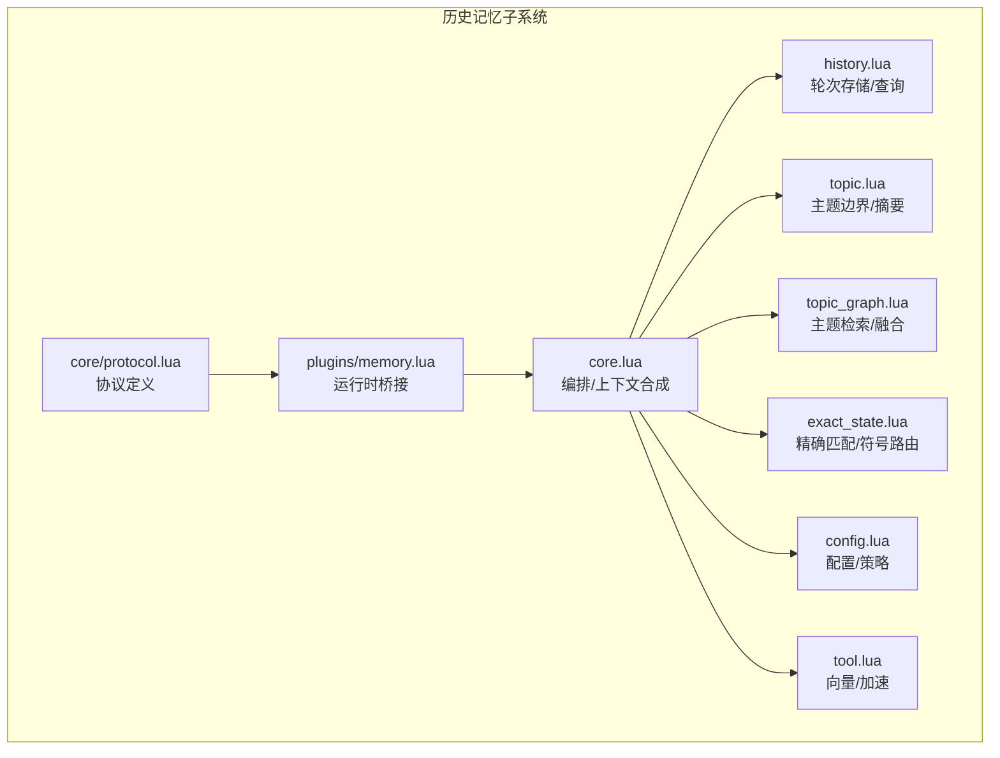
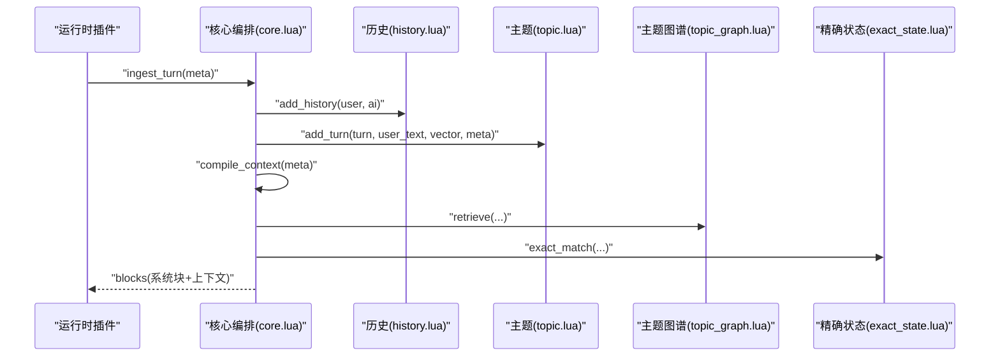
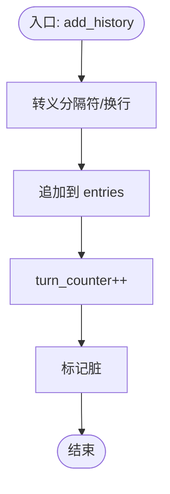
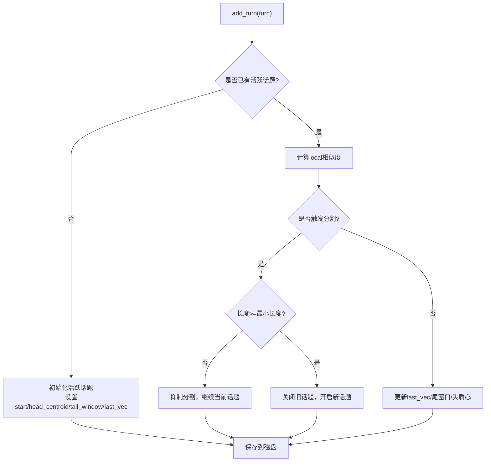
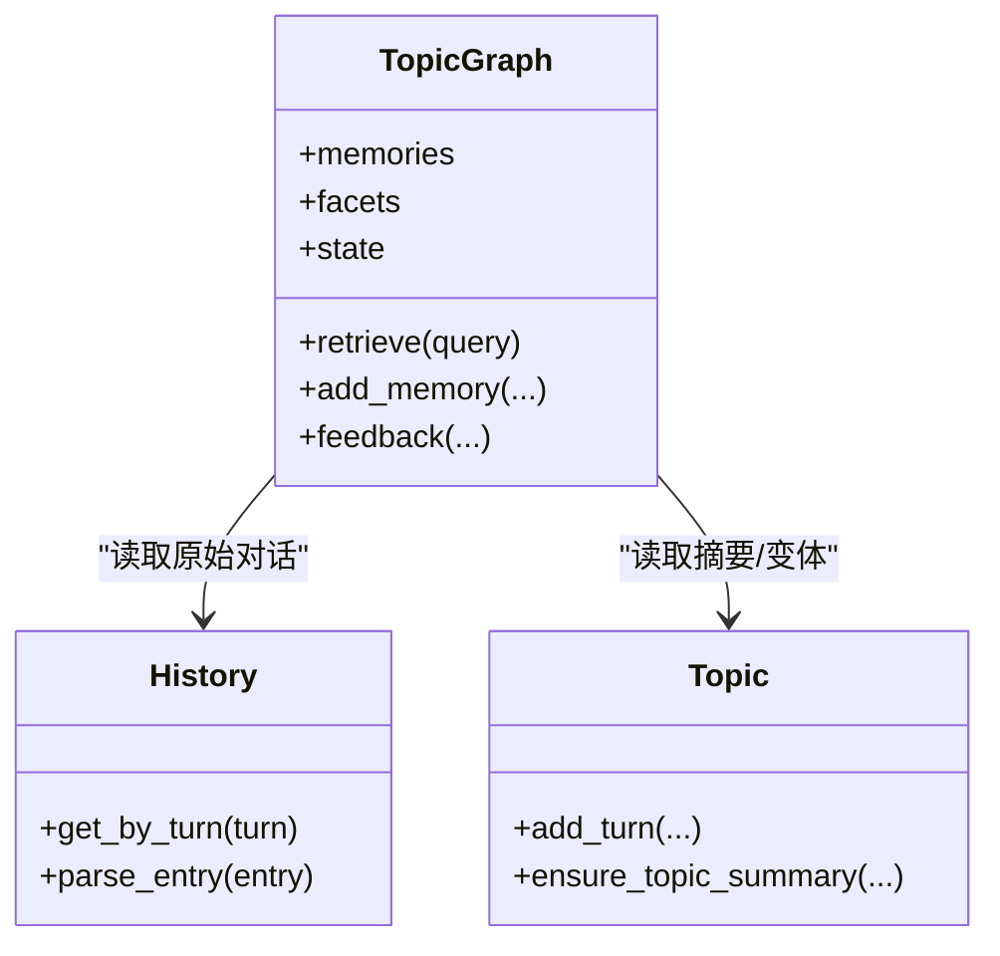
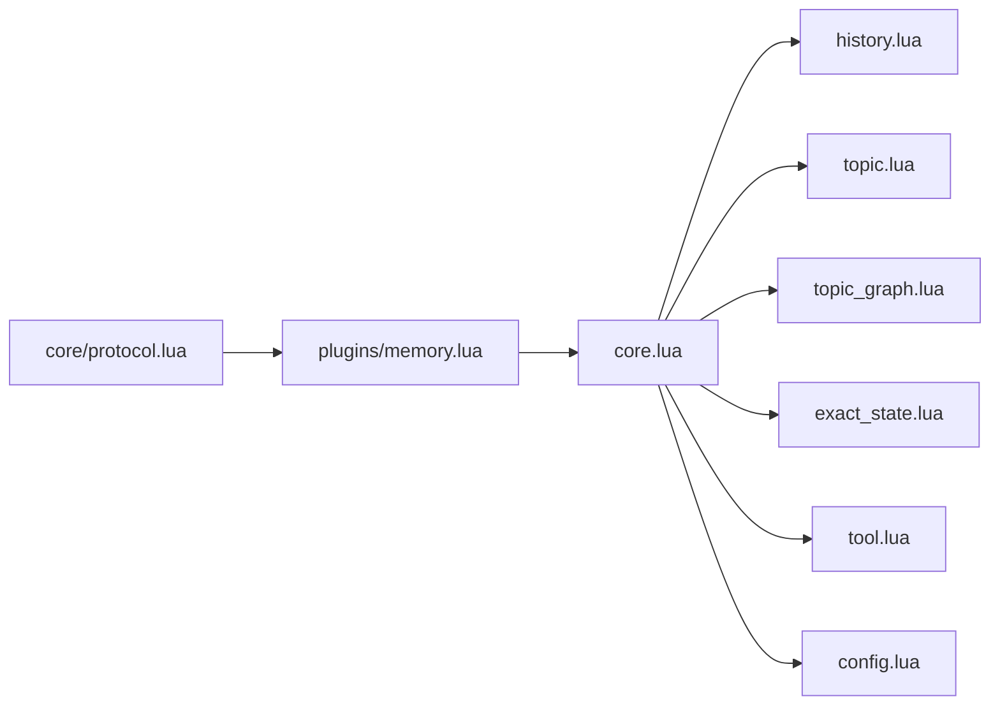

# 历史记忆

<cite>
**本文引用的文件**   
- [mori_memory/README.md](file://mori_memory/README.md)
- [mori_memory/module/memory/history.lua](file://mori_memory/module/memory/history.lua)
- [mori_memory/module/memory/topic.lua](file://mori_memory/module/memory/topic.lua)
- [mori_memory/module/memory/topic_graph.lua](file://mori_memory/module/memory/topic_graph.lua)
- [mori_memory/module/memory/exact_state.lua](file://mori_memory/module/memory/exact_state.lua)
- [mori_memory/module/config.lua](file://mori_memory/module/config.lua)
- [mori_memory/module/tool.lua](file://mori_memory/module/tool.lua)
- [mori_memory/mori_memory/core.lua](file://mori_memory/mori_memory/core.lua)
- [mori_runtime/lua/mori/plugins/memory.lua](file://mori_runtime/lua/mori/plugins/memory.lua)
- [mori_runtime/lua/mori/core/protocol.lua](file://mori_runtime/lua/mori/core/protocol.lua)
- [mori_memory/docs/20260324_mori_generalization_rwkv_mamba_rosa.md](file://mori_memory/docs/20260324_mori_generalization_rwkv_mamba_rosa.md)
- [mori_memory/docs/20260325_two_axis_scope_controller_design.md](file://mori_memory/docs/20260325_two_axis_scope_controller_design.md)
- [test_phase2_simple.lua](file://test_phase2_simple.lua)
</cite>

## 目录
1. [简介](#简介)
2. [项目结构](#项目结构)
3. [核心组件](#核心组件)
4. [架构总览](#架构总览)
5. [详细组件分析](#详细组件分析)
6. [依赖分析](#依赖分析)
7. [性能考虑](#性能考虑)
8. [故障排查指南](#故障排查指南)
9. [结论](#结论)
10. [附录](#附录)

## 简介
本文件围绕“历史记忆（History Memory）”展开，系统性阐述其在对话历史记录中的核心地位与工作机制。历史记忆负责：
- 对话轮次的存储与索引（按轮次编号）
- 用户与AI对话内容的持久化
- 时间戳与生成版本的协同管理
- 查询接口：按轮次获取、范围查询、最近N轮查询等
- 与主题记忆（Topic Memory）的协作：在话题重建、摘要生成、检索融合中的角色
- 配置参数与性能优化：内存控制、持久化策略、加速模块
- 实际使用示例与最佳实践：在LLM上下文中构建历史对话、处理长对话场景

## 项目结构
历史记忆位于 mori_memory 子模块中，核心文件与职责如下：
- 历史记忆：module/memory/history.lua
- 主题记忆：module/memory/topic.lua
- 主题图谱：module/memory/topic_graph.lua
- 精确状态（Exact State）：module/memory/exact_state.lua
- 配置：module/config.lua
- 工具与加速：module/tool.lua
- 核心编排：mori_memory/core.lua
- 运行时桥接：mori_runtime/lua/mori/plugins/memory.lua、mori_runtime/lua/mori/core/protocol.lua
- 使用说明与示例：mori_memory/README.md

图表来源
- [mori_memory/module/memory/history.lua:1-195](file://mori_memory/module/memory/history.lua#L1-L195)
- [mori_memory/module/memory/topic.lua:1-120](file://mori_memory/module/memory/topic.lua#L1-L120)
- [mori_memory/module/memory/topic_graph.lua:1-120](file://mori_memory/module/memory/topic_graph.lua#L1-L120)
- [mori_memory/module/memory/exact_state.lua:1-120](file://mori_memory/module/memory/exact_state.lua#L1-L120)
- [mori_memory/module/config.lua:1-120](file://mori_memory/module/config.lua#L1-L120)
- [mori_memory/module/tool.lua:1-120](file://mori_memory/module/tool.lua#L1-L120)
- [mori_memory/mori_memory/core.lua:1-120](file://mori_memory/mori_memory/core.lua#L1-L120)
- [mori_runtime/lua/mori/plugins/memory.lua:1-30](file://mori_runtime/lua/mori/plugins/memory.lua#L1-L30)
- [mori_runtime/lua/mori/core/protocol.lua:1-30](file://mori_runtime/lua/mori/core/protocol.lua#L1-L30)

章节来源
- [mori_memory/README.md:1-89](file://mori_memory/README.md#L1-L89)

## 核心组件
- 历史记忆（history.lua）
  - 数据结构：entries 表（按轮次顺序）、turn_counter（当前轮次计数）
  - 文件格式：V3头 + GEN版本号 + 每行一条记录（用户/AI内容以分隔符分隔）
  - 关键能力：按轮次读取、范围读取、最近N轮、转存磁盘、加载与校验
- 主题记忆（topic.lua）
  - 数据结构：active_topic（活跃话题）、topics（历史话题列表）、dialogues（轮次文本缓存）
  - 核心算法：基于“话语对相似度 + 全局漂移”的话题边界检测与分割
  - 摘要能力：支持分级摘要（full/slight/heavy/none），缓存与回写
- 主题图谱（topic_graph.lua）
  - 数据结构：memories、facets、exact索引、运行时状态（flow_runtime）
  - 能力：语义检索、精确匹配、趋势候选、反馈融合、HNSW加速
- 精确状态（exact_state.lua）
  - 数据结构：scope/thread/threads/suffix图、term/mention索引
  - 能力：回复父节点候选、符号键构建、后缀图、最近窗口回溯
- 工具与加速（tool.lua）
  - 能力：向量维度校验、平均向量、余弦相似度、SIMD加速、Topic记录二进制编解码
- 配置（config.lua）
  - 能力：主题/图谱/精确匹配/守卫/流分配等参数集中管理
- 核心编排（core.lua）
  - 能力：编译上下文（compile_context）、写入轮次（ingest_turn）、广播状态变更、与主题/历史/图谱交互

章节来源
- [mori_memory/module/memory/history.lua:1-195](file://mori_memory/module/memory/history.lua#L1-L195)
- [mori_memory/module/memory/topic.lua:1-200](file://mori_memory/module/memory/topic.lua#L1-L200)
- [mori_memory/module/memory/topic_graph.lua:1-200](file://mori_memory/module/memory/topic_graph.lua#L1-L200)
- [mori_memory/module/memory/exact_state.lua:1-200](file://mori_memory/module/memory/exact_state.lua#L1-L200)
- [mori_memory/module/tool.lua:1-200](file://mori_memory/module/tool.lua#L1-L200)
- [mori_memory/module/config.lua:1-200](file://mori_memory/module/config.lua#L1-L200)
- [mori_memory/mori_memory/core.lua:1-220](file://mori_memory/mori_memory/core.lua#L1-L220)

## 架构总览
历史记忆在系统中的位置与交互如下：

图表来源
- [mori_runtime/lua/mori/plugins/memory.lua:1-20](file://mori_runtime/lua/mori/plugins/memory.lua#L1-L20)
- [mori_runtime/lua/mori/core/protocol.lua:1-20](file://mori_runtime/lua/mori/core/protocol.lua#L1-L20)
- [mori_memory/mori_memory/core.lua:1711-1959](file://mori_memory/mori_memory/core.lua#L1711-L1959)
- [mori_memory/module/memory/history.lua:117-126](file://mori_memory/module/memory/history.lua#L117-L126)
- [mori_memory/module/memory/topic.lua:659-794](file://mori_memory/module/memory/topic.lua#L659-L794)
- [mori_memory/module/memory/topic_graph.lua:1-200](file://mori_memory/module/memory/topic_graph.lua#L1-L200)
- [mori_memory/module/memory/exact_state.lua:1-200](file://mori_memory/module/memory/exact_state.lua#L1-L200)

## 详细组件分析

### 历史记忆（history.lua）
- 数据结构与持久化
  - entries：按轮次顺序存储的字符串记录
  - turn_counter：当前轮次计数
  - 文件头：V3 + GEN版本号，确保快照一致性
  - 序列化：FIELD_SEP/RECORD_SEP转义，保证换行与特殊字符安全
- 查询接口
  - get_turn()：获取当前轮次
  - get_by_turn(turn)：按轮次获取整条记录
  - get_turn_text(turn, role)：按轮次获取指定角色（用户/AI）文本
  - parse_entry(entry)：解析记录为用户/AI文本对
- 写入与落盘
  - add_history(user, ai)：追加一条记录并标记脏
  - save_to_disk(snapshot_generation)：原子写入，带版本号
- 加载与校验
  - load()：按版本头/生成号校验，加载entries并更新turn_counter

图表来源
- [mori_memory/module/memory/history.lua:117-126](file://mori_memory/module/memory/history.lua#L117-L126)

章节来源
- [mori_memory/module/memory/history.lua:1-195](file://mori_memory/module/memory/history.lua#L1-L195)

### 主题记忆（topic.lua）
- 主题边界与摘要
  - active_topic：活跃话题状态（起始轮、头质心、尾窗口、last_vec、scope_key、摘要缓存）
  - add_turn(turn, user_text, vector, meta)：写入轮向量与文本，维护活跃话题
  - 话题分割：基于“话语对相似度（local）+ 全局漂移（drift）+ 确认阈值（confirm）”三重检测
  - close_current_topic(end_turn)：结束活跃话题并写入topics
  - 摘要：支持分级摘要（full/slight/heavy/none），缓存与回写
- 与历史记忆协作
  - 摘要生成时读取历史文本（通过history.get_turn_text），避免重复计算embedding
  - 通过dialogues缓存减少对历史文件的频繁访问

图表来源
- [mori_memory/module/memory/topic.lua:659-794](file://mori_memory/module/memory/topic.lua#L659-L794)

章节来源
- [mori_memory/module/memory/topic.lua:1-200](file://mori_memory/module/memory/topic.lua#L1-L200)

### 主题图谱（topic_graph.lua）
- 数据与索引
  - memories：主题/事实/片段记忆
  - facets：词面权重映射，用于语义检索
  - exact索引：term/mention/bookmark/symbol等精确匹配
  - 运行时状态：flow_runtime、topic_fast_prior、memory_next_fast等
- 检索与融合
  - retrieve：结合语义相似度、主题先验、精确匹配、趋势候选等多路信号
  - feedback：快慢反馈融合，动态调整prior与next候选
  - HNSW加速：可选的topic centroid索引
- 与历史/主题协作
  - 通过history.get_by_turn读取原始对话，拼装检索上下文
  - 与topic的摘要变体配合，提供不同粒度的检索信号

图表来源
- [mori_memory/module/memory/topic_graph.lua:1-200](file://mori_memory/module/memory/topic_graph.lua#L1-L200)
- [mori_memory/module/memory/history.lua:146-165](file://mori_memory/module/memory/history.lua#L146-L165)
- [mori_memory/module/memory/topic.lua:532-619](file://mori_memory/module/memory/topic.lua#L532-L619)

章节来源
- [mori_memory/module/memory/topic_graph.lua:1-200](file://mori_memory/module/memory/topic_graph.lua#L1-L200)

### 精确状态（exact_state.lua）
- 符号键与后缀图
  - build_symbol_key：从terms/mentions/motifs提取稳定符号，限制数量
  - suffix_graph：基于符号后缀构建转移图，支持回复父节点候选
- 精确匹配
  - 提取term权重、提及、书签、动机模式
  - overlap_score：计算查询与候选的重叠分数，支持hard hits加成
- 与主题图谱协作
  - 作为“精确命中片段”的软先验，与语义检索融合，提升召回质量

章节来源
- [mori_memory/module/memory/exact_state.lua:1-200](file://mori_memory/module/memory/exact_state.lua#L1-L200)

### 工具与加速（tool.lua）
- 向量操作
  - validate_vector/vector_dim：向量维度校验
  - average_vectors/cosine_similarity：平均向量与余弦相似度
  - vector_to_bin/bin_to_vector：Topic记录二进制编解码
- SIMD加速
  - 自动加载simdc_math.so，若失败则回退Lua实现
- Python嵌入
  - get_embedding/get_embedding_query/get_embedding_passage：通过py_pipeline获取向量

章节来源
- [mori_memory/module/tool.lua:1-200](file://mori_memory/module/tool.lua#L1-L200)

### 核心编排（core.lua）
- 编译上下文（compile_context）
  - 读取guard与grudge状态，生成系统块（黑名单/备注等）
  - 选择读出门控（exact/memory/transcript/pending/trend/topic），融合多路信号
  - 与topic_graph.retrieve、exact_state等协作，输出blocks
- 写入轮次（ingest_turn）
  - 解析期望轮次，写入history与topic
  - 广播状态变更，触发分布式同步

章节来源
- [mori_memory/mori_memory/core.lua:1961-2019](file://mori_memory/mori_memory/core.lua#L1961-L2019)
- [mori_memory/mori_memory/core.lua:1711-1959](file://mori_memory/mori_memory/core.lua#L1711-L1959)

## 依赖分析
- 模块内依赖
  - history.lua 依赖 config、tool、persistence、snapshot
  - topic.lua 依赖 history、tool、config、persistence
  - topic_graph.lua 依赖 history、topic、tool、config、persistence、snapshot
  - exact_state.lua 依赖 config、persistence、snapshot、util
  - core.lua 依赖 history、topic、topic_graph、exact_state、tool、config、saver、distributed_sync
- 运行时依赖
  - 运行时通过 plugins/memory.lua 暴露 ingest_turn/compile_context
  - 协议通过 core/protocol.lua 定义

图表来源
- [mori_memory/mori_memory/core.lua:1-30](file://mori_memory/mori_memory/core.lua#L1-L30)
- [mori_runtime/lua/mori/plugins/memory.lua:1-20](file://mori_runtime/lua/mori/plugins/memory.lua#L1-L20)
- [mori_runtime/lua/mori/core/protocol.lua:1-20](file://mori_runtime/lua/mori/core/protocol.lua#L1-L20)

章节来源
- [mori_memory/mori_memory/core.lua:1-30](file://mori_memory/mori_memory/core.lua#L1-L30)

## 性能考虑
- 向量计算与SIMD加速
  - tool.lua优先使用simdc_math.so进行点积/余弦计算，显著降低CPU开销
  - 若缺失则回退Lua实现，仍可保证正确性
- 主题边界检测的复杂度
  - add_turn涉及相似度计算与窗口维护，时间复杂度与MAKE_CLUSTER1/MAKE_CLUSTER2相关
  - 建议合理设置阈值与窗口大小，避免过度分割或漂移
- 主题图谱检索
  - 可启用HNSW加速，减少主题centroid扫描成本
  - facet权重归一化与槽位裁剪（facet_slots）控制检索规模
- 精确匹配
  - term权重提取与重叠评分在大文本上可能成为瓶颈，建议限制term数量与窗口
- 内存与持久化
  - 历史文件采用V3头+GEN版本号，确保快照一致性
  - topic.bin与topic_graph/state.lua/vec.bin等二进制文件采用原子写入，避免损坏
- 配置优化要点
  - topic_graph.feedback/fast/adopt_lr、decay、topic_cap/next_cap等参数影响检索稳定性与资源占用
  - exact_match的retrieve_limit、reply_parent_*等参数影响精确召回与延迟

章节来源
- [mori_memory/module/tool.lua:1-120](file://mori_memory/module/tool.lua#L1-L120)
- [mori_memory/module/config.lua:27-145](file://mori_memory/module/config.lua#L27-L145)
- [mori_memory/module/memory/topic_graph.lua:1-120](file://mori_memory/module/memory/topic_graph.lua#L1-L120)

## 故障排查指南
- 历史文件加载失败
  - 现象：返回 invalid_history_header 或 invalid_history_generation
  - 排查：确认文件头与GEN版本号，检查快照一致性
- topic.bin损坏
  - 现象：返回 corrupt_active_head/tail/last 或版本不匹配
  - 排查：删除或修复topic.bin，必要时重建
- 向量维度不匹配
  - 现象：validate_vector 返回 dimension_mismatch
  - 排查：核对embedding维度与配置dim，确保宿主系统提供正确的向量
- 精确匹配召回异常
  - 现象：overlap_score偏低或term权重异常
  - 排查：检查extract_text_term_weights与filter_terms逻辑，确认term数量与权重上限
- 运行时一致性问题
  - 现象：跨模块状态不一致
  - 排查：参考test_phase2_simple中的版本向量与事务冲突检测思路，确保模块版本与快照一致

章节来源
- [mori_memory/module/memory/history.lua:67-115](file://mori_memory/module/memory/history.lua#L67-L115)
- [mori_memory/module/memory/topic.lua:373-464](file://mori_memory/module/memory/topic.lua#L373-L464)
- [mori_memory/module/tool.lua:160-170](file://mori_memory/module/tool.lua#L160-L170)
- [test_phase2_simple.lua:1-150](file://test_phase2_simple.lua#L1-L150)

## 结论
历史记忆作为对话历史记录的核心，通过简洁可靠的数据结构与严格的持久化策略，为主题记忆、主题图谱与精确状态提供了坚实的基础。在LLM上下文中，历史记忆与主题记忆协作完成话题边界与摘要生成，再由主题图谱与精确状态融合检索信号，最终形成高质量的上下文块。通过合理的配置与SIMD/HNSW加速，可在保证正确性的前提下获得优异的性能表现。

## 附录

### 配置参数说明（节选）
- topic_graph
  - storage.root：主题图谱存储根目录
  - feedback.fast/adopt_lr、slow_*：快慢反馈学习率与权重
  - topic_cap/next_cap：主题与下一跳候选上限
  - facet_slots：facet权重槽位裁剪
  - exact_match.*：精确匹配相关参数
- topic
  - make_cluster1/make_cluster2：头质心与尾窗口阈值
  - topic_limit/break_limit/confirm_limit：主题边界检测阈值
  - summary_max_tokens/allow_llm_summary：摘要生成策略
- disentangle
  - memory_limits/ttl_settings/gc_control：内存与GC控制
  - two_axis_controller_*：双轴控制器参数
  - selective_write_*：慢写入选择性策略

章节来源
- [mori_memory/module/config.lua:27-496](file://mori_memory/module/config.lua#L27-L496)

### 实际使用示例（路径指引）
- 基本写入与编译上下文
  - 参考：[mori_memory/README.md:11-38](file://mori_memory/README.md#L11-L38)
- 运行时桥接
  - 参考：[mori_runtime/lua/mori/plugins/memory.lua:1-20](file://mori_runtime/lua/mori/plugins/memory.lua#L1-L20)
  - 参考：[mori_runtime/lua/mori/core/protocol.lua:1-20](file://mori_runtime/lua/mori/core/protocol.lua#L1-L20)
- 历史写入与主题写入
  - 参考：[mori_memory/mori_memory/core.lua:1711-1740](file://mori_memory/mori_memory/core.lua#L1711-L1740)
  - 参考：[mori_memory/mori_memory/core.lua:1821-1821](file://mori_memory/mori_memory/core.lua#L1821-L1821)

### 最佳实践
- 长对话场景
  - 合理设置MAKE_CLUSTER1/MAKE_CLUSTER2与MIN_TOPIC_LENGTH，避免频繁分割
  - 使用分级摘要（slight/heavy）在不同粒度间平衡检索效率与覆盖度
- 多人/多源隔离
  - 启用guard.topic_scope_isolation，按scope_key强制话题边界，降低跨源污染
- 检索质量
  - 结合exact_state与topic_graph的feedback融合，提升召回与相关性
- 性能优化
  - 启用SIMD与HNSW加速，合理裁剪facet_slots与候选上限
  - 控制disentangle的memory_limits与GC触发阈值，避免内存压力

章节来源
- [mori_memory/docs/20260325_two_axis_scope_controller_design.md:308-369](file://mori_memory/docs/20260325_two_axis_scope_controller_design.md#L308-L369)
- [mori_memory/docs/20260324_mori_generalization_rwkv_mamba_rosa.md:645-746](file://mori_memory/docs/20260324_mori_generalization_rwkv_mamba_rosa.md#L645-L746)