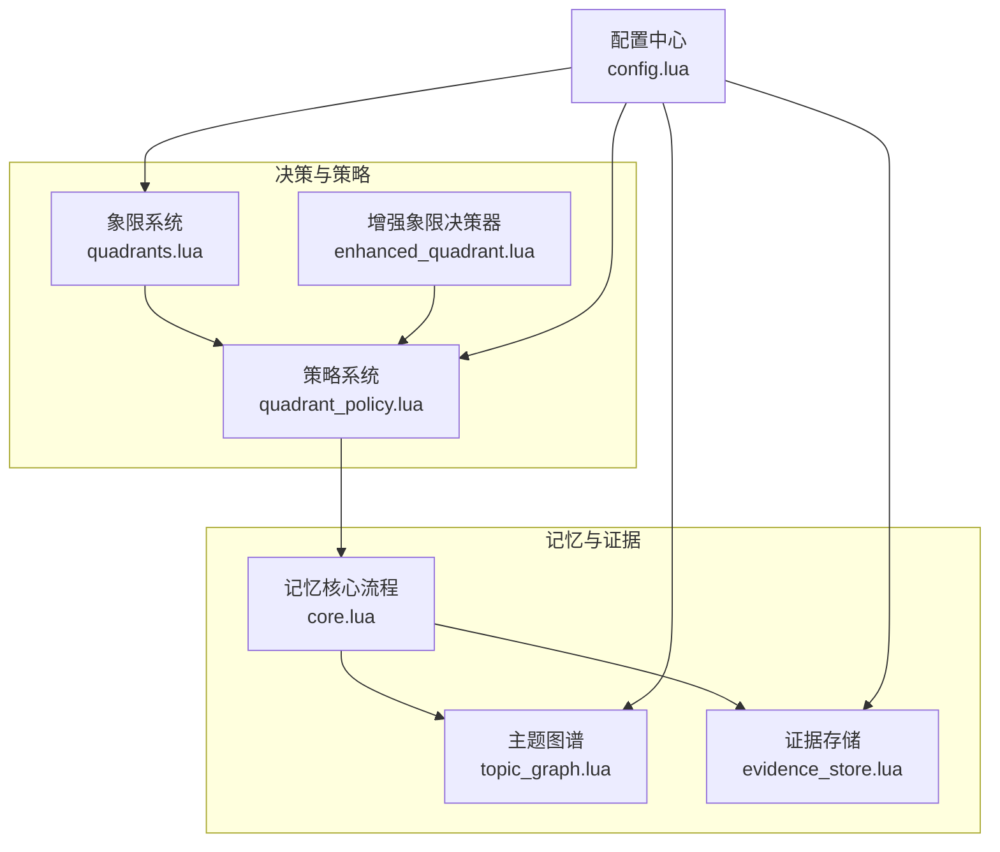
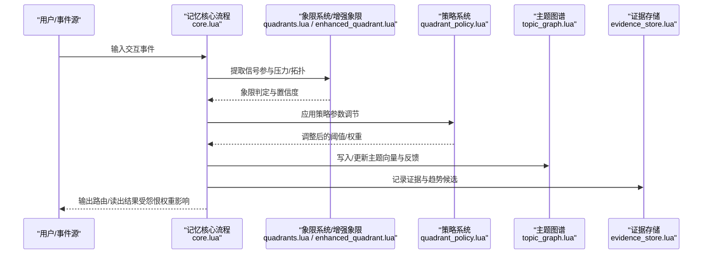
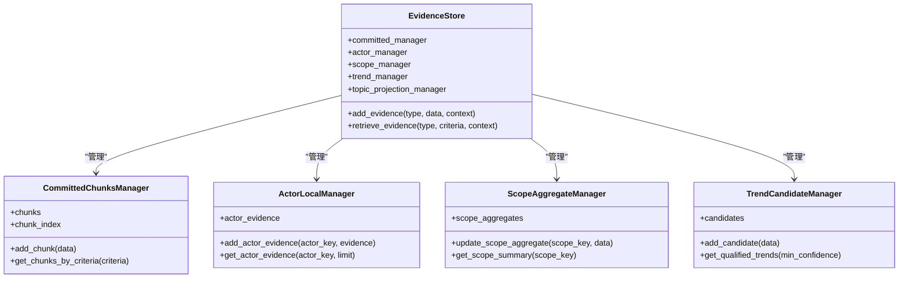
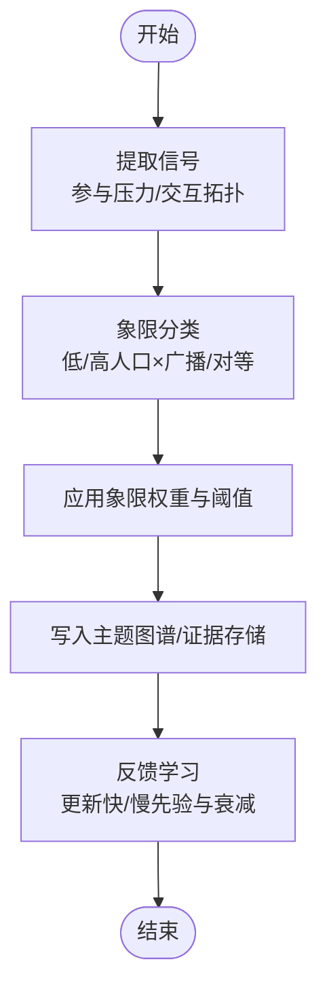
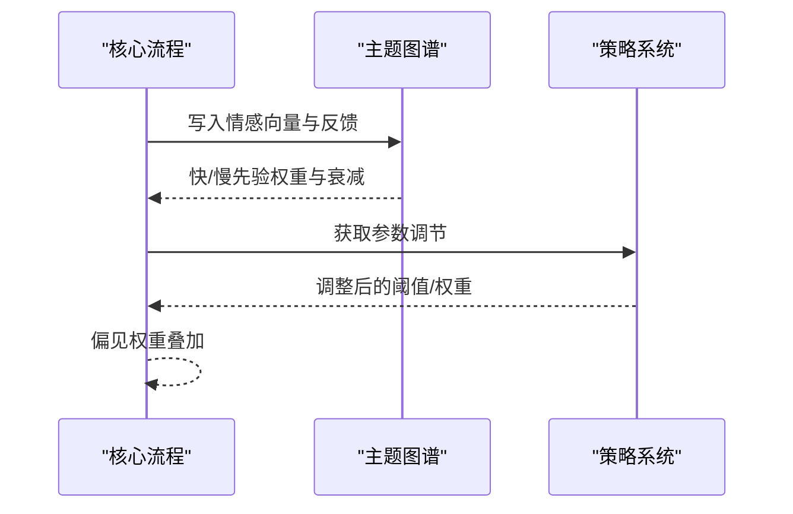
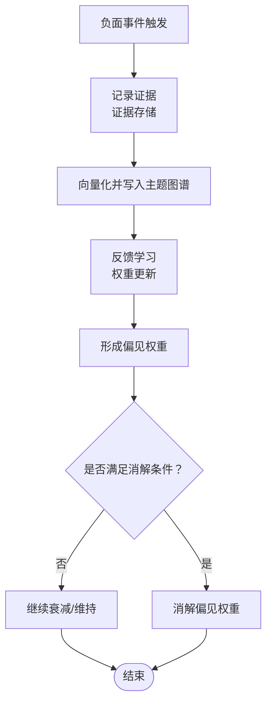
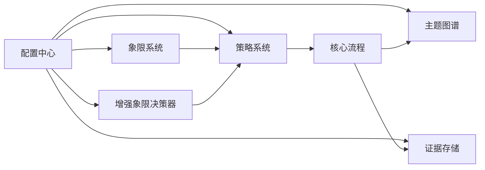

# 怨恨记忆

<cite>
**本文档引用的文件**
- [core.lua](file://mori_memory/mori_memory/core.lua)
- [topic_graph.lua](file://mori_memory/module/memory/topic_graph.lua)
- [config.lua](file://mori_memory/module/config.lua)
- [quadrants.lua](file://mori_memory/module/decision/quadrants.lua)
- [enhanced_quadrant.lua](file://mori_memory/module/decision/enhanced_quadrant.lua)
- [quadrant_policy.lua](file://mori_memory/module/policy/quadrant_policy.lua)
- [evidence_store.lua](file://mori_memory/module/evidence/evidence_store.lua)
- [group_room_affinity_prior_design.md](file://mori_memory/docs/group_room_affinity_prior_design.md)
- [run_level3_benchmarks.py](file://mori_memory/scripts/run_level3_benchmarks.py)
- [integration_demo.lua](file://mori_memory/integration_demo.lua)
- [validation.csv](file://mori_memory/benchmarks/data/hf/dialogsum/validation.csv)
</cite>

## 目录
1. [简介](#简介)
2. [项目结构](#项目结构)
3. [核心组件](#核心组件)
4. [架构总览](#架构总览)
5. [详细组件分析](#详细组件分析)
6. [依赖分析](#依赖分析)
7. [性能考量](#性能考量)
8. [故障排查指南](#故障排查指南)
9. [结论](#结论)
10. [附录](#附录)

## 简介
本文件围绕“怨恨记忆（Grudge Memory）”这一概念，结合仓库中现有的记忆系统、情感相关信号处理、象限决策与策略层、证据存储与主题图谱等模块，给出一套可落地的设计与实现说明。怨恨记忆并非传统意义上的事实性记忆，而是对交互体验的主观加权与偏见建模：它通过情感强度、触发条件、影响范围与衰减因子等机制，模拟“对某人/某事的负面倾向”如何在后续交互中被感知与影响。

本设计强调以下关键点：
- 情感强度与偏见建模：基于交互信号（提及、回复链、话题连贯性等）计算倾向性，并以“偏见权重”的形式注入后续路由与读出。
- 触发与累积：负面事件（如投诉、反复冲突、被忽视）作为触发条件，逐步提升情感强度。
- 衰减与消解：通过时间衰减、积极行为抵消、阈值消解等机制，控制怨恨强度的自然回落。
- 影响范围：可按演员（actor）或范围（scope）进行粒度化建模，避免过度泛化。
- 与现有系统协同：与主题图谱、证据存储、象限决策与策略层无缝衔接，不影响核心路由守卫。

## 项目结构
本项目采用模块化组织，核心记忆与交互路由由多层模块协作完成：
- 决策与象限：象限系统与增强象限决策器负责根据信号确定当前象限，并据此调整权重与阈值。
- 策略层：策略系统将象限映射为参数调节，不改变路由逻辑，仅调节阈值、写入保守度、回忆宽度等。
- 主题图谱与证据存储：主题图谱负责向量检索与反馈更新，证据存储负责短期证据的聚合与趋势候选管理。
- 配置中心：集中管理衰减、阈值、权重等参数，支持不同来源与场景的差异化策略。

**图表来源**
- [quadrants.lua:1-285](file://mori_memory/module/decision/quadrants.lua#L1-L285)
- [enhanced_quadrant.lua:1-335](file://mori_memory/module/decision/enhanced_quadrant.lua#L1-L335)
- [quadrant_policy.lua:1-238](file://mori_memory/module/policy/quadrant_policy.lua#L1-L238)
- [topic_graph.lua:1-200](file://mori_memory/module/memory/topic_graph.lua#L1-L200)
- [evidence_store.lua:1-603](file://mori_memory/module/evidence/evidence_store.lua#L1-L603)
- [core.lua:1354-1376](file://mori_memory/mori_memory/core.lua#L1354-L1376)
- [config.lua:1-300](file://mori_memory/module/config.lua#L1-L300)

**章节来源**
- [quadrants.lua:1-285](file://mori_memory/module/decision/quadrants.lua#L1-L285)
- [enhanced_quadrant.lua:1-335](file://mori_memory/module/decision/enhanced_quadrant.lua#L1-L335)
- [quadrant_policy.lua:1-238](file://mori_memory/module/policy/quadrant_policy.lua#L1-L238)
- [topic_graph.lua:1-200](file://mori_memory/module/memory/topic_graph.lua#L1-L200)
- [evidence_store.lua:1-603](file://mori_memory/module/evidence/evidence_store.lua#L1-L603)
- [core.lua:1354-1376](file://mori_memory/mori_memory/core.lua#L1354-L1376)
- [config.lua:1-300](file://mori_memory/module/config.lua#L1-L300)

## 核心组件
- 象限系统与增强象限决策器：基于参与压力与交互拓扑，将环境分为低/高人口与广播/对等两类象限，并通过置信度与自适应阈值进行稳健分类。
- 策略系统：将象限映射为参数调节，如附加保守度、待定阈值倍增、写入阈值偏移、回忆宽度等，不改变路由逻辑。
- 主题图谱：提供向量检索、反馈写回、快慢先验混合与衰减控制，支撑情感强度的动态更新。
- 证据存储：管理已提交记忆块、演员本地证据、范围聚合与趋势候选，支持按演员/范围/时间等维度检索与清理。
- 配置中心：集中管理衰减、阈值、权重、TTL等参数，支持按来源覆盖与默认信用策略。

**章节来源**
- [quadrants.lua:1-285](file://mori_memory/module/decision/quadrants.lua#L1-L285)
- [enhanced_quadrant.lua:1-335](file://mori_memory/module/decision/enhanced_quadrant.lua#L1-L335)
- [quadrant_policy.lua:1-238](file://mori_memory/module/policy/quadrant_policy.lua#L1-L238)
- [topic_graph.lua:1-200](file://mori_memory/module/memory/topic_graph.lua#L1-L200)
- [evidence_store.lua:1-603](file://mori_memory/module/evidence/evidence_store.lua#L1-L603)
- [config.lua:1-300](file://mori_memory/module/config.lua#L1-L300)

## 架构总览
怨恨记忆的实现以“信号→象限→策略→主题图谱/证据存储”的闭环为核心，情感强度通过主题图谱的反馈与衰减机制进行动态更新，同时在后续交互中以偏见权重的形式影响路由与读出。

**图表来源**
- [core.lua:1354-1376](file://mori_memory/mori_memory/core.lua#L1354-L1376)
- [quadrants.lua:227-245](file://mori_memory/module/decision/quadrants.lua#L227-L245)
- [enhanced_quadrant.lua:227-253](file://mori_memory/module/decision/enhanced_quadrant.lua#L227-L253)
- [quadrant_policy.lua:193-207](file://mori_memory/module/policy/quadrant_policy.lua#L193-L207)
- [topic_graph.lua:40-53](file://mori_memory/module/memory/topic_graph.lua#L40-L53)
- [evidence_store.lua:508-537](file://mori_memory/module/evidence/evidence_store.lua#L508-L537)

## 详细组件分析

### 数据结构设计
- 演员（actor）与范围（scope）键：用于区分个人层面与群体/房间层面的怨恨建模，避免跨域过度泛化。
- 触发条件：负面事件（如重复投诉、被忽视、冲突升级）作为触发条件，进入证据存储与主题图谱。
- 影响范围：可按 actor 或 scope 聚合，分别维护独立的情感强度与偏见权重。
- 衰减因子：主题图谱提供快/慢先验权重与衰减系数，证据存储提供趋势候选的置信度与TTL。

**图表来源**
- [evidence_store.lua:1-603](file://mori_memory/module/evidence/evidence_store.lua#L1-L603)

**章节来源**
- [evidence_store.lua:1-603](file://mori_memory/module/evidence/evidence_store.lua#L1-L603)

### 实现原理与流程

#### 情感强度计算
- 信号提取：从交互上下文中提取参与压力与交互拓扑，结合置信度与自适应阈值，确定象限。
- 象限权重：不同象限对不同维度赋予不同权重，从而影响后续阈值与写入保守度。
- 写入与反馈：将带情感色彩的证据写入主题图谱，利用反馈学习更新快/慢先验权重与衰减。

**图表来源**
- [quadrants.lua:227-245](file://mori_memory/module/decision/quadrants.lua#L227-L245)
- [enhanced_quadrant.lua:227-253](file://mori_memory/module/decision/enhanced_quadrant.lua#L227-L253)
- [quadrant_policy.lua:93-121](file://mori_memory/module/policy/quadrant_policy.lua#L93-L121)
- [topic_graph.lua:40-53](file://mori_memory/module/memory/topic_graph.lua#L40-L53)

**章节来源**
- [quadrants.lua:227-245](file://mori_memory/module/decision/quadrants.lua#L227-L245)
- [enhanced_quadrant.lua:227-253](file://mori_memory/module/decision/enhanced_quadrant.lua#L227-L253)
- [quadrant_policy.lua:93-121](file://mori_memory/module/policy/quadrant_policy.lua#L93-L121)
- [topic_graph.lua:40-53](file://mori_memory/module/memory/topic_graph.lua#L40-L53)

#### 记忆权重调整与偏见形成
- 偏见形成：在主题图谱中，情感强度体现为对特定 actor/scope 的先验权重；快先验快速响应，慢先验稳定持久。
- 权重调整：策略系统将象限映射为参数调节，如附加保守度、待定阈值倍增、写入阈值偏移等，间接影响偏见权重的引入强度。
- 偏见消解：通过时间衰减、积极行为抵消、阈值消解等方式，降低偏见权重，避免长期固化。

**图表来源**
- [topic_graph.lua:40-53](file://mori_memory/module/memory/topic_graph.lua#L40-L53)
- [quadrant_policy.lua:93-121](file://mori_memory/module/policy/quadrant_policy.lua#L93-L121)
- [core.lua:1354-1376](file://mori_memory/mori_memory/core.lua#L1354-L1376)

**章节来源**
- [topic_graph.lua:40-53](file://mori_memory/module/memory/topic_graph.lua#L40-L53)
- [quadrant_policy.lua:93-121](file://mori_memory/module/policy/quadrant_policy.lua#L93-L121)
- [core.lua:1354-1376](file://mori_memory/mori_memory/core.lua#L1354-L1376)

#### 触发与消解机制
- 触发条件：负面事件（如重复投诉、被忽视、冲突升级）作为触发条件，进入证据存储与主题图谱。
- 情感强度累积：通过主题图谱的反馈学习与权重更新，逐步提升情感强度。
- 衰减与消解：时间衰减、积极行为抵消、阈值消解等机制，控制怨恨强度的自然回落。

**图表来源**
- [evidence_store.lua:508-537](file://mori_memory/module/evidence/evidence_store.lua#L508-L537)
- [topic_graph.lua:40-53](file://mori_memory/module/memory/topic_graph.lua#L40-L53)
- [group_room_affinity_prior_design.md:380-427](file://mori_memory/docs/group_room_affinity_prior_design.md#L380-L427)

**章节来源**
- [evidence_store.lua:508-537](file://mori_memory/module/evidence/evidence_store.lua#L508-L537)
- [topic_graph.lua:40-53](file://mori_memory/module/memory/topic_graph.lua#L40-L53)
- [group_room_affinity_prior_design.md:380-427](file://mori_memory/docs/group_room_affinity_prior_design.md#L380-L427)

### 配置参数说明
以下参数直接影响怨恨记忆的行为，可在配置中心进行调整：
- 主题图谱反馈与衰减
  - 快/慢先验采样率与采纳率
  - 快/慢先验权重
  - 快先验衰减系数
- 象限与策略
  - 象限阈值（自适应）
  - 附加保守度、待定阈值倍增、写入阈值偏移
- 证据存储
  - 最大提交块数、演员证据上限、聚合窗口（小时）、趋势最小支持次数、趋势候选上限
- 其他
  - TTL（小时）、最近激活衰减、温度感知权重等

**章节来源**
- [config.lua:27-145](file://mori_memory/module/config.lua#L27-L145)
- [topic_graph.lua:40-53](file://mori_memory/module/memory/topic_graph.lua#L40-L53)
- [evidence_store.lua:26-56](file://mori_memory/module/evidence/evidence_store.lua#L26-L56)
- [evidence_store.lua:177-207](file://mori_memory/module/evidence/evidence_store.lua#L177-L207)
- [evidence_store.lua:228-275](file://mori_memory/module/evidence/evidence_store.lua#L228-L275)
- [evidence_store.lua:286-342](file://mori_memory/module/evidence/evidence_store.lua#L286-L342)
- [quadrant_policy.lua:93-121](file://mori_memory/module/policy/quadrant_policy.lua#L93-L121)

### 实际使用示例
- 投诉场景：用户反复投诉同一问题，系统将其标记为负面事件，写入证据存储并更新主题图谱情感权重；随后交互中对该用户的回复倾向降低，直至其行为改善或超过消解阈值。
- 负面反馈：用户对某主播表达不满，系统通过象限与策略层调整阈值，减少对该主播的主动推荐，同时保留守卫机制防止违规内容通过。
- 情感偏见：在多人房间中，系统基于近期激活与亲密度进行快速衰减与冷却，避免系统死抱着旧关系不放。

**章节来源**
- [integration_demo.lua:102-140](file://mori_memory/integration_demo.lua#L102-L140)
- [group_room_affinity_prior_design.md:380-427](file://mori_memory/docs/group_room_affinity_prior_design.md#L380-L427)

### 伦理与隐私考虑
- 守卫机制：配置中心提供守卫开关与阈值，确保即使存在偏见也不绕过守卫。
- 信用与阻断：针对来源与用户设置信用阈值、阻断与恢复策略，防止恶意滥用。
- 数据最小化：证据存储与主题图谱均提供TTL与清理策略，避免长期留存敏感信息。
- 透明与可控：策略层仅调节参数，不改变核心路由逻辑，便于审计与回滚。

**章节来源**
- [config.lua:184-219](file://mori_memory/module/config.lua#L184-L219)
- [evidence_store.lua:578-601](file://mori_memory/module/evidence/evidence_store.lua#L578-L601)
- [topic_graph.lua:40-53](file://mori_memory/module/memory/topic_graph.lua#L40-L53)

## 依赖分析
怨恨记忆的实现依赖于以下模块间的耦合关系：
- 决策层与策略层：象限系统与增强象限决策器输出象限，策略系统将其映射为参数调节，二者低耦合、高内聚。
- 主题图谱与证据存储：主题图谱负责向量检索与反馈，证据存储负责短期证据聚合与趋势候选，二者通过共同的上下文键（actor/scope/thread/segment）进行关联。
- 配置中心：集中管理衰减、阈值、权重等参数，为上述模块提供统一输入。

**图表来源**
- [config.lua:1-300](file://mori_memory/module/config.lua#L1-L300)
- [quadrants.lua:227-245](file://mori_memory/module/decision/quadrants.lua#L227-L245)
- [enhanced_quadrant.lua:227-253](file://mori_memory/module/decision/enhanced_quadrant.lua#L227-L253)
- [quadrant_policy.lua:193-207](file://mori_memory/module/policy/quadrant_policy.lua#L193-L207)
- [topic_graph.lua:40-53](file://mori_memory/module/memory/topic_graph.lua#L40-L53)
- [evidence_store.lua:508-537](file://mori_memory/module/evidence/evidence_store.lua#L508-L537)
- [core.lua:1354-1376](file://mori_memory/mori_memory/core.lua#L1354-L1376)

**章节来源**
- [config.lua:1-300](file://mori_memory/module/config.lua#L1-L300)
- [quadrants.lua:227-245](file://mori_memory/module/decision/quadrants.lua#L227-L245)
- [enhanced_quadrant.lua:227-253](file://mori_memory/module/decision/enhanced_quadrant.lua#L227-L253)
- [quadrant_policy.lua:193-207](file://mori_memory/module/policy/quadrant_policy.lua#L193-L207)
- [topic_graph.lua:40-53](file://mori_memory/module/memory/topic_graph.lua#L40-L53)
- [evidence_store.lua:508-537](file://mori_memory/module/evidence/evidence_store.lua#L508-L537)
- [core.lua:1354-1376](file://mori_memory/mori_memory/core.lua#L1354-L1376)

## 性能考量
- 向量维度与归一化：主题图谱对向量进行归一化与维度校验，避免无效向量导致的性能退化。
- 快慢先验与衰减：通过快/慢先验权重与衰减系数，平衡响应速度与稳定性。
- TTL与清理：证据存储与主题图谱均提供TTL与清理策略，控制内存占用与查询开销。
- 参数调节：策略层仅调节参数，不引入复杂逻辑，降低运行时开销。

[本节为通用指导，无需具体文件分析]

## 故障排查指南
- 象限误判：检查信号置信度与自适应阈值，必要时增加数据窗口或提高稳定性阈值。
- 偏见过强：检查策略参数调节与主题图谱反馈权重，适当提高消解阈值或缩短TTL。
- 写入失败：确认守卫阈值与信用策略，确保未触发阻断；检查主题图谱与证据存储的容量限制。
- 性能异常：核查向量维度与归一化，检查TTL与清理策略是否生效。

**章节来源**
- [enhanced_quadrant.lua:100-121](file://mori_memory/module/decision/enhanced_quadrant.lua#L100-L121)
- [quadrant_policy.lua:93-121](file://mori_memory/module/policy/quadrant_policy.lua#L93-L121)
- [topic_graph.lua:40-53](file://mori_memory/module/memory/topic_graph.lua#L40-L53)
- [evidence_store.lua:578-601](file://mori_memory/module/evidence/evidence_store.lua#L578-L601)

## 结论
怨恨记忆通过“信号→象限→策略→主题图谱/证据存储”的闭环，实现了对交互体验的主观建模与偏见管理。其设计强调：
- 情感强度与偏见权重的动态更新；
- 触发与消解机制的可解释性；
- 与现有守卫与策略层的协同；
- 伦理与隐私保护的内置保障。

在实际部署中，建议以配置中心为唯一入口进行参数调优，并结合基准脚本与对话数据集进行效果验证。

[本节为总结性内容，无需具体文件分析]

## 附录

### 关键流程参考路径
- 记忆写入与主题图谱更新：[core.lua:1354-1376](file://mori_memory/mori_memory/core.lua#L1354-L1376)
- 主题图谱反馈与衰减参数：[topic_graph.lua:40-53](file://mori_memory/module/memory/topic_graph.lua#L40-L53)
- 象限判定与置信度：[quadrants.lua:227-245](file://mori_memory/module/decision/quadrants.lua#L227-L245)、[enhanced_quadrant.lua:227-253](file://mori_memory/module/decision/enhanced_quadrant.lua#L227-L253)
- 策略参数调节：[quadrant_policy.lua:93-121](file://mori_memory/module/policy/quadrant_policy.lua#L93-L121)
- 证据存储与清理：[evidence_store.lua:578-601](file://mori_memory/module/evidence/evidence_store.lua#L578-L601)
- 配置中心参数：[config.lua:27-145](file://mori_memory/module/config.lua#L27-L145)
- 偏见衰减与重组冷却建议：[group_room_affinity_prior_design.md:380-427](file://mori_memory/docs/group_room_affinity_prior_design.md#L380-L427)
- 基准脚本与参数示例：[run_level3_benchmarks.py:168-207](file://mori_memory/scripts/run_level3_benchmarks.py#L168-L207)
- 示例对话数据（投诉/反馈）：[validation.csv:199-4672](file://mori_memory/benchmarks/data/hf/dialogsum/validation.csv#L199-L4672)