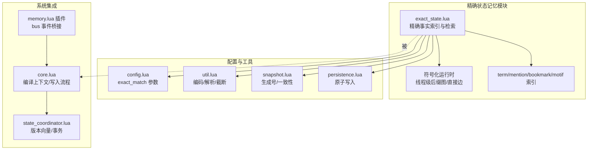
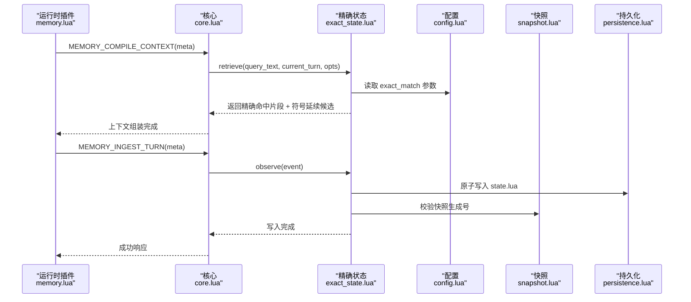
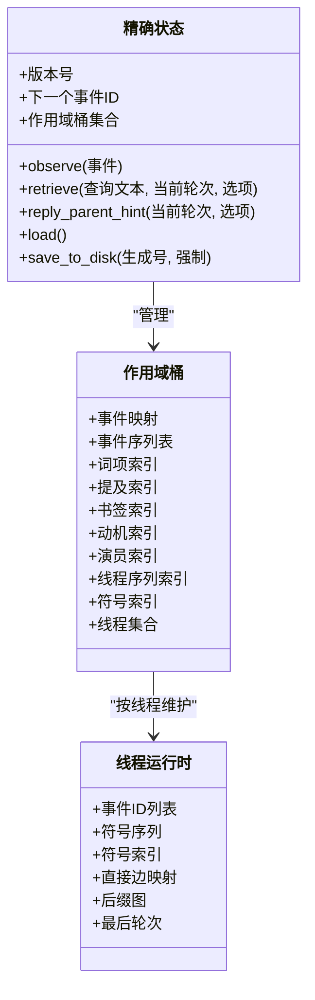
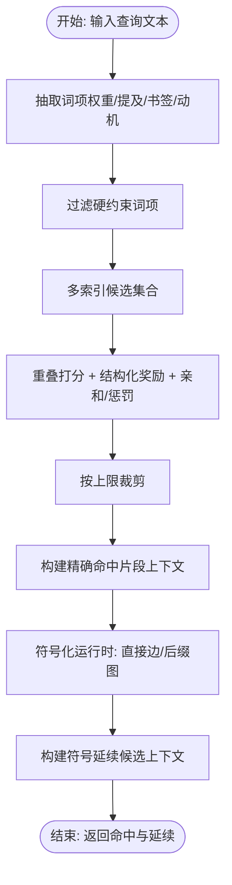
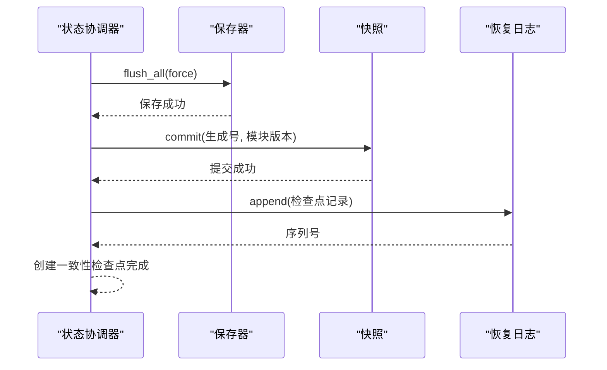
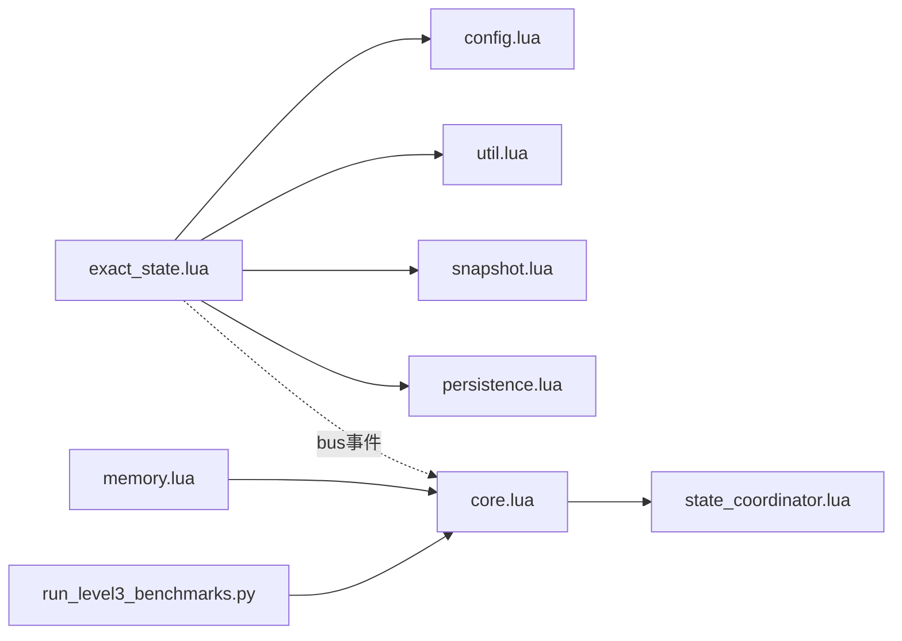

# 精确状态记忆

<cite>
**本文引用的文件**
- [exact_state.lua](file://mori_memory/module/memory/exact_state.lua)
- [core.lua](file://mori_memory/mori_memory/core.lua)
- [state_coordinator.lua](file://mori_memory/module/state_coordinator.lua)
- [config.lua](file://mori_memory/module/config.lua)
- [util.lua](file://mori_memory/mori_memory/util.lua)
- [snapshot.lua](file://mori_memory/module/snapshot.lua)
- [persistence.lua](file://mori_memory/module/persistence.lua)
- [memory.lua](file://mori_runtime/lua/mori/plugins/memory.lua)
- [20260324_mori_generalization_rwkv_mamba_rosa.md](file://mori_memory/docs/20260324_mori_generalization_rwkv_mamba_rosa.md)
- [run_level3_benchmarks.py](file://mori_memory/scripts/run_level3_benchmarks.py)
</cite>

## 目录
1. [简介](#简介)
2. [项目结构](#项目结构)
3. [核心组件](#核心组件)
4. [架构总览](#架构总览)
5. [详细组件分析](#详细组件分析)
6. [依赖关系分析](#依赖关系分析)
7. [性能考量](#性能考量)
8. [故障排查指南](#故障排查指南)
9. [结论](#结论)
10. [附录](#附录)

## 简介
精确状态记忆（Exact State Memory）是 Mori 记忆系统中负责维护“具体、准确”的事实信息与状态数据的关键模块。其设计目标是在多模态、多来源、高并发的交互场景中，提供稳定、可追溯、可恢复的精确事实索引与检索能力，支撑“精确命中片段”“符号延续候选”等高精度上下文构建，并与模糊记忆（如主题图谱、历史记忆）形成互补，共同服务于决策系统。

与模糊记忆相比，精确状态记忆强调：
- 键值对与结构化事实的硬约束匹配
- 基于词项权重、提及、书签、动机模式的精确检索
- 符号化运行时（线程级后缀图、直接边）驱动的延续预测
- 严格的版本控制与一致性保障，确保状态可恢复、可审计

## 项目结构
精确状态记忆位于 mori_memory/module/memory/exact_state.lua，围绕以下关键子系统协作：
- 配置中心：提供 exact_match 开关、检索限制、符号化运行时参数等
- 状态协调器：统一版本向量、事务一致性、检查点与恢复
- 快照与持久化：原子写入、生成号校验、模块级一致性
- 工具库：Lua 表值编码/解析、UTF-8 截断、向量校验等
- 运行时插件：与主内存核心集成，暴露 observe/retrieve 接口

**图表来源**
- [exact_state.lua:1-1529](file://mori_memory/module/memory/exact_state.lua#L1-L1529)
- [core.lua:1-327](file://mori_memory/mori_memory/core.lua#L1-L327)
- [state_coordinator.lua:1-302](file://mori_memory/module/state_coordinator.lua#L1-L302)
- [config.lua:87-109](file://mori_memory/module/config.lua#L87-L109)
- [util.lua:1-153](file://mori_memory/mori_memory/util.lua#L1-L153)
- [snapshot.lua:1-60](file://mori_memory/module/snapshot.lua#L1-L60)
- [persistence.lua:1-200](file://mori_memory/module/persistence.lua#L1-L200)
- [memory.lua:1-28](file://mori_runtime/lua/mori/plugins/memory.lua#L1-L28)

**章节来源**
- [exact_state.lua:1-1529](file://mori_memory/module/memory/exact_state.lua#L1-L1529)
- [core.lua:1-327](file://mori_memory/mori_memory/core.lua#L1-L327)
- [config.lua:87-109](file://mori_memory/module/config.lua#L87-L109)

## 核心组件
- 精确事实索引与检索（exact_state.lua）
  - 事件观察与特征抽取：提取词项权重、提及、书签、动机模式
  - 多维索引：term/mention/bookmark/motif/actor/thread/symbol
  - 精确检索：基于词项重叠与硬约束（fact:id、key=value）打分
  - 符号化运行时：线程级后缀图与直接边，生成“符号延续候选”
  - 保存/加载：原子写入 state.lua，带快照生成号校验
- 配置中心（config.lua）
  - exact_match 开关与参数：检索上限、最小分数、回复父提示、符号化运行时参数
- 状态协调器（state_coordinator.lua）
  - 版本向量、事务一致性、检查点与恢复验证
- 工具库（util.lua）
  - Lua 表值编码/解析、UTF-8 截断、向量校验
- 快照与持久化（snapshot.lua、persistence.lua）
  - 生成号一致性、原子写入、错误处理
- 运行时插件（memory.lua）
  - 通过 bus 事件桥接 compile_context/ingest_turn 与 exact_state.observe/retrieve

**章节来源**
- [exact_state.lua:1-1529](file://mori_memory/module/memory/exact_state.lua#L1-L1529)
- [config.lua:87-109](file://mori_memory/module/config.lua#L87-L109)
- [state_coordinator.lua:1-302](file://mori_memory/module/state_coordinator.lua#L1-L302)
- [util.lua:1-153](file://mori_memory/mori_memory/util.lua#L1-L153)
- [snapshot.lua:1-60](file://mori_memory/module/snapshot.lua#L1-L60)
- [persistence.lua:1-200](file://mori_memory/module/persistence.lua#L1-L200)
- [memory.lua:1-28](file://mori_runtime/lua/mori/plugins/memory.lua#L1-L28)

## 架构总览
精确状态记忆在系统中的位置与交互如下：

**图表来源**
- [memory.lua:12-25](file://mori_runtime/lua/mori/plugins/memory.lua#L12-L25)
- [core.lua:1861-1905](file://mori_memory/mori_memory/core.lua#L1861-L1905)
- [exact_state.lua:969-1030](file://mori_memory/module/memory/exact_state.lua#L969-L1030)
- [config.lua:87-109](file://mori_memory/module/config.lua#L87-L109)
- [snapshot.lua:42-60](file://mori_memory/module/snapshot.lua#L42-L60)
- [persistence.lua:1-200](file://mori_memory/module/persistence.lua#L1-L200)

## 详细组件分析

### 数据结构与序列化
- 状态对象结构
  - 版本号、下一个事件 ID、按作用域组织的桶（events/event_order/索引）
  - 线程级符号化运行时（event_ids/symbols/symbol_index/direct_next/suffix_graph/last_turn）
- 序列化与反序列化
  - 使用工具库的 Lua 表值编码/解析，保证可移植与可审计
  - 保存时附加快照生成号，加载时进行一致性校验
- 增量更新
  - 观察新事件时，更新多维索引与符号化运行时，标记脏页触发持久化

**图表来源**
- [exact_state.lua:46-1030](file://mori_memory/module/memory/exact_state.lua#L46-L1030)
- [util.lua:59-144](file://mori_memory/mori_memory/util.lua#L59-L144)

**章节来源**
- [exact_state.lua:46-1030](file://mori_memory/module/memory/exact_state.lua#L46-L1030)
- [util.lua:59-144](file://mori_memory/mori_memory/util.lua#L59-L144)

### 精确检索与符号延续
- 精确检索
  - 提取查询词项权重，优先使用硬约束词（fact:id、key=value、数字/下划线）
  - 多索引并集/交集融合，结合演员/线程亲和、结构化奖励、时效惩罚打分
  - 限制返回条目数量，输出“精确命中片段”上下文
- 符号延续
  - 基于线程运行时的直接边与后缀图，按出现频次、长度、时效打分
  - 生成“符号延续候选”上下文，扩展检索覆盖面

**图表来源**
- [exact_state.lua:1378-1526](file://mori_memory/module/memory/exact_state.lua#L1378-L1526)

**章节来源**
- [exact_state.lua:1378-1526](file://mori_memory/module/memory/exact_state.lua#L1378-L1526)

### 版本控制与一致性
- 版本向量
  - 每个模块维护版本号、时间戳与依赖，事务开始时记录快照，提交时更新
- 一致性检查点
  - 原子保存所有模块状态，写入快照与 WAL，记录生成号与模块版本
- 恢复验证
  - 加载快照与 WAL，验证版本一致性与序列连续性，自动创建检查点

**图表来源**
- [state_coordinator.lua:144-207](file://mori_memory/module/state_coordinator.lua#L144-L207)
- [snapshot.lua:42-60](file://mori_memory/module/snapshot.lua#L42-L60)

**章节来源**
- [state_coordinator.lua:1-302](file://mori_memory/module/state_coordinator.lua#L1-L302)
- [snapshot.lua:1-60](file://mori_memory/module/snapshot.lua#L1-L60)

### 与模糊记忆的协同
- 精确记忆提供“精确命中片段”与“符号延续候选”，补充主题图谱与历史记忆的语义检索
- 在编译上下文时，将精确命中片段与模糊检索结果融合，形成更稳健的上下文
- 在写入流程中，利用精确记忆的符号化运行时为写入强度与路由提供额外支持

**章节来源**
- [20260324_mori_generalization_rwkv_mamba_rosa.md:661-704](file://mori_memory/docs/20260324_mori_generalization_rwkv_mamba_rosa.md#L661-L704)
- [core.lua:1861-1905](file://mori_memory/mori_memory/core.lua#L1861-L1905)

## 依赖关系分析
- 模块耦合
  - exact_state 依赖 config/exact_match 参数、util 编码/解析、snapshot 生成号、persistence 原子写入
  - 与 core.lua 通过 bus 事件桥接 observe/retrieve
  - 与 state_coordinator 协作实现版本向量与事务一致性
- 外部依赖
  - 运行时插件 memory.lua 通过 bus 事件调用核心接口
  - 基准脚本 run_level3_benchmarks.py 通过参数开启 exact_match 并设置检索限制

**图表来源**
- [exact_state.lua:1-1529](file://mori_memory/module/memory/exact_state.lua#L1-L1529)
- [core.lua:1-327](file://mori_memory/mori_memory/core.lua#L1-L327)
- [state_coordinator.lua:1-302](file://mori_memory/module/state_coordinator.lua#L1-L302)
- [config.lua:87-109](file://mori_memory/module/config.lua#L87-L109)
- [util.lua:1-153](file://mori_memory/mori_memory/util.lua#L1-L153)
- [snapshot.lua:1-60](file://mori_memory/module/snapshot.lua#L1-L60)
- [persistence.lua:1-200](file://mori_memory/module/persistence.lua#L1-L200)
- [memory.lua:1-28](file://mori_runtime/lua/mori/plugins/memory.lua#L1-L28)
- [run_level3_benchmarks.py:261-276](file://mori_memory/scripts/run_level3_benchmarks.py#L261-L276)

**章节来源**
- [exact_state.lua:1-1529](file://mori_memory/module/memory/exact_state.lua#L1-L1529)
- [core.lua:1-327](file://mori_memory/mori_memory/core.lua#L1-L327)
- [state_coordinator.lua:1-302](file://mori_memory/module/state_coordinator.lua#L1-L302)
- [config.lua:87-109](file://mori_memory/module/config.lua#L87-L109)
- [util.lua:1-153](file://mori_memory/mori_memory/util.lua#L1-L153)
- [snapshot.lua:1-60](file://mori_memory/module/snapshot.lua#L1-L60)
- [persistence.lua:1-200](file://mori_memory/module/persistence.lua#L1-L200)
- [memory.lua:1-28](file://mori_runtime/lua/mori/plugins/memory.lua#L1-L28)
- [run_level3_benchmarks.py:261-276](file://mori_memory/scripts/run_level3_benchmarks.py#L261-L276)

## 性能考量
- 索引规模控制
  - 作用域事件容量上限（默认 2048），超过则删除最早事件，保持索引紧凑
- 检索限制
  - 精确检索上限、最小分数、亲和/惩罚权重、时效衰减，平衡召回与质量
- 符号化运行时
  - 后缀最大长度、延续上限、边缘/计数/长度奖励，控制延续生成成本
- 原子写入与生成号校验
  - 避免部分写入，确保快照与磁盘状态一致，减少恢复开销

[本节为通用指导，无需特定文件引用]

## 故障排查指南
- 精确状态加载失败
  - 现象：初始化时报错，提示 exact_state.load 失败
  - 排查：检查快照生成号与文件生成号是否一致；确认 state.lua 是否存在且可解析
- 写入失败或部分写入
  - 现象：observe 成功但重启后状态丢失
  - 排查：检查持久化写入是否成功；确认快照与 WAL 是否一致
- 一致性问题
  - 现象：恢复后模块版本不一致
  - 排查：使用状态协调器的恢复验证接口，检查 WAL 序列连续性与模块版本

**章节来源**
- [exact_state.lua:914-945](file://mori_memory/module/memory/exact_state.lua#L914-L945)
- [state_coordinator.lua:210-258](file://mori_memory/module/state_coordinator.lua#L210-L258)

## 结论
精确状态记忆通过“精确事实索引 + 符号化运行时”的双轨设计，在高并发与多来源场景下提供了稳定、可恢复、可审计的精确检索能力。其与模糊记忆的协同，使系统既能捕捉语义关联，又能维护关键事实的准确性，为决策系统的鲁棒性与可解释性提供了坚实基础。

[本节为总结性内容，无需特定文件引用]

## 附录

### 配置参数与使用示例
- 配置参数（来自配置中心）
  - exact_match.enabled：启用精确匹配
  - exact_match.storage_root：精确状态存储根目录
  - exact_match.retrieve_limit：检索上限
  - exact_match.retrieve_min_score：最小分数
  - exact_match.reply_parent_enabled：启用回复父提示
  - exact_match.reply_parent_window：回复父提示窗口
  - exact_match.reply_parent_min_score：回复父提示最小分数
  - exact_match.prior_weight/actor_bonus/thread_bonus/recency_penalty：检索打分权重
  - exact_match.symbolic_enabled/suffix_max_len/continuation_limit：符号化运行时参数
- 使用示例（通过运行时插件）
  - 观察事件：调用 observe，传入事件文本、轮次、作用域/线程/演员等元信息
  - 检索上下文：调用 retrieve，传入查询文本、当前轮次、作用域/线程/演员等选项
  - 回复父提示：调用 reply_parent_hint，获取最近相关片段用于回复引导

**章节来源**
- [config.lua:87-109](file://mori_memory/module/config.lua#L87-L109)
- [exact_state.lua:969-1526](file://mori_memory/module/memory/exact_state.lua#L969-L1526)
- [memory.lua:12-25](file://mori_runtime/lua/mori/plugins/memory.lua#L12-L25)
- [run_level3_benchmarks.py:261-276](file://mori_memory/scripts/run_level3_benchmarks.py#L261-L276)