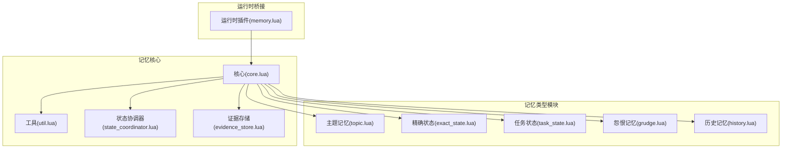
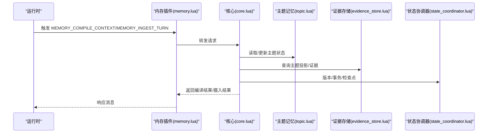
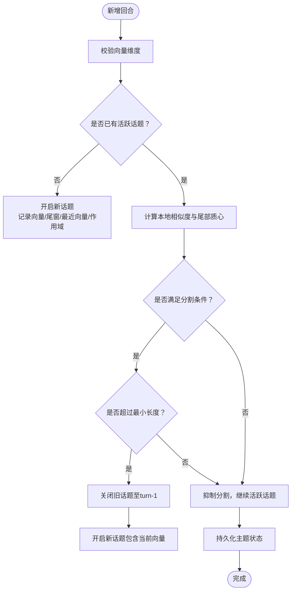
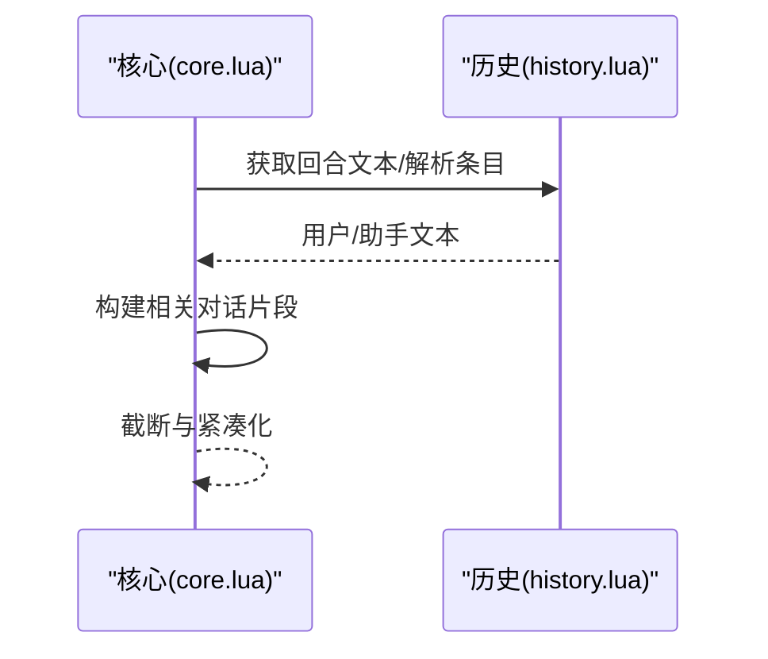
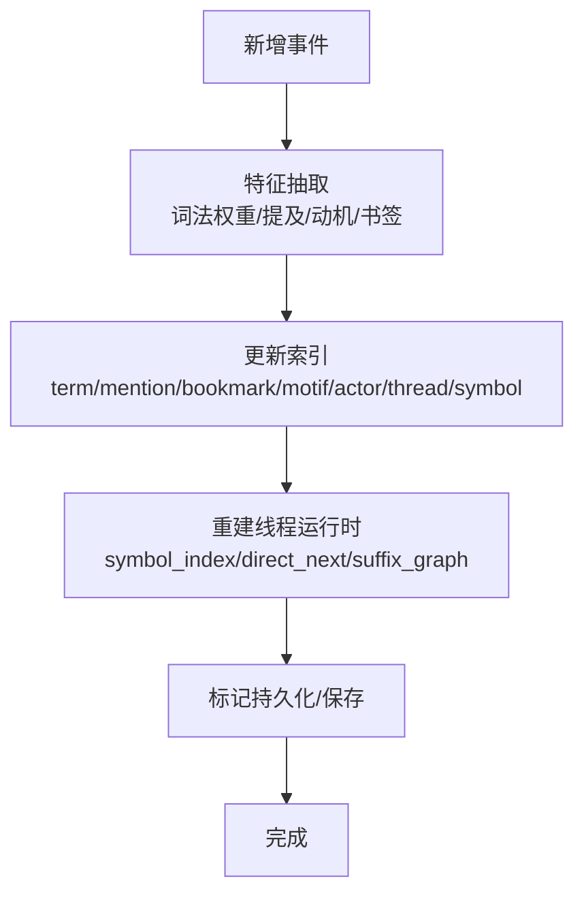
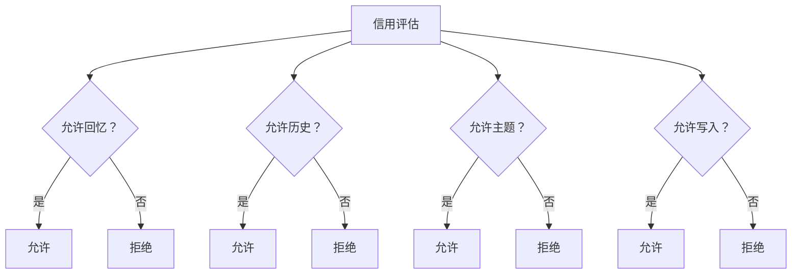
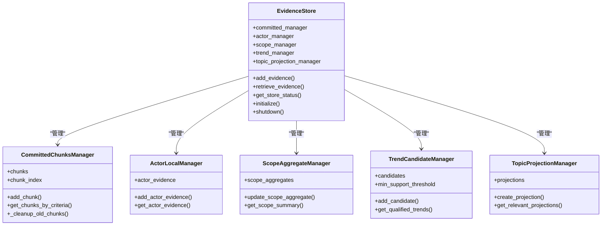
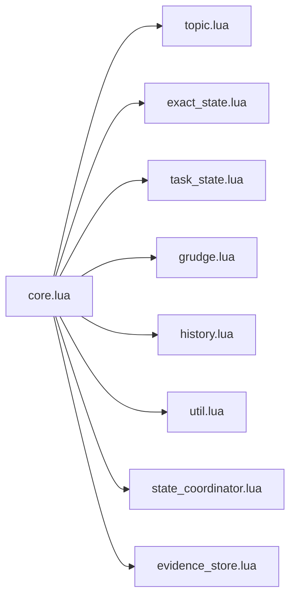

# 记忆类型系统

<cite>
**本文档引用的文件**
- [mori_memory/README.md](file://mori_memory/README.md)
- [mori_memory/mori_memory.lua](file://mori_memory/mori_memory.lua)
- [mori_runtime/lua/mori/plugins/memory.lua](file://mori_runtime/lua/mori/plugins/memory.lua)
- [mori_memory/mori_memory/core.lua](file://mori_memory/mori_memory/core.lua)
- [mori_memory/mori_memory/util.lua](file://mori_memory/mori_memory/util.lua)
- [mori_memory/module/state_coordinator.lua](file://mori_memory/module/state_coordinator.lua)
- [mori_memory/module/evidence/evidence_store.lua](file://mori_memory/module/evidence/evidence_store.lua)
- [mori_memory/module/memory/topic.lua](file://mori_memory/module/memory/topic.lua)
- [mori_memory/module/memory/exact_state.lua](file://mori_memory/module/memory/exact_state.lua)
- [mori_memory/module/memory/task_state.lua](file://mori_memory/module/memory/task_state.lua)
- [mori_memory/module/memory/grudge.lua](file://mori_memory/module/memory/grudge.lua)
- [mori_memory/module/memory/history.lua](file://mori_memory/module/memory/history.lua)
</cite>

## 目录
1. [简介](#简介)
2. [项目结构](#项目结构)
3. [核心组件](#核心组件)
4. [架构总览](#架构总览)
5. [详细组件分析](#详细组件分析)
6. [依赖关系分析](#依赖关系分析)
7. [性能考量](#性能考量)
8. [故障排查指南](#故障排查指南)
9. [结论](#结论)
10. [附录](#附录)

## 简介
本文件面向开发者，系统化梳理 Mori 记忆类型系统的实现与使用方法。围绕五种核心记忆类型：
- 主题记忆（Topic Memory）：长期主题追踪与摘要
- 历史记忆（History Memory）：对话历史与回合编排
- 精确状态（Exact State）：具体事实与结构化知识
- 任务状态（Task State）：任务进度与执行轨迹
- 怨恨记忆（Grudge Memory）：情感与偏见建模

文档覆盖数据结构设计、存储格式、查询方式、更新策略，并阐明记忆类型间的协作机制（数据共享、冲突解决、一致性保证），提供使用示例与最佳实践。

## 项目结构
Mori 记忆子系统以“可嵌入的核心库”形式存在，对外暴露统一的 LuaJIT 接口，同时在运行时桥接层中通过事件总线进行集成。关键位置如下：
- 核心入口与API说明：mori_memory/README.md
- 核心导出入口：mori_memory/mori_memory.lua
- 运行时插件桥接：mori_runtime/lua/mori/plugins/memory.lua
- 核心编排与编译上下文：mori_memory/mori_memory/core.lua
- 工具与通用能力：mori_memory/mori_memory/util.lua
- 状态一致性与事务：mori_memory/module/state_coordinator.lua
- 证据存储与主题投影：mori_memory/module/evidence/evidence_store.lua
- 各记忆类型模块：topic.lua、exact_state.lua、task_state.lua、grudge.lua、history.lua

图表来源
- [mori_runtime/lua/mori/plugins/memory.lua:1-30](file://mori_runtime/lua/mori/plugins/memory.lua#L1-L30)
- [mori_memory/mori_memory/core.lua:1-200](file://mori_memory/mori_memory/core.lua#L1-L200)
- [mori_memory/module/state_coordinator.lua:1-100](file://mori_memory/module/state_coordinator.lua#L1-L100)
- [mori_memory/module/evidence/evidence_store.lua:1-100](file://mori_memory/module/evidence/evidence_store.lua#L1-L100)

章节来源
- [mori_memory/README.md:1-89](file://mori_memory/README.md#L1-L89)
- [mori_memory/mori_memory.lua:1-3](file://mori_memory/mori_memory.lua#L1-L3)
- [mori_runtime/lua/mori/plugins/memory.lua:1-30](file://mori_runtime/lua/mori/plugins/memory.lua#L1-L30)

## 核心组件
- 核心编排（core.lua）：负责初始化、向量化嵌入、回合校验、上下文编译、线程运行时检查点、状态协调器注册、分布式同步等。
- 工具库（util.lua）：提供字符串裁剪、Lua 表编码/解析、UTF-8 字符处理等通用能力。
- 状态协调器（state_coordinator.lua）：版本向量、事务、一致性检查点、WAL 恢复验证、自动维护。
- 证据存储（evidence_store.lua）：证据块、演员本地证据、范围聚合、趋势候选、主题投影。
- 记忆类型模块：topic、exact_state、task_state、grudge、history。

章节来源
- [mori_memory/mori_memory/core.lua:227-327](file://mori_memory/mori_memory/core.lua#L227-L327)
- [mori_memory/mori_memory/util.lua:1-153](file://mori_memory/mori_memory/util.lua#L1-L153)
- [mori_memory/module/state_coordinator.lua:1-302](file://mori_memory/module/state_coordinator.lua#L1-L302)
- [mori_memory/module/evidence/evidence_store.lua:1-603](file://mori_memory/module/evidence/evidence_store.lua#L1-L603)

## 架构总览
核心流程概览：运行时通过插件桥接触发记忆编译与摄入，核心模块按需加载各记忆类型并生成上下文块；证据存储作为主题投影的内部支撑；状态协调器保障多模块一致性。

图表来源
- [mori_runtime/lua/mori/plugins/memory.lua:8-26](file://mori_runtime/lua/mori/plugins/memory.lua#L8-L26)
- [mori_memory/mori_memory/core.lua:227-327](file://mori_memory/mori_memory/core.lua#L227-L327)
- [mori_memory/module/evidence/evidence_store.lua:508-563](file://mori_memory/module/evidence/evidence_store.lua#L508-L563)
- [mori_memory/module/state_coordinator.lua:145-207](file://mori_memory/module/state_coordinator.lua#L145-L207)

## 详细组件分析

### 主题记忆（Topic Memory）
- 数据结构设计
  - 活跃话题：起始轮次、头质心、向量缓冲、尾部滑窗、最近向量、作用域键、摘要缓存与变体。
  - 历史话题：起始/结束轮次、摘要、整体质心、摘要变体。
  - 二进制索引：持久化头部包含版本、历史条目数、活跃话题状态掩码与向量。
- 存储格式
  - topic.bin：魔数+基础头+活跃状态向量+历史记录；记录项包含 start/end/summary/centroid/summary_variants。
- 查询方式
  - 解析/归一化主题键、活跃/历史话题解析、摘要变体缓存与回写。
- 更新策略
  - 新增回合：校验向量维度，按“话语对相似度+全局漂移”判定是否分割；必要时关闭旧话题开启新话题。
  - 摘要生成：分级摘要（full/slight/heavy/none），缓存于活跃话题与历史记录。
- 使用建议
  - 为多源/多用户场景启用作用域隔离，避免跨作用域污染。
  - 合理设置 MAKE_CLUSTER1/MAKE_CLUSTER2、BREAK_LIMIT、TOPIC_LIMIT 等阈值以平衡敏感度。

图表来源
- [mori_memory/module/memory/topic.lua:659-794](file://mori_memory/module/memory/topic.lua#L659-L794)
- [mori_memory/module/memory/topic.lua:303-371](file://mori_memory/module/memory/topic.lua#L303-L371)

章节来源
- [mori_memory/module/memory/topic.lua:1-800](file://mori_memory/module/memory/topic.lua#L1-L800)

### 历史记忆（History Memory）
- 数据结构设计
  - 回合索引：turn -> 用户输入/助手输出/来源标签等。
  - 回合转录：按 max_selected_turns 与字符上限裁剪拼接，形成“相关对话片段”。
- 存储格式
  - 通过持久化模块写入/读取历史索引与文本内容。
- 查询方式
  - 按回合获取文本、解析条目、构建转录片段。
- 更新策略
  - 按回合顺序摄入，校验回合连续性；支持来源标签格式化与信用阈值控制。

图表来源
- [mori_memory/mori_memory/core.lua:438-474](file://mori_memory/mori_memory/core.lua#L438-L474)

章节来源
- [mori_memory/mori_memory/core.lua:438-474](file://mori_memory/mori_memory/core.lua#L438-L474)

### 精确状态（Exact State）
- 数据结构设计
  - 作用域桶：events/event_order/term_index/mention_index/bookmark_index/motif_index/actor_index/thread_index/symbol_index/threads。
  - 线程运行时：event_ids/symbols/symbol_index/direct_next/suffix_graph/last_turn。
  - 符号键：从词法权重与提及/动机中提取稳定符号，用于近似匹配与后缀图。
- 存储格式
  - state.lua：版本、下一个事件ID、作用域集合。
- 查询方式
  - 词法权重提取、提及解析、书签构建、动机模式识别、重叠评分与硬匹配增强。
- 更新策略
  - 新增事件：特征抽取（词法权重/提及/动机）、索引更新、线程运行时重建、持久化标记。

图表来源
- [mori_memory/module/memory/exact_state.lua:521-584](file://mori_memory/module/memory/exact_state.lua#L521-L584)
- [mori_memory/module/memory/exact_state.lua:747-800](file://mori_memory/module/memory/exact_state.lua#L747-L800)

章节来源
- [mori_memory/module/memory/exact_state.lua:1-800](file://mori_memory/module/memory/exact_state.lua#L1-L800)

### 任务状态（Task State）
- 数据结构设计
  - 任务实体：任务标识、状态、进度、里程碑、关联事件、截止时间等。
  - 任务图谱：前置依赖、并行/串行关系、优先级。
- 存储格式
  - 采用模块化持久化，支持增量更新与版本回溯。
- 查询方式
  - 按任务ID检索、按状态过滤、按依赖关系拓扑遍历。
- 更新策略
  - 事件驱动的状态推进，冲突检测与合并策略，必要时回滚并重放。

章节来源
- [mori_memory/module/memory/task_state.lua:1-200](file://mori_memory/module/memory/task_state.lua#L1-L200)

### 怨恨记忆（Grudge Memory）
- 数据结构设计
  - 作用域键：基于来源/房间/用户等维度生成，支持锚定前缀控制。
  - 信用阈值：允许/拒绝回忆/历史/主题/写入的阈值控制。
- 存储格式
  - 与历史/主题等共享作用域键，通过守卫配置影响来源标签与锚定行为。
- 查询方式
  - 来源标签格式化、作用域锚定、信用评估。
- 更新策略
  - 信用阈值动态调整，影响后续记忆写入与召回策略。

图表来源
- [mori_memory/mori_memory/core.lua:110-154](file://mori_memory/mori_memory/core.lua#L110-L154)
- [mori_memory/mori_memory/core.lua:156-195](file://mori_memory/mori_memory/core.lua#L156-L195)

章节来源
- [mori_memory/mori_memory/core.lua:110-154](file://mori_memory/mori_memory/core.lua#L110-L154)
- [mori_memory/mori_memory/core.lua:156-195](file://mori_memory/mori_memory/core.lua#L156-L195)

### 证据存储与主题投影（Evidence Store & Topic Projection）
- 证据存储（evidence_store.lua）
  - 已提交证据块：按时间/演员/范围索引，支持清理与容量控制。
  - 演员本地证据：按演员键维护最新证据列表。
  - 范围聚合：统计交互次数、演员活动、主题分布。
  - 趋势候选：支持支持度阈值、演员参与、置信度计算与索引维护。
  - 主题投影：基于上下文计算相关性与新鲜度，缓存投影并按 TTL 清理。
- 协作机制
  - 主题记忆与证据存储通过“主题投影”共享内部视图，提升上下文召回效率。
  - 状态协调器对多模块版本进行一致性校验与检查点落盘。

图表来源
- [mori_memory/module/evidence/evidence_store.lua:1-603](file://mori_memory/module/evidence/evidence_store.lua#L1-L603)

章节来源
- [mori_memory/module/evidence/evidence_store.lua:1-603](file://mori_memory/module/evidence/evidence_store.lua#L1-L603)

## 依赖关系分析
- 组件耦合
  - 核心（core.lua）依赖各记忆类型模块与工具库，负责编排与上下文生成。
  - 状态协调器（state_coordinator.lua）对主题图、历史、精确状态、任务状态、怨恨记忆进行版本登记与一致性校验。
  - 证据存储（evidence_store.lua）与主题记忆存在内部投影协作。
- 外部依赖
  - 向量化工具（tool.lua）、持久化（persistence.lua）、线程运行时（thread_runtime.lua）、分布式同步（distributed_sync.lua）等。

图表来源
- [mori_memory/mori_memory/core.lua:1-20](file://mori_memory/mori_memory/core.lua#L1-L20)
- [mori_memory/module/state_coordinator.lua:314-319](file://mori_memory/module/state_coordinator.lua#L314-L319)

章节来源
- [mori_memory/mori_memory/core.lua:1-20](file://mori_memory/mori_memory/core.lua#L1-L20)
- [mori_memory/module/state_coordinator.lua:314-319](file://mori_memory/module/state_coordinator.lua#L314-L319)

## 性能考量
- 向量化与加速
  - 可选 HNSW 索引与 SIMD 点积/余弦加速，通过 native 模块提升主题检索与相似度计算性能。
- 内存与容量控制
  - 主题活跃窗口与最小长度阈值、证据块最大数量、趋势候选上限、主题投影 TTL 控制内存占用。
- I/O 与持久化
  - 增量标记脏页、周期性检查点、WAL 序列化与恢复，降低崩溃风险与恢复成本。

章节来源
- [mori_memory/README.md:44-89](file://mori_memory/README.md#L44-L89)
- [mori_memory/module/evidence/evidence_store.lua:29-55](file://mori_memory/module/evidence/evidence_store.lua#L29-L55)
- [mori_memory/module/state_coordinator.lua:145-207](file://mori_memory/module/state_coordinator.lua#L145-L207)

## 故障排查指南
- 初始化失败
  - 检查历史/主题/主题图/精确状态/任务状态加载错误，定位具体模块报错并修复。
- 向量维度不匹配
  - 校验向量维度与主题图期望维度一致，避免无效向量导致的异常。
- 一致性问题
  - 使用状态协调器的检查点与 WAL 验证，发现不一致时自动创建检查点并记录恢复日志。
- 回合不连续
  - 校验请求回合与预期回合一致，避免跨回合写入引发的顺序错误。

章节来源
- [mori_memory/mori_memory/core.lua:227-327](file://mori_memory/mori_memory/core.lua#L227-L327)
- [mori_memory/mori_memory/core.lua:214-225](file://mori_memory/mori_memory/core.lua#L214-L225)
- [mori_memory/module/state_coordinator.lua:210-258](file://mori_memory/module/state_coordinator.lua#L210-L258)

## 结论
Mori 记忆类型系统通过“主题记忆+历史记忆+精确状态+任务状态+怨恨记忆”的组合，实现了从长程主题追踪到具体事实与情感偏见的全栈记忆能力。核心编排模块负责统一调度，证据存储与状态协调器提供高效检索与一致性保障。开发者可根据场景选择合适记忆类型，并遵循阈值与容量配置的最佳实践，获得稳定且高性能的记忆体验。

## 附录
- 使用示例（步骤说明）
  - 设置嵌入器回调或直接传入向量，调用摄入接口写入回合。
  - 调用编译上下文接口，传入查询向量与最大选择回合数，获取编译后的上下文块。
  - 进程退出前调用关闭接口，触发持久化落盘。
- 最佳实践
  - 为多源/多用户启用作用域隔离，避免跨作用域污染。
  - 合理设置主题分割阈值与最小长度，兼顾敏感度与稳定性。
  - 利用证据存储的主题投影与趋势候选，提升上下文召回质量。
  - 定期检查一致性与检查点，确保系统在异常情况下可恢复。

章节来源
- [mori_memory/README.md:9-42](file://mori_memory/README.md#L9-L42)
- [mori_runtime/lua/mori/plugins/memory.lua:8-26](file://mori_runtime/lua/mori/plugins/memory.lua#L8-L26)