# 记忆系统

<cite>
**本文引用的文件**
- [mori_memory/core.lua](file://mori_memory/mori_memory/core.lua)
- [mori_memory.lua](file://mori_memory/mori_memory.lua)
- [hnsw.lua](file://mori_memory/module/hnsw.lua)
- [persistence.lua](file://mori_memory/module/persistence.lua)
- [distributed_sync.lua](file://mori_memory/module/distributed_sync.lua)
- [history.lua](file://mori_memory/module/memory/history.lua)
- [topic.lua](file://mori_memory/module/memory/topic.lua)
- [topic_graph.lua](file://mori_memory/module/memory/topic_graph.lua)
- [exact_state.lua](file://mori_memory/module/memory/exact_state.lua)
- [task_state.lua](file://mori_memory/module/memory/task_state.lua)
- [grudge.lua](file://mori_memory/module/memory/grudge.lua)
- [disentangle.lua](file://mori_memory/module/memory/disentangle.lua)
- [saver.lua](file://mori_memory/module/memory/saver.lua)
- [config.lua](file://mori_memory/module/config.lua)
- [README.md](file://mori_memory/README.md)
</cite>

## 目录
1. [简介](#简介)
2. [项目结构](#项目结构)
3. [核心组件](#核心组件)
4. [架构总览](#架构总览)
5. [详细组件分析](#详细组件分析)
6. [依赖关系分析](#依赖关系分析)
7. [性能考量](#性能考量)
8. [故障排查指南](#故障排查指南)
9. [结论](#结论)
10. [附录](#附录)

## 简介
本文件面向Mori记忆系统，聚焦其基于LuaJIT实现的多维度记忆存储架构与检索机制。系统围绕“主题记忆、历史记忆、精确状态、任务状态”等不同记忆类型，结合向量相似度计算、HNSW索引、分布式同步与线程解耦控制，形成可扩展、可落盘、可调优的记忆内核。本文提供从架构到实现细节、从检索算法到生命周期管理、从性能优化到配置调优的完整技术文档。

## 项目结构
- 核心入口与API：mori_memory/mori_memory.lua对外暴露统一接口，内部委托给核心模块。
- 核心逻辑：mori_memory/mori_memory/core.lua负责记忆的写入、检索、选择性写入、读出门控、线程运行时与证据存储集成。
- 子模块：
  - topic.lua：话题聚类与摘要，维护“头质心/尾窗口/全局质心”等状态。
  - topic_graph.lua：多粒度检索与融合（语义、桥接、主题先验、趋势候选、精确匹配等）。
  - history.lua：对话历史的持久化与按轮次访问。
  - exact_state.lua：精确匹配与符号化线索（提及、动机、线程图谱等）。
  - task_state.lua：服务/槽位状态的短期记忆块。
  - disentangle.lua：多流解耦、控制器、TTL与GC控制。
  - grudge.lua：反投毒守卫与用户信用评分。
  - saver.lua：原子落盘与快照提交。
  - config.lua：全量配置与策略档。
  - persistence.lua：原子写入与替换。
  - distributed_sync.lua：分布式节点管理、心跳、增量同步与冲突解决。
  - hnsw.lua：HNSW索引FFI绑定与查询封装。

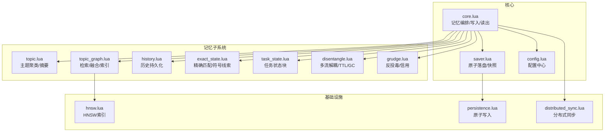

图表来源
- [mori_memory/core.lua:1-327](file://mori_memory/mori_memory/core.lua#L1-L327)
- [topic.lua:1-800](file://mori_memory/module/memory/topic.lua#L1-L800)
- [topic_graph.lua:1-800](file://mori_memory/module/memory/topic_graph.lua#L1-L800)
- [history.lua:1-195](file://mori_memory/module/memory/history.lua#L1-L195)
- [exact_state.lua:1-800](file://mori_memory/module/memory/exact_state.lua#L1-L800)
- [task_state.lua:1-305](file://mori_memory/module/memory/task_state.lua#L1-L305)
- [disentangle.lua:1-800](file://mori_memory/module/memory/disentangle.lua#L1-L800)
- [grudge.lua:1-497](file://mori_memory/module/memory/grudge.lua#L1-L497)
- [saver.lua:1-67](file://mori_memory/module/memory/saver.lua#L1-L67)
- [config.lua:1-680](file://mori_memory/module/config.lua#L1-L680)
- [persistence.lua:1-97](file://mori_memory/module/persistence.lua#L1-L97)
- [distributed_sync.lua:1-287](file://mori_memory/module/distributed_sync.lua#L1-L287)
- [hnsw.lua:1-310](file://mori_memory/module/hnsw.lua#L1-L310)

章节来源
- [mori_memory/README.md:1-89](file://mori_memory/README.md#L1-L89)
- [mori_memory/core.lua:1-327](file://mori_memory/mori_memory/core.lua#L1-L327)

## 核心组件
- 记忆核心（core.lua）
  - 初始化：加载历史、主题、主题图、精确状态、任务状态、线程运行时与证据存储，注册分布式模块。
  - 写入：向量化输入，选择性写入（事实/片段/趋势候选），并写入主题图与证据存储。
  - 读出：根据查询向量与读出门控，融合主题、精确匹配、趋势候选、历史转录等，生成编译后的上下文块。
  - 生命周期：周期性线程运行时检查点、WAL回放、清理与GC触发。
- 主题记忆（topic.lua）
  - 基于“话语对相似度+头质心/尾窗口/全局质心”的双阈值话题边界检测，支持分级摘要与LLM摘要开关。
- 主题图检索（topic_graph.lua）
  - 多路检索融合：语义相似度、桥接主题、主题先验、趋势候选、精确匹配、符号线索等。
  - HNSW索引：可选的topic centroid索引，加速主题检索。
- 历史记忆（history.lua）
  - 历史文本的原子写入与按轮次解析，支持快照生成号一致性校验。
- 精确状态（exact_state.lua）
  - 提供精确匹配与符号化线索（提及、动机、线程后缀图、书签等），支持回复父节点候选。
- 任务状态（task_state.lua）
  - 服务/槽位状态块的短期记忆，支持预览与观察。
- 多流解耦（disentangle.lua）
  - 流/段/线程管理、动态阈值、TTL清理、GC触发、控制器表面与诊断。
- 反投毒守卫（grudge.lua）
  - 用户信用评分、风险分析、阻断与提示。
- 原子落盘（saver.lua）
  - 统一触发topic_graph、history、exact_state、task_state的原子保存与快照提交。
- 配置中心（config.lua）
  - 全量参数与策略档，涵盖检索、写入、守卫、解耦、TTL、GC等。

章节来源
- [mori_memory/core.lua:1-327](file://mori_memory/mori_memory/core.lua#L1-L327)
- [topic.lua:1-800](file://mori_memory/module/memory/topic.lua#L1-L800)
- [topic_graph.lua:1-800](file://mori_memory/module/memory/topic_graph.lua#L1-L800)
- [history.lua:1-195](file://mori_memory/module/memory/history.lua#L1-L195)
- [exact_state.lua:1-800](file://mori_memory/module/memory/exact_state.lua#L1-L800)
- [task_state.lua:1-305](file://mori_memory/module/memory/task_state.lua#L1-L305)
- [disentangle.lua:1-800](file://mori_memory/module/memory/disentangle.lua#L1-L800)
- [grudge.lua:1-497](file://mori_memory/module/memory/grudge.lua#L1-L497)
- [saver.lua:1-67](file://mori_memory/module/memory/saver.lua#L1-L67)
- [config.lua:1-680](file://mori_memory/module/config.lua#L1-L680)

## 架构总览
记忆系统采用“核心编排 + 多记忆子系统 + 基础设施”的分层设计。核心模块负责编排写入与读出，各记忆子系统独立负责各自领域的数据结构与检索策略，基础设施提供索引、原子落盘与分布式能力。

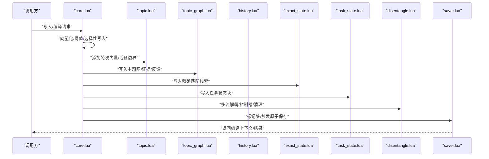

图表来源
- [mori_memory/core.lua:1-327](file://mori_memory/mori_memory/core.lua#L1-L327)
- [topic.lua:659-794](file://mori_memory/module/memory/topic.lua#L659-L794)
- [topic_graph.lua:1-800](file://mori_memory/module/memory/topic_graph.lua#L1-L800)
- [exact_state.lua:1-800](file://mori_memory/module/memory/exact_state.lua#L1-L800)
- [task_state.lua:1-305](file://mori_memory/module/memory/task_state.lua#L1-L305)
- [disentangle.lua:1-800](file://mori_memory/module/memory/disentangle.lua#L1-L800)
- [saver.lua:1-67](file://mori_memory/module/memory/saver.lua#L1-L67)

## 详细组件分析

### 主题记忆（topic.lua）
- 设计要点
  - 头质心/尾窗口/全局质心三段式状态，支持“话语对相似度+头/尾漂移”双阈值话题边界检测。
  - 支持分级摘要与可选LLM摘要，缓存摘要以减少重复生成。
  - 作用域隔离：跨作用域强制分割，降低多用户/多源污染。
- 关键流程
  - 添加轮次向量并评估是否分割。
  - 关闭活跃话题并生成整体质心与摘要。
  - 保存二进制索引与摘要缓存。

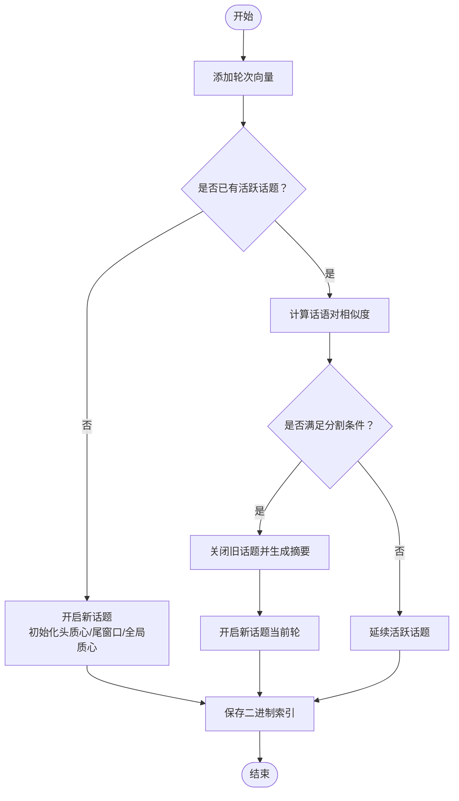

图表来源
- [topic.lua:659-794](file://mori_memory/module/memory/topic.lua#L659-L794)

章节来源
- [topic.lua:1-800](file://mori_memory/module/memory/topic.lua#L1-L800)

### 主题图检索（topic_graph.lua）
- 设计要点
  - 多路检索融合：语义相似度、桥接主题、主题先验、趋势候选、精确匹配、符号线索。
  - HNSW索引：可选的主题centroid索引，加速检索。
  - 运行时：流/主题/记忆的运行时状态与TTL清理。
- 关键流程
  - 构建查询面（文本/向量/精确词），提取Facet/符号线索。
  - 多路打分与融合，输出候选记忆集合。
  - 反馈学习：快速/慢速先验与采纳率调整。

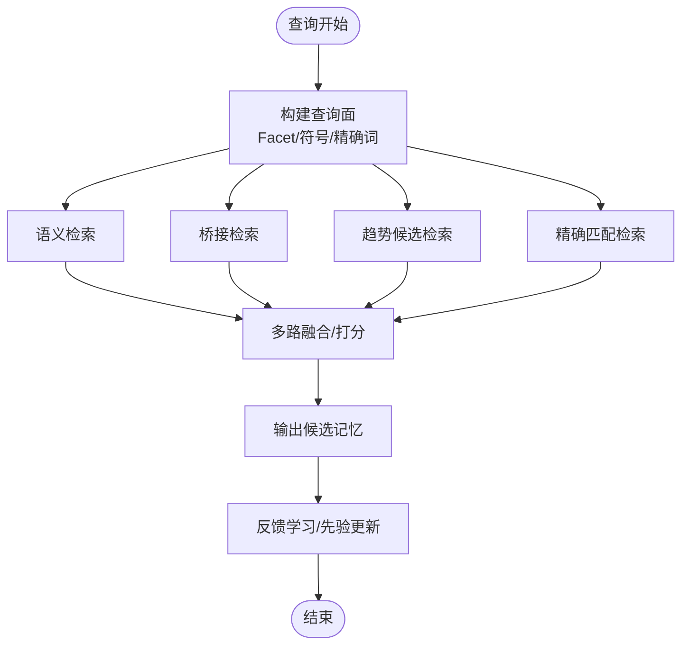

图表来源
- [topic_graph.lua:1-800](file://mori_memory/module/memory/topic_graph.lua#L1-L800)

章节来源
- [topic_graph.lua:1-800](file://mori_memory/module/memory/topic_graph.lua#L1-L800)

### 历史记忆（history.lua）
- 设计要点
  - 历史文本的原子写入与按轮次解析，支持快照生成号一致性校验。
  - 采用定界符编码/解码，保证跨平台可移植。
- 关键流程
  - 解析历史文件头与生成号，校验一致性。
  - 原子写入：临时文件+原子替换，确保落盘安全。

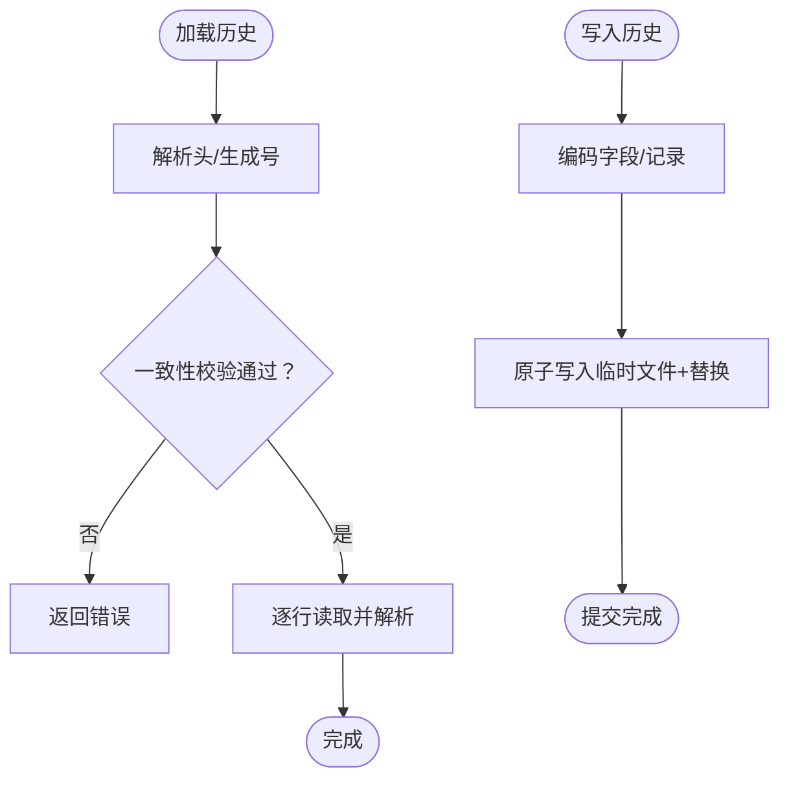

图表来源
- [history.lua:67-194](file://mori_memory/module/memory/history.lua#L67-L194)
- [persistence.lua:25-94](file://mori_memory/module/persistence.lua#L25-L94)

章节来源
- [history.lua:1-195](file://mori_memory/module/memory/history.lua#L1-L195)
- [persistence.lua:1-97](file://mori_memory/module/persistence.lua#L1-L97)

### 精确状态（exact_state.lua）
- 设计要点
  - 精确匹配与符号化线索（提及、动机、线程后缀图、书签等）。
  - 支持回复父节点候选与最近窗口回溯。
- 关键流程
  - 提取词项权重与硬词（含fact:id、键值对等）。
  - 构建索引与候选集，计算重叠得分并输出块。

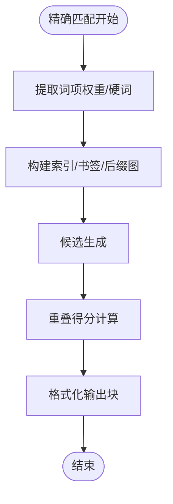

图表来源
- [exact_state.lua:1-800](file://mori_memory/module/memory/exact_state.lua#L1-L800)

章节来源
- [exact_state.lua:1-800](file://mori_memory/module/memory/exact_state.lua#L1-L800)

### 任务状态（task_state.lua）
- 设计要点
  - 服务/槽位状态块的短期记忆，支持预览与观察。
  - 合并与裁剪，限制最大服务数量。
- 关键流程
  - 归一化快照，合并到作用域桶。
  - 格式化输出块，支持预览。

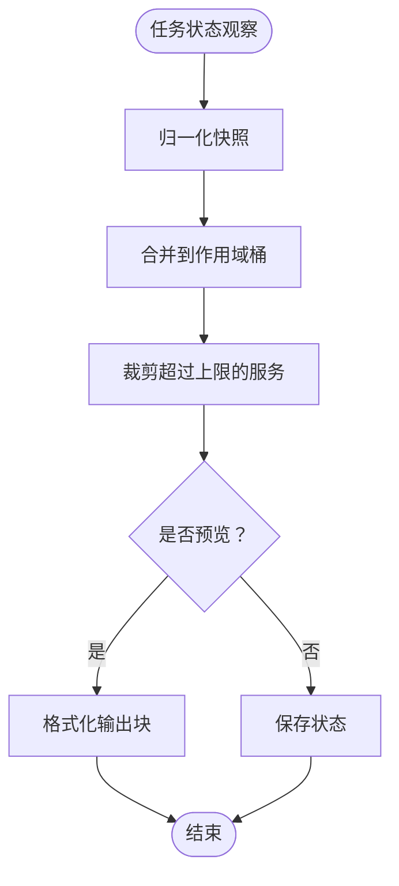

图表来源
- [task_state.lua:1-305](file://mori_memory/module/memory/task_state.lua#L1-L305)

章节来源
- [task_state.lua:1-305](file://mori_memory/module/memory/task_state.lua#L1-L305)

### 多流解耦（disentangle.lua）
- 设计要点
  - 流/段/线程管理、动态阈值、TTL清理、GC触发、控制器表面与诊断。
  - 内存压力监控与周期性清理，保障稳定性。
- 关键流程
  - 控制器表面与诊断计算。
  - TTL清理与GC触发。
  - 动态阈值与路由决策。

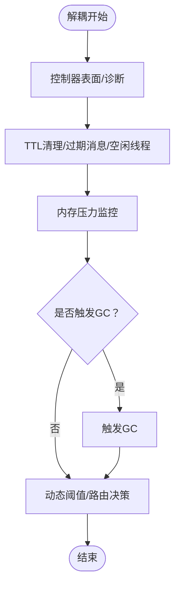

图表来源
- [disentangle.lua:1-800](file://mori_memory/module/memory/disentangle.lua#L1-L800)

章节来源
- [disentangle.lua:1-800](file://mori_memory/module/memory/disentangle.lua#L1-L800)

### 反投毒守卫（grudge.lua）
- 设计要点
  - 用户信用评分、风险分析、阻断与提示。
  - 作用域键与演员键生成，支持按来源策略。
- 关键流程
  - 风险分析与信用衰减/奖励。
  - 阻断阈值与冷却时间。
  - 提示生成与保存。

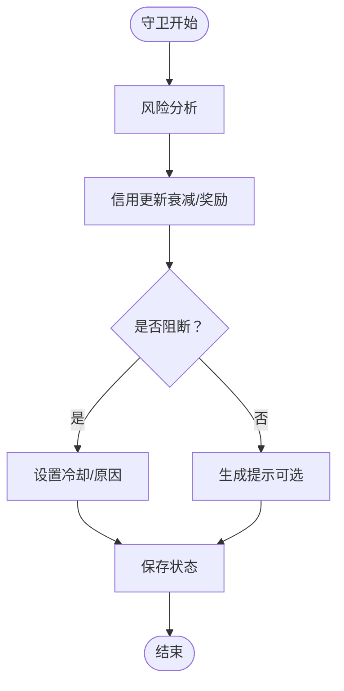

图表来源
- [grudge.lua:1-497](file://mori_memory/module/memory/grudge.lua#L1-L497)

章节来源
- [grudge.lua:1-497](file://mori_memory/module/memory/grudge.lua#L1-L497)

### 原子落盘与快照（saver.lua）
- 设计要点
  - 统一触发topic_graph、history、exact_state、task_state的原子保存与快照提交。
  - 退出时自动落盘并归档。
- 关键流程
  - 标记脏状态。
  - 依次保存各模块并提交快照。
  - 退出时强制保存。

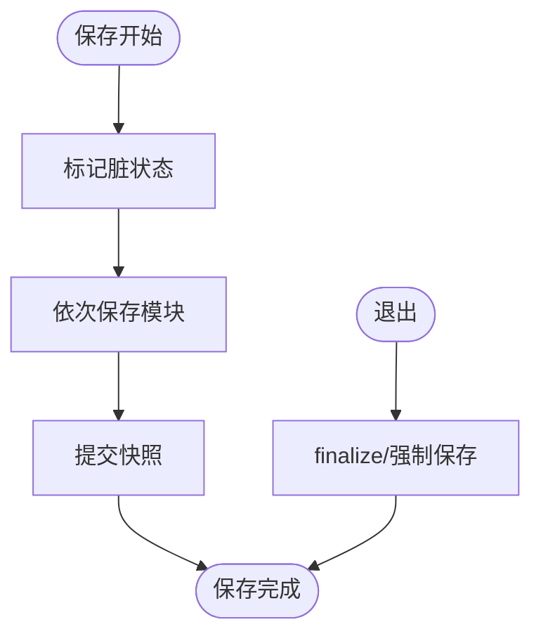

图表来源
- [saver.lua:1-67](file://mori_memory/module/memory/saver.lua#L1-L67)

章节来源
- [saver.lua:1-67](file://mori_memory/module/memory/saver.lua#L1-L67)

### 分布式同步（distributed_sync.lua）
- 设计要点
  - 节点管理、心跳、增量同步、冲突解决、优雅降级。
  - 版本向量与模块状态对比，决定拉取/推送。
- 关键流程
  - 注册节点与心跳维护。
  - 增量同步与冲突解决。
  - 网络分区检测与降级策略。

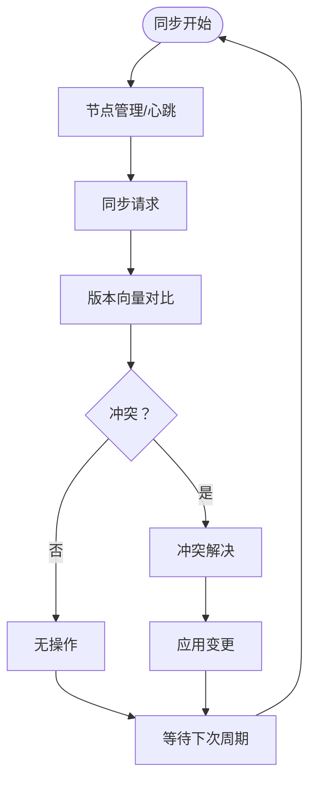

图表来源
- [distributed_sync.lua:1-287](file://mori_memory/module/distributed_sync.lua#L1-L287)

章节来源
- [distributed_sync.lua:1-287](file://mori_memory/module/distributed_sync.lua#L1-L287)

## 依赖关系分析
- 模块耦合
  - core.lua高内聚地编排topic、topic_graph、history、exact_state、task_state、disentangle、grudge、saver、config、hnsw、persistence、distributed_sync。
  - topic_graph.lua依赖hnsw.lua进行主题centroid检索。
  - saver.lua依赖persistence.lua进行原子写入。
  - distributed_sync.lua依赖config与state_coordinator进行版本与状态管理。
- 外部依赖
  - LuaJIT FFI绑定HNSW原生模块。
  - Python管道（可选）用于主题摘要生成。

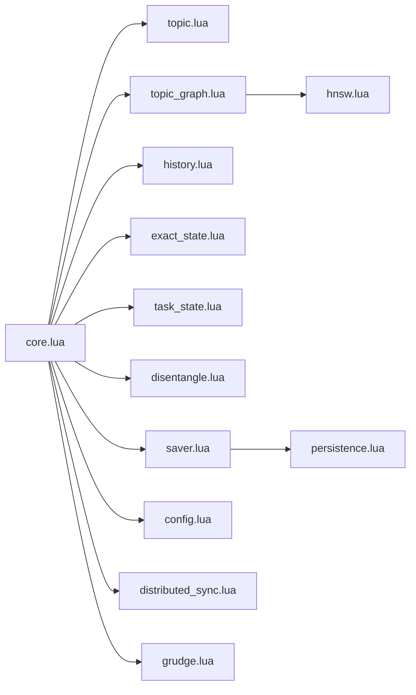

图表来源
- [mori_memory/core.lua:1-327](file://mori_memory/mori_memory/core.lua#L1-L327)
- [topic_graph.lua:1-800](file://mori_memory/module/memory/topic_graph.lua#L1-L800)
- [hnsw.lua:1-310](file://mori_memory/module/hnsw.lua#L1-L310)
- [saver.lua:1-67](file://mori_memory/module/memory/saver.lua#L1-L67)
- [persistence.lua:1-97](file://mori_memory/module/persistence.lua#L1-L97)
- [distributed_sync.lua:1-287](file://mori_memory/module/distributed_sync.lua#L1-L287)
- [grudge.lua:1-497](file://mori_memory/module/memory/grudge.lua#L1-L497)
- [config.lua:1-680](file://mori_memory/module/config.lua#L1-L680)

章节来源
- [mori_memory/core.lua:1-327](file://mori_memory/mori_memory/core.lua#L1-L327)

## 性能考量
- 向量相似度与索引
  - 使用余弦相似度；HNSW索引可选，提升主题检索效率。
  - 向量维度与索引参数（m、ef_construction、ef_search、max_elements）影响检索精度与速度。
- 写入选择性
  - 通过写入选项（候选阈值、提交阈值、即时提交阈值、趋势阈值）控制慢记忆促进节奏。
- 读出门控
  - 读出权重与最小阈值（memory/transcript/pending/trend）平衡不同记忆来源的贡献。
- TTL与GC
  - TTL清理过期消息与空闲线程，GC在内存压力或周期性触发，防止内存膨胀。
- 原子落盘
  - 原子写入与快照提交，减少落盘开销与数据不一致风险。

章节来源
- [config.lua:1-680](file://mori_memory/module/config.lua#L1-L680)
- [disentangle.lua:1-800](file://mori_memory/module/memory/disentangle.lua#L1-L800)
- [saver.lua:1-67](file://mori_memory/module/memory/saver.lua#L1-L67)
- [hnsw.lua:1-310](file://mori_memory/module/hnsw.lua#L1-L310)

## 故障排查指南
- HNSW模块不可用
  - 现象：HNSW模块加载失败，系统退回纯Lua扫描。
  - 排查：确认native模块构建脚本执行成功，模块路径正确。
  - 参考：[hnsw.lua:80-103](file://mori_memory/module/hnsw.lua#L80-L103)
- 历史文件不一致
  - 现象：历史生成号不匹配或头无效。
  - 排查：检查快照生成号与历史文件头，必要时重建。
  - 参考：[history.lua:67-114](file://mori_memory/module/memory/history.lua#L67-L114)
- 写入被阻断
  - 现象：用户信用过低导致写入被阻断。
  - 排查：检查信用衰减、风险分析与阻断阈值。
  - 参考：[grudge.lua:316-356](file://mori_memory/module/memory/grudge.lua#L316-L356)
- 写入选项不生效
  - 现象：记忆未按预期写入。
  - 排查：检查选择性写入选项与控制器表面参数。
  - 参考：[core.lua:960-1157](file://mori_memory/mori_memory/core.lua#L960-L1157)
- 分布式同步异常
  - 现象：节点间状态不一致或同步失败。
  - 排查：检查节点心跳、版本向量、冲突解决策略。
  - 参考：[distributed_sync.lua:1-287](file://mori_memory/module/distributed_sync.lua#L1-L287)

章节来源
- [hnsw.lua:80-103](file://mori_memory/module/hnsw.lua#L80-L103)
- [history.lua:67-114](file://mori_memory/module/memory/history.lua#L67-L114)
- [grudge.lua:316-356](file://mori_memory/module/memory/grudge.lua#L316-L356)
- [core.lua:960-1157](file://mori_memory/mori_memory/core.lua#L960-L1157)
- [distributed_sync.lua:1-287](file://mori_memory/module/distributed_sync.lua#L1-L287)

## 结论
Mori记忆系统通过“主题记忆+历史记忆+精确状态+任务状态”的多维组合，配合向量相似度与HNSW索引、分布式同步与线程解耦控制，实现了高效、稳定且可扩展的记忆内核。其配置中心提供了丰富的调优参数，便于在不同场景下平衡检索质量、写入节奏与资源占用。建议在生产环境中启用原子落盘与快照、合理配置TTL/GC与读出门控，并根据业务需求启用HNSW与分布式同步。

## 附录

### API与使用示例（基于README）
- 设置基础目录与嵌入器回调
  - 参考：[mori_memory.lua:1-3](file://mori_memory/mori_memory.lua#L1-L3)
  - 示例路径：[README.md:11-42](file://mori_memory/README.md#L11-L42)
- 写入与编译上下文
  - 示例路径：[README.md:18-38](file://mori_memory/README.md#L18-L38)
- 原生模块构建
  - 示例路径：[README.md:48-71](file://mori_memory/README.md#L48-L71)

章节来源
- [mori_memory.lua:1-3](file://mori_memory/mori_memory.lua#L1-L3)
- [README.md:1-89](file://mori_memory/README.md#L1-L89)