# 插件管理系统

<cite>
**本文引用的文件**
- [runtime.lua](file://mori_runtime/lua/mori/app/runtime.lua)
- [plugin.lua](file://mori_runtime/lua/mori/core/plugin.lua)
- [bus.lua](file://mori_runtime/lua/mori/core/bus.lua)
- [protocol.lua](file://mori_runtime/lua/mori/core/protocol.lua)
- [memory.lua](file://mori_runtime/lua/mori/plugins/memory.lua)
- [context.lua](file://mori_runtime/lua/mori/plugins/context.lua)
- [live_outputs.lua](file://mori_runtime/lua/mori/plugins/live_outputs.lua)
- [tts_python.lua](file://mori_runtime/lua/mori/plugins/tts_python.lua)
- [llm_llama_server.lua](file://mori_runtime/lua/mori/plugins/llm_llama_server.lua)
- [json.lua](file://mori_runtime/lua/mori/core/json.lua)
- [clean.lua](file://mori_runtime/lua/mori/text/clean.lua)
- [chunker.lua](file://mori_runtime/lua/mori/speech/chunker.lua)
</cite>

## 目录
1. [简介](#简介)
2. [项目结构](#项目结构)
3. [核心组件](#核心组件)
4. [架构总览](#架构总览)
5. [详细组件分析](#详细组件分析)
6. [依赖关系分析](#依赖关系分析)
7. [性能考量](#性能考量)
8. [故障排查指南](#故障排查指南)
9. [结论](#结论)
10. [附录](#附录)

## 简介
本文件系统性阐述基于 Lua 的插件管理与运行时架构，覆盖插件发现与加载、初始化与生命周期、事件总线通信、插件间协作、接口规范、错误隔离与恢复、以及面向开发者的模板与最佳实践。文档以实际源码为依据，配合图示帮助读者快速理解并扩展插件体系。

## 项目结构
围绕“运行时”与“核心插件”两大子系统组织：
- 运行时入口负责调度、事件循环、插件加载与生命周期管理
- 核心模块提供事件总线、协议常量、JSON 编码、文本清洗、语音分段等通用能力
- 插件模块实现具体业务能力（上下文合成、内存编排、TTS、LLM、实时输出）

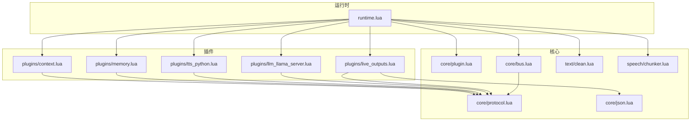

图表来源
- [runtime.lua:543-665](file://mori_runtime/lua/mori/app/runtime.lua#L543-L665)
- [plugin.lua:13-48](file://mori_runtime/lua/mori/core/plugin.lua#L13-L48)
- [bus.lua:14-91](file://mori_runtime/lua/mori/core/bus.lua#L14-L91)
- [protocol.lua:3-32](file://mori_runtime/lua/mori/core/protocol.lua#L3-L32)
- [context.lua:30-87](file://mori_runtime/lua/mori/plugins/context.lua#L30-L87)
- [memory.lua:8-26](file://mori_runtime/lua/mori/plugins/memory.lua#L8-L26)
- [tts_python.lua:8-28](file://mori_runtime/lua/mori/plugins/tts_python.lua#L8-L28)
- [llm_llama_server.lua:8-21](file://mori_runtime/lua/mori/plugins/llm_llama_server.lua#L8-L21)
- [live_outputs.lua:63-111](file://mori_runtime/lua/mori/plugins/live_outputs.lua#L63-L111)
- [json.lua:84-86](file://mori_runtime/lua/mori/core/json.lua#L84-L86)
- [clean.lua:16-46](file://mori_runtime/lua/mori/text/clean.lua#L16-L46)
- [chunker.lua:56-153](file://mori_runtime/lua/mori/speech/chunker.lua#L56-L153)

章节来源
- [runtime.lua:543-665](file://mori_runtime/lua/mori/app/runtime.lua#L543-L665)
- [plugin.lua:13-48](file://mori_runtime/lua/mori/core/plugin.lua#L13-L48)
- [bus.lua:14-91](file://mori_runtime/lua/mori/core/bus.lua#L14-L91)
- [protocol.lua:3-32](file://mori_runtime/lua/mori/core/protocol.lua#L3-L32)

## 核心组件
- 事件总线 Bus：提供订阅/发布、请求-响应式调用、统一错误上报能力
- 协议常量 Protocol：集中定义所有事件名，确保跨插件一致性
- 插件加载器 Plugin：按名称列表动态加载插件，校验接口规范，发出生命周期事件
- 运行时 Runtime：构建 Bus、加载插件、驱动事件循环、协调各插件工作
- 文本清洗 Clean：剥离思维标记、去除推理后缀，保证可见文本质量
- 语音分段 Chunker：按标点与字符长度切分文本，支持软硬边界策略
- JSON 编码 Json：稳定可预测的 JSON 序列化工具

章节来源
- [bus.lua:14-91](file://mori_runtime/lua/mori/core/bus.lua#L14-L91)
- [protocol.lua:3-32](file://mori_runtime/lua/mori/core/protocol.lua#L3-L32)
- [plugin.lua:13-48](file://mori_runtime/lua/mori/core/plugin.lua#L13-L48)
- [runtime.lua:543-665](file://mori_runtime/lua/mori/app/runtime.lua#L543-L665)
- [clean.lua:16-46](file://mori_runtime/lua/mori/text/clean.lua#L16-L46)
- [chunker.lua:56-153](file://mori_runtime/lua/mori/speech/chunker.lua#L56-L153)
- [json.lua:84-86](file://mori_runtime/lua/mori/core/json.lua#L84-L86)

## 架构总览
运行时通过插件加载器批量加载插件，每个插件在 setup 中注册事件处理器，并由运行时在事件流中协同工作。事件采用“广播+请求-响应”的混合模式，既支持多播通知，也支持链式查询返回首个非空值。

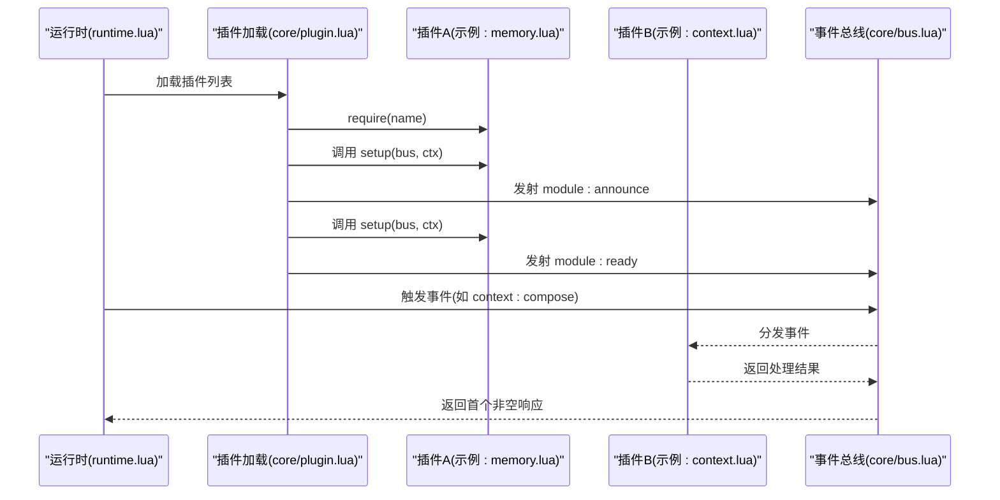

图表来源
- [runtime.lua:556-563](file://mori_runtime/lua/mori/app/runtime.lua#L556-L563)
- [plugin.lua:13-48](file://mori_runtime/lua/mori/core/plugin.lua#L13-L48)
- [memory.lua:8-26](file://mori_runtime/lua/mori/plugins/memory.lua#L8-L26)
- [context.lua:30-87](file://mori_runtime/lua/mori/plugins/context.lua#L30-L87)
- [bus.lua:50-91](file://mori_runtime/lua/mori/core/bus.lua#L50-L91)

## 详细组件分析

### 插件加载与生命周期
- 发现与加载：按配置提供的插件名称列表逐一 require，捕获失败并上报模块错误事件
- 接口校验：要求插件返回表且包含 setup 函数，否则上报无效插件错误
- 生命周期事件：
  - 加载成功后发射 module:announce（含 id/version）
  - setup 成功后发射 module:ready
  - 运行结束时发射 memory:shutdown 并逐个插件进行清理

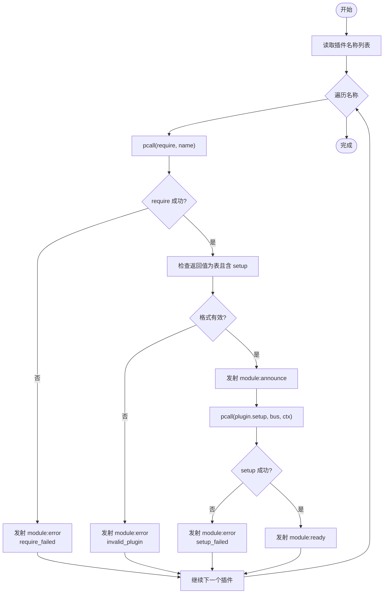

图表来源
- [plugin.lua:13-48](file://mori_runtime/lua/mori/core/plugin.lua#L13-L48)
- [protocol.lua:6-8](file://mori_runtime/lua/mori/core/protocol.lua#L6-L8)

章节来源
- [plugin.lua:13-48](file://mori_runtime/lua/mori/core/plugin.lua#L13-L48)
- [protocol.lua:6-8](file://mori_runtime/lua/mori/core/protocol.lua#L6-L8)

### 事件总线与协议
- 订阅/发布：on 注册处理器，emit 广播事件，异常被捕获并转为 BUS_ERROR
- 请求-响应：call 顺序调用处理器，返回首个非空结果，异常同样转为 BUS_ERROR
- 协议常量：集中定义模块、上下文、内存、语音、输出、LLM 等事件名，避免拼写不一致

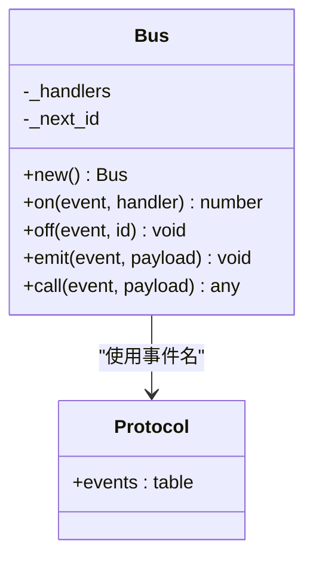

图表来源
- [bus.lua:14-91](file://mori_runtime/lua/mori/core/bus.lua#L14-L91)
- [protocol.lua:3-32](file://mori_runtime/lua/mori/core/protocol.lua#L3-L32)

章节来源
- [bus.lua:14-91](file://mori_runtime/lua/mori/core/bus.lua#L14-L91)
- [protocol.lua:3-32](file://mori_runtime/lua/mori/core/protocol.lua#L3-L32)

### 上下文插件（context）
职责：将用户输入与记忆块组合为 LLM 可消费的消息序列，支持系统提示拼接、块迭代与去重处理。
- 事件：订阅 context:compose，接收包含回合、用户输入、系统提示、来源等字段
- 处理：调用 memory:compile_context 获取记忆块，组装 messages 与 blocks，最终返回 { messages, blocks }

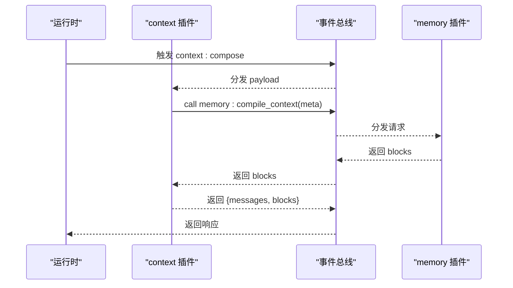

图表来源
- [context.lua:30-87](file://mori_runtime/lua/mori/plugins/context.lua#L30-L87)
- [memory.lua:12-14](file://mori_runtime/lua/mori/plugins/memory.lua#L12-L14)
- [protocol.lua:12-16](file://mori_runtime/lua/mori/core/protocol.lua#L12-L16)

章节来源
- [context.lua:30-87](file://mori_runtime/lua/mori/plugins/context.lua#L30-L87)
- [memory.lua:12-14](file://mori_runtime/lua/mori/plugins/memory.lua#L12-L14)
- [protocol.lua:12-16](file://mori_runtime/lua/mori/core/protocol.lua#L12-L16)

### 内存插件（memory）
职责：对接底层记忆模块，提供上下文编译、单轮记忆注入与关闭清理。
- 事件：
  - 订阅 memory:compile_context：返回记忆块
  - 订阅 memory:ingest_turn：记录单轮对话
  - 订阅 memory:shutdown：安全关闭
- 生命周期：在 setup 中绑定 ctx.memory，并在运行结束时触发 shutdown

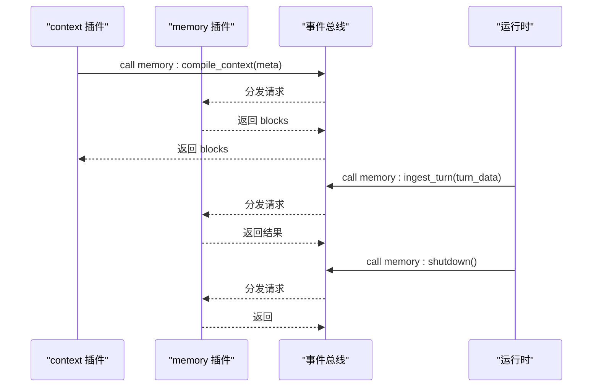

图表来源
- [memory.lua:8-26](file://mori_runtime/lua/mori/plugins/memory.lua#L8-L26)
- [protocol.lua:14-16](file://mori_runtime/lua/mori/core/protocol.lua#L14-L16)

章节来源
- [memory.lua:8-26](file://mori_runtime/lua/mori/plugins/memory.lua#L8-L26)
- [protocol.lua:14-16](file://mori_runtime/lua/mori/core/protocol.lua#L14-L16)

### 实时输出插件（live_outputs）
职责：将字幕、打印信息与事件日志落盘或输出到标准输出。
- 事件：
  - 订阅 output:subtitle：标准化文本并写入字幕文件，必要时打印到 stdout
  - 订阅 output:print：直接打印
  - 订阅 output:event：JSON 编码后追加到事件日志文件
- 配置：支持 subtitle_path、event_log_path、print_to_stdout

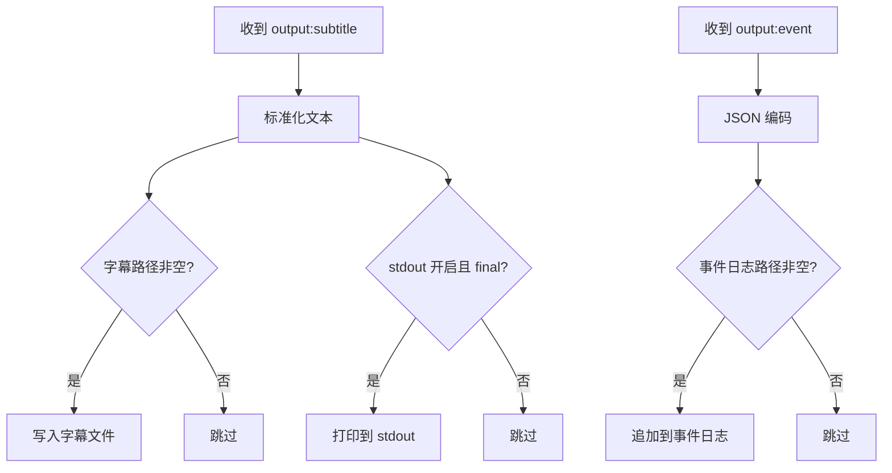

图表来源
- [live_outputs.lua:63-111](file://mori_runtime/lua/mori/plugins/live_outputs.lua#L63-L111)
- [json.lua:84-86](file://mori_runtime/lua/mori/core/json.lua#L84-L86)

章节来源
- [live_outputs.lua:63-111](file://mori_runtime/lua/mori/plugins/live_outputs.lua#L63-L111)
- [json.lua:84-86](file://mori_runtime/lua/mori/core/json.lua#L84-L86)

### TTS 插件（tts_python）
职责：桥接到 Python 后端，转发 TTS 提交、拉取与取消意图。
- 事件：
  - 订阅 tts:submit：提交分段文本
  - 订阅 tts:drain：拉取已完成结果
  - 订阅 tts:cancel_intent：取消指定意图

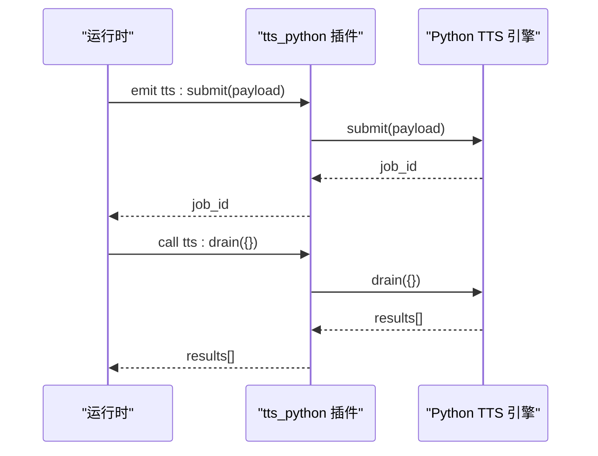

图表来源
- [tts_python.lua:8-28](file://mori_runtime/lua/mori/plugins/tts_python.lua#L8-L28)

章节来源
- [tts_python.lua:8-28](file://mori_runtime/lua/mori/plugins/tts_python.lua#L8-L28)

### LLM 插件（llm_llama_server）
职责：桥接到 Python 后端，提供流式对话能力。
- 事件：
  - 订阅 llm:stream：接收 messages、params、回调 on_delta、should_abort
  - 调用 Python 引擎 stream_chat 并回调 on_delta

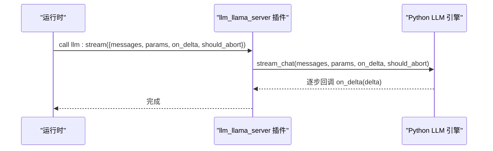

图表来源
- [llm_llama_server.lua:8-21](file://mori_runtime/lua/mori/plugins/llm_llama_server.lua#L8-L21)

章节来源
- [llm_llama_server.lua:8-21](file://mori_runtime/lua/mori/plugins/llm_llama_server.lua#L8-L21)

### 文本清洗与语音分段
- 文本清洗：剥离<think>...标记、去除推理后缀、标准化空白
- 语音分段：按硬/软标点与字符阈值切分，支持首段 boost、最小/最大长度控制

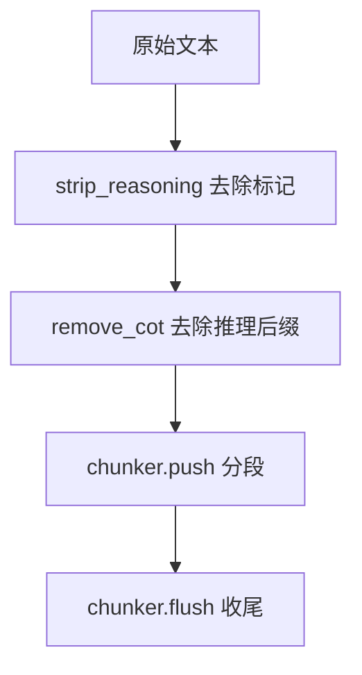

图表来源
- [clean.lua:16-46](file://mori_runtime/lua/mori/text/clean.lua#L16-L46)
- [chunker.lua:56-153](file://mori_runtime/lua/mori/speech/chunker.lua#L56-L153)

章节来源
- [clean.lua:16-46](file://mori_runtime/lua/mori/text/clean.lua#L16-L46)
- [chunker.lua:56-153](file://mori_runtime/lua/mori/speech/chunker.lua#L56-L153)

## 依赖关系分析
- 运行时依赖：插件加载器、事件总线、协议常量、文本清洗、语音分段
- 插件依赖：协议常量；部分插件依赖 Python 桥接对象（ctx.py_tts、ctx.py_llm）
- 插件间协作：context 依赖 memory 的编译上下文；运行时通过 call 获取首个可用结果；通过 emit 广播状态

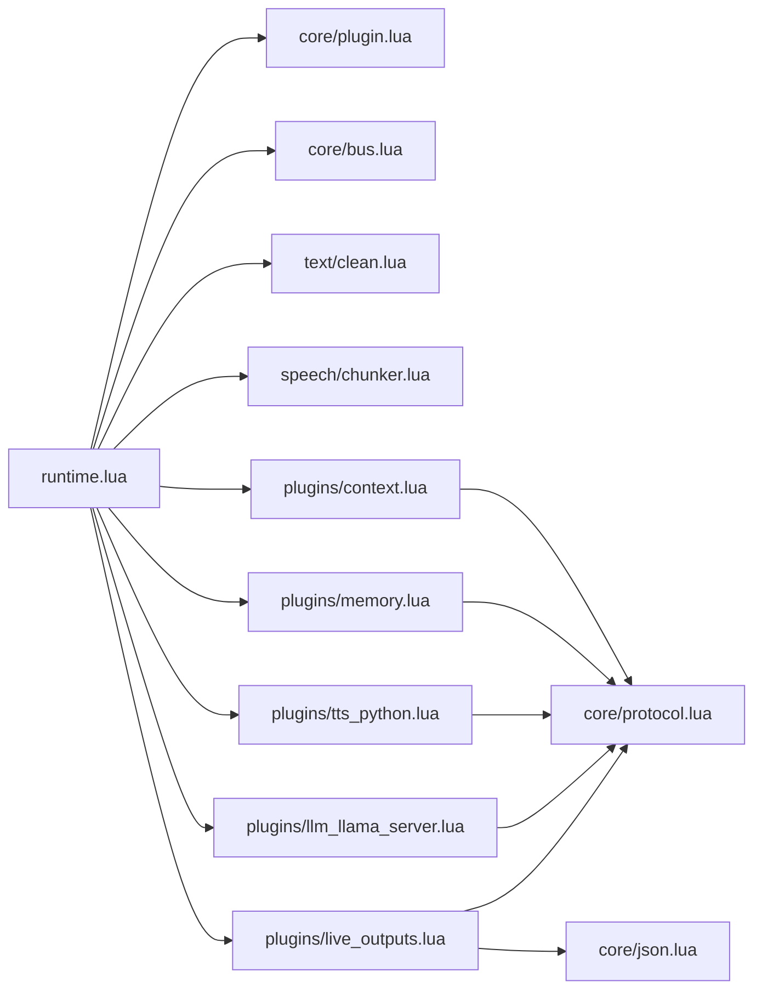

图表来源
- [runtime.lua:543-665](file://mori_runtime/lua/mori/app/runtime.lua#L543-L665)
- [plugin.lua:13-48](file://mori_runtime/lua/mori/core/plugin.lua#L13-L48)
- [bus.lua:14-91](file://mori_runtime/lua/mori/core/bus.lua#L14-L91)
- [protocol.lua:3-32](file://mori_runtime/lua/mori/core/protocol.lua#L3-L32)
- [context.lua:30-87](file://mori_runtime/lua/mori/plugins/context.lua#L30-L87)
- [memory.lua:8-26](file://mori_runtime/lua/mori/plugins/memory.lua#L8-L26)
- [tts_python.lua:8-28](file://mori_runtime/lua/mori/plugins/tts_python.lua#L8-L28)
- [llm_llama_server.lua:8-21](file://mori_runtime/lua/mori/plugins/llm_llama_server.lua#L8-L21)
- [live_outputs.lua:63-111](file://mori_runtime/lua/mori/plugins/live_outputs.lua#L63-L111)
- [json.lua:84-86](file://mori_runtime/lua/mori/core/json.lua#L84-L86)

章节来源
- [runtime.lua:543-665](file://mori_runtime/lua/mori/app/runtime.lua#L543-L665)
- [protocol.lua:3-32](file://mori_runtime/lua/mori/core/protocol.lua#L3-L32)

## 性能考量
- 事件处理：call 顺序遍历处理器并短路返回首个非空值，避免不必要的计算
- 文本清洗：仅在可见文本更新时进行 strip_reasoning，减少重复处理
- 语音分段：首段 boost 降低前几个分段的最小长度阈值，提升实时性
- 队列压缩：对直播输入进行去重合并，降低后续处理压力
- 错误隔离：pcall 包裹外部调用，异常转化为 BUS_ERROR，避免崩溃传播

## 故障排查指南
- 插件加载失败
  - 现象：发射 module:error，携带 require_failed
  - 排查：确认插件路径正确、返回值为表且包含 setup
- 插件 setup 失败
  - 现象：发射 module:error，携带 setup_failed
  - 排查：检查插件内部依赖（如 ctx.py_tts/ctx.py_llm）是否就绪
- 事件处理异常
  - 现象：BUS_ERROR，包含事件名、处理器 ID、错误信息
  - 排查：定位对应处理器，修复回调逻辑
- 输出异常
  - 现象：文件写入失败或编码异常
  - 排查：检查路径权限、磁盘空间、JSON 编码稳定性

章节来源
- [plugin.lua:17-26](file://mori_runtime/lua/mori/core/plugin.lua#L17-L26)
- [plugin.lua:33-38](file://mori_runtime/lua/mori/core/plugin.lua#L33-L38)
- [bus.lua:56-68](file://mori_runtime/lua/mori/core/bus.lua#L56-L68)
- [live_outputs.lua:43-51](file://mori_runtime/lua/mori/plugins/live_outputs.lua#L43-L51)
- [json.lua:34-82](file://mori_runtime/lua/mori/core/json.lua#L34-L82)

## 结论
该插件系统以事件总线为核心，通过统一协议与严格的生命周期管理，实现了模块解耦与可扩展性。上下文与内存插件形成清晰的数据通道，TTS 与 LLM 插件通过 Python 桥接实现高性能推理与语音合成。建议在生产环境中强化插件间契约约束、引入热重载与资源池化策略，以进一步提升稳定性与吞吐。

## 附录

### 插件接口规范
- 必需字段
  - id：字符串，唯一标识插件
  - 版本 version：字符串，语义化版本
- 必需方法
  - setup(bus, ctx)：在其中注册事件处理器，绑定上下文对象
- 建议行为
  - 在 setup 中显式检查 ctx 依赖（如 py_tts/py_llm），缺失时报错
  - 对外暴露的事件命名遵循 core/protocol.lua 中的约定
  - 对异常进行 pcall 包裹，避免影响其他处理器

章节来源
- [memory.lua:3-6](file://mori_runtime/lua/mori/plugins/memory.lua#L3-L6)
- [context.lua:3-6](file://mori_runtime/lua/mori/plugins/context.lua#L3-L6)
- [tts_python.lua:8-11](file://mori_runtime/lua/mori/plugins/tts_python.lua#L8-L11)
- [llm_llama_server.lua:8-11](file://mori_runtime/lua/mori/plugins/llm_llama_server.lua#L8-L11)
- [protocol.lua:3-32](file://mori_runtime/lua/mori/core/protocol.lua#L3-L32)

### 插件开发指南
- 插件模板
  - 返回表包含 id、version
  - 在 setup 中 require("mori.core.protocol")，注册所需事件处理器
  - 使用 bus:on 订阅事件，使用 bus:emit 或 bus:call 广播/请求
- 最佳实践
  - 严格校验输入参数类型与范围
  - 将耗时操作异步化，避免阻塞事件循环
  - 对外部依赖进行健壮性检查与降级处理
- 调试技巧
  - 利用 BUS_ERROR 事件定位异常处理器
  - 使用 output:print 输出关键路径日志
  - 通过 output:event 记录结构化事件，便于回放与分析

章节来源
- [context.lua:30-87](file://mori_runtime/lua/mori/plugins/context.lua#L30-L87)
- [live_outputs.lua:94-98](file://mori_runtime/lua/mori/plugins/live_outputs.lua#L94-L98)
- [bus.lua:56-68](file://mori_runtime/lua/mori/core/bus.lua#L56-L68)

### 现有插件实现分析
- memory 插件
  - 功能：编译上下文、注入单轮记忆、关闭清理
  - 使用：被 context 插件通过 bus:call 调用
- context 插件
  - 功能：将用户输入与记忆块组合为消息序列
  - 使用：运行时通过 bus:call 触发，返回 messages 与 blocks
- live_outputs 插件
  - 功能：字幕落盘、事件日志、标准输出打印
  - 使用：订阅 output:* 事件，按配置写入
- tts_python 插件
  - 功能：桥接 Python TTS，提交/拉取/取消
  - 使用：运行时通过 bus:call 触发
- llm_llama_server 插件
  - 功能：桥接 Python LLM，提供流式对话
  - 使用：运行时通过 bus:call 触发

章节来源
- [memory.lua:8-26](file://mori_runtime/lua/mori/plugins/memory.lua#L8-L26)
- [context.lua:30-87](file://mori_runtime/lua/mori/plugins/context.lua#L30-L87)
- [live_outputs.lua:63-111](file://mori_runtime/lua/mori/plugins/live_outputs.lua#L63-L111)
- [tts_python.lua:8-28](file://mori_runtime/lua/mori/plugins/tts_python.lua#L8-L28)
- [llm_llama_server.lua:8-21](file://mori_runtime/lua/mori/plugins/llm_llama_server.lua#L8-L21)

### 高级特性建议
- 热重载
  - 设计插件卸载流程（如 module:unloading），在重新加载前清理资源
  - 保持事件名与回调签名稳定，避免破坏依赖
- 错误隔离
  - 为每个插件建立独立错误通道，避免全局异常风暴
- 性能监控
  - 在关键事件上埋点，统计延迟与吞吐，结合 output:event 输出指标