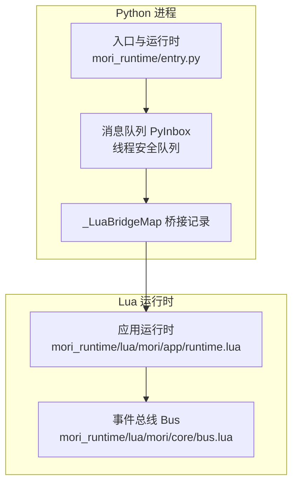
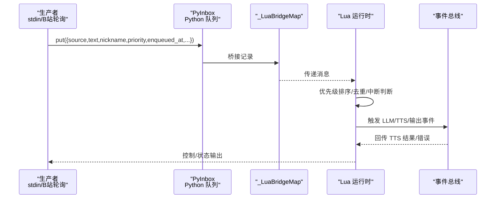
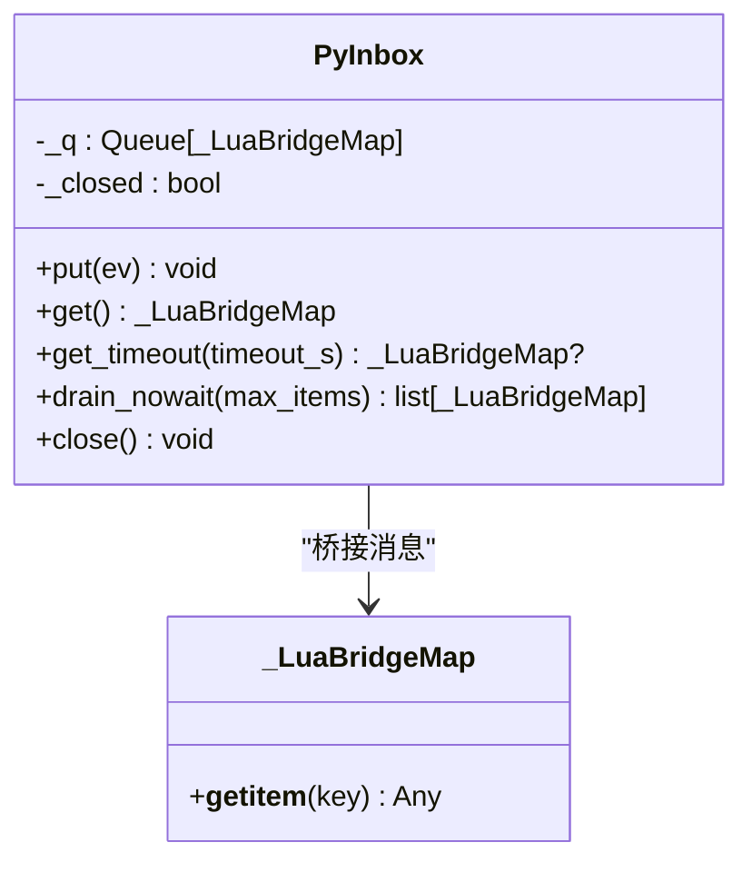
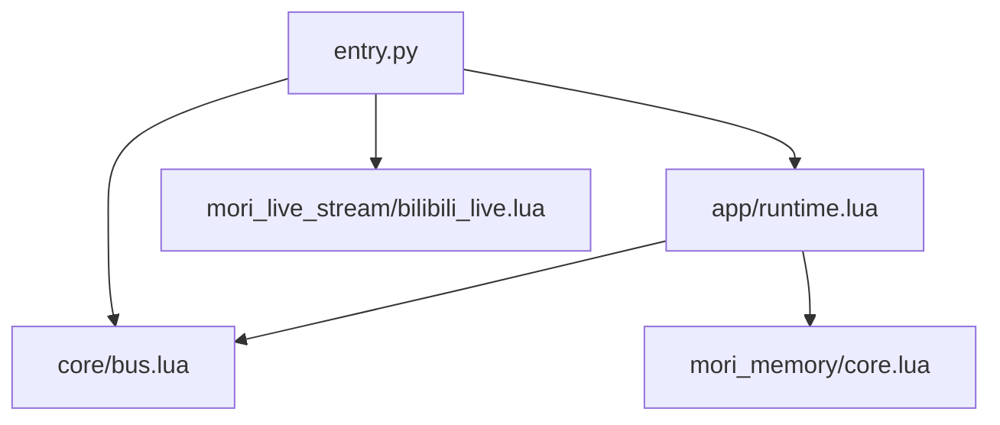

# 消息队列系统

<cite>
**本文档引用的文件**
- [mori_runtime/entry.py](file://mori_runtime/entry.py)
- [mori_runtime/lua/mori/app/runtime.lua](file://mori_runtime/lua/mori/app/runtime.lua)
- [mori_runtime/lua/mori/core/bus.lua](file://mori_runtime/lua/mori/core/bus.lua)
- [mori_runtime/config.py](file://mori_runtime/config.py)
- [mori_live_stream/lua/mori_live_stream/bilibili_live.lua](file://mori_live_stream/lua/mori_live_stream/bilibili_live.lua)
- [mori_memory/mori_memory/core.lua](file://mori_memory/mori_memory/core.lua)
- [README.md](file://README.md)
</cite>

## 目录
1. [简介](#简介)
2. [项目结构](#项目结构)
3. [核心组件](#核心组件)
4. [架构总览](#架构总览)
5. [详细组件分析](#详细组件分析)
6. [依赖分析](#依赖分析)
7. [性能考虑](#性能考虑)
8. [故障排除指南](#故障排除指南)
9. [结论](#结论)
10. [附录](#附录)

## 简介
本文件围绕消息队列系统进行深入技术文档化，重点剖析 PyInbox 类的设计与实现，涵盖以下主题：
- 线程安全的消息队列与溢出处理机制
- 消息优先级与调度策略
- 队列容量管理与超时控制
- 消息格式规范与字段语义
- 异步处理模式（生产者-消费者）与错误处理
- 性能优化建议与实际使用示例
- 常见问题与排障方法

## 项目结构
该消息队列系统位于 Python 入口模块中，通过 lupa 将 Python 对象桥接到 Lua 运行时，形成跨语言的异步消息处理链路。关键位置如下：
- Python 层：消息生产者（stdin、B站弹幕轮询）、消息队列容器（PyInbox）、桥接数据类型（_LuaBridgeMap）
- Lua 层：消息消费与调度（runtime.lua）、事件总线（bus.lua）、消息去重与优先级选择逻辑
- 配置层：统一配置解析与默认参数注入（config.py）

图表来源
- [mori_runtime/entry.py:89-144](file://mori_runtime/entry.py#L89-L144)
- [mori_runtime/lua/mori/app/runtime.lua:146-220](file://mori_runtime/lua/mori/app/runtime.lua#L146-L220)
- [mori_runtime/lua/mori/core/bus.lua:14-91](file://mori_runtime/lua/mori/core/bus.lua#L14-L91)

章节来源
- [mori_runtime/entry.py:89-144](file://mori_runtime/entry.py#L89-L144)
- [mori_runtime/lua/mori/app/runtime.lua:146-220](file://mori_runtime/lua/mori/app/runtime.lua#L146-L220)
- [mori_runtime/lua/mori/core/bus.lua:14-91](file://mori_runtime/lua/mori/core/bus.lua#L14-L91)

## 核心组件
- PyInbox：Python 线程安全消息队列，负责接收外部消息并提供阻塞/非阻塞获取接口，内置溢出丢弃策略。
- _LuaBridgeMap：桥接记录类型，确保从 Python 传递到 Lua 的消息具备稳定的键访问行为。
- Lua 应用运行时：负责从队列取出消息、排序优先级、中断策略、TTS 提交与结果回传。
- 事件总线 Bus：插件化事件分发与错误回调，支撑消息处理流程。

章节来源
- [mori_runtime/entry.py:89-144](file://mori_runtime/entry.py#L89-L144)
- [mori_runtime/entry.py:54-62](file://mori_runtime/entry.py#L54-L62)
- [mori_runtime/lua/mori/app/runtime.lua:98-136](file://mori_runtime/lua/mori/app/runtime.lua#L98-L136)
- [mori_runtime/lua/mori/core/bus.lua:14-91](file://mori_runtime/lua/mori/core/bus.lua#L14-L91)

## 架构总览
消息在 Python 中被生产（stdin、B站弹幕），进入 PyInbox 后由 Lua 运行时消费。Lua 层根据优先级与时间戳进行排序，并结合中断策略决定是否打断当前意图。同时，TTS 子系统异步生成音频，结果通过事件总线回传。

图表来源
- [mori_runtime/entry.py:452-476](file://mori_runtime/entry.py#L452-L476)
- [mori_runtime/entry.py:479-579](file://mori_runtime/entry.py#L479-L579)
- [mori_runtime/entry.py:89-144](file://mori_runtime/entry.py#L89-L144)
- [mori_runtime/lua/mori/app/runtime.lua:146-220](file://mori_runtime/lua/mori/app/runtime.lua#L146-L220)
- [mori_runtime/lua/mori/core/bus.lua:50-91](file://mori_runtime/lua/mori/core/bus.lua#L50-L91)

## 详细组件分析

### PyInbox 设计与实现
- 线程安全：基于标准库 queue.Queue，内部已实现线程安全的入队/出队。
- 队列容量：最大长度固定为 2048，避免无限增长导致内存压力。
- 超时与溢出：入队设置短超时（0.1 秒），若满则尝试丢弃最早元素并重试，仍满则丢弃本次消息。
- 关闭信号：close() 方法注入高优先级退出消息，保证优雅停机。
- 获取接口：get()/get_timeout()/drain_nowait() 支持不同消费模式。

图表来源
- [mori_runtime/entry.py:89-144](file://mori_runtime/entry.py#L89-L144)
- [mori_runtime/entry.py:54-62](file://mori_runtime/entry.py#L54-L62)

章节来源
- [mori_runtime/entry.py:89-144](file://mori_runtime/entry.py#L89-L144)

### 消息格式规范
消息在 Python 层被构造并桥接至 Lua。常见字段及语义：
- source：消息来源标识（如 "stdin"、"bilibili"、"system"）
- text：消息正文
- nickname：昵称（弹幕来源用户）
- priority：优先级数值，数值越大越优先
- enqueued_at：入队时间戳（秒）
- 其他扩展字段：user_id、room_id、timeline 等（视来源而定）

Lua 层在消费时会：
- 为缺失的 enqueued_at 补充当前时间
- 基于 priority 降序、enqueued_at 升序进行排序
- 对 B站消息进行“保留最新、丢弃旧消息”的去重

章节来源
- [mori_runtime/entry.py:462-470](file://mori_runtime/entry.py#L462-L470)
- [mori_runtime/entry.py:524-535](file://mori_runtime/entry.py#L524-L535)
- [mori_runtime/entry.py:545-553](file://mori_runtime/entry.py#L545-L553)
- [mori_runtime/lua/mori/app/runtime.lua:98-111](file://mori_runtime/lua/mori/app/runtime.lua#L98-L111)
- [mori_runtime/lua/mori/app/runtime.lua:167-204](file://mori_runtime/lua/mori/app/runtime.lua#L167-L204)

### 异步处理模式与消息传递协议
- 生产者-消费者模型：
  - 生产者：stdin 线程、B站轮询线程
  - 消费者：Lua 运行时（runtime.lua）
- 消息传递协议：
  - Python 侧通过 lupa 将 dict 桥接为 _LuaBridgeMap，Lua 侧以表形式访问
  - Lua 侧通过 Bus.emit/call 实现事件驱动的插件化处理
- 错误处理策略：
  - Lua 侧对各处理器异常进行捕获并通过 BUS_ERROR 事件上报
  - Python 侧对回调失败进行保护，避免阻塞流式生成

章节来源
- [mori_runtime/entry.py:452-476](file://mori_runtime/entry.py#L452-L476)
- [mori_runtime/entry.py:479-579](file://mori_runtime/entry.py#L479-L579)
- [mori_runtime/lua/mori/app/runtime.lua:543-665](file://mori_runtime/lua/mori/app/runtime.lua#L543-L665)
- [mori_runtime/lua/mori/core/bus.lua:50-91](file://mori_runtime/lua/mori/core/bus.lua#L50-L91)

### 消息优先级与调度
- 优先级比较：按 priority 降序
- 时间戳比较：同优先级下按 enqueued_at 升序（先进先出）
- 中断策略：根据配置策略（never/always/priority）判断是否打断当前意图
- B站消息去重：仅保留最近一条，丢弃更早的同源消息

章节来源
- [mori_runtime/lua/mori/app/runtime.lua:98-111](file://mori_runtime/lua/mori/app/runtime.lua#L98-L111)
- [mori_runtime/lua/mori/app/runtime.lua:113-136](file://mori_runtime/lua/mori/app/runtime.lua#L113-L136)
- [mori_runtime/lua/mori/app/runtime.lua:167-204](file://mori_runtime/lua/mori/app/runtime.lua#L167-L204)

### 队列容量管理与溢出处理
- 容量上限：2048
- 超时入队：0.1 秒
- 溢出策略：满时丢弃最早消息并重试一次，仍满则放弃本次消息
- 关闭流程：注入高优先级退出消息，确保有序退出

章节来源
- [mori_runtime/entry.py:91](file://mori_runtime/entry.py#L91)
- [mori_runtime/entry.py:94-108](file://mori_runtime/entry.py#L94-L108)
- [mori_runtime/entry.py:128-143](file://mori_runtime/entry.py#L128-L143)

### 实际使用示例
- 启动 CLI 模式：从标准输入读取文本，注入队列
- 启动 VTuber 模式：可选启用 B站弹幕轮询，按配置参数抓取并入队
- 配置文件：支持统一配置 mori.config.json，自动注入默认参数

章节来源
- [mori_runtime/entry.py:452-476](file://mori_runtime/entry.py#L452-L476)
- [mori_runtime/entry.py:479-579](file://mori_runtime/entry.py#L479-L579)
- [mori_runtime/config.py:188-269](file://mori_runtime/config.py#L188-L269)
- [README.md:87-179](file://README.md#L87-L179)

## 依赖分析
- Python 依赖：queue、threading、time、argparse、typing 等
- Lua 依赖：mori.core.bus、mori.core.protocol、mori.plugins.* 等
- 外部集成：B站弹幕轮询模块、TTS 引擎（LuxTTS/ZipVoice）

图表来源
- [mori_runtime/entry.py:414-438](file://mori_runtime/entry.py#L414-L438)
- [mori_runtime/lua/mori/app/runtime.lua:1-668](file://mori_runtime/lua/mori/app/runtime.lua#L1-L668)
- [mori_runtime/lua/mori/core/bus.lua:1-95](file://mori_runtime/lua/mori/core/bus.lua#L1-L95)
- [mori_live_stream/lua/mori_live_stream/bilibili_live.lua:185-241](file://mori_live_stream/lua/mori_live_stream/bilibili_live.lua#L185-L241)
- [mori_memory/mori_memory/core.lua:168-208](file://mori_memory/mori_memory/core.lua#L168-L208)

章节来源
- [mori_runtime/entry.py:414-438](file://mori_runtime/entry.py#L414-L438)
- [mori_runtime/lua/mori/app/runtime.lua:1-668](file://mori_runtime/lua/mori/app/runtime.lua#L1-L668)
- [mori_runtime/lua/mori/core/bus.lua:1-95](file://mori_runtime/lua/mori/core/bus.lua#L1-L95)
- [mori_live_stream/lua/mori_live_stream/bilibili_live.lua:185-241](file://mori_live_stream/lua/mori_live_stream/bilibili_live.lua#L185-L241)
- [mori_memory/mori_memory/core.lua:168-208](file://mori_memory/mori_memory/core.lua#L168-L208)

## 性能考虑
- 队列大小调优
  - 当前容量为 2048，适合中等并发场景。若上游生产速率远高于消费速率，可适当降低容量以减少内存占用，或在上游增加背压。
- 超时机制
  - 入队超时 0.1 秒，出队阻塞等待，平衡吞吐与延迟。可根据业务调整。
- 内存管理
  - 使用桥接记录减少 Lua 侧转换开销；及时清理已完成的 TTS 任务，避免堆积。
- 优先级与中断
  - 合理设置 priority，避免低优先级消息长时间阻塞高优消息；中断策略可按需选择 never/always/priority。
- B站消息去重
  - 仅保留最新弹幕，减少重复处理成本。

章节来源
- [mori_runtime/entry.py:91](file://mori_runtime/entry.py#L91)
- [mori_runtime/entry.py:94-108](file://mori_runtime/entry.py#L94-L108)
- [mori_runtime/lua/mori/app/runtime.lua:167-204](file://mori_runtime/lua/mori/app/runtime.lua#L167-L204)

## 故障排除指南
- 消息丢失
  - 现象：入队频繁满导致丢弃
  - 排查：检查上游生产速率与下游消费速率；确认中断策略是否过于激进
  - 处理：降低队列容量或提升消费能力；必要时在上游增加缓冲
- 队列阻塞
  - 现象：get/get_timeout 长时间无响应
  - 排查：确认 Lua 侧是否正确消费；检查 BUS_ERROR 是否有异常
  - 处理：缩短超时；检查插件处理逻辑
- 优先级混乱
  - 现象：高优先级消息未及时处理
  - 排查：确认 priority 字段是否正确设置；检查 enqueued_at 是否一致
  - 处理：修正生产端字段；必要时调整中断策略
- B站消息重复
  - 现象：短时间内多条相同弹幕
  - 排查：确认去重逻辑是否生效
  - 处理：保持默认去重策略；检查时间戳与去重键

章节来源
- [mori_runtime/entry.py:94-108](file://mori_runtime/entry.py#L94-L108)
- [mori_runtime/lua/mori/app/runtime.lua:113-136](file://mori_runtime/lua/mori/app/runtime.lua#L113-L136)
- [mori_runtime/lua/mori/core/bus.lua:50-91](file://mori_runtime/lua/mori/core/bus.lua#L50-L91)

## 结论
本消息队列系统通过 Python 的线程安全队列与 Lua 的事件驱动模型，实现了稳定高效的异步消息处理。其设计要点包括：
- 明确的消息格式与优先级排序
- 短超时与有限容量的溢出策略
- Lua 侧的中断与去重机制
- 插件化的事件总线与错误处理

在实际部署中，应结合上游生产速率与下游消费能力，动态调整队列容量、超时与优先级策略，以获得最佳性能与稳定性。

## 附录

### 消息格式字段定义
- source：消息来源（如 "stdin"、"bilibili"、"system"）
- text：消息正文
- nickname：昵称（弹幕来源用户）
- priority：优先级数值
- enqueued_at：入队时间戳
- user_id/room_id/timeline：扩展字段（视来源而定）

章节来源
- [mori_runtime/entry.py:462-470](file://mori_runtime/entry.py#L462-L470)
- [mori_runtime/entry.py:524-535](file://mori_runtime/entry.py#L524-L535)
- [mori_runtime/entry.py:545-553](file://mori_runtime/entry.py#L545-L553)
- [mori_runtime/lua/mori/app/runtime.lua:98-111](file://mori_runtime/lua/mori/app/runtime.lua#L98-L111)