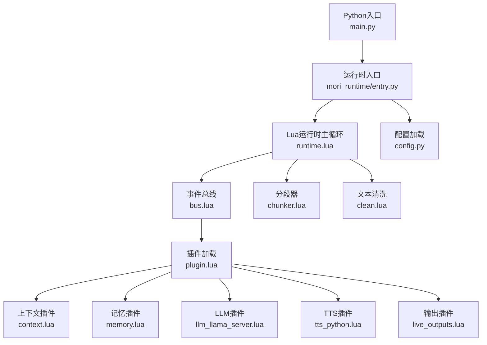
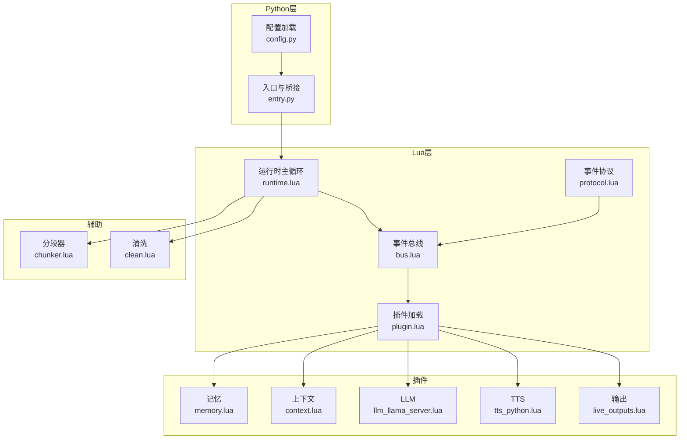
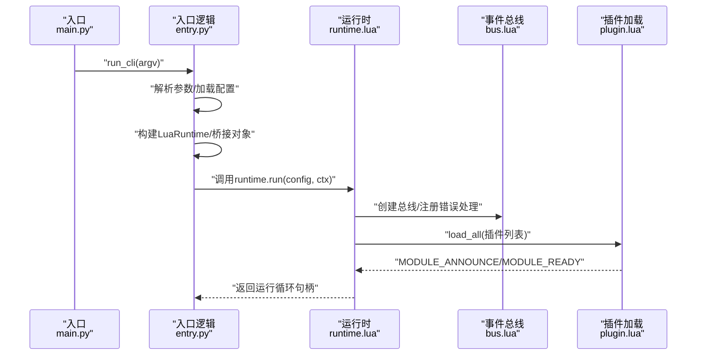
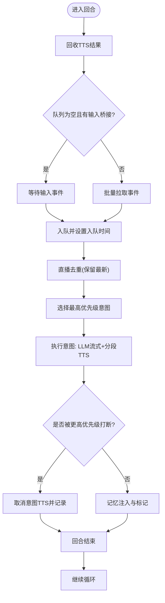
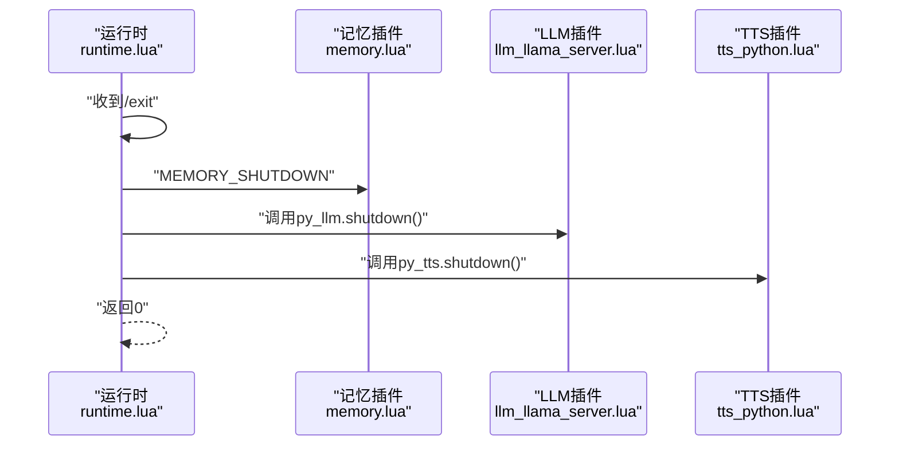
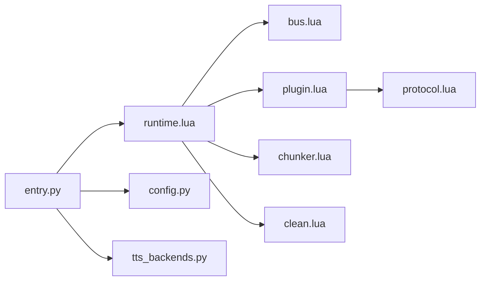

# 运行时生命周期

<cite>
**本文引用的文件**
- [mori_runtime/entry.py](file://mori_runtime/entry.py)
- [mori_runtime/config.py](file://mori_runtime/config.py)
- [mori_runtime/lua/mori/app/runtime.lua](file://mori_runtime/lua/mori/app/runtime.lua)
- [mori_runtime/lua/mori/core/bus.lua](file://mori_runtime/lua/mori/core/bus.lua)
- [mori_runtime/lua/mori/core/plugin.lua](file://mori_runtime/lua/mori/core/plugin.lua)
- [mori_runtime/lua/mori/core/protocol.lua](file://mori_runtime/lua/mori/core/protocol.lua)
- [mori_runtime/lua/mori/plugins/memory.lua](file://mori_runtime/lua/mori/plugins/memory.lua)
- [mori_runtime/lua/mori/plugins/context.lua](file://mori_runtime/lua/mori/plugins/context.lua)
- [mori_runtime/lua/mori/plugins/live_outputs.lua](file://mori_runtime/lua/mori/plugins/live_outputs.lua)
- [mori_runtime/lua/mori/plugins/tts_python.lua](file://mori_runtime/lua/mori/plugins/tts_python.lua)
- [mori_runtime/lua/mori/plugins/llm_llama_server.lua](file://mori_runtime/lua/mori/plugins/llm_llama_server.lua)
- [mori_runtime/lua/mori/speech/chunker.lua](file://mori_runtime/lua/mori/speech/chunker.lua)
- [mori_runtime/lua/mori/text/clean.lua](file://mori_runtime/lua/mori/text/clean.lua)
- [mori_runtime/tts_backends.py](file://mori_runtime/tts_backends.py)
- [main.py](file://main.py)
</cite>

## 目录
1. [简介](#简介)
2. [项目结构](#项目结构)
3. [核心组件](#核心组件)
4. [架构总览](#架构总览)
5. [详细组件分析](#详细组件分析)
6. [依赖分析](#依赖分析)
7. [性能考虑](#性能考虑)
8. [故障排查指南](#故障排查指南)
9. [结论](#结论)
10. [附录](#附录)

## 简介
本文件系统性阐述 Mori 运行时的生命周期管理，覆盖启动流程（初始化顺序、依赖检查、资源分配）、运行阶段（主循环、事件处理、状态管理）、关闭流程（优雅停机、资源清理、进程退出），并提供监控与诊断、容错机制以及扩展点与自定义钩子说明。运行时由 Python 入口驱动，通过 Lua 模块化插件体系实现功能扩展，围绕统一事件总线进行解耦协作。

## 项目结构
- Python 入口与配置
  - 入口脚本负责解析参数、加载配置、构建运行时桥接对象，并启动 Lua 运行时主循环。
  - 配置模块负责从 JSON 加载配置、合并 CLI 默认值、路径解析与相对路径修正。
- Lua 运行时与插件
  - 运行时主程序负责事件循环、意图调度、中断策略、TTS 分段与输出。
  - 插件通过协议事件注册处理器，实现上下文编排、记忆检索、LLM 推理、TTS 合成、实时输出等能力。
- 辅助模块
  - 事件总线提供发布/订阅与调用式回调，确保插件间松耦合。
  - 文本清洗与分段器用于推理文本的可见性处理与语音分片。

图表来源
- [main.py:1-13](file://main.py#L1-L13)
- [mori_runtime/entry.py:796-1084](file://mori_runtime/entry.py#L796-L1084)
- [mori_runtime/lua/mori/app/runtime.lua:543-668](file://mori_runtime/lua/mori/app/runtime.lua#L543-L668)
- [mori_runtime/lua/mori/core/bus.lua:1-95](file://mori_runtime/lua/mori/core/bus.lua#L1-L95)
- [mori_runtime/lua/mori/core/plugin.lua:1-52](file://mori_runtime/lua/mori/core/plugin.lua#L1-L52)
- [mori_runtime/lua/mori/plugins/context.lua:1-90](file://mori_runtime/lua/mori/plugins/context.lua#L1-L90)
- [mori_runtime/lua/mori/plugins/memory.lua:1-30](file://mori_runtime/lua/mori/plugins/memory.lua#L1-L30)
- [mori_runtime/lua/mori/plugins/llm_llama_server.lua:1-25](file://mori_runtime/lua/mori/plugins/llm_llama_server.lua#L1-L25)
- [mori_runtime/lua/mori/plugins/tts_python.lua:1-31](file://mori_runtime/lua/mori/plugins/tts_python.lua#L1-L31)
- [mori_runtime/lua/mori/plugins/live_outputs.lua:1-114](file://mori_runtime/lua/mori/plugins/live_outputs.lua#L1-L114)
- [mori_runtime/lua/mori/speech/chunker.lua:1-157](file://mori_runtime/lua/mori/speech/chunker.lua#L1-L157)
- [mori_runtime/lua/mori/text/clean.lua:1-49](file://mori_runtime/lua/mori/text/clean.lua#L1-L49)
- [mori_runtime/config.py:1-270](file://mori_runtime/config.py#L1-L270)

章节来源
- [main.py:1-13](file://main.py#L1-L13)
- [mori_runtime/entry.py:796-1084](file://mori_runtime/entry.py#L796-L1084)
- [mori_runtime/config.py:188-270](file://mori_runtime/config.py#L188-L270)

## 核心组件
- Python 运行时入口与桥接
  - 构建 LuaRuntime 并注入 Python 桥接对象（inbox、LLM、TTS），启动输入源线程（stdin、Bilibili）。
  - 提供 TTS 任务提交、结果回收、取消等接口，以及 LLM 流式生成桥接。
- Lua 运行时主循环
  - 负责事件循环、意图队列管理、中断策略、LLM 推理、TTS 分段提交与结果回传、记忆注入与输出。
- 事件总线与协议
  - 定义模块生命周期、输入、上下文、记忆、LLM、TTS、输出等事件契约，插件基于事件注册处理器。
- 插件体系
  - 记忆：上下文编译、回合记忆注入、优雅关闭。
  - 上下文：将记忆块拼装为 LLM messages。
  - LLM：桥接 Python 生成流。
  - TTS：桥接 Python 合成引擎，支持并发与取消。
  - 输出：字幕文件、事件日志、标准输出打印。
- 辅助模块
  - 分段器：按标点与长度切分文本，适配语音合成。
  - 文本清洗：移除推理标记与尾部占位符，保证可见文本质量。

章节来源
- [mori_runtime/entry.py:89-412](file://mori_runtime/entry.py#L89-L412)
- [mori_runtime/lua/mori/app/runtime.lua:543-668](file://mori_runtime/lua/mori/app/runtime.lua#L543-L668)
- [mori_runtime/lua/mori/core/bus.lua:1-95](file://mori_runtime/lua/mori/core/bus.lua#L1-L95)
- [mori_runtime/lua/mori/core/protocol.lua:1-35](file://mori_runtime/lua/mori/core/protocol.lua#L1-L35)
- [mori_runtime/lua/mori/plugins/memory.lua:1-30](file://mori_runtime/lua/mori/plugins/memory.lua#L1-L30)
- [mori_runtime/lua/mori/plugins/context.lua:1-90](file://mori_runtime/lua/mori/plugins/context.lua#L1-L90)
- [mori_runtime/lua/mori/plugins/llm_llama_server.lua:1-25](file://mori_runtime/lua/mori/plugins/llm_llama_server.lua#L1-L25)
- [mori_runtime/lua/mori/plugins/tts_python.lua:1-31](file://mori_runtime/lua/mori/plugins/tts_python.lua#L1-L31)
- [mori_runtime/lua/mori/plugins/live_outputs.lua:1-114](file://mori_runtime/lua/mori/plugins/live_outputs.lua#L1-L114)
- [mori_runtime/lua/mori/speech/chunker.lua:1-157](file://mori_runtime/lua/mori/speech/chunker.lua#L1-L157)
- [mori_runtime/lua/mori/text/clean.lua:1-49](file://mori_runtime/lua/mori/text/clean.lua#L1-L49)

## 架构总览
运行时采用“Python 引导 + Lua 主循环 + 插件事件总线”的分层架构。Python 负责外部 I/O、模型与 TTS 引擎初始化、桥接与线程管理；Lua 负责业务主循环、意图调度与事件编排；插件通过协议事件注册处理器，实现模块化扩展。

图表来源
- [mori_runtime/entry.py:796-1084](file://mori_runtime/entry.py#L796-L1084)
- [mori_runtime/config.py:188-270](file://mori_runtime/config.py#L188-L270)
- [mori_runtime/lua/mori/app/runtime.lua:543-668](file://mori_runtime/lua/mori/app/runtime.lua#L543-L668)
- [mori_runtime/lua/mori/core/bus.lua:1-95](file://mori_runtime/lua/mori/core/bus.lua#L1-L95)
- [mori_runtime/lua/mori/core/plugin.lua:1-52](file://mori_runtime/lua/mori/core/plugin.lua#L1-L52)
- [mori_runtime/lua/mori/core/protocol.lua:1-35](file://mori_runtime/lua/mori/core/protocol.lua#L1-L35)
- [mori_runtime/lua/mori/plugins/memory.lua:1-30](file://mori_runtime/lua/mori/plugins/memory.lua#L1-L30)
- [mori_runtime/lua/mori/plugins/context.lua:1-90](file://mori_runtime/lua/mori/plugins/context.lua#L1-L90)
- [mori_runtime/lua/mori/plugins/llm_llama_server.lua:1-25](file://mori_runtime/lua/mori/plugins/llm_llama_server.lua#L1-L25)
- [mori_runtime/lua/mori/plugins/tts_python.lua:1-31](file://mori_runtime/lua/mori/plugins/tts_python.lua#L1-L31)
- [mori_runtime/lua/mori/plugins/live_outputs.lua:1-114](file://mori_runtime/lua/mori/plugins/live_outputs.lua#L1-L114)
- [mori_runtime/lua/mori/speech/chunker.lua:1-157](file://mori_runtime/lua/mori/speech/chunker.lua#L1-L157)
- [mori_runtime/lua/mori/text/clean.lua:1-49](file://mori_runtime/lua/mori/text/clean.lua#L1-L49)

## 详细组件分析

### 启动流程（初始化顺序、依赖检查、资源分配）
- 参数与配置加载
  - 解析命令行参数，自动发现并加载仓库根目录下的配置文件，合并默认值与路径解析。
- Lua 运行时初始化
  - 创建事件总线，加载插件列表（默认包含记忆、上下文、LLM、TTS、输出插件），插件通过协议事件上报状态。
- Python 桥接与外部资源
  - 构建 Inbox（stdin/Bilibili 输入队列）、LLM（MoriPipeline 流式生成桥接）、TTS（ZipVoice/Lux 后端桥接）。
  - 启动输入线程：标准输入读取与 Bilibili 实时轮询，支持断播退出策略。
- 资源分配
  - TTS 使用线程池并发执行，按意图维度跟踪任务与可选取消。
  - LLM 通过生成器流式回调 delta，支持中断检查。

图表来源
- [main.py:1-13](file://main.py#L1-L13)
- [mori_runtime/entry.py:796-1084](file://mori_runtime/entry.py#L796-L1084)
- [mori_runtime/lua/mori/app/runtime.lua:543-668](file://mori_runtime/lua/mori/app/runtime.lua#L543-L668)
- [mori_runtime/lua/mori/core/plugin.lua:13-48](file://mori_runtime/lua/mori/core/plugin.lua#L13-L48)
- [mori_runtime/lua/mori/core/bus.lua:50-70](file://mori_runtime/lua/mori/core/bus.lua#L50-L70)

章节来源
- [mori_runtime/config.py:188-270](file://mori_runtime/config.py#L188-L270)
- [mori_runtime/entry.py:414-580](file://mori_runtime/entry.py#L414-L580)
- [mori_runtime/lua/mori/app/runtime.lua:543-564](file://mori_runtime/lua/mori/app/runtime.lua#L543-L564)

### 运行阶段（主循环、事件处理、状态管理）
- 主循环与意图调度
  - 周期性尝试从 Inbox 获取事件，按优先级与入队时间排序选择下一个意图。
  - 支持直播弹幕去重（保留最新）、中断策略（根据策略与优先级判断是否打断当前意图）。
- LLM 推理与 TTS 分段
  - 将记忆块与用户输入拼装为 messages，调用 LLM 流式生成，边生成边清洗可见文本。
  - 使用分段器将可见文本切分为语音段，异步提交 TTS 任务并持续回收已完成结果。
- 记忆注入与输出
  - 结束回合后将对话内容注入记忆，记录主题变化与去重信息。
  - 输出字幕到文件与标准输出，事件编码写入日志文件。

图表来源
- [mori_runtime/lua/mori/app/runtime.lua:582-650](file://mori_runtime/lua/mori/app/runtime.lua#L582-L650)
- [mori_runtime/lua/mori/speech/chunker.lua:128-153](file://mori_runtime/lua/mori/speech/chunker.lua#L128-L153)
- [mori_runtime/lua/mori/text/clean.lua:16-46](file://mori_runtime/lua/mori/text/clean.lua#L16-L46)

章节来源
- [mori_runtime/lua/mori/app/runtime.lua:98-136](file://mori_runtime/lua/mori/app/runtime.lua#L98-L136)
- [mori_runtime/lua/mori/app/runtime.lua:303-541](file://mori_runtime/lua/mori/app/runtime.lua#L303-L541)

### 关闭流程（优雅停机、资源清理、进程退出）
- 优雅停机
  - 监听退出命令（/exit 或 /quit），进入收尾阶段。
  - 触发记忆模块关闭、LLM 与 TTS 资源释放。
- 资源清理
  - TTS：线程池取消未完成任务并关闭；ZipVoice 后端通过进程通信发送关闭请求并强制终止超时进程。
  - LLM：调用 Pipeline shutdown。
- 进程退出
  - 返回状态码给入口脚本。

图表来源
- [mori_runtime/lua/mori/app/runtime.lua:653-665](file://mori_runtime/lua/mori/app/runtime.lua#L653-L665)
- [mori_runtime/lua/mori/plugins/memory.lua:20-25](file://mori_runtime/lua/mori/plugins/memory.lua#L20-L25)
- [mori_runtime/lua/mori/plugins/llm_llama_server.lua:13-20](file://mori_runtime/lua/mori/plugins/llm_llama_server.lua#L13-L20)
- [mori_runtime/tts_backends.py:729-759](file://mori_runtime/tts_backends.py#L729-L759)

章节来源
- [mori_runtime/lua/mori/app/runtime.lua:639-665](file://mori_runtime/lua/mori/app/runtime.lua#L639-L665)
- [mori_runtime/tts_backends.py:729-759](file://mori_runtime/tts_backends.py#L729-L759)

### 监控与诊断（性能指标、内存使用、错误日志）
- 错误日志
  - 总线错误事件会将处理器异常转为标准错误输出；插件加载失败、无效插件、setup 失败均通过模块错误事件上报。
- 输出与事件
  - 字幕文件与事件日志路径可通过配置指定；最终字幕仅在完整回合结束后写入。
- 性能指标
  - TTS 任务包含创建/完成时间戳与延迟毫秒数，便于统计端到端时延。
- 建议
  - 在生产环境开启事件日志以便回放与分析；结合分段器阈值与中断策略优化吞吐与延迟平衡。

章节来源
- [mori_runtime/lua/mori/core/bus.lua:50-91](file://mori_runtime/lua/mori/core/bus.lua#L50-L91)
- [mori_runtime/lua/mori/core/plugin.lua:13-48](file://mori_runtime/lua/mori/core/plugin.lua#L13-L48)
- [mori_runtime/lua/mori/plugins/live_outputs.lua:63-111](file://mori_runtime/lua/mori/plugins/live_outputs.lua#L63-L111)
- [mori_runtime/lua/mori/app/runtime.lua:222-280](file://mori_runtime/lua/mori/app/runtime.lua#L222-L280)

### 容错机制（异常恢复、降级策略、健康检查）
- 异常恢复
  - 插件加载失败、setup 失败、处理器抛错均通过总线错误事件捕获并记录，避免影响主循环。
  - TTS 提交失败与取消不影响后续回合处理。
- 降级策略
  - 当 TTS 引擎未初始化时，/tts 命令会提示不可用；可切换为关闭状态以避免阻塞。
  - 中断策略支持“从不”、“总是”、“优先级”，可根据负载动态调整。
- 健康检查
  - Bilibili 断播检测：可配置定时检查房间直播状态，离线时自动触发退出事件。
  - LLM/TTS 资源释放：退出时强制关闭，防止僵尸进程与资源泄漏。

章节来源
- [mori_runtime/lua/mori/core/bus.lua:50-91](file://mori_runtime/lua/mori/core/bus.lua#L50-L91)
- [mori_runtime/lua/mori/app/runtime.lua:608-638](file://mori_runtime/lua/mori/app/runtime.lua#L608-L638)
- [mori_runtime/entry.py:538-576](file://mori_runtime/entry.py#L538-L576)

### 扩展点与自定义钩子（启动回调、停止钩子、中间件支持）
- 插件扩展
  - 通过插件加载器注册新模块，遵循约定的 setup 回调与事件处理函数签名。
  - 可新增事件类型与处理器，实现自定义中间件（如鉴权、限流、路由）。
- 生命周期事件
  - 模块声明、就绪、错误事件可用于实现自定义启动回调与停止钩子。
- 自定义钩子建议
  - 在 CONTEXT_COMPOSE 之前插入预处理钩子，在 MEMORY_INGEST_TURN 之后插入后处理钩子。
  - 利用 LLM_STREAM 的 should_abort 回调实现主动中断与降级。

章节来源
- [mori_runtime/lua/mori/core/plugin.lua:13-48](file://mori_runtime/lua/mori/core/plugin.lua#L13-L48)
- [mori_runtime/lua/mori/core/protocol.lua:3-32](file://mori_runtime/lua/mori/core/protocol.lua#L3-L32)
- [mori_runtime/lua/mori/plugins/context.lua:30-86](file://mori_runtime/lua/mori/plugins/context.lua#L30-L86)
- [mori_runtime/lua/mori/plugins/memory.lua:8-25](file://mori_runtime/lua/mori/plugins/memory.lua#L8-L25)

## 依赖分析
- 组件耦合
  - Lua 运行时与插件通过事件协议弱耦合；Python 桥接对象仅在入口处注入，降低跨语言耦合。
  - 事件总线承担消息路由职责，避免循环依赖。
- 外部依赖
  - Lua 运行时依赖 lupa（LuaJIT）与模块搜索路径配置。
  - TTS 后端依赖 ZipVoice/Lux，需正确配置模型与设备参数。
- 潜在风险
  - 插件加载失败不会导致崩溃，但需关注模块错误事件日志。
  - TTS 线程池与 LLM 生成器需在退出时正确关闭，避免资源泄漏。

图表来源
- [mori_runtime/entry.py:414-438](file://mori_runtime/entry.py#L414-L438)
- [mori_runtime/lua/mori/app/runtime.lua:543-668](file://mori_runtime/lua/mori/app/runtime.lua#L543-L668)
- [mori_runtime/lua/mori/core/bus.lua:1-95](file://mori_runtime/lua/mori/core/bus.lua#L1-L95)
- [mori_runtime/lua/mori/core/plugin.lua:1-52](file://mori_runtime/lua/mori/core/plugin.lua#L1-L52)
- [mori_runtime/lua/mori/core/protocol.lua:1-35](file://mori_runtime/lua/mori/core/protocol.lua#L1-L35)
- [mori_runtime/lua/mori/speech/chunker.lua:1-157](file://mori_runtime/lua/mori/speech/chunker.lua#L1-L157)
- [mori_runtime/lua/mori/text/clean.lua:1-49](file://mori_runtime/lua/mori/text/clean.lua#L1-L49)
- [mori_runtime/config.py:1-270](file://mori_runtime/config.py#L1-L270)
- [mori_runtime/tts_backends.py:729-759](file://mori_runtime/tts_backends.py#L729-L759)

章节来源
- [mori_runtime/entry.py:414-438](file://mori_runtime/entry.py#L414-L438)
- [mori_runtime/config.py:188-270](file://mori_runtime/config.py#L188-L270)

## 性能考虑
- 吞吐与延迟
  - 分段器阈值与最小字符数影响 TTS 合成节奏；适当提高最小字符数可减少任务数量但增加单段延迟。
  - 中断策略“优先级”可提升高优消息响应速度，但可能导致频繁打断。
- 资源占用
  - TTS 线程池大小应与 CPU 核心数匹配；ZipVoice/Lux 设备选择影响显存与算力消耗。
  - LLM 上下文长度与预测步数直接影响生成时延，需结合硬件能力调优。
- I/O 与日志
  - 事件日志与字幕文件写入为同步操作，建议在高并发场景下评估磁盘性能。

## 故障排查指南
- 插件加载失败
  - 检查插件是否返回包含 setup 函数的表，查看模块错误事件中的具体原因。
- LLM/TTS 不可用
  - 确认已正确初始化桥接对象；查看 TTS 插件对 ctx.py_tts 的依赖。
- 退出无响应
  - 确认输入线程是否仍在运行；检查 Bilibili 离线检测是否提前触发退出。
- 日志定位
  - 查看标准错误中的 BUS_ERROR 与模块错误事件；启用事件日志以复现问题。

章节来源
- [mori_runtime/lua/mori/core/plugin.lua:13-48](file://mori_runtime/lua/mori/core/plugin.lua#L13-L48)
- [mori_runtime/lua/mori/core/bus.lua:50-91](file://mori_runtime/lua/mori/core/bus.lua#L50-L91)
- [mori_runtime/lua/mori/plugins/tts_python.lua:8-11](file://mori_runtime/lua/mori/plugins/tts_python.lua#L8-L11)
- [mori_runtime/entry.py:538-576](file://mori_runtime/entry.py#L538-L576)

## 结论
Mori 运行时通过清晰的启动流程、事件驱动的主循环、完善的插件体系与健壮的错误处理，实现了从输入到输出的全链路自动化。其模块化设计便于扩展与定制，配合中断策略与资源清理机制，满足生产环境对稳定性与性能的要求。

## 附录
- 关键事件清单
  - 模块：MODULE_ANNOUNCE、MODULE_READY、MODULE_ERROR
  - 输入：INPUT_TEXT
  - 上下文：CONTEXT_COMPOSE
  - 记忆：MEMORY_COMPILE_CONTEXT、MEMORY_INGEST_TURN、MEMORY_SHUTDOWN
  - LLM：LLM_STREAM
  - TTS：TTS_SUBMIT、TTS_DRAIN、TTS_CANCEL_INTENT、TTS_RESULT
  - 输出：OUTPUT_SUBTITLE、OUTPUT_EVENT、OUTPUT_PRINT

章节来源
- [mori_runtime/lua/mori/core/protocol.lua:3-32](file://mori_runtime/lua/mori/core/protocol.lua#L3-L32)