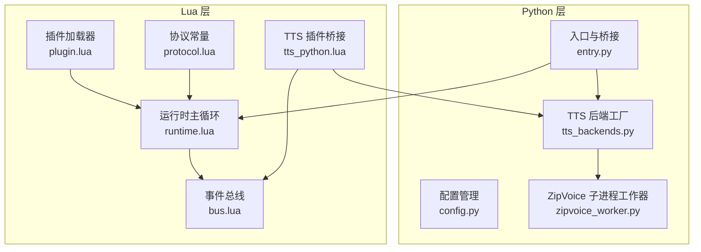
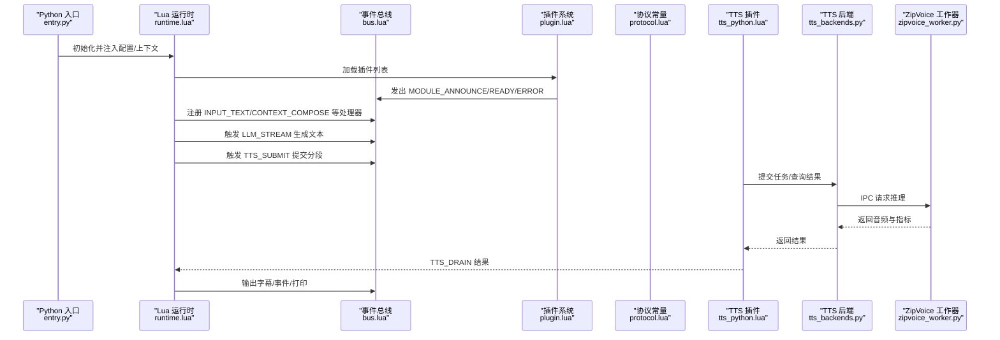
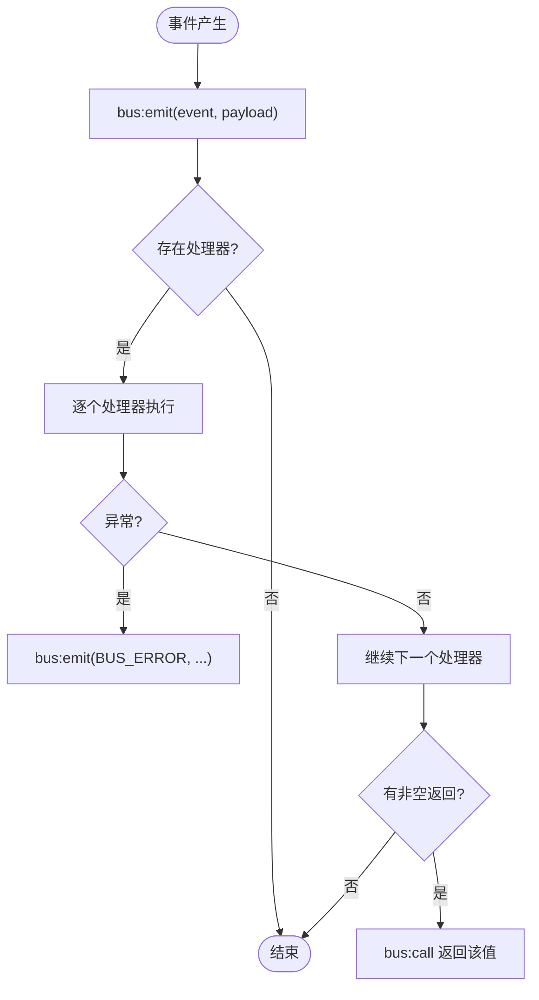
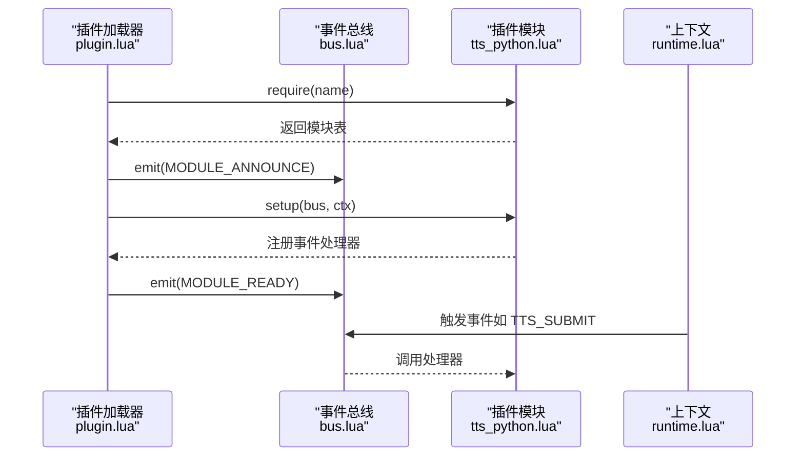
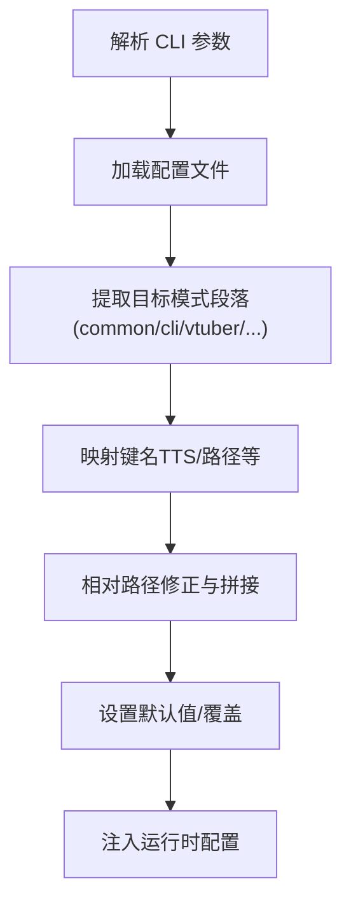
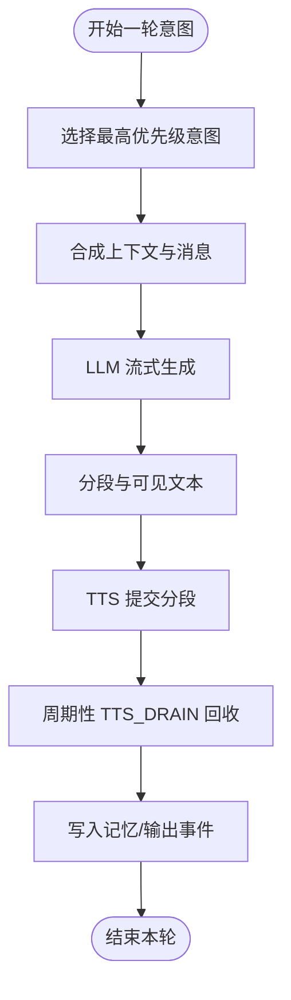
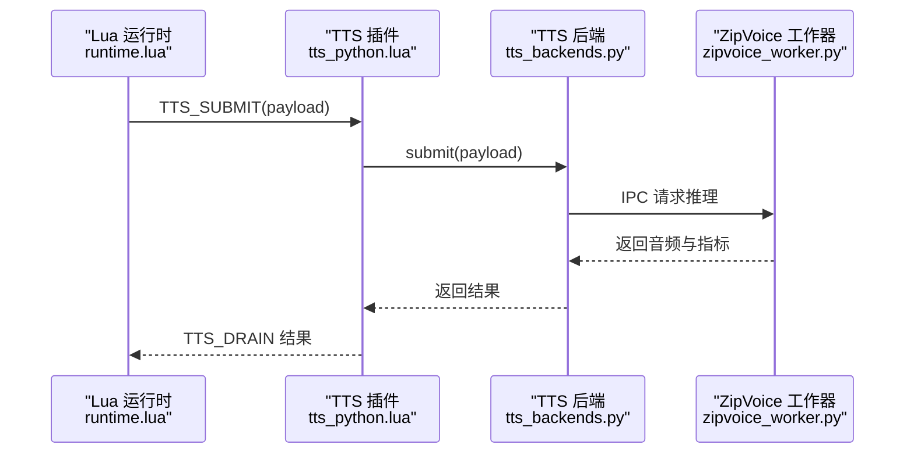
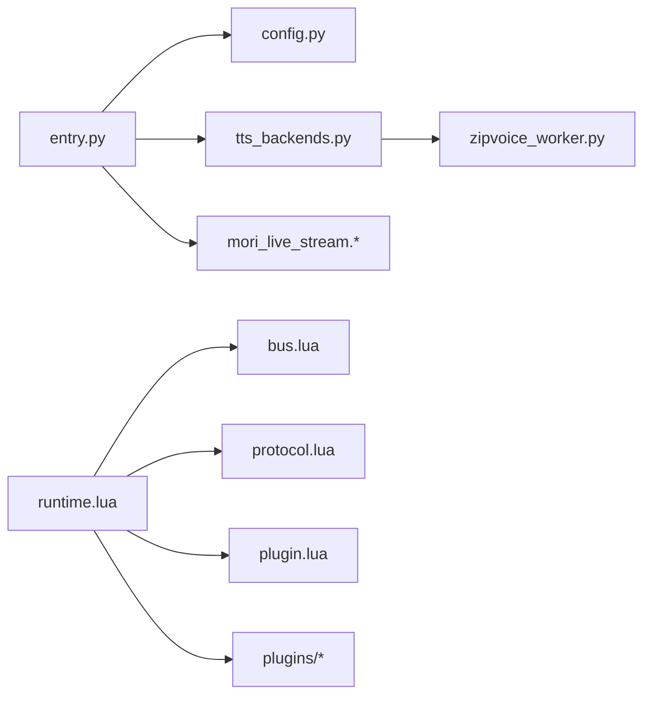

# 运行时系统

<cite>
**本文引用的文件**
- [mori_runtime/entry.py](file://mori_runtime/entry.py)
- [mori_runtime/config.py](file://mori_runtime/config.py)
- [mori_runtime/tts_backends.py](file://mori_runtime/tts_backends.py)
- [mori_runtime/zipvoice_worker.py](file://mori_runtime/zipvoice_worker.py)
- [mori_runtime/lua/mori/app/runtime.lua](file://mori_runtime/lua/mori/app/runtime.lua)
- [mori_runtime/lua/mori/core/bus.lua](file://mori_runtime/lua/mori/core/bus.lua)
- [mori_runtime/lua/mori/core/plugin.lua](file://mori_runtime/lua/mori/core/plugin.lua)
- [mori_runtime/lua/mori/core/protocol.lua](file://mori_runtime/lua/mori/core/protocol.lua)
- [mori_runtime/lua/mori/plugins/tts_python.lua](file://mori_runtime/lua/mori/plugins/tts_python.lua)
</cite>

## 目录
1. [简介](#简介)
2. [项目结构](#项目结构)
3. [核心组件](#核心组件)
4. [架构总览](#架构总览)
5. [详细组件分析](#详细组件分析)
6. [依赖分析](#依赖分析)
7. [性能考虑](#性能考虑)
8. [故障排除指南](#故障排除指南)
9. [结论](#结论)
10. [附录](#附录)

## 简介
本文件系统化梳理 Mori 运行时系统的设计与实现，重点覆盖以下方面：
- 运行时作为应用控制中心的理念与架构模式
- 消息队列系统（Lua 事件总线）的工作原理、消息类型与异步处理
- 插件管理（加载、生命周期、接口规范）
- 配置管理（配置文件解析、参数覆盖、动态配置更新）
- 错误处理策略、日志与监控机制
- 扩展接口与自定义插件开发指南
- 性能监控指标与故障排除方法

## 项目结构
运行时系统由 Python 入口、Lua 运行时与桥接层、TTS 后端与子进程工作器、以及 Lua 事件总线与插件体系构成。整体采用“Python 控制 + Lua 协调 + 插件扩展”的分层设计。

图示来源
- [mori_runtime/entry.py](file://mori_runtime/entry.py)
- [mori_runtime/config.py](file://mori_runtime/config.py)
- [mori_runtime/tts_backends.py](file://mori_runtime/tts_backends.py)
- [mori_runtime/zipvoice_worker.py](file://mori_runtime/zipvoice_worker.py)
- [mori_runtime/lua/mori/app/runtime.lua](file://mori_runtime/lua/mori/app/runtime.lua)
- [mori_runtime/lua/mori/core/bus.lua](file://mori_runtime/lua/mori/core/bus.lua)
- [mori_runtime/lua/mori/core/plugin.lua](file://mori_runtime/lua/mori/core/plugin.lua)
- [mori_runtime/lua/mori/core/protocol.lua](file://mori_runtime/lua/mori/core/protocol.lua)
- [mori_runtime/lua/mori/plugins/tts_python.lua](file://mori_runtime/lua/mori/plugins/tts_python.lua)

章节来源
- [mori_runtime/entry.py](file://mori_runtime/entry.py)
- [mori_runtime/config.py](file://mori_runtime/config.py)
- [mori_runtime/lua/mori/app/runtime.lua](file://mori_runtime/lua/mori/app/runtime.lua)

## 核心组件
- Python 入口与桥接：负责解析 CLI/配置、启动 Lua 运行时、建立 stdin/B站轮询输入队列、桥接 LLM/TTS/音频输出等。
- Lua 运行时主循环：统一调度意图（turn）、上下文合成、LLM 流式生成、TTS 分段提交与结果回传、内存写入与输出事件。
- 事件总线（Lua）：基于字符串事件名的发布/订阅与 call-first 返回机制，提供模块间解耦与可观测性。
- 插件系统：按约定加载模块，统一触发 announce/ready/error 事件，暴露 setup 回调完成注册。
- 配置管理：支持多级配置合并（CLI/配置文件/默认值），路径解析与相对路径修正。
- TTS 后端：支持 ZipVoice 与 Lux 两种后端；ZipVoice 通过独立子进程工作器进行推理，Python 侧负责任务提交与结果回收。

章节来源
- [mori_runtime/entry.py](file://mori_runtime/entry.py)
- [mori_runtime/lua/mori/app/runtime.lua](file://mori_runtime/lua/mori/app/runtime.lua)
- [mori_runtime/lua/mori/core/bus.lua](file://mori_runtime/lua/mori/core/bus.lua)
- [mori_runtime/lua/mori/core/plugin.lua](file://mori_runtime/lua/mori/core/plugin.lua)
- [mori_runtime/lua/mori/core/protocol.lua](file://mori_runtime/lua/mori/core/protocol.lua)
- [mori_runtime/lua/mori/plugins/tts_python.lua](file://mori_runtime/lua/mori/plugins/tts_python.lua)
- [mori_runtime/tts_backends.py](file://mori_runtime/tts_backends.py)
- [mori_runtime/zipvoice_worker.py](file://mori_runtime/zipvoice_worker.py)

## 架构总览
运行时系统以 Lua 主循环为核心，围绕事件总线组织各功能模块。Python 层负责底层资源与外部集成（B站轮询、LLM/TTS、配置与路径解析），Lua 层负责业务编排与交互体验。

图示来源
- [mori_runtime/entry.py](file://mori_runtime/entry.py)
- [mori_runtime/lua/mori/app/runtime.lua](file://mori_runtime/lua/mori/app/runtime.lua)
- [mori_runtime/lua/mori/core/bus.lua](file://mori_runtime/lua/mori/core/bus.lua)
- [mori_runtime/lua/mori/core/plugin.lua](file://mori_runtime/lua/mori/core/plugin.lua)
- [mori_runtime/lua/mori/core/protocol.lua](file://mori_runtime/lua/mori/core/protocol.lua)
- [mori_runtime/lua/mori/plugins/tts_python.lua](file://mori_runtime/lua/mori/plugins/tts_python.lua)
- [mori_runtime/tts_backends.py](file://mori_runtime/tts_backends.py)
- [mori_runtime/zipvoice_worker.py](file://mori_runtime/zipvoice_worker.py)

## 详细组件分析

### 组件一：消息队列系统（Lua 事件总线）
- 设计理念
  - 基于字符串事件名的发布/订阅，支持 call-first 返回首个非空响应，便于“查询型”事件。
  - 统一错误上报（BUS_ERROR），确保异常可追踪。
- 关键流程
  - 订阅：bus:on(event, handler) 注册回调，返回句柄 id。
  - 发布：bus:emit(event, payload) 广播到所有处理器。
  - 调用：bus:call(event, payload) 顺序调用处理器，返回第一个非空结果。
- 异步处理
  - Lua 主循环周期性从 Python 队列拉取事件，排序后选择最高优先级意图执行。
  - TTS 结果通过 TTS_DRAIN 非阻塞回收，避免阻塞主循环。
- 典型事件
  - 输入/上下文/记忆/语音意图/LLM 流式/输出事件等，详见协议常量。

图示来源
- [mori_runtime/lua/mori/core/bus.lua](file://mori_runtime/lua/mori/core/bus.lua)
- [mori_runtime/lua/mori/core/protocol.lua](file://mori_runtime/lua/mori/core/protocol.lua)

章节来源
- [mori_runtime/lua/mori/core/bus.lua](file://mori_runtime/lua/mori/core/bus.lua)
- [mori_runtime/lua/mori/core/protocol.lua](file://mori_runtime/lua/mori/core/protocol.lua)
- [mori_runtime/lua/mori/app/runtime.lua](file://mori_runtime/lua/mori/app/runtime.lua)

### 组件二：插件管理系统
- 接口规范
  - 插件需导出表，包含 setup(bus, ctx) 函数；可选 id/version 字段。
  - 插件加载器会发出 MODULE_ANNOUNCE/MODULE_READY/MODULE_ERROR 事件。
- 生命周期
  - 加载阶段：校验模块与接口，触发 announce/ready/error。
  - 运行阶段：插件在 bus 上注册事件处理器，参与业务编排。
- 示例：TTS 插件桥接 Python TTS 引擎，订阅 TTS_SUBMIT/DRAIN/CANCEL，转发至 ctx.py_tts。

图示来源
- [mori_runtime/lua/mori/core/plugin.lua](file://mori_runtime/lua/mori/core/plugin.lua)
- [mori_runtime/lua/mori/plugins/tts_python.lua](file://mori_runtime/lua/mori/plugins/tts_python.lua)
- [mori_runtime/lua/mori/core/bus.lua](file://mori_runtime/lua/mori/core/bus.lua)

章节来源
- [mori_runtime/lua/mori/core/plugin.lua](file://mori_runtime/lua/mori/core/plugin.lua)
- [mori_runtime/lua/mori/plugins/tts_python.lua](file://mori_runtime/lua/mori/plugins/tts_python.lua)

### 组件三：配置管理系统
- 配置来源与优先级
  - CLI 参数（覆盖默认值）
  - 配置文件（JSON）中的 common/cli/vtuber/love2d/inochi 等段落
  - 默认值（未指定时使用）
- 路径解析
  - 对 workdir/chat_model/embed_model 等路径字段进行相对路径修正与逗号分隔列表处理。
- 动态配置更新
  - 运行时可通过 bus:call/emit 传递配置变更事件（具体取决于插件实现），Lua 主循环根据配置调整行为（如 TTS 开关、中断策略）。

图示来源
- [mori_runtime/config.py](file://mori_runtime/config.py)
- [mori_runtime/entry.py](file://mori_runtime/entry.py)

章节来源
- [mori_runtime/config.py](file://mori_runtime/config.py)
- [mori_runtime/entry.py](file://mori_runtime/entry.py)

### 组件四：运行时主循环与意图执行
- 意图选择与优先级
  - 基于 priority/enqueued_at 排序，选择最高优先级意图。
- 中断策略
  - 支持 never/always/priority 三种策略；当新意图优先级显著高于当前意图时可中断。
- LLM 流式生成
  - 将系统提示、用户输入与上下文合成消息，流式回调增量文本，同时清洗可见文本并分段。
- TTS 提交与回收
  - 分段文本提交至 TTS 插件，周期性 TTS_DRAIN 回收已完成任务，输出事件与字幕。
- 写入记忆与输出
  - 最终清理思维类内容，写入记忆模块，并发出 turn_end 与输出事件。

图示来源
- [mori_runtime/lua/mori/app/runtime.lua](file://mori_runtime/lua/mori/app/runtime.lua)

章节来源
- [mori_runtime/lua/mori/app/runtime.lua](file://mori_runtime/lua/mori/app/runtime.lua)

### 组件五：TTS 后端与 ZipVoice 工作器
- 后端选择
  - 支持 zipvoice 与 lux 两种后端；zipvoice 通过子进程工作器执行推理。
- ZipVoice 工作器
  - 启动时发送 ready 消息，包含设备、采样率、声码器配置等。
  - 支持 prewarm（预热提示特征缓存）与推理请求；返回 RTF、时长等指标。
- Python 侧桥接
  - 提供 submit/drain/cancel_intent 等接口；支持可选语言提示、prompt_key 稳定路由。
- 质量与参数
  - 支持 quality_profile（realtime/balanced/hq）与 num_steps/guidance_scale/t_shift/speed 等参数覆盖。

图示来源
- [mori_runtime/lua/mori/plugins/tts_python.lua](file://mori_runtime/lua/mori/plugins/tts_python.lua)
- [mori_runtime/tts_backends.py](file://mori_runtime/tts_backends.py)
- [mori_runtime/zipvoice_worker.py](file://mori_runtime/zipvoice_worker.py)

章节来源
- [mori_runtime/tts_backends.py](file://mori_runtime/tts_backends.py)
- [mori_runtime/zipvoice_worker.py](file://mori_runtime/zipvoice_worker.py)
- [mori_runtime/lua/mori/plugins/tts_python.lua](file://mori_runtime/lua/mori/plugins/tts_python.lua)

## 依赖分析
- Python 入口依赖
  - mori_llm.pipeline、mori_runtime.config、mori_runtime.tts_backends、mori_tts.lux_tts、mori_live_stream.* 等模块。
- Lua 运行时依赖
  - core.bus、core.protocol、core.plugin、speech.chunker、text.clean、plugins/*。
- 插件依赖
  - 通过 bus 注册事件处理器，彼此通过事件通信，降低耦合。
- TTS 后端依赖
  - ZipVoice 依赖 zipvoice 仓库与模型权重；Lux 依赖外部模型与设备。

图示来源
- [mori_runtime/entry.py](file://mori_runtime/entry.py)
- [mori_runtime/config.py](file://mori_runtime/config.py)
- [mori_runtime/tts_backends.py](file://mori_runtime/tts_backends.py)
- [mori_runtime/zipvoice_worker.py](file://mori_runtime/zipvoice_worker.py)
- [mori_runtime/lua/mori/app/runtime.lua](file://mori_runtime/lua/mori/app/runtime.lua)
- [mori_runtime/lua/mori/core/bus.lua](file://mori_runtime/lua/mori/core/bus.lua)
- [mori_runtime/lua/mori/core/plugin.lua](file://mori_runtime/lua/mori/core/plugin.lua)
- [mori_runtime/lua/mori/core/protocol.lua](file://mori_runtime/lua/mori/core/protocol.lua)

章节来源
- [mori_runtime/entry.py](file://mori_runtime/entry.py)
- [mori_runtime/lua/mori/app/runtime.lua](file://mori_runtime/lua/mori/app/runtime.lua)

## 性能考虑
- 队列与批处理
  - Lua 主循环每轮最多拉取固定数量事件，避免阻塞；TTS_DRAIN 限制批量回收数量。
- 中断策略
  - priority 策略在新意图显著更高时中断当前生成，减少等待时间。
- ZipVoice 推理
  - 通过子进程工作器隔离推理，支持预热提示特征缓存；质量档位（realtime/balanced/hq）与 num_steps/guidance_scale/t_shift/speed 可调。
- I/O 与并发
  - Python 侧使用线程池与队列；ZipVoice 使用独立进程；建议合理设置 num_thread 与采样率以平衡延迟与质量。

## 故障排除指南
- 启动失败
  - 缺少 lupa 依赖：安装依赖后重试。
  - ZipVoice 路径/模型缺失：检查 zipvoice_repo/model_dir/checkpoint_name 等路径是否正确。
- TTS 不可用
  - 确认已启用 TTS 并正确初始化 py_tts；查看输出提示“engine not initialized”。
- 推理异常
  - 查看 BUS_ERROR 事件输出；关注 ZipVoice 工作器退出码与日志。
- 配置问题
  - 检查配置文件路径与键名映射；确认路径解析后实际文件存在。
- 中断策略无效
  - 检查 interrupt_policy 设置与意图优先级；确认新意图确实更高。

章节来源
- [mori_runtime/entry.py](file://mori_runtime/entry.py)
- [mori_runtime/lua/mori/core/bus.lua](file://mori_runtime/lua/mori/core/bus.lua)
- [mori_runtime/lua/mori/app/runtime.lua](file://mori_runtime/lua/mori/app/runtime.lua)
- [mori_runtime/tts_backends.py](file://mori_runtime/tts_backends.py)
- [mori_runtime/zipvoice_worker.py](file://mori_runtime/zipvoice_worker.py)

## 结论
Mori 运行时系统以 Lua 事件总线为核心，结合 Python 桥接与插件扩展，实现了高内聚、低耦合的实时交互系统。其消息队列、插件化与配置管理共同支撑了灵活的业务编排与可扩展的生态。ZipVoice 与 Lux 双后端提供了多样化的 TTS 能力，配合质量档位与参数覆盖，满足不同场景需求。

## 附录

### 扩展接口与自定义插件开发指南
- 插件接口
  - 导出表，包含 setup(bus, ctx)；可选 id/version。
  - 在 setup 中通过 bus:on 订阅/发布事件，参与业务流程。
- 建议事件
  - 输入/上下文/记忆/语音意图/LLM/输出等，参考协议常量。
- 注意事项
  - 处理器内部异常将被转换为 BUS_ERROR；请尽量保证健壮性。
  - 避免长时间阻塞事件处理，必要时拆分为异步任务。

章节来源
- [mori_runtime/lua/mori/core/plugin.lua](file://mori_runtime/lua/mori/core/plugin.lua)
- [mori_runtime/lua/mori/core/protocol.lua](file://mori_runtime/lua/mori/core/protocol.lua)