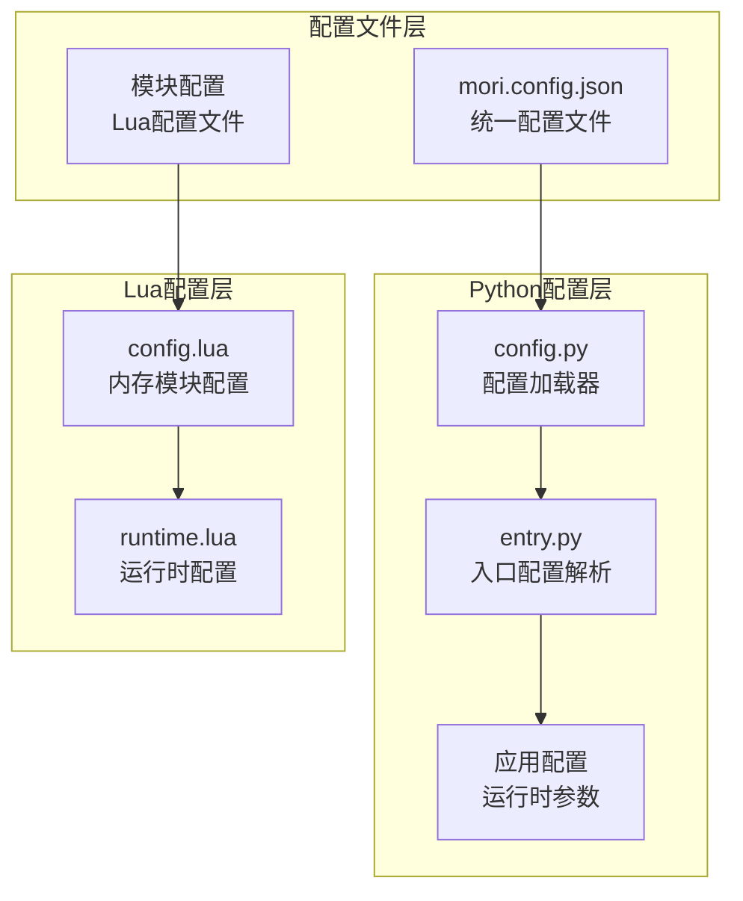
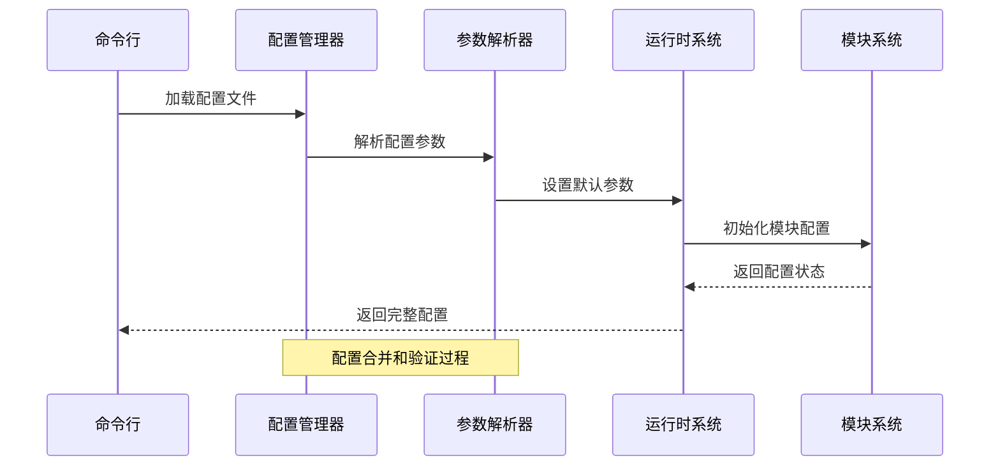
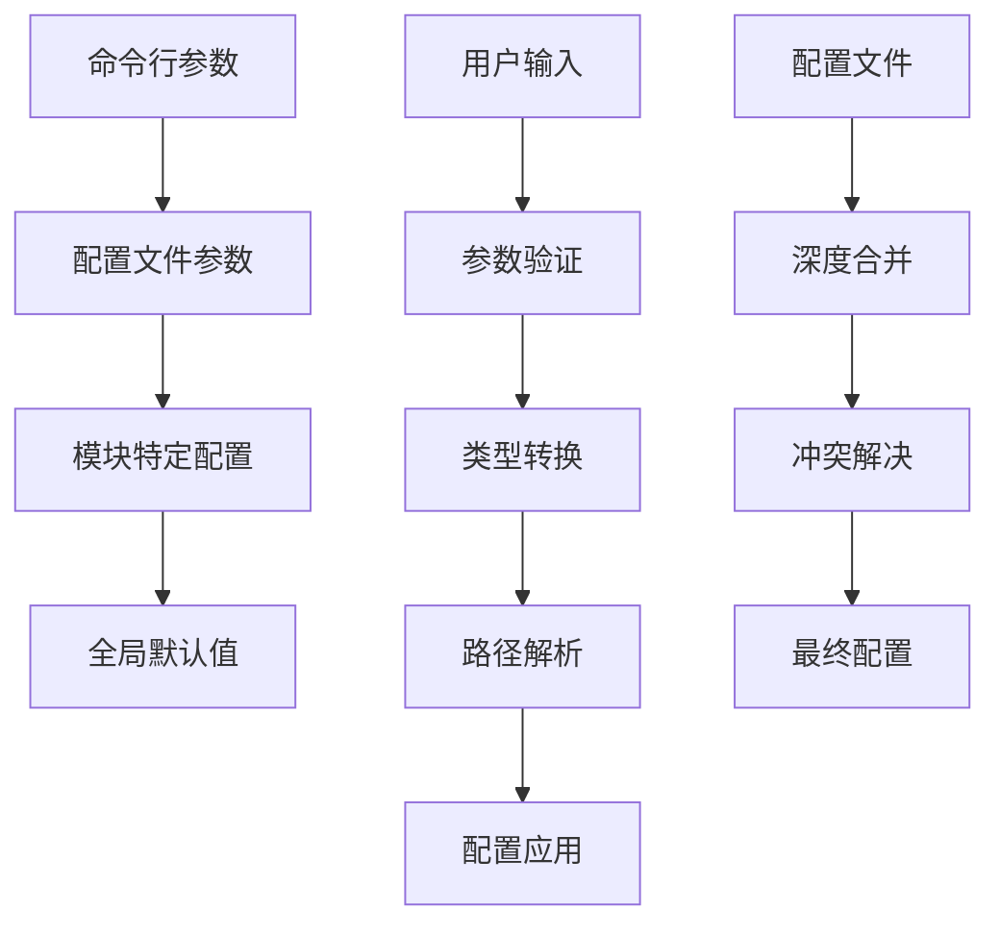
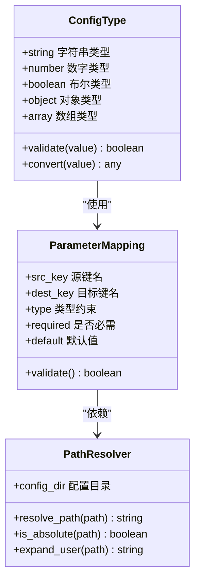
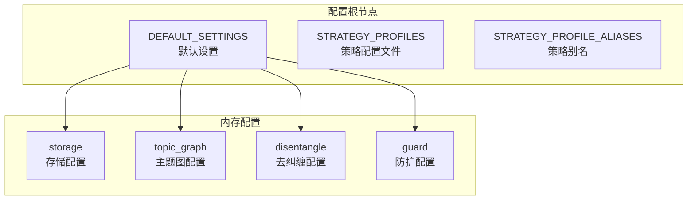
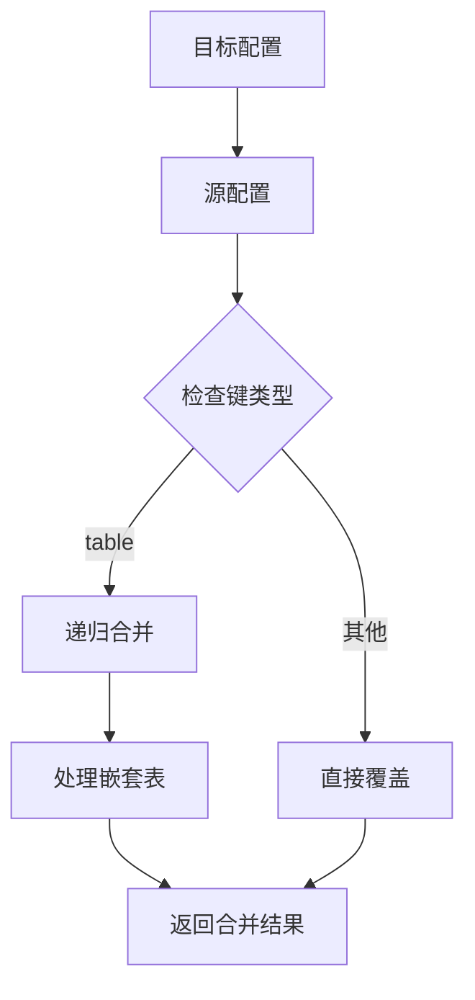
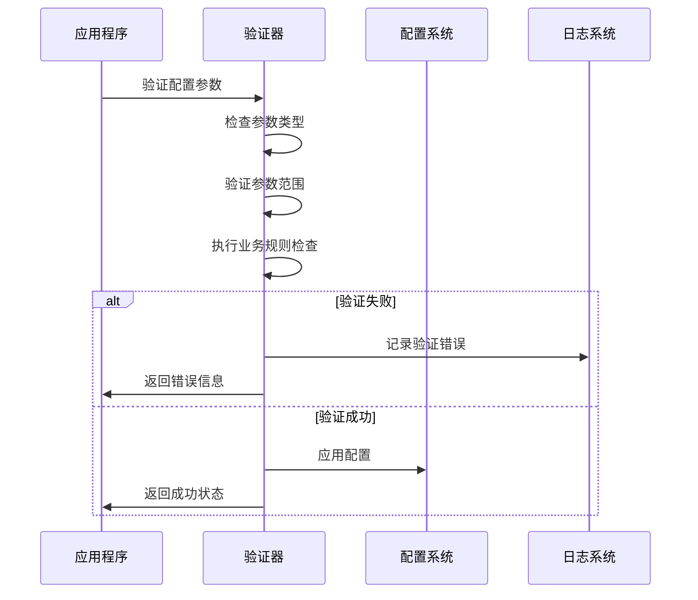
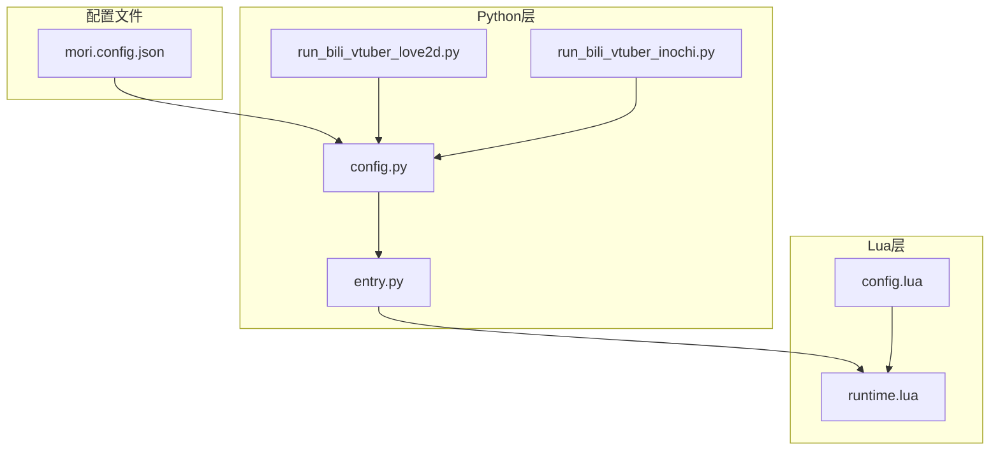

# 配置管理系统

<cite>
**本文档引用的文件**
- [mori.config.json](file://mori.config.json)
- [config.py](file://mori_runtime/config.py)
- [entry.py](file://mori_runtime/entry.py)
- [runtime.lua](file://mori_runtime/lua/mori/app/runtime.lua)
- [config.lua](file://mori_memory/module/config.lua)
- [run_bili_vtuber_love2d.py](file://scripts/run_bili_vtuber_love2d.py)
- [run_bili_vtuber_inochi.py](file://scripts/run_bili_vtuber_inochi.py)
</cite>

## 目录
1. [简介](#简介)
2. [项目结构](#项目结构)
3. [核心组件](#核心组件)
4. [架构概览](#架构概览)
5. [详细组件分析](#详细组件分析)
6. [依赖关系分析](#依赖关系分析)
7. [性能考虑](#性能考虑)
8. [故障排除指南](#故障排除指南)
9. [结论](#结论)

## 简介

Mori配置管理系统是一个多层次、多语言的配置管理框架，支持Python和Lua两种运行时环境。该系统提供了统一的配置文件格式、灵活的配置合并机制和强大的动态配置更新能力。

系统主要特点：
- **多层配置结构**：支持全局配置、模块特定配置和运行时配置的分层管理
- **类型安全**：严格的参数类型验证和转换机制
- **动态更新**：支持配置热重载和参数覆盖
- **跨语言兼容**：Python和Lua双引擎配置系统
- **扩展性**：支持自定义配置源和插件化架构

## 项目结构

配置系统由三个主要层次组成：

**图表来源**
- [mori.config.json:1-83](file://mori.config.json#L1-L83)
- [config.py:188-270](file://mori_runtime/config.py#L188-L270)
- [config.lua:6-497](file://mori_memory/module/config.lua#L6-L497)

**章节来源**
- [mori.config.json:1-83](file://mori.config.json#L1-L83)
- [config.py:1-270](file://mori_runtime/config.py#L1-L270)
- [config.lua:1-680](file://mori_memory/module/config.lua#L1-L680)

## 核心组件

### 统一配置文件 (mori.config.json)

统一配置文件采用JSON格式，包含以下主要部分：

- **版本控制**：通过version字段实现配置版本管理
- **通用配置**：common段落包含LLM模型参数
- **模块配置**：tts、cli、vtuber、love2d、inochi等模块特定配置
- **路径解析**：自动处理相对路径和绝对路径

### Python配置管理器

Python配置管理器提供以下功能：

- **配置发现**：自动查找配置文件位置
- **参数映射**：将JSON配置映射到Python参数
- **路径解析**：处理相对路径依赖于配置文件位置
- **默认值处理**：提供合理的默认参数值

### Lua配置系统

Lua配置系统专注于内存模块管理：

- **深度合并**：支持嵌套配置的深度合并
- **策略配置**：支持不同的运行策略配置
- **路径解析**：统一的路径解析机制
- **运行时调整**：支持运行时配置修改

**章节来源**
- [mori.config.json:1-83](file://mori.config.json#L1-L83)
- [config.py:188-270](file://mori_runtime/config.py#L188-L270)
- [config.lua:604-679](file://mori_memory/module/config.lua#L604-L679)

## 架构概览

配置系统采用分层架构设计，确保各层之间的清晰职责分离：

**图表来源**
- [config.py:239-270](file://mori_runtime/config.py#L239-L270)
- [entry.py:796-830](file://mori_runtime/entry.py#L796-L830)

### 配置优先级和合并规则

配置系统遵循以下优先级顺序：

1. **命令行参数** (最高优先级)
2. **配置文件参数**
3. **模块特定配置**
4. **全局默认值** (最低优先级)

**图表来源**
- [config.py:204-220](file://mori_runtime/config.py#L204-L220)
- [config.py:134-157](file://mori_runtime/config.py#L134-L157)

**章节来源**
- [config.py:204-270](file://mori_runtime/config.py#L204-L270)

## 详细组件分析

### Python配置加载器

Python配置加载器是整个配置系统的核心组件，负责处理所有配置相关的操作。

#### 主要功能

1. **配置文件发现**：自动搜索配置文件位置
2. **参数提取**：从配置文件中提取指定模块的参数
3. **路径解析**：处理相对路径依赖于配置文件位置
4. **默认值设置**：为缺失的参数设置默认值

#### 配置参数类型系统

配置系统支持多种数据类型：

**图表来源**
- [config.py:11-120](file://mori_runtime/config.py#L11-L120)
- [config.py:134-157](file://mori_runtime/config.py#L134-L157)

#### 动态配置更新机制

配置系统支持以下动态更新方式：

1. **参数覆盖**：通过命令行参数覆盖配置文件设置
2. **运行时调整**：某些配置可以在运行时进行调整
3. **热重载**：支持重新加载配置文件而不重启服务

**章节来源**
- [config.py:188-270](file://mori_runtime/config.py#L188-L270)

### Lua配置管理系统

Lua配置系统专门用于内存模块管理，提供了更复杂的配置合并和策略管理功能。

#### 配置结构

Lua配置系统采用深度嵌套的配置结构：

**图表来源**
- [config.lua:6-497](file://mori_memory/module/config.lua#L6-L497)

#### 配置合并算法

Lua配置系统实现了深度合并算法：

**图表来源**
- [config.lua:532-544](file://mori_memory/module/config.lua#L532-L544)

**章节来源**
- [config.lua:512-679](file://mori_memory/module/config.lua#L512-L679)

### 运行时配置管理

运行时配置管理负责在应用程序运行期间处理配置相关的操作。

#### 配置参数验证

运行时系统提供了全面的参数验证机制：

**图表来源**
- [entry.py:880-962](file://mori_runtime/entry.py#L880-L962)

**章节来源**
- [entry.py:832-1084](file://mori_runtime/entry.py#L832-L1084)

## 依赖关系分析

配置系统各组件之间的依赖关系如下：

**图表来源**
- [config.py:1-270](file://mori_runtime/config.py#L1-L270)
- [entry.py:1-1084](file://mori_runtime/entry.py#L1-L1084)
- [config.lua:1-680](file://mori_memory/module/config.lua#L1-L680)

### 耦合度分析

配置系统的耦合度设计遵循以下原则：

- **低内聚高耦合**：配置文件与Python层耦合度适中
- **模块化设计**：Lua配置系统独立于Python配置系统
- **接口契约**：通过明确的接口契约降低耦合度

**章节来源**
- [config.py:1-270](file://mori_runtime/config.py#L1-L270)
- [config.lua:1-680](file://mori_memory/module/config.lua#L1-L680)

## 性能考虑

配置系统在设计时充分考虑了性能因素：

### 配置加载优化

1. **延迟加载**：配置文件只在需要时加载
2. **缓存机制**：已加载的配置文件进行缓存
3. **增量更新**：支持配置的增量更新而非全量重载

### 内存管理

1. **深度复制**：使用深度复制避免配置污染
2. **垃圾回收**：及时释放不再使用的配置对象
3. **内存池**：对频繁使用的配置项进行内存池管理

### 并发处理

1. **线程安全**：配置访问具有线程安全性
2. **锁机制**：在必要时使用适当的锁机制
3. **无锁数据结构**：对于只读配置使用无锁数据结构

## 故障排除指南

### 常见配置问题

#### 配置文件找不到

**症状**：应用程序启动时报错，提示配置文件不存在

**解决方案**：
1. 检查配置文件路径是否正确
2. 确认配置文件权限设置
3. 验证工作目录设置

#### 参数类型不匹配

**症状**：应用程序运行时报参数类型错误

**解决方案**：
1. 检查配置文件中的参数类型
2. 验证命令行参数格式
3. 使用配置验证工具检查配置文件

#### 路径解析错误

**症状**：相对路径解析失败

**解决方案**：
1. 确认配置文件的绝对路径
2. 检查相对路径相对于配置文件的位置
3. 使用绝对路径替代相对路径

### 调试技巧

1. **启用调试模式**：使用详细的日志输出
2. **配置验证**：使用内置的配置验证工具
3. **逐步排查**：从最简单的配置开始逐步添加复杂性

**章节来源**
- [config.py:160-185](file://mori_runtime/config.py#L160-L185)
- [entry.py:880-962](file://mori_runtime/entry.py#L880-L962)

## 结论

Mori配置管理系统是一个设计精良、功能完备的配置管理框架。它通过分层架构、类型安全和动态更新机制，为复杂的多模块应用程序提供了强大的配置管理能力。

### 主要优势

1. **灵活性**：支持多种配置源和动态更新
2. **可靠性**：完善的错误处理和故障恢复机制
3. **可扩展性**：模块化的架构设计便于扩展
4. **易用性**：直观的配置语法和丰富的验证功能

### 未来发展方向

1. **配置加密**：支持敏感配置的加密存储
2. **配置版本控制**：增强配置变更的历史追踪
3. **远程配置源**：支持从远程服务器加载配置
4. **配置模板**：提供配置模板生成功能

该配置系统为Mori项目的稳定运行和持续发展奠定了坚实的基础。