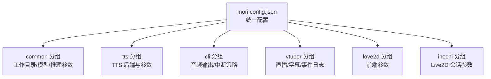
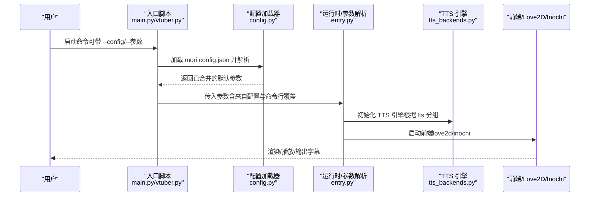
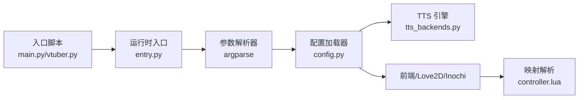
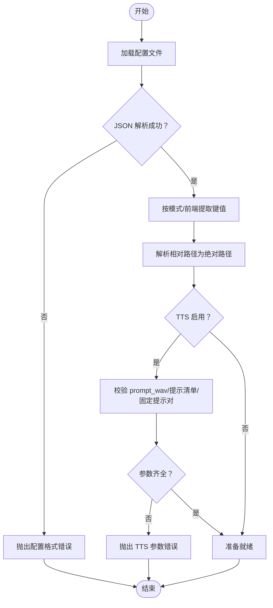

# 配置指南

<cite>
**本文引用的文件**   
- [mori.config.json](file://mori.config.json)
- [mori_runtime/config.py](file://mori_runtime/config.py)
- [mori_runtime/entry.py](file://mori_runtime/entry.py)
- [mori_runtime/tts_backends.py](file://mori_runtime/tts_backends.py)
- [scripts/run_bili_vtuber_love2d.py](file://scripts/run_bili_vtuber_love2d.py)
- [scripts/run_bili_vtuber_inochi.py](file://scripts/run_bili_vtuber_inochi.py)
- [mori_live2d/love2d_frontend/controller.lua](file://mori_live2d/love2d_frontend/controller.lua)
- [vtuber.py](file://vtuber.py)
- [main.py](file://main.py)
</cite>

## 目录
1. [简介](#简介)
2. [项目结构](#项目结构)
3. [核心组件](#核心组件)
4. [架构总览](#架构总览)
5. [详细组件分析](#详细组件分析)
6. [依赖分析](#依赖分析)
7. [性能考虑](#性能考虑)
8. [故障排查指南](#故障排查指南)
9. [结论](#结论)
10. [附录](#附录)

## 简介
本指南面向使用 Mori 的开发者与运营人员，系统讲解统一配置文件 mori.config.json 的结构、字段语义、默认值、取值范围与使用场景，并给出不同使用场景的配置示例（如基础 AI 助手、VTuber 模式、直播集成）。同时阐明配置加载与优先级规则（文件配置、命令行参数、环境变量），介绍配置验证机制与错误处理策略，并提供性能优化建议与配置迁移注意事项。

## 项目结构
Mori 的统一配置通过一个 JSON 文件集中管理，按功能划分为若干配置分组：
- common：通用 LLM 参数与工作目录设置
- tts：文本转语音后端与参数
- cli：命令行工具相关参数
- vtuber：VTuber 流水线参数（B站弹幕、字幕、事件日志等）
- love2d：Love2D 前端参数（TTS 开关、可执行路径、偶像 Puppet、映射文件、鼠标视角等）
- inochi：Inochi Live2D 会话参数（根目录、二进制、X11）

图表来源
- [mori.config.json:1-83](file://mori.config.json#L1-L83)

章节来源
- [mori.config.json:1-83](file://mori.config.json#L1-L83)

## 核心组件
- 配置解析与合并
  - Python 层负责解析 JSON、提取各分组键、进行键名映射、相对路径解析与默认值填充
  - 支持按入口模式（cli/vtuber）与前端配置（love2d/inochi）分别构建默认参数集
- 命令行参数覆盖
  - 所有入口均支持命令行参数覆盖配置文件中的同名参数
- 环境变量
  - Love2D 前端通过环境变量传递 Live 目录、偶像路径、映射路径、鼠标视角等参数

章节来源
- [mori_runtime/config.py:188-270](file://mori_runtime/config.py#L188-L270)
- [mori_runtime/entry.py:582-793](file://mori_runtime/entry.py#L582-L793)
- [scripts/run_bili_vtuber_love2d.py:73-168](file://scripts/run_bili_vtuber_love2d.py#L73-L168)
- [mori_live2d/love2d_frontend/controller.lua:101-186](file://mori_live2d/love2d_frontend/controller.lua#L101-L186)

## 架构总览
统一配置在启动时被加载并映射到不同模块的参数集合中，随后由具体入口（如 CLI、VTuber、Love2D/Inochi 前端）消费。

图表来源
- [main.py:1-13](file://main.py#L1-L13)
- [vtuber.py:1-13](file://vtuber.py#L1-13)
- [mori_runtime/config.py:239-270](file://mori_runtime/config.py#L239-L270)
- [mori_runtime/entry.py:582-793](file://mori_runtime/entry.py#L582-L793)
- [mori_runtime/tts_backends.py:525-650](file://mori_runtime/tts_backends.py#L525-L650)

## 详细组件分析

### common 分组
作用：定义通用推理参数与工作目录，供 CLI、VTuber 等入口共享。
- 字段与默认值要点
  - workdir：工作目录，默认当前目录
  - llama_bin_dir：llama.cpp 二进制目录（用于定位可执行）
  - chat_model/embed_model：聊天/嵌入模型路径（可为空，由运行时自动选择）
  - ctx_size：上下文长度（默认较大值）
  - n_predict：最大生成长度
  - temp/top_p：采样温度与核采样概率
  - system：系统提示词（默认内置中文提示）
- 使用场景
  - 基础 AI 助手：仅启用 LLM 推理，无需 TTS
  - VTuber：作为上游推理参数，影响弹幕理解与回复质量
- 取值范围与注意
  - ctx_size、n_predict 与硬件性能相关，过大可能导致内存压力
  - temp/top_p 控制创造性与稳定性，需结合业务场景调优

章节来源
- [mori.config.json:3-13](file://mori.config.json#L3-L13)
- [mori_runtime/config.py:11-21](file://mori_runtime/config.py#L11-L21)
- [mori_runtime/entry.py:596-601](file://mori_runtime/entry.py#L596-L601)

### tts 分组
作用：统一 TTS 后端与参数，支持 lux 与 zipvoice 两种后端。
- 关键字段与默认值
  - enabled：是否启用 TTS
  - backend：后端选择（默认 zipvoice）
  - model/device/threads：lux 后端参数
  - prompt_wav/prompt_duration/prompt_rms：参考音色参数
  - num_steps/guidance_scale/t_shift/speed：采样与合成参数
  - return_smooth：是否返回平滑输出
  - zipvoice_*：zipvoice 后端专用参数（Python 可执行、仓库路径、模型类型、检查点、分词器、语言标签、固定提示、移除长静音、线程数、语言检测器、最小置信度、提示清单、提示策略、质量档位、vocoder 档位与模型等）
- 使用场景
  - VTuber 模式：启用 TTS 并配置 zipvoice 提升多语言自然度
  - 基础助手：lux 后端快速体验
- 取值范围与注意
  - zipvoice 语言检测器支持 auto/heuristic/lingua
  - 质量档位 realtime/balanced/hq 对应不同的 num_steps/guidance_scale/t_shift
  - prompt_wav 必须存在；zipvoice 模式下需提供 zh/ja 固定提示或提示清单

章节来源
- [mori.config.json:14-51](file://mori.config.json#L14-L51)
- [mori_runtime/config.py:42-83](file://mori_runtime/config.py#L42-L83)
- [mori_runtime/tts_backends.py:17-650](file://mori_runtime/tts_backends.py#L17-L650)

### cli 分组
作用：CLI 工具相关参数。
- 字段与默认值
  - audio_dir：音频输出目录（相对 workdir）
  - interrupt_policy：中断策略（priority/always/never）
- 使用场景
  - 本地测试/批量生成音频时使用

章节来源
- [mori.config.json:52-55](file://mori.config.json#L52-L55)
- [mori_runtime/config.py:23-27](file://mori_runtime/config.py#L23-L27)
- [mori_runtime/entry.py:796-800](file://mori_runtime/entry.py#L796-L800)

### vtuber 分组
作用：VTuber 流水线参数，连接 B站弹幕、字幕、事件日志与 TTS。
- 字段与默认值
  - live_dir：直播数据目录
  - subtitle_file/event_log：字幕与事件日志文件名
  - print_to_stdout：是否打印到标准输出
  - bilibili_*：房间 ID/URL、拉取间隔、Catchup 数、离线退出、离线检查间隔、中断策略
- 使用场景
  - 直播集成：从 B站房间抓取弹幕，生成字幕与事件日志，可选 TTS 输出

章节来源
- [mori.config.json:56-68](file://mori.config.json#L56-L68)
- [mori_runtime/config.py:28-40](file://mori_runtime/config.py#L28-L40)
- [mori_runtime/entry.py:479-580](file://mori_runtime/entry.py#L479-L580)

### love2d 分组
作用：Love2D 前端参数，驱动偶像渲染与口型同步。
- 字段与默认值
  - tts：是否启用 TTS
  - love_bin：Love2D 可执行路径
  - puppet：偶像 Puppet 路径
  - mapping：映射文件路径（.mori-map/.lua）
  - mouse_look：鼠标视角开关
  - skip_prepare：跳过准备步骤（构建/安装示例模型）
- 使用场景
  - VTuber 模式下与 vtuber.py 协同，渲染偶像并播放 TTS 音频

章节来源
- [mori.config.json:69-77](file://mori.config.json#L69-L77)
- [mori_runtime/config.py:85-98](file://mori_runtime/config.py#L85-L98)
- [scripts/run_bili_vtuber_love2d.py:154-167](file://scripts/run_bili_vtuber_love2d.py#L154-L167)

### inochi 分组
作用：Inochi Live2D 会话参数。
- 字段与默认值
  - inochi_root：Inochi 根目录
  - inochi_bin：Inochi 会话二进制路径
  - inochi_x11：是否启用 X11（Linux）
- 使用场景
  - 通过 Inochi 会话运行 Live2D 偶像

章节来源
- [mori.config.json:78-81](file://mori.config.json#L78-L81)
- [mori_runtime/config.py:94-98](file://mori_runtime/config.py#L94-L98)
- [scripts/run_bili_vtuber_inochi.py:182-202](file://scripts/run_bili_vtuber_inochi.py#L182-L202)

## 依赖分析
- 配置加载链路
  - 入口脚本（main.py、vtuber.py）调用运行时入口函数
  - 运行时入口函数构建参数解析器并注册所有 TTS/推理相关参数
  - 配置加载器按模式与前端配置提取键值，进行路径解析与默认值填充
  - 参数最终传入 TTS 引擎与前端模块
- 前端映射
  - Love2D 前端支持从映射文件或 KV 配置加载动作映射，支持大小写与模糊匹配
- 命令行覆盖
  - 所有入口均支持命令行参数覆盖配置文件中的同名参数

图表来源
- [main.py:1-13](file://main.py#L1-L13)
- [vtuber.py:1-13](file://vtuber.py#L1-13)
- [mori_runtime/entry.py:582-793](file://mori_runtime/entry.py#L582-L793)
- [mori_runtime/config.py:239-270](file://mori_runtime/config.py#L239-L270)
- [mori_runtime/tts_backends.py:525-650](file://mori_runtime/tts_backends.py#L525-L650)
- [mori_live2d/love2d_frontend/controller.lua:101-186](file://mori_live2d/love2d_frontend/controller.lua#L101-L186)

章节来源
- [mori_runtime/config.py:160-270](file://mori_runtime/config.py#L160-L270)
- [mori_runtime/entry.py:582-793](file://mori_runtime/entry.py#L582-L793)
- [mori_live2d/love2d_frontend/controller.lua:101-186](file://mori_live2d/love2d_frontend/controller.lua#L101-L186)

## 性能考虑
- LLM 推理
  - ctx_size 与 n_predict 过大将增加显存/CPU 压力，建议按硬件能力逐步调优
  - temp/top_p 影响生成稳定性与速度，建议在演示与生产环境区分配置
- TTS 合成
  - zipvoice 质量档位（realtime/balanced/hq）直接影响 num_steps/guidance_scale/t_shift，实时场景优先 realtime
  - prompt_wav 与 prompt_duration/prompt_rms 影响音色一致性与合成速度
  - num_thread 与 vocoder_profile 会影响吞吐与延迟
- 前端渲染
  - mouse_look 与 mapping 的复杂度会影响帧率，建议在分布式部署中谨慎开启鼠标交互
- 路径与 I/O
  - audio_dir/live_dir/subtitle_file/event_log 等路径建议使用绝对路径或与 workdir 的相对路径，避免运行时解析开销

章节来源
- [mori_runtime/tts_backends.py:393-447](file://mori_runtime/tts_backends.py#L393-L447)
- [mori_runtime/entry.py:596-793](file://mori_runtime/entry.py#L596-L793)

## 故障排查指南
- 配置文件未找到
  - 若显式指定 --config 且文件不存在，将抛出异常；若未指定则尝试在当前目录与仓库根目录查找
- 键名映射错误
  - 配置文件中的键名会映射到运行时参数名，若传入未知参数将被忽略或报错
- TTS 启用但缺少必要参数
  - lux 后端：需要 --tts-prompt-wav
  - zipvoice 后端：需要提示清单或 zh/ja 固定提示对
- 前端资源缺失
  - puppet 不存在或缺少依赖库时会报错；可通过 --skip-prepare 跳过自动准备，但需自行确保环境
- 语言检测与路由
  - zipvoice 语言检测器支持 heuristic/auto/lingua，lingua 需要额外依赖；最小置信度不足时回退到启发式规则

章节来源
- [mori_runtime/config.py:160-201](file://mori_runtime/config.py#L160-L201)
- [mori_runtime/tts_backends.py:525-650](file://mori_runtime/tts_backends.py#L525-L650)
- [scripts/run_bili_vtuber_love2d.py:201-222](file://scripts/run_bili_vtuber_love2d.py#L201-L222)

## 结论
Mori 的统一配置体系以 mori.config.json 为核心，通过清晰的分组与严格的键名映射，将 LLM、TTS、VTuber、前端渲染等模块有机串联。遵循本文的配置结构、优先级与验证规则，可在不同场景下快速搭建稳定可靠的 AI 助手与 VTuber 流水线。

## 附录

### 配置优先级与覆盖顺序
- 默认加载顺序
  - 1) 命令行参数（最高优先级）
  - 2) 配置文件（mori.config.json）
  - 3) 环境变量（Love2D 前端）
- 说明
  - 命令行参数可覆盖配置文件中的任意键
  - 环境变量仅影响前端（如 MORI_LIVE_DIR/MORI_PUPPET_PATH/MORI_MAPPING_PATH/MORI_MOUSE_LOOK）
  - 配置文件中的相对路径会在加载后解析为绝对路径

章节来源
- [mori_runtime/config.py:239-270](file://mori_runtime/config.py#L239-L270)
- [scripts/run_bili_vtuber_love2d.py:235-249](file://scripts/run_bili_vtuber_love2d.py#L235-L249)

### 配置验证与错误处理流程

图表来源
- [mori_runtime/config.py:188-201](file://mori_runtime/config.py#L188-L201)
- [mori_runtime/tts_backends.py:525-650](file://mori_runtime/tts_backends.py#L525-L650)

### 使用场景配置示例（路径指引）
- 基础 AI 助手
  - 设置 common.chat_model/common.embed_model 与 common.ctx_size/n_predict/system
  - 如需 TTS，启用 tts.enabled 并配置 lux 后端的 prompt_wav
  - 参考路径
    - [mori.config.json:3-13](file://mori.config.json#L3-L13)
    - [mori.config.json:14-51](file://mori.config.json#L14-L51)
- VTuber 模式（B站直播）
  - 配置 vtuber.bilibili_room_id 或 bilibili_room_url、live_dir、subtitle_file、event_log
  - 启用 tts 并配置 zipvoice 的提示清单或 zh/ja 固定提示对
  - 参考路径
    - [mori.config.json:56-68](file://mori.config.json#L56-L68)
    - [mori.config.json:14-51](file://mori.config.json#L14-L51)
- Love2D 前端
  - 配置 love2d.puppet、love2d.mapping、love2d.mouse_look
  - 通过环境变量 MORI_LIVE_DIR/MORI_PUPPET_PATH/MORI_MAPPING_PATH/MORI_MOUSE_LOOK 注入运行时参数
  - 参考路径
    - [mori.config.json:69-77](file://mori.config.json#L69-L77)
    - [mori_live2d/love2d_frontend/controller.lua:101-186](file://mori_live2d/love2d_frontend/controller.lua#L101-L186)

### 配置迁移与版本兼容
- 版本号
  - 配置文件包含 version 字段，用于未来版本的兼容性检查与迁移策略
- 迁移建议
  - 新增字段：建议保留旧字段并提供默认值，避免破坏既有配置
  - 键名变更：通过配置加载器的键映射表（如 _TTS_KEY_MAP）保持向后兼容
  - 路径变更：使用相对路径解析逻辑，确保跨平台兼容
- 参考路径
  - [mori.config.json:2](file://mori.config.json#L2)
  - [mori_runtime/config.py:42-83](file://mori_runtime/config.py#L42-L83)
  - [mori_runtime/config.py:134-157](file://mori_runtime/config.py#L134-L157)