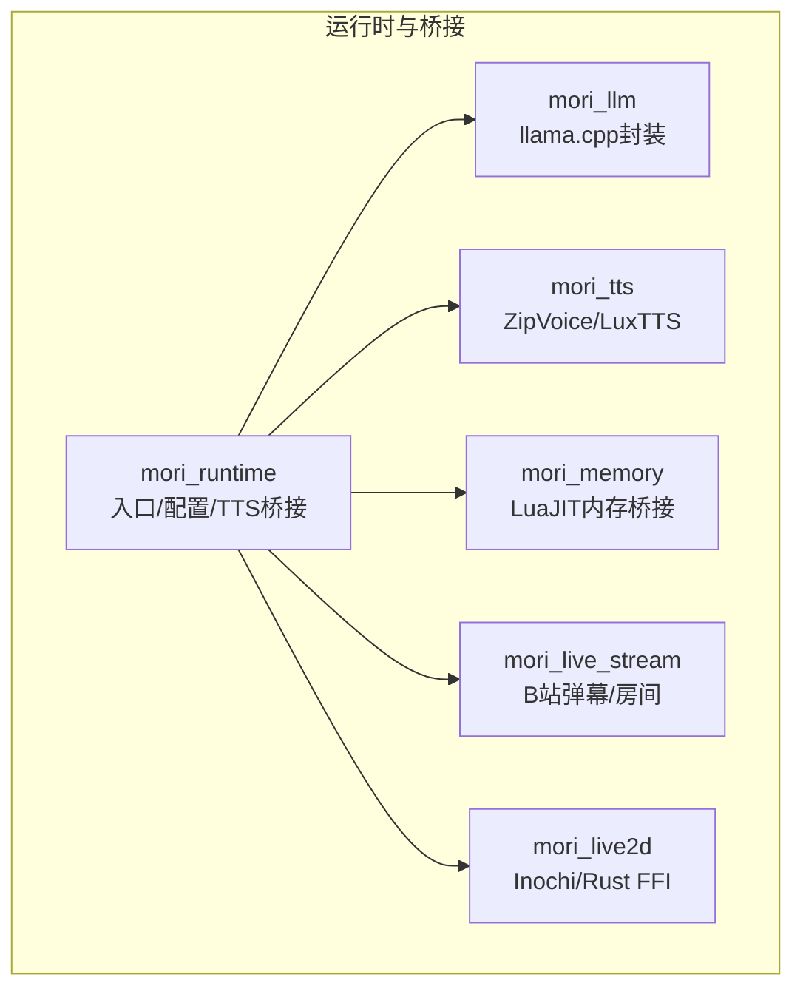
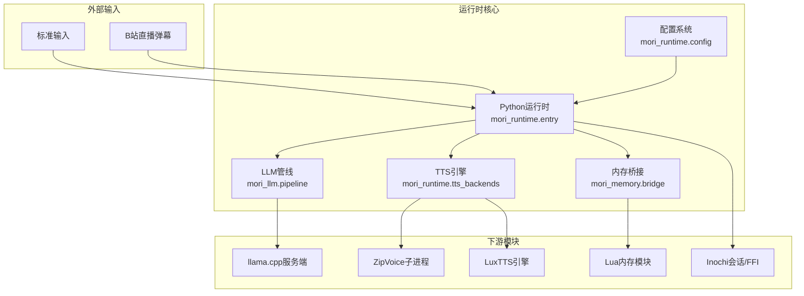
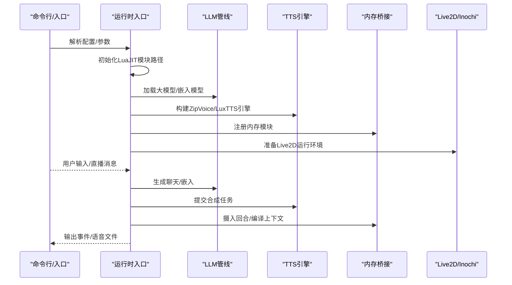
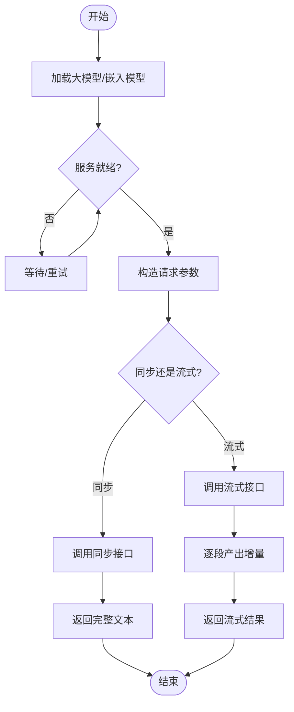
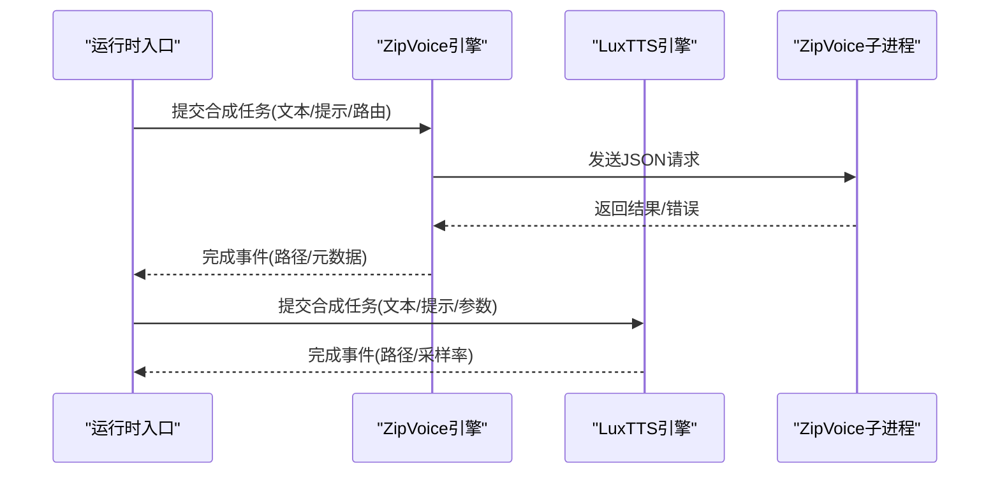
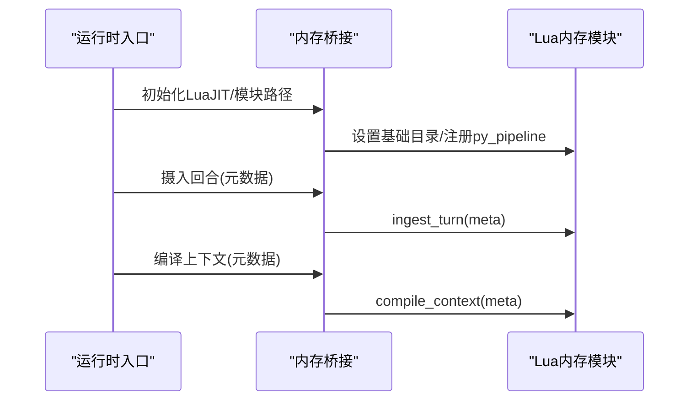
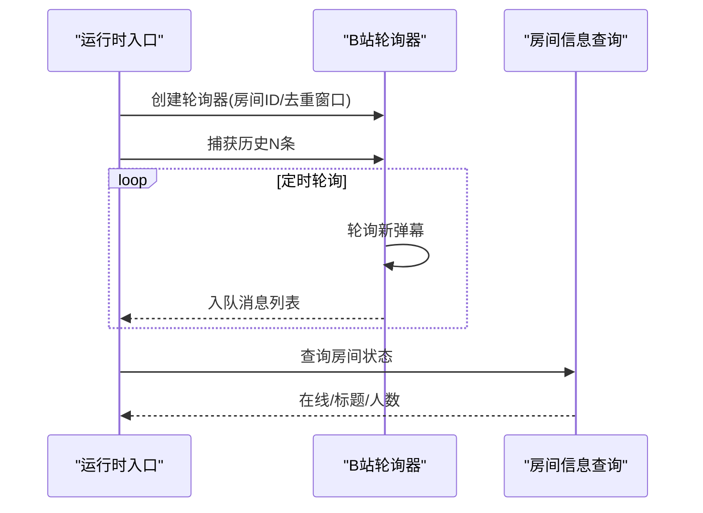
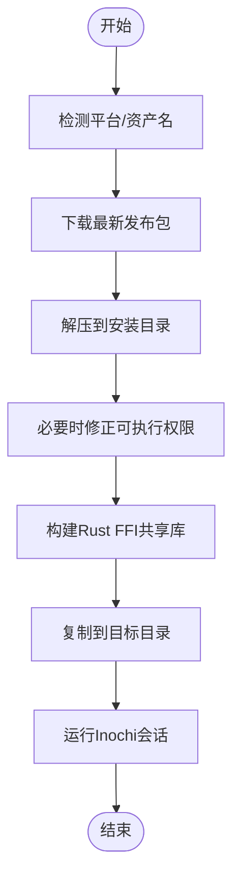
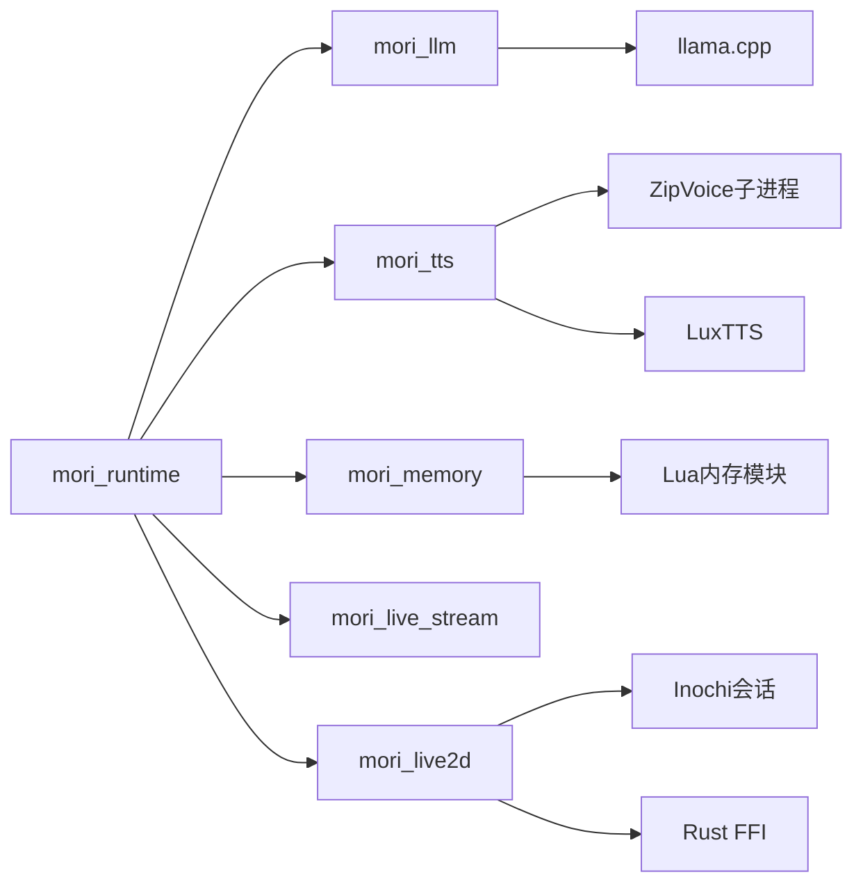

# 技术架构概览

<cite>
**本文档引用的文件**
- [mori_runtime/entry.py](file://mori_runtime/entry.py)
- [mori_runtime/config.py](file://mori_runtime/config.py)
- [mori_runtime/tts_backends.py](file://mori_runtime/tts_backends.py)
- [mori_llm/pipeline.py](file://mori_llm/pipeline.py)
- [mori_llm/llama_cpp_cli.py](file://mori_llm/llama_cpp_cli.py)
- [mori_memory/bridge.py](file://mori_memory/bridge.py)
- [mori_live_stream/bilibili_live.py](file://mori_live_stream/bilibili_live.py)
- [mori_live_stream/bilibili_room.py](file://mori_live_stream/bilibili_room.py)
- [mori_live2d/inox2d_runtime.py](file://mori_live2d/inox2d_runtime.py)
- [mori_live2d/inochi_session.py](file://mori_live2d/inochi_session.py)
- [mori_tts/lux_tts.py](file://mori_tts/lux_tts.py)
</cite>

## 目录
1. [引言](#引言)
2. [项目结构](#项目结构)
3. [核心组件](#核心组件)
4. [架构总览](#架构总览)
5. [详细组件分析](#详细组件分析)
6. [依赖关系分析](#依赖关系分析)
7. [性能考虑](#性能考虑)
8. [故障排除指南](#故障排除指南)
9. [结论](#结论)

## 引言
本文件面向Mori系统的整体技术架构，围绕monorepo设计与多语言技术栈（Python、LuaJIT、Rust、Love2D）展开，系统性阐述各模块职责、相互依赖与数据流，重点覆盖以下方面：
- mori_runtime：核心运行时与桥接层，负责统一调度与进程间通信
- mori_memory：基于LuaJIT的内存系统，提供检索增强与上下文编译
- mori_llm：本地大模型推理（llama.cpp），支持同步/流式生成
- mori_tts：语音合成，支持ZipVoice与LuxTTS两种后端
- mori_live_stream：直播弹幕采集与房间状态查询
- mori_live2d：Live2D渲染与Inochi会话管理，结合Rust FFI

目标是帮助开发者快速理解系统边界、组件交互与扩展点。

## 项目结构
Mori采用monorepo组织方式，按功能域划分模块，每个模块自包含其Python桥接、Lua实现与原生扩展（如Rust）。核心目录如下：
- mori_runtime：运行时入口、配置解析、TTS后端选择与桥接
- mori_memory：LuaJIT内存核心桥接与调用
- mori_llm：llama.cpp服务/CLI封装与推理管线
- mori_tts：ZipVoice子进程与LuxTTS引擎
- mori_live_stream：B站弹幕轮询与房间信息查询
- mori_live2d：Inochi会话安装/运行与Rust FFI构建

图表来源
- [mori_runtime/entry.py:414-438](file://mori_runtime/entry.py#L414-L438)
- [mori_runtime/config.py:204-236](file://mori_runtime/config.py#L204-L236)
- [mori_memory/bridge.py:7-34](file://mori_memory/bridge.py#L7-L34)
- [mori_llm/pipeline.py:307-354](file://mori_llm/pipeline.py#L307-L354)
- [mori_tts/lux_tts.py:65-97](file://mori_tts/lux_tts.py#L65-L97)
- [mori_live_stream/bilibili_live.py:93-146](file://mori_live_stream/bilibili_live.py#L93-L146)
- [mori_live2d/inox2d_runtime.py:32-62](file://mori_live2d/inox2d_runtime.py#L32-L62)

章节来源
- [mori_runtime/entry.py:414-438](file://mori_runtime/entry.py#L414-L438)
- [mori_runtime/config.py:204-236](file://mori_runtime/config.py#L204-L236)

## 核心组件
- 运行时入口与桥接
  - 负责加载LuaJIT模块路径、启动TTS引擎、构建LLM推理管线、拉起直播线程与标准输入读取线程，以及消息入队/出队与回调桥接
  - 关键职责：统一参数解析、工作目录与模型路径解析、TTS后端选择、LLM服务生命周期管理
- 配置系统
  - 支持从JSON配置文件加载通用参数、TTS参数、CLI/VTuber模式参数，并进行相对路径解析与默认值注入
- 内存系统桥接
  - 通过LuaJIT运行时加载Lua内存模块，提供“摄入回合”与“编译上下文”的接口
- LLM推理管线
  - 封装llama.cpp服务端与CLI，提供同步/流式聊天生成与向量嵌入能力
- TTS后端
  - ZipVoice：以子进程形式运行ZipVoice推理，支持多语言路由与提示词池
  - LuxTTS：PyTorch后端，支持设备自动选择与提示编码缓存
- 直播采集
  - B站弹幕轮询与房间状态查询，支持捕获历史消息与离线退出策略
- Live2D渲染
  - Inochi会话安装/运行与Rust FFI构建，为Love2D/Live2D前端提供底层支撑

章节来源
- [mori_runtime/entry.py:1-1084](file://mori_runtime/entry.py#L1-L1084)
- [mori_runtime/config.py:1-270](file://mori_runtime/config.py#L1-L270)
- [mori_memory/bridge.py:1-43](file://mori_memory/bridge.py#L1-L43)
- [mori_llm/pipeline.py:1-582](file://mori_llm/pipeline.py#L1-L582)
- [mori_tts/lux_tts.py:1-171](file://mori_tts/lux_tts.py#L1-L171)
- [mori_live_stream/bilibili_live.py:1-221](file://mori_live_stream/bilibili_live.py#L1-L221)
- [mori_live2d/inochi_session.py:1-103](file://mori_live2d/inochi_session.py#L1-L103)
- [mori_live2d/inox2d_runtime.py:1-64](file://mori_live2d/inox2d_runtime.py#L1-L64)

## 架构总览
下图展示Mori系统的核心组件与交互关系，突出数据流与控制流：

图表来源
- [mori_runtime/entry.py:414-438](file://mori_runtime/entry.py#L414-L438)
- [mori_runtime/config.py:204-236](file://mori_runtime/config.py#L204-L236)
- [mori_llm/pipeline.py:307-354](file://mori_llm/pipeline.py#L307-L354)
- [mori_runtime/tts_backends.py:525-649](file://mori_runtime/tts_backends.py#L525-L649)
- [mori_memory/bridge.py:7-34](file://mori_memory/bridge.py#L7-L34)

## 详细组件分析

### 组件A：运行时入口与桥接（mori_runtime）
- 角色定位
  - Python侧主控：解析配置、构建LuaJIT运行时、注册模块路径、启动TTS/LLM、拉起直播与stdin线程
  - 桥接层：将Python对象映射为Lua可识别的表结构，实现双向数据传递
- 关键流程
  - 初始化LuaJIT并追加模块搜索路径（mori_runtime、mori_memory、mori_live_stream）
  - 启动stdin与B站直播线程，将消息入队至共享队列
  - 构建LLM推理管线与TTS引擎，暴露同步/流式生成与语音合成接口
  - 提供任务提交/完成轮询与意图级取消能力
- 数据流
  - 输入：用户输入、直播弹幕、配置参数
  - 处理：LLM生成、TTS合成、内存摄入/上下文编译
  - 输出：语音文件、日志事件、Live2D驱动信号

图表来源
- [mori_runtime/entry.py:414-438](file://mori_runtime/entry.py#L414-L438)
- [mori_runtime/entry.py:479-579](file://mori_runtime/entry.py#L479-L579)
- [mori_runtime/entry.py:146-188](file://mori_runtime/entry.py#L146-L188)
- [mori_runtime/entry.py:203-412](file://mori_runtime/entry.py#L203-L412)

章节来源
- [mori_runtime/entry.py:414-438](file://mori_runtime/entry.py#L414-L438)
- [mori_runtime/entry.py:479-579](file://mori_runtime/entry.py#L479-L579)
- [mori_runtime/entry.py:146-188](file://mori_runtime/entry.py#L146-L188)
- [mori_runtime/entry.py:203-412](file://mori_runtime/entry.py#L203-L412)

### 组件B：LLM集成（mori_llm）
- 角色定位
  - 通过llama.cpp服务端提供同步/流式聊天生成与向量嵌入
  - 通过CLI封装提供轻量嵌入执行路径
- 关键流程
  - 解析llama.cpp二进制路径，启动服务端进程并等待健康检查
  - 构造聊天请求参数（max_tokens、temperature、top_p、stop、seed等）
  - 流式返回增量token，支持中断与异常处理
  - 嵌入模式下对输入文本进行前缀规范化与向量归一化
- 性能与可靠性
  - GPU层参数可配置，支持草稿模型加速
  - 超时与重试策略，避免阻塞

图表来源
- [mori_llm/pipeline.py:405-431](file://mori_llm/pipeline.py#L405-L431)
- [mori_llm/pipeline.py:519-573](file://mori_llm/pipeline.py#L519-L573)
- [mori_llm/llama_cpp_cli.py:26-56](file://mori_llm/llama_cpp_cli.py#L26-L56)

章节来源
- [mori_llm/pipeline.py:1-582](file://mori_llm/pipeline.py#L1-L582)
- [mori_llm/llama_cpp_cli.py:1-248](file://mori_llm/llama_cpp_cli.py#L1-L248)

### 组件C：TTS后端（mori_runtime.tts_backends 与 mori_tts/lux_tts）
- 角色定位
  - ZipVoice：独立子进程推理，支持中日语言路由、提示词池与质量档位
  - LuxTTS：PyTorch后端，支持设备自动选择与提示编码缓存
- 关键流程
  - ZipVoice：启动子进程，约定JSON协议通信，按路由选择提示词，执行推理并输出wav
  - LuxTTS：预编码提示音频，多线程安全生成，写入48kHz wav
- 配置与路由
  - ZipVoice支持多种检测模式（启发式/语言学库）、提示词清单、轮询策略与质量档位
  - LuxTTS支持设备选择、步数、引导强度、速度与平滑输出

图表来源
- [mori_runtime/tts_backends.py:525-649](file://mori_runtime/tts_backends.py#L525-L649)
- [mori_runtime/tts_backends.py:761-800](file://mori_runtime/tts_backends.py#L761-L800)
- [mori_tts/lux_tts.py:132-171](file://mori_tts/lux_tts.py#L132-L171)

章节来源
- [mori_runtime/tts_backends.py:1-1171](file://mori_runtime/tts_backends.py#L1-L1171)
- [mori_tts/lux_tts.py:1-171](file://mori_tts/lux_tts.py#L1-L171)

### 组件D：内存系统桥接（mori_memory）
- 角色定位
  - 通过LuaJIT运行时加载Lua内存模块，提供摄入回合与编译上下文接口
- 关键流程
  - 初始化LuaJIT并设置模块路径
  - 注入Python侧pipeline对象到Lua全局
  - 调用内存模块的摄入与上下文编译函数

图表来源
- [mori_memory/bridge.py:7-34](file://mori_memory/bridge.py#L7-L34)

章节来源
- [mori_memory/bridge.py:1-43](file://mori_memory/bridge.py#L1-L43)

### 组件E：直播采集（mori_live_stream）
- 角色定位
  - B站弹幕轮询与房间状态查询，支持捕获历史消息与离线退出
- 关键流程
  - 初始化LuaJIT并加载Lua侧轮询模块
  - 拉起后台线程定时轮询，去重并入队消息
  - 提供房间信息查询与在线状态判断

图表来源
- [mori_live_stream/bilibili_live.py:93-146](file://mori_live_stream/bilibili_live.py#L93-L146)
- [mori_live_stream/bilibili_live.py:177-205](file://mori_live_stream/bilibili_live.py#L177-L205)
- [mori_live_stream/bilibili_room.py:93-136](file://mori_live_stream/bilibili_room.py#L93-L136)

章节来源
- [mori_live_stream/bilibili_live.py:1-221](file://mori_live_stream/bilibili_live.py#L1-L221)
- [mori_live_stream/bilibili_room.py:1-141](file://mori_live_stream/bilibili_room.py#L1-L141)

### 组件F：Live2D渲染（mori_live2d）
- 角色定位
  - Inochi会话安装/运行与Rust FFI构建，为Love2D/Live2D前端提供底层支撑
- 关键流程
  - 自动下载/解压Inochi会话可执行文件
  - 构建Rust cdylib并复制到指定目录
  - 运行Inochi会话，支持平台差异与环境变量

图表来源
- [mori_live2d/inochi_session.py:48-81](file://mori_live2d/inochi_session.py#L48-L81)
- [mori_live2d/inox2d_runtime.py:32-62](file://mori_live2d/inox2d_runtime.py#L32-L62)

章节来源
- [mori_live2d/inochi_session.py:1-103](file://mori_live2d/inochi_session.py#L1-L103)
- [mori_live2d/inox2d_runtime.py:1-64](file://mori_live2d/inox2d_runtime.py#L1-L64)

## 依赖关系分析
- 模块内聚与耦合
  - mori_runtime作为中枢，向上游提供统一接口，向下游分发任务
  - mori_memory、mori_llm、mori_tts、mori_live_stream、mori_live2d均为松耦合插件式模块
- 外部依赖
  - LuaJIT：用于运行Lua模块与桥接
  - llama.cpp：本地推理服务端/CLI
  - ZipVoice：独立Python子进程推理
  - LuxTTS：PyTorch后端
  - Inochi2D：Live2D会话与Rust FFI
- 可能的循环依赖
  - 当前结构以Python运行时为核心，其他模块均通过桥接调用，未见循环依赖迹象

图表来源
- [mori_runtime/entry.py:414-438](file://mori_runtime/entry.py#L414-L438)
- [mori_llm/pipeline.py:307-354](file://mori_llm/pipeline.py#L307-L354)
- [mori_runtime/tts_backends.py:525-649](file://mori_runtime/tts_backends.py#L525-L649)
- [mori_memory/bridge.py:7-34](file://mori_memory/bridge.py#L7-L34)
- [mori_live2d/inochi_session.py:84-102](file://mori_live2d/inochi_session.py#L84-L102)

章节来源
- [mori_runtime/entry.py:414-438](file://mori_runtime/entry.py#L414-L438)
- [mori_llm/pipeline.py:307-354](file://mori_llm/pipeline.py#L307-L354)
- [mori_runtime/tts_backends.py:525-649](file://mori_runtime/tts_backends.py#L525-L649)
- [mori_memory/bridge.py:7-34](file://mori_memory/bridge.py#L7-L34)
- [mori_live2d/inochi_session.py:84-102](file://mori_live2d/inochi_session.py#L84-L102)

## 性能考虑
- 推理性能
  - llama.cpp服务端支持GPU层参数与草稿模型，建议在具备CUDA/MPS的设备上启用
  - 流式生成可降低首token延迟，适合实时场景
- TTS性能
  - ZipVoice子进程隔离，避免主线程阻塞；提示词缓存减少重复编码开销
  - LuxTTS支持多线程与设备选择，建议根据硬件选择合适线程数与后端
- 内存与上下文
  - 内存摄入与上下文编译需配合去重与窗口大小，避免上下文过长导致性能下降
- I/O与并发
  - 直播轮询间隔与去重窗口需平衡实时性与资源占用
  - 运行时使用队列与线程池，注意背压与溢出策略

## 故障排除指南
- 缺少依赖
  - LuaJIT/luajit21：安装lupa后重试
  - llama.cpp二进制：设置LLAMA_CPP_BIN_DIR或LLAMA_CPP_DIR，或显式传入--llama-bin-dir
  - LuxTTS：执行安装脚本后重试
- ZipVoice子进程异常
  - 确认Python可执行、仓库路径、模型目录与提示词清单存在
  - 检查子进程stdout/stderr输出，确认ready消息与错误码
- Live2D无法运行
  - 确认平台资产与可执行文件存在，Linux需可执行权限
  - 如遇Wayland问题，尝试强制X11显示驱动
- 直播轮询失败
  - 检查房间ID与网络连通性，适当增大超时与轮询间隔

章节来源
- [mori_runtime/entry.py:416-418](file://mori_runtime/entry.py#L416-L418)
- [mori_llm/llama_cpp_cli.py:26-56](file://mori_llm/llama_cpp_cli.py#L26-L56)
- [mori_tts/lux_tts.py:74-82](file://mori_tts/lux_tts.py#L74-L82)
- [mori_runtime/tts_backends.py:619-624](file://mori_runtime/tts_backends.py#L619-L624)
- [mori_live2d/inochi_session.py:75-80](file://mori_live2d/inochi_session.py#L75-L80)
- [mori_live_stream/bilibili_live.py:110-114](file://mori_live_stream/bilibili_live.py#L110-L114)

## 结论
Mori系统通过monorepo与多语言技术栈实现了高度模块化的本地AI应用框架：
- Python运行时作为中枢，统一调度与桥接
- LuaJIT承载内存与直播等模块的高效实现
- llama.cpp提供稳定可靠的本地推理能力
- ZipVoice与LuxTTS满足多样化的语音合成需求
- Live2D与Inochi会话为视觉呈现提供基础
该架构既保证了开发效率与扩展性，也为性能优化与故障排查提供了清晰的边界与路径。