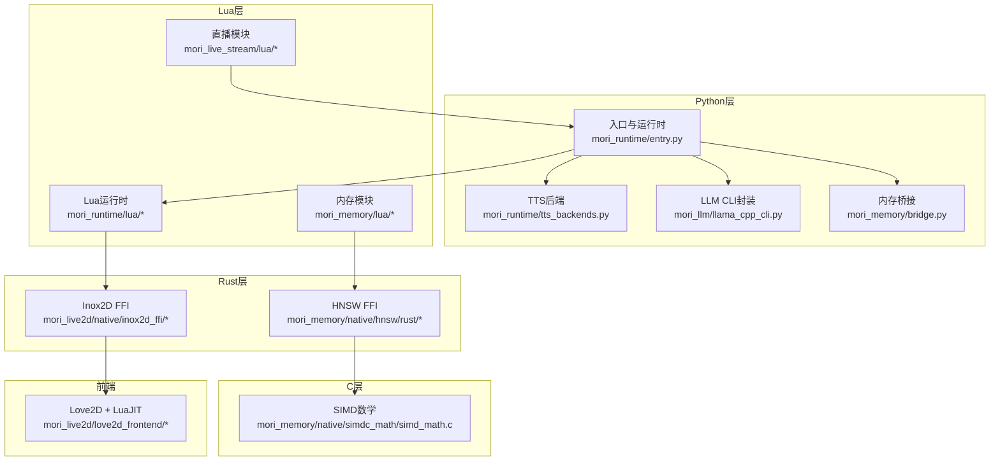
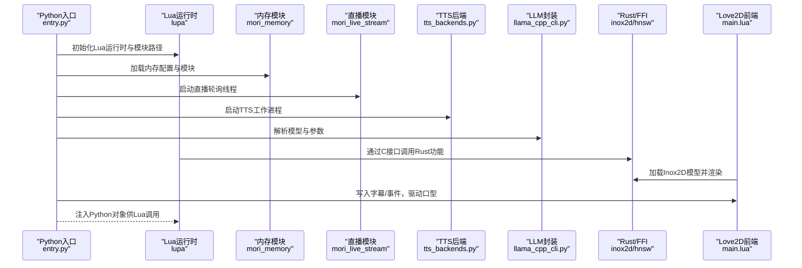
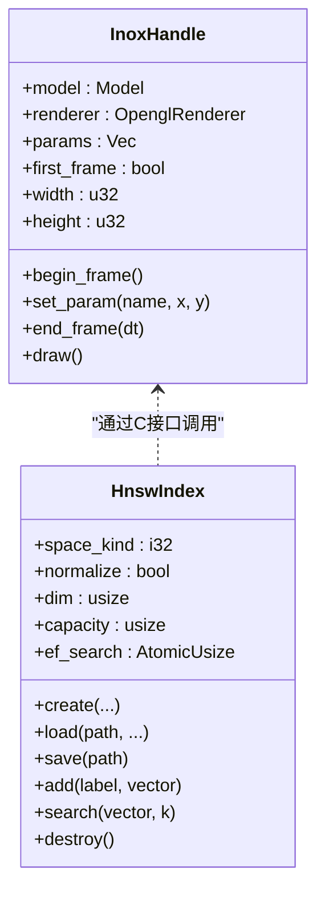
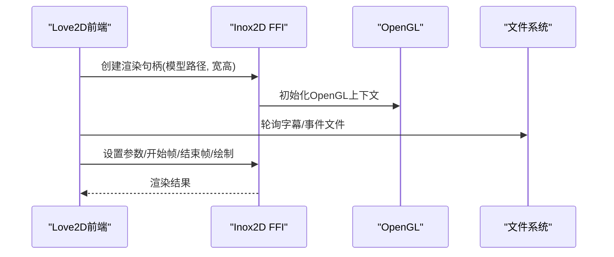
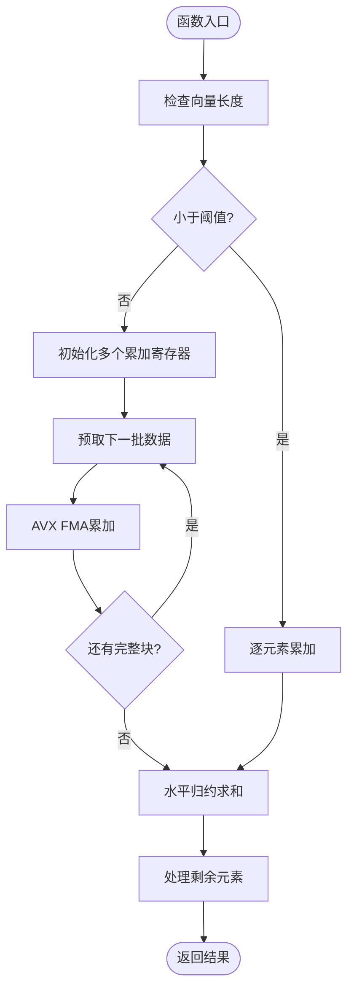
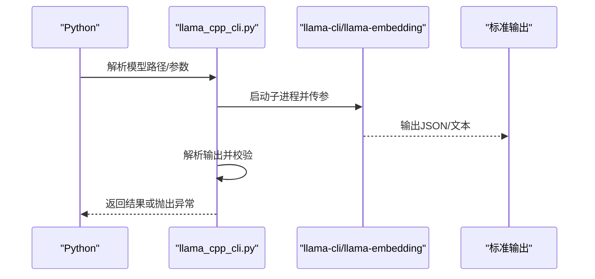
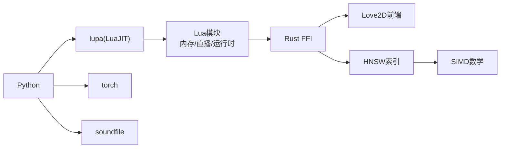

# 技术栈介绍

<cite>
**本文档引用的文件**
- [mori_live2d/README.md](file://mori_live2d/README.md)
- [mori_live2d/love2d_frontend/main.lua](file://mori_live2d/love2d_frontend/main.lua)
- [mori_live2d/native/inox2d_ffi/Cargo.toml](file://mori_live2d/native/inox2d_ffi/Cargo.toml)
- [mori_live2d/native/inox2d_ffi/src/lib.rs](file://mori_live2d/native/inox2d_ffi/src/lib.rs)
- [mori_memory/native/simdc_math/simd_math.c](file://mori_memory/native/simdc_math/simd_math.c)
- [mori_memory/native/hnsw/rust/Cargo.toml](file://mori_memory/native/hnsw/rust/Cargo.toml)
- [mori_memory/native/hnsw/rust/src/lib.rs](file://mori_memory/native/hnsw/rust/src/lib.rs)
- [mori_llm/llama_cpp_cli.py](file://mori_llm/llama_cpp_cli.py)
- [mori_runtime/entry.py](file://mori_runtime/entry.py)
- [mori_runtime/tts_backends.py](file://mori_runtime/tts_backends.py)
- [mori_memory/bridge.py](file://mori_memory/bridge.py)
- [requirements.txt](file://requirements.txt)
- [mori_memory/benchmarks/requirements.txt](file://mori_memory/benchmarks/requirements.txt)
</cite>

## 目录
1. [引言](#引言)
2. [项目结构](#项目结构)
3. [核心组件](#核心组件)
4. [架构总览](#架构总览)
5. [详细组件分析](#详细组件分析)
6. [依赖关系分析](#依赖关系分析)
7. [性能考虑](#性能考虑)
8. [故障排查指南](#故障排查指南)
9. [结论](#结论)
10. [附录](#附录)

## 引言
本文件面向Mori项目的开发者与使用者，系统梳理项目中Python生态的关键依赖与跨语言技术栈，包括llama.cpp、lupa、torch、soundfile等库的作用边界，LuaJIT在内存系统中的重要性，Rust在FFI绑定中的应用，Love2D游戏引擎在Live2D前端中的使用，以及C语言在SIMD数学计算中的性能优化作用。同时提供版本兼容性与选择理由，帮助读者理解技术决策背后的权衡。

## 项目结构
Mori采用多语言混合架构：Python负责运行时调度、TTS合成、LLM调用与内存桥接；Rust通过cdylib导出C接口供LuaJIT调用；C语言实现高性能SIMD计算；Love2D + LuaJIT提供Live2D渲染与交互前端；llama.cpp提供本地推理能力。

图表来源
- [mori_runtime/entry.py:414-438](file://mori_runtime/entry.py#L414-L438)
- [mori_live2d/love2d_frontend/main.lua:15-20](file://mori_live2d/love2d_frontend/main.lua#L15-L20)
- [mori_live2d/native/inox2d_ffi/Cargo.toml:1-16](file://mori_live2d/native/inox2d_ffi/Cargo.toml#L1-L16)
- [mori_memory/native/hnsw/rust/Cargo.toml:1-16](file://mori_memory/native/hnsw/rust/Cargo.toml#L1-L16)
- [mori_memory/native/simdc_math/simd_math.c:1-146](file://mori_memory/native/simdc_math/simd_math.c#L1-L146)

章节来源
- [mori_runtime/entry.py:414-438](file://mori_runtime/entry.py#L414-L438)
- [mori_live2d/love2d_frontend/main.lua:15-20](file://mori_live2d/love2d_frontend/main.lua#L15-L20)

## 核心组件
- Python生态
  - lupa：提供LuaJIT运行时与Python互操作，使Lua模块可被Python加载与调用，支撑内存、直播、运行时模块的统一调度。
  - torch：在TTS后端中用于模型推理与音频处理（具体使用见TTS后端实现）。
  - soundfile：用于音频文件的读写与流式处理（具体使用见TTS后端实现）。
  - 其他：huggingface_hub、pyarrow等用于基准测试与数据处理。
- Rust层
  - inox2d与inox2d-opengl：提供Inochi2D模型解析、OpenGL渲染与参数驱动。
  - hnsw_rs：提供近似最近邻检索的高性能索引实现。
- C层
  - SIMD数学：基于AVX/FMA指令集实现向量点积与余弦相似度的高效计算。
- Lua/LuaJIT层
  - 内存模块、直播模块、运行时模块：通过lupa注入Python对象，实现跨语言协作。
- Love2D前端
  - 通过LuaJIT FFI加载Rust编译的动态库，完成Live2D渲染、字幕显示、音频播放与口型同步。

章节来源
- [requirements.txt:1-2](file://requirements.txt#L1-L2)
- [mori_runtime/tts_backends.py:1-50](file://mori_runtime/tts_backends.py#L1-L50)
- [mori_memory/benchmarks/requirements.txt:1-3](file://mori_memory/benchmarks/requirements.txt#L1-L3)
- [mori_live2d/native/inox2d_ffi/Cargo.toml:9-16](file://mori_live2d/native/inox2d_ffi/Cargo.toml#L9-L16)
- [mori_memory/native/hnsw/rust/Cargo.toml:14-16](file://mori_memory/native/hnsw/rust/Cargo.toml#L14-L16)
- [mori_memory/native/simdc_math/simd_math.c:1-15](file://mori_memory/native/simdc_math/simd_math.c#L1-L15)

## 架构总览
Mori以Python为核心调度器，通过lupa注入Lua运行时，Lua模块负责与Rust/FFI交互，实现Live2D渲染、内存检索与直播采集；同时Python侧负责LLM推理与TTS合成，形成“Python主控 + Lua桥接 + Rust/FFI加速”的分层架构。

图表来源
- [mori_runtime/entry.py:414-438](file://mori_runtime/entry.py#L414-L438)
- [mori_memory/bridge.py:7-34](file://mori_memory/bridge.py#L7-L34)
- [mori_live2d/love2d_frontend/main.lua:15-20](file://mori_live2d/love2d_frontend/main.lua#L15-L20)
- [mori_runtime/tts_backends.py:668-703](file://mori_runtime/tts_backends.py#L668-L703)
- [mori_llm/llama_cpp_cli.py:26-56](file://mori_llm/llama_cpp_cli.py#L26-L56)

## 详细组件分析

### Python生态与依赖
- lupa
  - 作用：在Python中创建LuaJIT运行时，动态加载Lua模块，实现Python与Lua的双向桥接。
  - 使用场景：运行时模块、内存模块、直播模块均通过lupa注册与调用。
- torch
  - 作用：在TTS后端中用于模型推理与特征提取（具体实现参见TTS后端）。
- soundfile
  - 作用：在TTS后端中进行音频文件的读写与流式处理（具体实现参见TTS后端）。
- huggingface_hub、pyarrow
  - 作用：用于基准测试与数据处理（见基准测试依赖文件）。

章节来源
- [requirements.txt:1-2](file://requirements.txt#L1-L2)
- [mori_runtime/tts_backends.py:1-50](file://mori_runtime/tts_backends.py#L1-L50)
- [mori_memory/benchmarks/requirements.txt:1-3](file://mori_memory/benchmarks/requirements.txt#L1-L3)

### LuaJIT在内存系统中的重要性
- LuaJIT提供轻量级脚本环境，便于快速迭代与热插拔配置。
- 通过lupa，Python可将对象注入Lua全局，实现跨语言调用。
- 内存模块、直播模块、运行时模块均以Lua实现，便于与前端Love2D协同。

章节来源
- [mori_runtime/entry.py:414-438](file://mori_runtime/entry.py#L414-L438)
- [mori_memory/bridge.py:7-34](file://mori_memory/bridge.py#L7-L34)

### Rust在FFI绑定中的应用
- inox2d_ffi
  - 导出C接口，封装Inox2D模型加载、参数设置、帧更新与OpenGL渲染。
  - 提供错误码与缓冲区管理，确保跨语言安全。
- hnsw_ffi
  - 导出C接口，封装HNSW索引的创建、保存、搜索与容量查询。
  - 使用hnsw_rs并启用SIMD优化特性，提升大规模向量检索性能。

图表来源
- [mori_live2d/native/inox2d_ffi/src/lib.rs:84-196](file://mori_live2d/native/inox2d_ffi/src/lib.rs#L84-L196)
- [mori_memory/native/hnsw/rust/src/lib.rs:23-61](file://mori_memory/native/hnsw/rust/src/lib.rs#L23-L61)

章节来源
- [mori_live2d/native/inox2d_ffi/src/lib.rs:135-290](file://mori_live2d/native/inox2d_ffi/src/lib.rs#L135-L290)
- [mori_memory/native/hnsw/rust/src/lib.rs:242-592](file://mori_memory/native/hnsw/rust/src/lib.rs#L242-L592)

### Love2D游戏引擎在Live2D前端中的使用
- Love2D负责窗口管理、渲染循环与输入事件处理。
- 通过LuaJIT FFI加载Rust编译的动态库，实现Inox2D模型的加载与渲染。
- 支持字幕文件轮询、事件日志解析、音频播放与口型同步。

图表来源
- [mori_live2d/love2d_frontend/main.lua:238-283](file://mori_live2d/love2d_frontend/main.lua#L238-L283)
- [mori_live2d/native/inox2d_ffi/src/lib.rs:135-196](file://mori_live2d/native/inox2d_ffi/src/lib.rs#L135-L196)

章节来源
- [mori_live2d/README.md:16-66](file://mori_live2d/README.md#L16-L66)
- [mori_live2d/love2d_frontend/main.lua:156-283](file://mori_live2d/love2d_frontend/main.lua#L156-L283)

### C语言在SIMD数学计算中的性能优化
- 使用AVX/FMA指令集实现向量点积与余弦相似度的批量计算。
- 通过预取与分块累加减少内存带宽瓶颈，提升大规模向量运算吞吐。
- 与Rust FFI配合，将高性能计算能力暴露给上层模块。

图表来源
- [mori_memory/native/simdc_math/simd_math.c:17-62](file://mori_memory/native/simdc_math/simd_math.c#L17-L62)
- [mori_memory/native/simdc_math/simd_math.c:64-145](file://mori_memory/native/simdc_math/simd_math.c#L64-L145)

章节来源
- [mori_memory/native/simdc_math/simd_math.c:1-146](file://mori_memory/native/simdc_math/simd_math.c#L1-L146)

### llama.cpp在本地推理中的应用
- 提供命令行封装，自动定位二进制与模型文件，支持嵌入与对话两种模式。
- 通过子进程调用llama-cli/llama-embedding，传递参数并解析输出。
- 支持自定义模型选择与池化策略，满足不同任务需求。

图表来源
- [mori_llm/llama_cpp_cli.py:90-160](file://mori_llm/llama_cpp_cli.py#L90-L160)
- [mori_llm/llama_cpp_cli.py:162-221](file://mori_llm/llama_cpp_cli.py#L162-L221)

章节来源
- [mori_llm/llama_cpp_cli.py:26-56](file://mori_llm/llama_cpp_cli.py#L26-L56)
- [mori_llm/llama_cpp_cli.py:90-160](file://mori_llm/llama_cpp_cli.py#L90-L160)
- [mori_llm/llama_cpp_cli.py:162-221](file://mori_llm/llama_cpp_cli.py#L162-L221)

## 依赖关系分析
- Python层依赖lupa实现LuaJIT运行时，依赖torch与soundfile进行TTS推理与音频处理。
- Lua层通过lupa与Python对象交互，加载内存、直播与运行时模块。
- Rust层通过cdylib导出C接口，供LuaJIT FFI调用，实现高性能渲染与索引。
- C层提供SIMD数学运算，服务于向量检索与相似度计算。
- Love2D前端通过LuaJIT FFI与Rust交互，完成Live2D渲染与口型同步。

图表来源
- [requirements.txt:1-2](file://requirements.txt#L1-L2)
- [mori_runtime/tts_backends.py:1-50](file://mori_runtime/tts_backends.py#L1-L50)
- [mori_live2d/native/inox2d_ffi/Cargo.toml:9-16](file://mori_live2d/native/inox2d_ffi/Cargo.toml#L9-L16)
- [mori_memory/native/hnsw/rust/Cargo.toml:14-16](file://mori_memory/native/hnsw/rust/Cargo.toml#L14-L16)
- [mori_memory/native/simdc_math/simd_math.c:1-15](file://mori_memory/native/simdc_math/simd_math.c#L1-L15)

章节来源
- [requirements.txt:1-2](file://requirements.txt#L1-L2)
- [mori_runtime/tts_backends.py:1-50](file://mori_runtime/tts_backends.py#L1-L50)
- [mori_live2d/native/inox2d_ffi/Cargo.toml:9-16](file://mori_live2d/native/inox2d_ffi/Cargo.toml#L9-L16)
- [mori_memory/native/hnsw/rust/Cargo.toml:14-16](file://mori_memory/native/hnsw/rust/Cargo.toml#L14-L16)

## 性能考虑
- SIMD优化：在C层使用AVX/FMA指令集，显著提升向量运算性能，适用于大规模相似度计算与检索。
- Rust FFI：通过cdylib导出稳定ABI，降低跨语言调用开销，保证渲染与索引的实时性。
- LuaJIT：在内存与直播模块中提供轻量脚本能力，减少Python-GIL影响，提高并发响应。
- 子进程隔离：llama.cpp通过独立进程执行，避免阻塞主线程，便于资源控制与错误恢复。
- 线程池与异步：TTS后端使用线程池与消息队列，平衡延迟与吞吐。

## 故障排查指南
- LuaJIT缺失
  - 现象：运行时报错提示缺少lupa依赖。
  - 处理：激活虚拟环境并安装依赖。
- Inox2D FFI加载失败
  - 现象：Love2D前端提示无法加载inochi2d动态库。
  - 处理：确认Rust已构建libmori_inox2d.so并放置于正确路径。
- HNSW索引维度不匹配
  - 现象：加载索引时报维度不一致错误。
  - 处理：确保dump文件与调用方维度一致，或重新训练索引。
- TTS工作进程异常退出
  - 现象：ZipVoice工作进程非预期退出。
  - 处理：检查工作进程启动参数与模型路径，查看标准输出错误信息。
- llama.cpp二进制未找到
  - 现象：无法定位llama-cli/llama-embedding可执行文件。
  - 处理：设置LLAMA_CPP_BIN_DIR或LLAMA_CPP_DIR环境变量，或确保在PATH中。

章节来源
- [mori_runtime/entry.py:416-418](file://mori_runtime/entry.py#L416-L418)
- [mori_live2d/README.md:20-26](file://mori_live2d/README.md#L20-L26)
- [mori_memory/native/hnsw/rust/src/lib.rs:308-333](file://mori_memory/native/hnsw/rust/src/lib.rs#L308-L333)
- [mori_runtime/tts_backends.py:668-703](file://mori_runtime/tts_backends.py#L668-L703)
- [mori_llm/llama_cpp_cli.py:26-56](file://mori_llm/llama_cpp_cli.py#L26-L56)

## 结论
Mori通过Python主控、Lua桥接与Rust/FFI加速的组合，实现了本地化的AI VTuber全流程：从LLM推理、TTS合成到Live2D渲染与直播采集。LuaJIT在内存系统中的灵活性、Rust在FFI绑定中的稳定性与性能优势，以及C层SIMD数学计算的高效性，共同构成了Mori的技术基石。选择这些技术栈的核心考量在于：本地化部署、低延迟交互、跨语言协作与可扩展的性能优化路径。

## 附录
- 版本与兼容性要点
  - Rust工具链：Rust 2021/2024 edition，配合Cargo构建cdylib。
  - LuaJIT：Love2D推荐11.x版本，确保FFI可用。
  - Python依赖：lupa、torch、soundfile等，按需安装。
  - llama.cpp：通过命令行封装自动定位二进制与模型，支持多种模型格式。
- 选择理由
  - LuaJIT：轻量、高性能、易于与Python互操作。
  - Rust：零成本抽象、稳定的FFI ABI、高性能数值计算。
  - C SIMD：针对向量运算的底层优化，适合大规模检索与相似度计算。
  - Love2D：成熟的2D渲染与输入处理框架，适配Live2D前端。
  - Python：生态完善、易用性强，适合快速迭代与工程化落地。