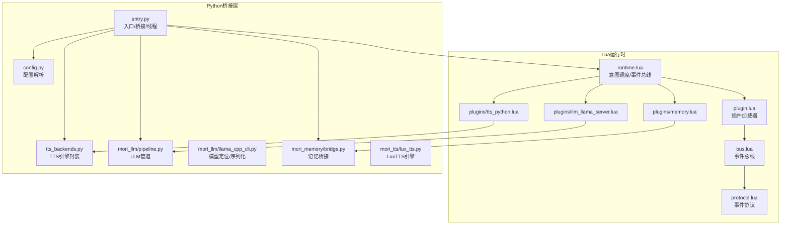
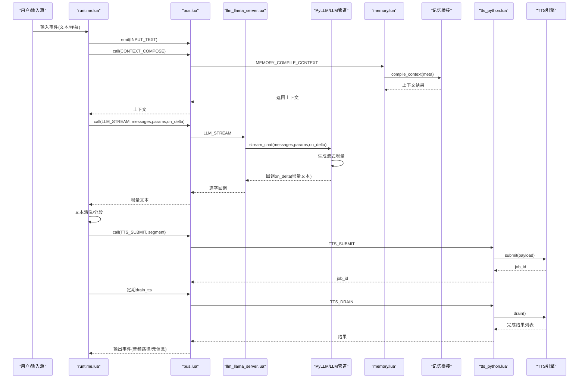
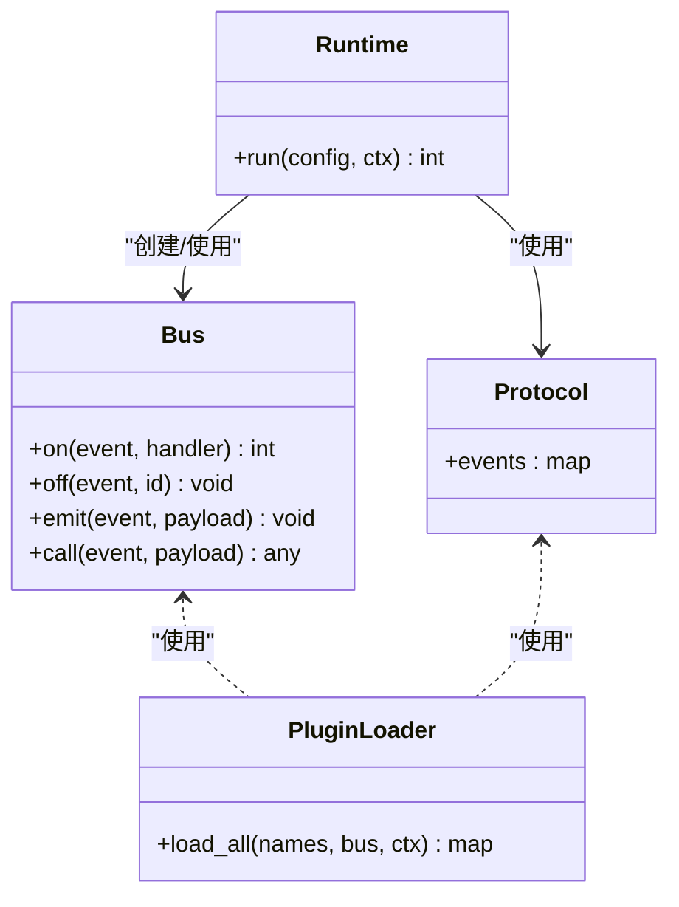
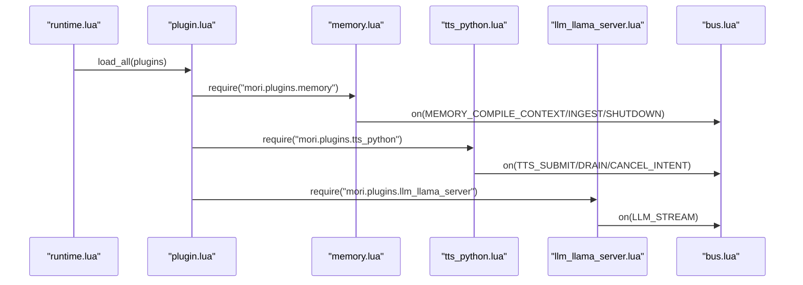
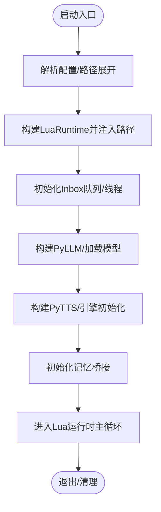
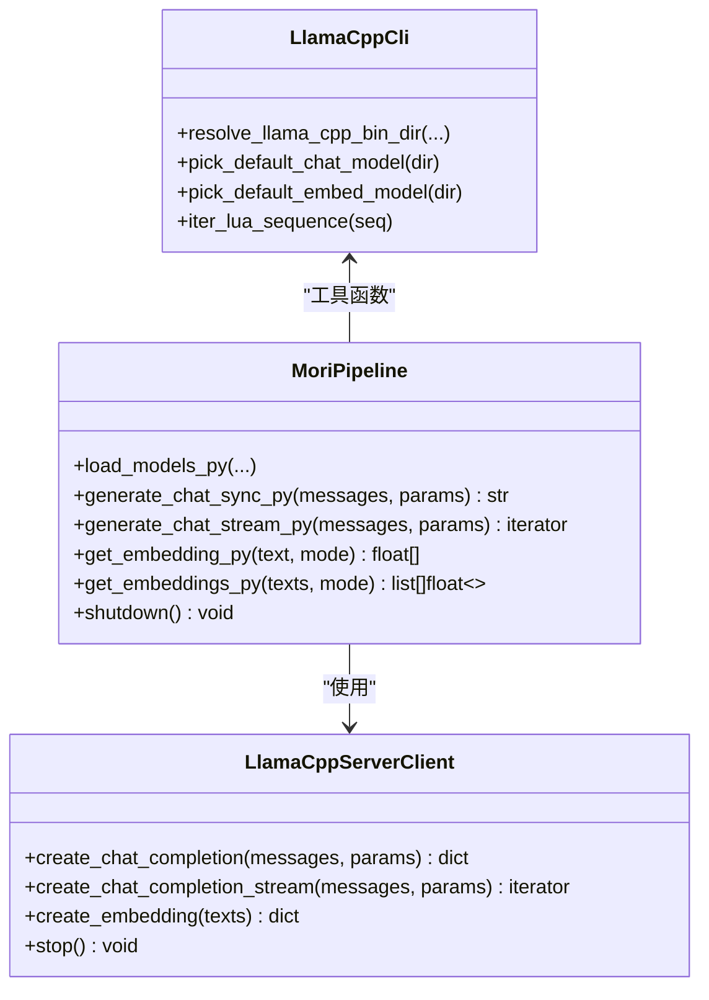
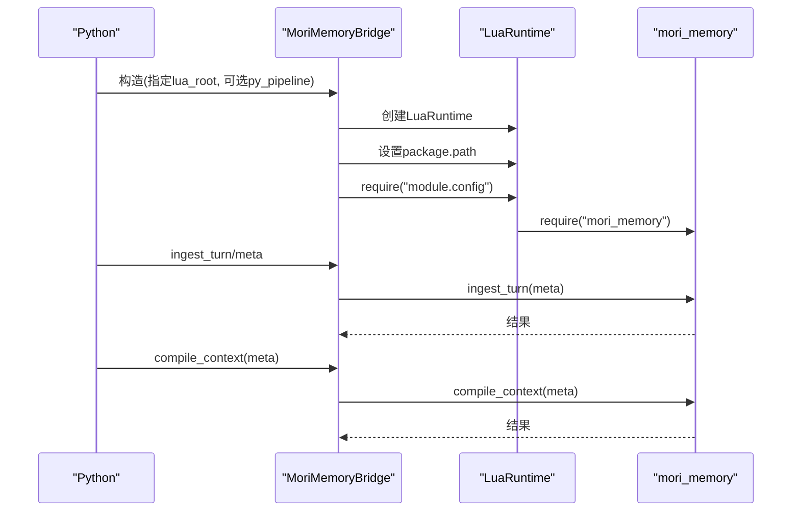
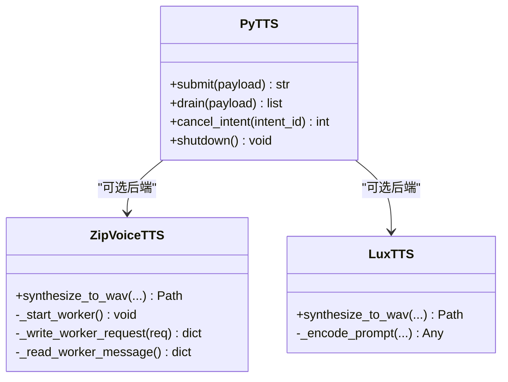
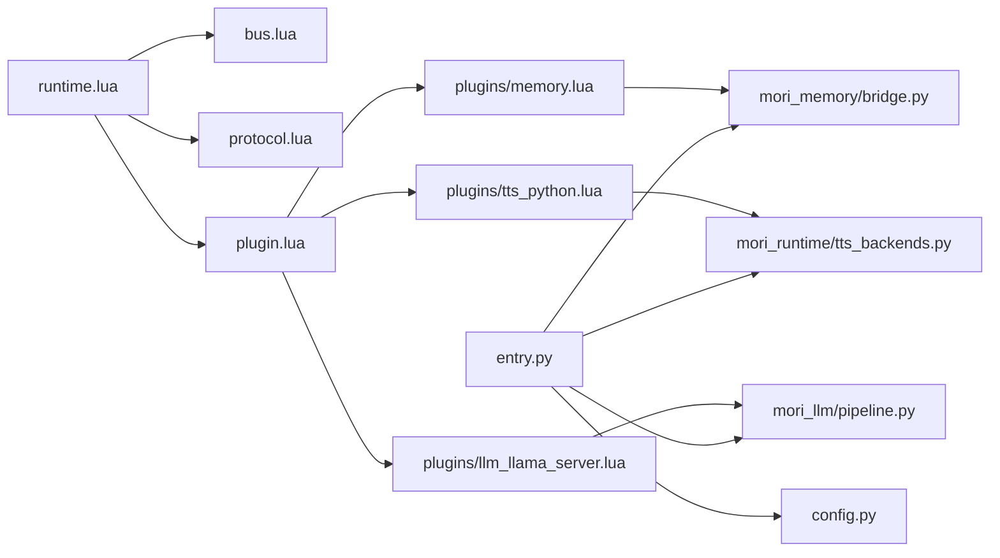

# 模块关系说明

<cite>
**本文档引用的文件**
- [mori_runtime/entry.py](file://mori_runtime/entry.py)
- [mori_runtime/config.py](file://mori_runtime/config.py)
- [mori_runtime/tts_backends.py](file://mori_runtime/tts_backends.py)
- [mori_runtime/lua/mori/app/runtime.lua](file://mori_runtime/lua/mori/app/runtime.lua)
- [mori_runtime/lua/mori/core/bus.lua](file://mori_runtime/lua/mori/core/bus.lua)
- [mori_runtime/lua/mori/core/protocol.lua](file://mori_runtime/lua/mori/core/protocol.lua)
- [mori_runtime/lua/mori/core/plugin.lua](file://mori_runtime/lua/mori/core/plugin.lua)
- [mori_runtime/lua/mori/plugins/memory.lua](file://mori_runtime/lua/mori/plugins/memory.lua)
- [mori_runtime/lua/mori/plugins/tts_python.lua](file://mori_runtime/lua/mori/plugins/tts_python.lua)
- [mori_runtime/lua/mori/plugins/llm_llama_server.lua](file://mori_runtime/lua/mori/plugins/llm_llama_server.lua)
- [mori_llm/pipeline.py](file://mori_llm/pipeline.py)
- [mori_llm/llama_cpp_cli.py](file://mori_llm/llama_cpp_cli.py)
- [mori_memory/bridge.py](file://mori_memory/bridge.py)
- [mori_tts/lux_tts.py](file://mori_tts/lux_tts.py)
</cite>

## 目录
1. [简介](#简介)
2. [项目结构](#项目结构)
3. [核心组件](#核心组件)
4. [架构总览](#架构总览)
5. [详细组件分析](#详细组件分析)
6. [依赖关系分析](#依赖关系分析)
7. [性能考虑](#性能考虑)
8. [故障排除指南](#故障排除指南)
9. [结论](#结论)

## 简介
本文件面向开发者，系统性阐述Mori各核心模块之间的关系与协作机制，重点说明：
- mori_runtime 如何作为统一入口协调各个子模块（LLM、记忆、TTS、输入源等）
- mori_memory 如何通过 lupa 绑定与 Python 层交互
- mori_llm 如何与记忆系统进行数据交换
- mori_tts 如何接收来自 LLM 的文本并生成语音输出
- 模块间通信协议、数据格式转换与错误处理机制
- 提供调用流程图与数据流转示例，帮助快速理解模块依赖与交互模式

## 项目结构
Mori采用“Lua运行时 + Python桥接”的混合架构：
- Lua侧负责事件总线、插件加载、意图编排、分段切词与TTS提交
- Python侧负责LLM推理、TTS合成、内存桥接与配置解析
- 通过 lupa 将Lua与Python对象桥接，实现跨语言调用

**图表来源**
- [mori_runtime/lua/mori/app/runtime.lua:543-668](file://mori_runtime/lua/mori/app/runtime.lua#L543-L668)
- [mori_runtime/lua/mori/core/plugin.lua:13-48](file://mori_runtime/lua/mori/core/plugin.lua#L13-L48)
- [mori_runtime/lua/mori/core/bus.lua:14-95](file://mori_runtime/lua/mori/core/bus.lua#L14-L95)
- [mori_runtime/lua/mori/core/protocol.lua:1-35](file://mori_runtime/lua/mori/core/protocol.lua#L1-L35)
- [mori_runtime/lua/mori/plugins/memory.lua:1-30](file://mori_runtime/lua/mori/plugins/memory.lua#L1-L30)
- [mori_runtime/lua/mori/plugins/tts_python.lua:1-31](file://mori_runtime/lua/mori/plugins/tts_python.lua#L1-L31)
- [mori_runtime/lua/mori/plugins/llm_llama_server.lua:1-25](file://mori_runtime/lua/mori/plugins/llm_llama_server.lua#L1-L25)
- [mori_runtime/entry.py:414-438](file://mori_runtime/entry.py#L414-L438)
- [mori_runtime/config.py:1-270](file://mori_runtime/config.py#L1-L270)
- [mori_runtime/tts_backends.py:1-1171](file://mori_runtime/tts_backends.py#L1-L1171)
- [mori_llm/pipeline.py:1-582](file://mori_llm/pipeline.py#L1-L582)
- [mori_llm/llama_cpp_cli.py:1-248](file://mori_llm/llama_cpp_cli.py#L1-L248)
- [mori_memory/bridge.py:1-43](file://mori_memory/bridge.py#L1-L43)
- [mori_tts/lux_tts.py:1-171](file://mori_tts/lux_tts.py#L1-L171)

**章节来源**
- [mori_runtime/lua/mori/app/runtime.lua:543-668](file://mori_runtime/lua/mori/app/runtime.lua#L543-L668)
- [mori_runtime/entry.py:414-438](file://mori_runtime/entry.py#L414-L438)

## 核心组件
- mori_runtime（Lua）：提供事件总线、插件系统、意图调度、TTS分段与输出事件
- mori_llm（Python）：封装 llama.cpp 服务端客户端，提供同步/流式推理接口
- mori_memory（Python）：通过 lupa 调用 Lua 记忆模块，提供上下文编译与记忆注入
- mori_tts（Python）：支持 ZipVoice 子进程与 LuxTTS 引擎，提供多后端TTS合成
- 配置系统（Python）：统一解析配置、路径展开、默认值合并

**章节来源**
- [mori_runtime/lua/mori/core/protocol.lua:1-35](file://mori_runtime/lua/mori/core/protocol.lua#L1-L35)
- [mori_runtime/lua/mori/plugins/memory.lua:1-30](file://mori_runtime/lua/mori/plugins/memory.lua#L1-L30)
- [mori_runtime/lua/mori/plugins/tts_python.lua:1-31](file://mori_runtime/lua/mori/plugins/tts_python.lua#L1-L31)
- [mori_runtime/lua/mori/plugins/llm_llama_server.lua:1-25](file://mori_runtime/lua/mori/plugins/llm_llama_server.lua#L1-L25)
- [mori_llm/pipeline.py:307-582](file://mori_llm/pipeline.py#L307-L582)
- [mori_memory/bridge.py:1-43](file://mori_memory/bridge.py#L1-L43)
- [mori_runtime/tts_backends.py:525-800](file://mori_runtime/tts_backends.py#L525-L800)
- [mori_runtime/config.py:188-270](file://mori_runtime/config.py#L188-L270)

## 架构总览
mori_runtime 以 Lua 为主导的事件驱动架构，通过插件订阅/发布协议事件完成模块解耦。Python侧通过 lupa 注入全局对象，Lua侧通过 require 加载模块并注册事件处理器。

**图表来源**
- [mori_runtime/lua/mori/app/runtime.lua:303-541](file://mori_runtime/lua/mori/app/runtime.lua#L303-L541)
- [mori_runtime/lua/mori/core/bus.lua:50-91](file://mori_runtime/lua/mori/core/bus.lua#L50-L91)
- [mori_runtime/lua/mori/plugins/memory.lua:12-25](file://mori_runtime/lua/mori/plugins/memory.lua#L12-L25)
- [mori_runtime/lua/mori/plugins/llm_llama_server.lua:13-20](file://mori_runtime/lua/mori/plugins/llm_llama_server.lua#L13-L20)
- [mori_runtime/lua/mori/plugins/tts_python.lua:13-27](file://mori_runtime/lua/mori/plugins/tts_python.lua#L13-L27)
- [mori_llm/pipeline.py:519-573](file://mori_llm/pipeline.py#L519-L573)
- [mori_memory/bridge.py:35-42](file://mori_memory/bridge.py#L35-L42)
- [mori_runtime/tts_backends.py:245-389](file://mori_runtime/tts_backends.py#L245-L389)

## 详细组件分析

### 组件A：mori_runtime（Lua）事件总线与插件系统
- 事件总线（bus.lua）：提供 on/emit/call 机制，支持 BUS_ERROR 错误广播
- 协议定义（protocol.lua）：集中声明所有事件名，确保跨模块契约一致
- 插件加载（plugin.lua）：按名称加载插件，触发 MODULE_ANNOUNCE/MODULE_READY/MODULE_ERROR
- 运行时（runtime.lua）：主循环、意图选择、中断策略、TTS分段与输出事件

**图表来源**
- [mori_runtime/lua/mori/core/bus.lua:14-95](file://mori_runtime/lua/mori/core/bus.lua#L14-L95)
- [mori_runtime/lua/mori/core/protocol.lua:1-35](file://mori_runtime/lua/mori/core/protocol.lua#L1-L35)
- [mori_runtime/lua/mori/core/plugin.lua:13-48](file://mori_runtime/lua/mori/core/plugin.lua#L13-L48)
- [mori_runtime/lua/mori/app/runtime.lua:543-668](file://mori_runtime/lua/mori/app/runtime.lua#L543-L668)

**章节来源**
- [mori_runtime/lua/mori/core/bus.lua:14-95](file://mori_runtime/lua/mori/core/bus.lua#L14-L95)
- [mori_runtime/lua/mori/core/protocol.lua:1-35](file://mori_runtime/lua/mori/core/protocol.lua#L1-L35)
- [mori_runtime/lua/mori/core/plugin.lua:13-48](file://mori_runtime/lua/mori/core/plugin.lua#L13-L48)
- [mori_runtime/lua/mori/app/runtime.lua:543-668](file://mori_runtime/lua/mori/app/runtime.lua#L543-L668)

### 组件B：mori_runtime（Lua）插件与事件映射
- memory.lua：注册 MEMORY_COMPILE_CONTEXT/MEMORY_INGEST_TURN/MEMORY_SHUTDOWN
- tts_python.lua：注册 TTS_SUBMIT/TTS_DRAIN/TTS_CANCEL_INTENT
- llm_llama_server.lua：注册 LLM_STREAM

**图表来源**
- [mori_runtime/lua/mori/core/plugin.lua:13-48](file://mori_runtime/lua/mori/core/plugin.lua#L13-L48)
- [mori_runtime/lua/mori/plugins/memory.lua:8-25](file://mori_runtime/lua/mori/plugins/memory.lua#L8-L25)
- [mori_runtime/lua/mori/plugins/tts_python.lua:8-27](file://mori_runtime/lua/mori/plugins/tts_python.lua#L8-L27)
- [mori_runtime/lua/mori/plugins/llm_llama_server.lua:8-20](file://mori_runtime/lua/mori/plugins/llm_llama_server.lua#L8-L20)

**章节来源**
- [mori_runtime/lua/mori/plugins/memory.lua:1-30](file://mori_runtime/lua/mori/plugins/memory.lua#L1-L30)
- [mori_runtime/lua/mori/plugins/tts_python.lua:1-31](file://mori_runtime/lua/mori/plugins/tts_python.lua#L1-L31)
- [mori_runtime/lua/mori/plugins/llm_llama_server.lua:1-25](file://mori_runtime/lua/mori/plugins/llm_llama_server.lua#L1-L25)

### 组件C：mori_runtime（Python）入口与桥接
- entry.py：构建 LuaRuntime，注入包路径，初始化 Inbox/线程，构建 PyLLM/PyTTS，启动输入源线程
- config.py：统一解析配置、路径展开、默认值合并，支持 CLI/VTuber/Love2D/Inochi 启动器
- tts_backends.py：ZipVoice/LuxTTS引擎封装，子进程通信、参数解析、提示词池管理

**图表来源**
- [mori_runtime/entry.py:414-438](file://mori_runtime/entry.py#L414-L438)
- [mori_runtime/entry.py:796-800](file://mori_runtime/entry.py#L796-L800)
- [mori_runtime/config.py:188-270](file://mori_runtime/config.py#L188-L270)
- [mori_runtime/tts_backends.py:525-650](file://mori_runtime/tts_backends.py#L525-L650)

**章节来源**
- [mori_runtime/entry.py:414-438](file://mori_runtime/entry.py#L414-L438)
- [mori_runtime/entry.py:796-800](file://mori_runtime/entry.py#L796-L800)
- [mori_runtime/config.py:188-270](file://mori_runtime/config.py#L188-L270)
- [mori_runtime/tts_backends.py:525-650](file://mori_runtime/tts_backends.py#L525-L650)

### 组件D：mori_llm（Python）推理管道
- pipeline.py：封装 llama.cpp 服务端客户端，提供同步/流式聊天接口，参数标准化与消息序列化
- llama_cpp_cli.py：模型定位、命令行封装、序列化迭代器

**图表来源**
- [mori_llm/pipeline.py:56-306](file://mori_llm/pipeline.py#L56-L306)
- [mori_llm/pipeline.py:307-582](file://mori_llm/pipeline.py#L307-L582)
- [mori_llm/llama_cpp_cli.py:26-56](file://mori_llm/llama_cpp_cli.py#L26-L56)
- [mori_llm/llama_cpp_cli.py:223-248](file://mori_llm/llama_cpp_cli.py#L223-L248)

**章节来源**
- [mori_llm/pipeline.py:56-306](file://mori_llm/pipeline.py#L56-L306)
- [mori_llm/pipeline.py:307-582](file://mori_llm/pipeline.py#L307-L582)
- [mori_llm/llama_cpp_cli.py:26-56](file://mori_llm/llama_cpp_cli.py#L26-L56)
- [mori_llm/llama_cpp_cli.py:223-248](file://mori_llm/llama_cpp_cli.py#L223-L248)

### 组件E：mori_memory（Python）与Lua桥接
- bridge.py：通过 lupa 初始化 LuaRuntime，设置包路径，注入 py_pipeline，require mori_memory 并暴露 ingest_turn/compile_context/shutdown

**图表来源**
- [mori_memory/bridge.py:7-43](file://mori_memory/bridge.py#L7-L43)

**章节来源**
- [mori_memory/bridge.py:1-43](file://mori_memory/bridge.py#L1-L43)

### 组件F：mori_tts（Python）引擎与任务管理
- tts_backends.py：ZipVoice子进程通信（JSON请求/响应）、语言检测、提示词池、质量配置
- lux_tts.py：LuxTTS引擎封装，提示词缓存、设备选择、WAV写出

**图表来源**
- [mori_runtime/entry.py:203-412](file://mori_runtime/entry.py#L203-L412)
- [mori_runtime/tts_backends.py:525-800](file://mori_runtime/tts_backends.py#L525-L800)
- [mori_tts/lux_tts.py:65-171](file://mori_tts/lux_tts.py#L65-L171)

**章节来源**
- [mori_runtime/entry.py:203-412](file://mori_runtime/entry.py#L203-L412)
- [mori_runtime/tts_backends.py:525-800](file://mori_runtime/tts_backends.py#L525-L800)
- [mori_tts/lux_tts.py:65-171](file://mori_tts/lux_tts.py#L65-L171)

## 依赖关系分析
- 运行时依赖
  - runtime.lua 依赖 bus.lua/protocol.lua/plugin.lua
  - 插件依赖 protocol.lua 事件契约
- Python桥接依赖
  - entry.py 依赖 mori_llm/pipeline.py、mori_runtime/tts_backends.py、mori_memory/bridge.py
  - config.py 为入口提供统一配置解析
- 记忆与LLM/TTS
  - memory.lua 通过 bus 调用 MEMORY_* 事件，最终由 Python 侧 bridge.py 实现
  - tts_python.lua 通过 bus 调用 TTS_* 事件，最终由 PyTTS 执行

**图表来源**
- [mori_runtime/lua/mori/app/runtime.lua:543-668](file://mori_runtime/lua/mori/app/runtime.lua#L543-L668)
- [mori_runtime/lua/mori/core/plugin.lua:13-48](file://mori_runtime/lua/mori/core/plugin.lua#L13-L48)
- [mori_runtime/lua/mori/plugins/memory.lua:1-30](file://mori_runtime/lua/mori/plugins/memory.lua#L1-L30)
- [mori_runtime/lua/mori/plugins/tts_python.lua:1-31](file://mori_runtime/lua/mori/plugins/tts_python.lua#L1-L31)
- [mori_runtime/lua/mori/plugins/llm_llama_server.lua:1-25](file://mori_runtime/lua/mori/plugins/llm_llama_server.lua#L1-L25)
- [mori_llm/pipeline.py:307-582](file://mori_llm/pipeline.py#L307-L582)
- [mori_memory/bridge.py:1-43](file://mori_memory/bridge.py#L1-L43)
- [mori_runtime/tts_backends.py:1-1171](file://mori_runtime/tts_backends.py#L1-L1171)
- [mori_runtime/entry.py:1-1084](file://mori_runtime/entry.py#L1-L1084)
- [mori_runtime/config.py:1-270](file://mori_runtime/config.py#L1-L270)

**章节来源**
- [mori_runtime/lua/mori/core/plugin.lua:13-48](file://mori_runtime/lua/mori/core/plugin.lua#L13-L48)
- [mori_runtime/lua/mori/plugins/memory.lua:1-30](file://mori_runtime/lua/mori/plugins/memory.lua#L1-L30)
- [mori_runtime/lua/mori/plugins/tts_python.lua:1-31](file://mori_runtime/lua/mori/plugins/tts_python.lua#L1-L31)
- [mori_runtime/lua/mori/plugins/llm_llama_server.lua:1-25](file://mori_runtime/lua/mori/plugins/llm_llama_server.lua#L1-L25)
- [mori_llm/pipeline.py:307-582](file://mori_llm/pipeline.py#L307-L582)
- [mori_memory/bridge.py:1-43](file://mori_memory/bridge.py#L1-L43)
- [mori_runtime/tts_backends.py:1-1171](file://mori_runtime/tts_backends.py#L1-L1171)
- [mori_runtime/entry.py:1-1084](file://mori_runtime/entry.py#L1-L1084)
- [mori_runtime/config.py:1-270](file://mori_runtime/config.py#L1-L270)

## 性能考虑
- 流式推理：LLM 使用流式接口，逐字回调减少首字延迟
- 分段TTS：将可见文本分段提交，降低单次合成开销
- 线程池与队列：PyTTS 使用线程池并发合成，Inbox 队列限制大小避免内存膨胀
- ZipVoice子进程：长生命周期复用，减少启动开销；参数默认值按质量档位预设
- 设备选择：LuxTTS 自动探测可用设备，避免无效降级

[本节为通用指导，无需特定文件来源]

## 故障排除指南
- 缺少依赖
  - lupa 未安装：入口会抛出明确异常，提示安装依赖
  - ZipVoice/模型/提示词缺失：启动阶段校验失败，抛出 FileNotFoundError/ValueError
- LLM服务异常
  - llama-server 启动超时或提前退出：捕获异常并给出模型路径提示
  - HTTP请求失败：返回状态码与响应体，便于定位
- TTS任务异常
  - ZipVoice子进程异常退出：尝试重启并重读采样率
  - LuxTTS生成文件不存在：抛出文件未生成错误
- 事件总线错误
  - 插件setup失败或require失败：BUS_ERROR 事件广播，记录插件ID与错误信息

**章节来源**
- [mori_runtime/entry.py:414-418](file://mori_runtime/entry.py#L414-L418)
- [mori_runtime/tts_backends.py:668-703](file://mori_runtime/tts_backends.py#L668-L703)
- [mori_llm/pipeline.py:159-173](file://mori_llm/pipeline.py#L159-L173)
- [mori_runtime/lua/mori/core/bus.lua:50-91](file://mori_runtime/lua/mori/core/bus.lua#L50-L91)

## 结论
Mori通过“Lua事件总线 + Python桥接”的架构实现了模块解耦与高效协作：
- mori_runtime 作为统一入口，以协议事件驱动各子模块
- mori_memory 通过 lupa 与 Lua 记忆模块无缝对接，支持上下文编译与记忆注入
- mori_llm 以服务端客户端形式提供稳定推理能力，并与记忆系统协同
- mori_tts 支持多后端与子进程复用，结合分段策略提升实时性
- 配置系统与错误处理机制保证了部署与运维的稳定性