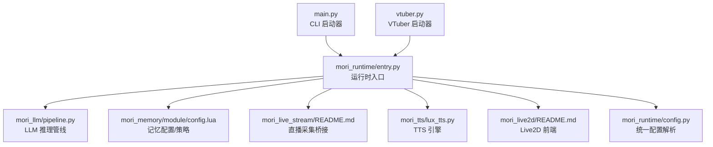
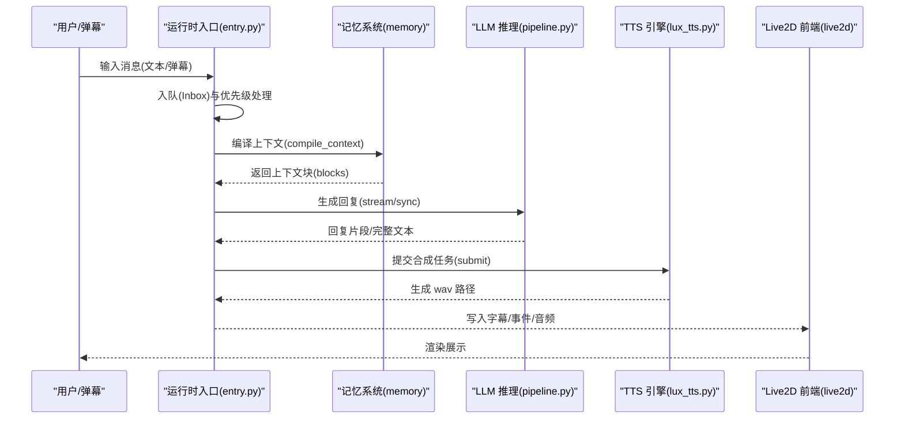
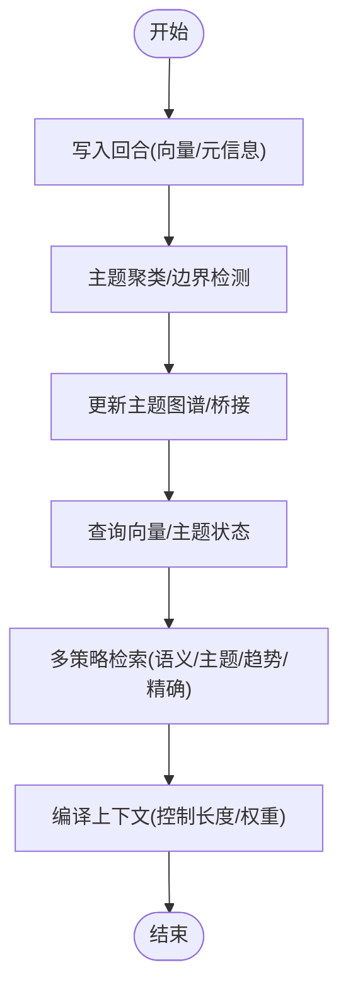
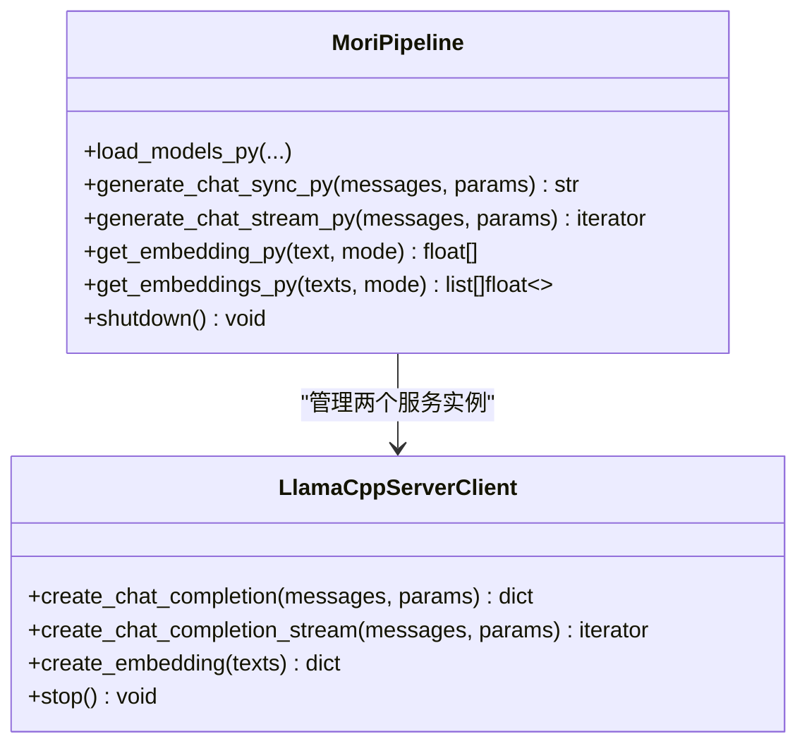
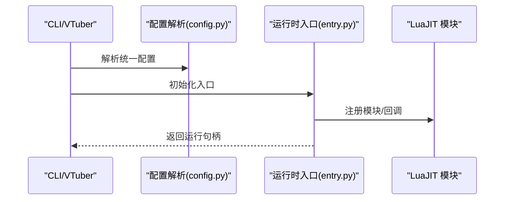
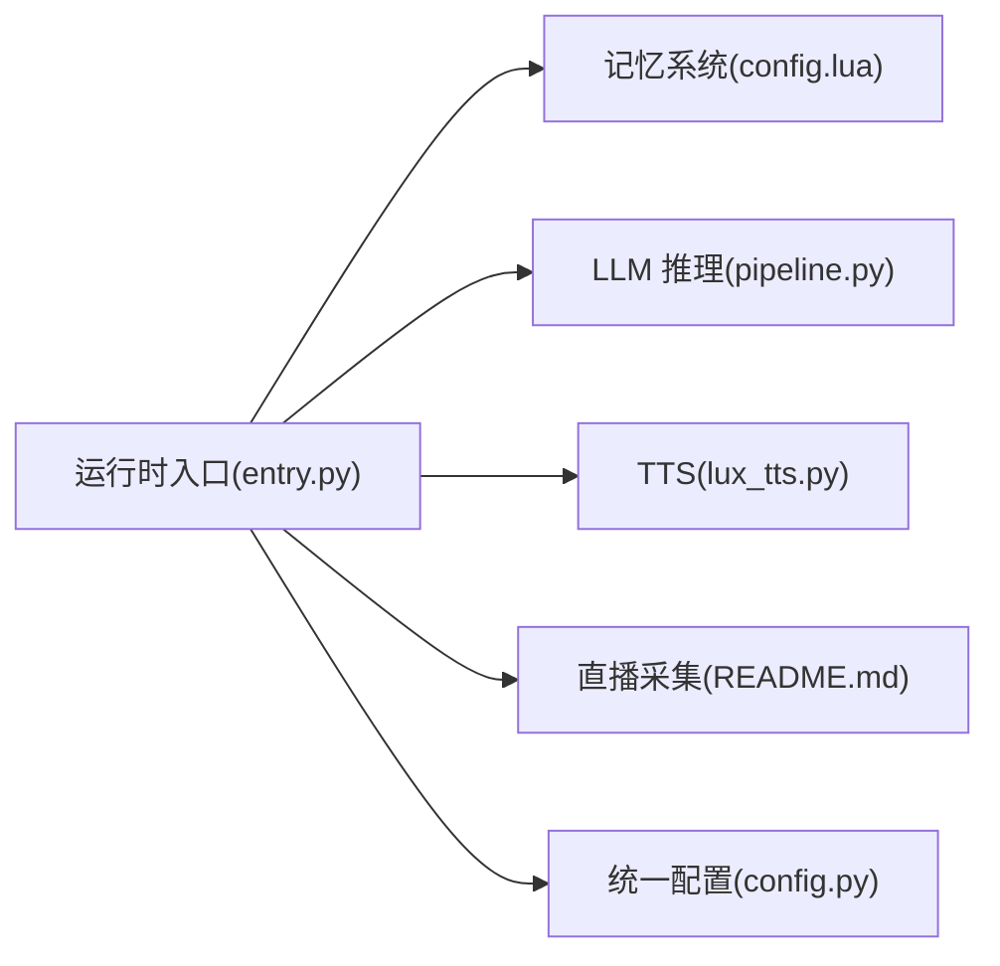

# 项目介绍

<cite>
**本文引用的文件**
- [README.md](file://README.md)
- [main.py](file://main.py)
- [vtuber.py](file://vtuber.py)
- [mori_runtime/entry.py](file://mori_runtime/entry.py)
- [mori_runtime/config.py](file://mori_runtime/config.py)
- [mori_llm/pipeline.py](file://mori_llm/pipeline.py)
- [mori_memory/README.md](file://mori_memory/README.md)
- [mori_memory/module/config.lua](file://mori_memory/module/config.lua)
- [mori_live_stream/README.md](file://mori_live_stream/README.md)
- [mori_live2d/README.md](file://mori_live2d/README.md)
- [mori_tts/lux_tts.py](file://mori_tts/lux_tts.py)
</cite>

## 目录
1. [简介](#简介)
2. [项目结构](#项目结构)
3. [核心组件](#核心组件)
4. [架构总览](#架构总览)
5. [详细组件分析](#详细组件分析)
6. [依赖分析](#依赖分析)
7. [性能考量](#性能考量)
8. [故障排查指南](#故障排查指南)
9. [结论](#结论)
10. [附录](#附录)

## 简介
Mori 是一个以“本地化、低成本、可扩展”为核心的 AI VTuber/助手系统。其核心理念与独特价值主张包括：
- 不依赖 LLM 规模：通过 llama.cpp 本地推理，避免对超大模型的资源占用与推理成本。
- 无需 token 费用：本地模型运行，无云端调用与按次付费，降低长期运营成本。
- 创新记忆系统：采用线程优先（thread-first）的记忆设计，结合主题图谱与多策略检索，实现高召回与可控的上下文编译，从而在中小模型上也能获得接近“长上下文”的表现。
- Python 洁癖：以简洁、可维护的 Python 代码组织模块，强调可读性与可演进性，减少不必要的复杂度。

项目采用类 monorepo 架构，将记忆核心、LLM 推理、TTS、直播采集与 Live2D 前端等子模块解耦，既保证独立演进，又通过统一入口与配置实现无缝协作。

## 项目结构
Mori 仓库采用“主入口 + 子模块”的组织方式，核心入口脚本位于根目录，各子系统以独立包/模块形式提供功能：
- 主入口
  - CLI 启动器：main.py
  - VTuber 启动器：vtuber.py
- 运行时与配置
  - 运行时入口与桥接：mori_runtime/entry.py
  - 统一配置解析：mori_runtime/config.py
- 记忆系统
  - 记忆核心文档：mori_memory/README.md
  - 记忆配置与策略：mori_memory/module/config.lua
- LLM 推理
  - llama.cpp 服务封装与流水线：mori_llm/pipeline.py
- 直播采集
  - Bilibili 弹幕采集与桥接：mori_live_stream/README.md
- TTS
  - LuxTTS 实现：mori_tts/lux_tts.py
- Live2D 前端
  - Inochi2D/Love2D 集成与参数映射：mori_live2d/README.md

**图表来源**
- [main.py](file://main.py)
- [vtuber.py](file://vtuber.py)
- [mori_runtime/entry.py](file://mori_runtime/entry.py)
- [mori_runtime/config.py](file://mori_runtime/config.py)
- [mori_llm/pipeline.py](file://mori_llm/pipeline.py)
- [mori_memory/module/config.lua](file://mori_memory/module/config.lua)
- [mori_live_stream/README.md](file://mori_live_stream/README.md)
- [mori_tts/lux_tts.py](file://mori_tts/lux_tts.py)
- [mori_live2d/README.md](file://mori_live2d/README.md)

**章节来源**
- [README.md](file://README.md)
- [main.py](file://main.py)
- [vtuber.py](file://vtuber.py)
- [mori_runtime/entry.py](file://mori_runtime/entry.py)
- [mori_runtime/config.py](file://mori_runtime/config.py)

## 核心组件
- 运行时与桥接（mori_runtime）
  - 提供 Python 与 LuaJIT 的桥接层，负责消息队列、TTS 任务调度、LLM 推理与直播采集的统一编排。
  - 支持 stdin 与 Bilibili 弹幕输入，统一注入到记忆系统与 LLM 流水线。
- 记忆系统（mori_memory）
  - 线程优先的记忆设计，围绕“话题图谱 + 多策略检索 + 上下文编译”构建，兼顾召回、稳定性与可控长度。
  - 支持 HNSW 索引与 SIMD 点积加速，可在无原生模块时回退至纯 Lua 实现。
- LLM 推理（mori_llm）
  - 封装 llama.cpp 的本地推理服务，提供同步/流式对话与向量嵌入能力，支持草稿模型与推理优化参数。
- 直播采集（mori_live_stream）
  - 以 LuaJIT + libcurl 的薄桥接实现 Bilibili 弹幕轮询，便于与 Lua 组件保持一致。
- TTS（mori_tts）
  - LuxTTS 作为默认 TTS 引擎，支持参考音色编码、采样步数、引导强度、语速等参数，兼顾质量与延迟。
- Live2D 前端（mori_live2d）
  - 通过 Love2D + Inox2D 渲染 Live2D 模型，驱动嘴形与基础动画，配合字幕与音频进行 VTuber 展示。

**章节来源**
- [mori_runtime/entry.py](file://mori_runtime/entry.py)
- [mori_memory/README.md](file://mori_memory/README.md)
- [mori_memory/module/config.lua](file://mori_memory/module/config.lua)
- [mori_llm/pipeline.py](file://mori_llm/pipeline.py)
- [mori_live_stream/README.md](file://mori_live_stream/README.md)
- [mori_tts/lux_tts.py](file://mori_tts/lux_tts.py)
- [mori_live2d/README.md](file://mori_live2d/README.md)

## 架构总览
Mori 的运行时以 Python 为主线程，通过 lupa 将 LuaJIT 模块（记忆、直播、运行时插件）纳入统一调度。数据流从输入（stdin/弹幕）进入 Inbox，经记忆编译上下文，交由 LLM 生成回复，再由 TTS 生成音频并写入 live 目录，供前端渲染与字幕叠加。

**图表来源**
- [mori_runtime/entry.py](file://mori_runtime/entry.py)
- [mori_llm/pipeline.py](file://mori_llm/pipeline.py)
- [mori_tts/lux_tts.py](file://mori_tts/lux_tts.py)
- [mori_live2d/README.md](file://mori_live2d/README.md)

## 详细组件分析

### 记忆系统（线程优先设计）
- 设计要点
  - 线程优先：以“对话回合/线程”为基本单元组织记忆，避免传统“全局上下文”带来的噪声与膨胀。
  - 主题图谱：围绕话题节点建立邻接关系，支持跨回合的主题迁移与跨话题的桥接检索。
  - 多策略检索：结合语义相似、主题局部先验、趋势候选、精确匹配等策略，提升召回与稳定性。
  - 上下文编译：根据查询向量与主题状态，动态选择合适的记忆片段，控制上下文长度与质量。
- 性能与可扩展性
  - 可选 HNSW 索引与 SIMD 点积加速，显著降低检索时间；缺失时自动回退。
  - 内置垃圾回收与 TTL 控制，防止长期运行导致的内存膨胀。
- 配置与策略
  - 通过 config.lua 提供丰富的策略参数（如主题容量、检索上限、反馈学习率等），并支持策略档位与动态阈值控制器。

**图表来源**
- [mori_memory/module/config.lua](file://mori_memory/module/config.lua)

**章节来源**
- [mori_memory/README.md](file://mori_memory/README.md)
- [mori_memory/module/config.lua](file://mori_memory/module/config.lua)

### LLM 推理（本地 llama.cpp）
- 能力概览
  - 启动本地 llama-server，提供聊天与嵌入接口。
  - 支持草稿模型（draft model）与推理参数（温度、top_p、最大 token 等）。
  - 流式/非流式两种生成模式，适配不同场景。
- 错误处理
  - 对健康检查、HTTP 请求异常、JSON 解析错误进行分类处理，确保稳定性。
- 与记忆/运行时的协作
  - 通过统一的消息格式与参数传递，与记忆编译结果无缝衔接。

**图表来源**
- [mori_llm/pipeline.py](file://mori_llm/pipeline.py)

**章节来源**
- [mori_llm/pipeline.py](file://mori_llm/pipeline.py)

### 运行时入口与桥接（Python + LuaJIT）
- 功能职责
  - 统一 CLI/VTuber 入口，解析统一配置，初始化 LuaJIT 运行时与模块路径。
  - 管道 stdin 与 Bilibili 弹幕输入，维护 Inbox 队列，处理优先级与中断策略。
  - 管理 LLM 与 TTS 生命周期，提供任务提交与完成回调。
- 配置机制
  - 支持 mori.config.json 的多档位配置（common/cli/vtuber/tts/love2d/inochi），自动解析相对路径与默认值。
- 与子模块协作
  - 通过 lupa 注入 Python 对象到 Lua，实现双向桥接（如记忆 API、TTS 任务、直播轮询）。

**图表来源**
- [mori_runtime/entry.py](file://mori_runtime/entry.py)
- [mori_runtime/config.py](file://mori_runtime/config.py)

**章节来源**
- [mori_runtime/entry.py](file://mori_runtime/entry.py)
- [mori_runtime/config.py](file://mori_runtime/config.py)

### 直播采集（Bilibili 弹幕轮询）
- 能力概览
  - 使用 LuaJIT + libcurl 实现弹幕轮询，支持历史回放、离线退出、定时检查等。
  - 与运行时入口集成，将弹幕转换为统一消息结构注入 Inbox。
- 限制与建议
  - 当前为简单轮询接口，注意 412/限流问题，必要时调整 UA、间隔或升级为 WebSocket 方案。

**章节来源**
- [mori_live_stream/README.md](file://mori_live_stream/README.md)
- [mori_runtime/entry.py](file://mori_runtime/entry.py)

### TTS（LuxTTS）
- 能力概览
  - 支持参考音色编码、采样步数、引导强度、t_shift、语速等参数，兼顾质量与实时性。
  - 通过线程池异步合成，支持任务取消与批量完成回调。
- 设备与性能
  - 自动检测 CUDA/MPS/CPU，优先 GPU；支持线程数配置与平滑输出选项。

**章节来源**
- [mori_tts/lux_tts.py](file://mori_tts/lux_tts.py)
- [mori_runtime/entry.py](file://mori_runtime/entry.py)

### Live2D 前端（Love2D + Inox2D）
- 能力概览
  - 通过 Love2D + Inox2D 渲染 Live2D 模型，驱动嘴形与基础动画。
  - 支持参数映射（.mori-map）、鼠标视角、Idle 动画、字体与 UI 尺寸等配置。
- 限制与建议
  - 当前 Inox2D 处于原型期，部分模型部件可能不渲染；建议使用 Aka/Midori 验证链路。

**章节来源**
- [mori_live2d/README.md](file://mori_live2d/README.md)

## 依赖分析
- 组件耦合
  - 运行时入口对 LLM、记忆、TTS、直播采集形成高层协调，彼此通过桥接对象解耦。
  - 记忆系统与 LLM 通过“向量 + 主题状态”交互，形成“检索-编译-生成”的闭环。
- 外部依赖
  - llama.cpp 二进制与模型文件、lupa、LuaJIT 模块、Torch/SoundFile（LuxTTS）。
- 配置与路径
  - 统一配置文件支持多档位与相对路径解析，避免硬编码与环境漂移。

**图表来源**
- [mori_runtime/entry.py](file://mori_runtime/entry.py)
- [mori_runtime/config.py](file://mori_runtime/config.py)
- [mori_llm/pipeline.py](file://mori_llm/pipeline.py)
- [mori_memory/module/config.lua](file://mori_memory/module/config.lua)
- [mori_tts/lux_tts.py](file://mori_tts/lux_tts.py)
- [mori_live_stream/README.md](file://mori_live_stream/README.md)

**章节来源**
- [mori_runtime/entry.py](file://mori_runtime/entry.py)
- [mori_runtime/config.py](file://mori_runtime/config.py)

## 性能考量
- 记忆检索
  - 在具备 HNSW 与 SIMD 的环境下，检索延迟显著下降；缺失时回退纯 Lua，仍可满足日常使用。
- LLM 推理
  - 通过草稿模型与推理参数调优，平衡吞吐与质量；GPU 加速优先，CPU 场景建议减小上下文与最大 token。
- TTS 合成
  - LuxTTS 支持较小的采样步数与较低的引导强度以降低延迟；平滑输出可提升音质但增加耗时。
- 运行时队列与背压
  - Inbox 队列具备容量与丢弃策略，避免上游洪峰导致下游阻塞。

[本节为通用指导，无需具体文件分析]

## 故障排查指南
- 缺少依赖
  - 运行时缺少 lupa：请激活虚拟环境并安装依赖。
  - TTS 缺少 LuxTTS 依赖：执行安装脚本后重试。
- LLM 启动失败
  - 检查 llama-server 路径与模型文件是否存在；确认端口未被占用。
- 记忆写入/读取异常
  - 确认持久化路径与 base_dir 设置；检查 HNSW/SIMD 模块是否正确构建。
- 直播采集 412/限流
  - 调整轮询间隔、更换 UA 或升级为 WebSocket 方案。
- Live2D 前端渲染异常
  - 检查模型部件类型与参数映射；在 Wayland 环境可尝试 X11 模式。

**章节来源**
- [mori_runtime/entry.py](file://mori_runtime/entry.py)
- [mori_tts/lux_tts.py](file://mori_tts/lux_tts.py)
- [mori_live_stream/README.md](file://mori_live_stream/README.md)
- [mori_live2d/README.md](file://mori_live2d/README.md)

## 结论
Mori 通过“本地化 + 记忆系统 + 多模块解耦”的组合，实现了在中小模型与低成本硬件上，依然具备高质量、低 token 成本的 VTuber/助手体验。其类 monorepo 架构让各子模块既能独立演进，又能通过统一入口与配置协同工作。对于希望自建本地 AI VTuber 或智能助手的用户，Mori 提供了清晰的路径与可扩展的空间。

[本节为总结性内容，无需具体文件分析]

## 附录
- 快速启动
  - 初始化子模块与依赖后，编写统一配置文件，使用 CLI/VTuber 入口启动。
- 常用参数
  - LLM 上下文大小、最大 token、温度、top_p；TTS 采样步数、引导强度、语速；Live2D 参数映射与渲染尺寸。

**章节来源**
- [README.md](file://README.md)
- [mori_runtime/config.py](file://mori_runtime/config.py)