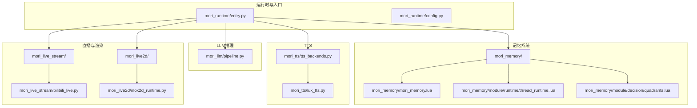
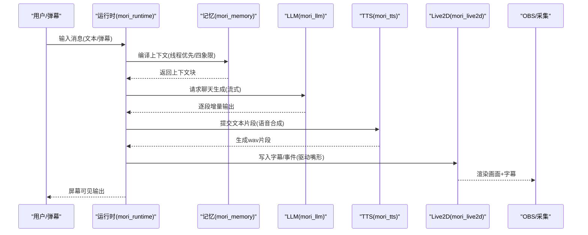
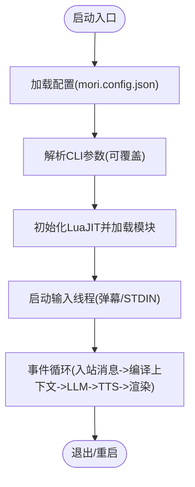
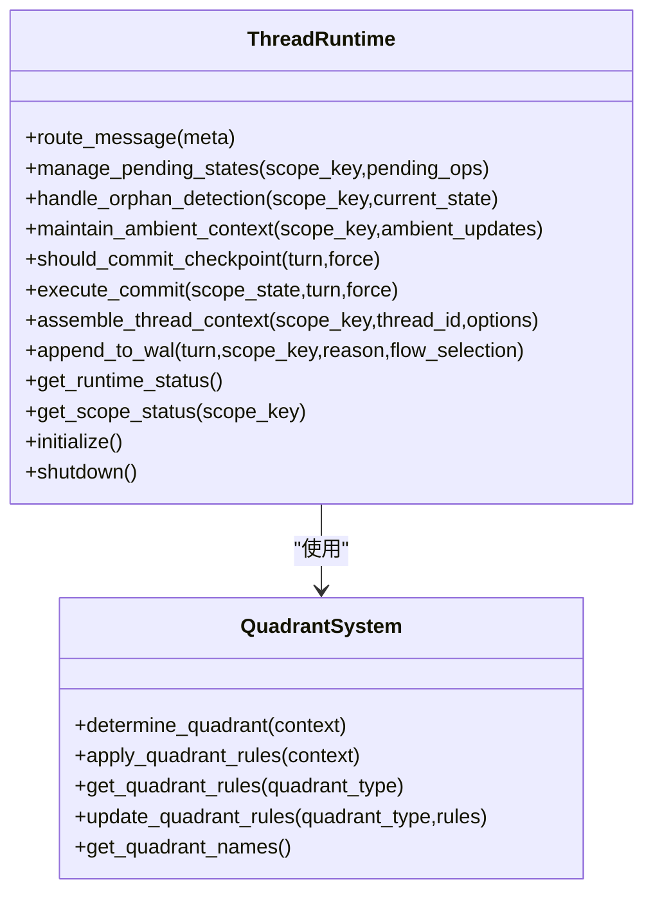
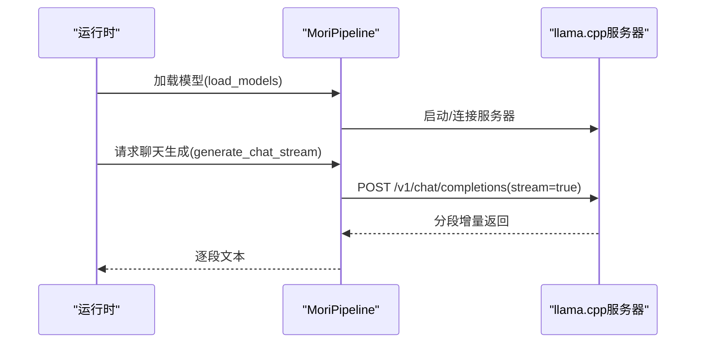
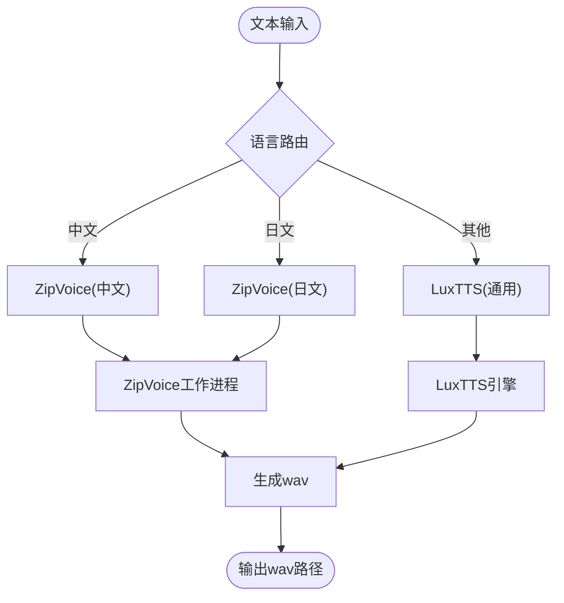
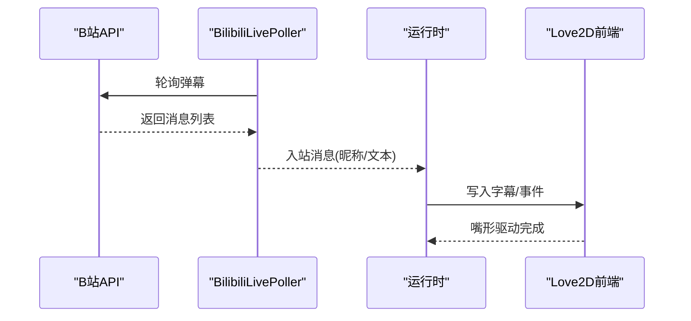
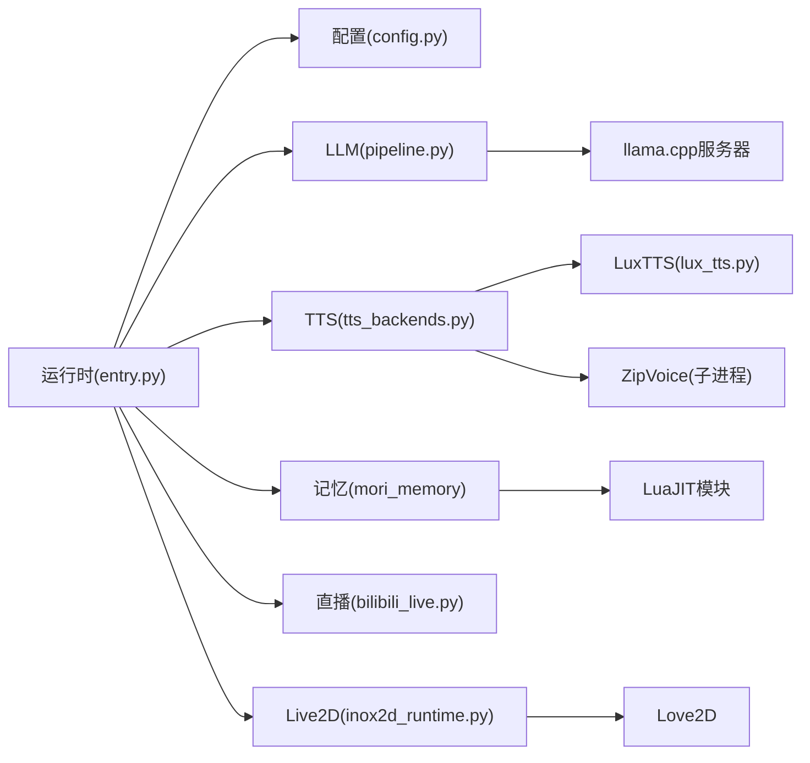

# 项目概述

<cite>
**本文引用的文件**
- [README.md](file://README.md)
- [mori_runtime/entry.py](file://mori_runtime/entry.py)
- [mori_runtime/config.py](file://mori_runtime/config.py)
- [mori_llm/pipeline.py](file://mori_llm/pipeline.py)
- [mori_tts/lux_tts.py](file://mori_tts/lux_tts.py)
- [mori_tts/tts_backends.py](file://mori_tts/tts_backends.py)
- [mori_live2d/README.md](file://mori_live2d/README.md)
- [mori_live2d/inox2d_runtime.py](file://mori_live2d/inox2d_runtime.py)
- [mori_live_stream/README.md](file://mori_live_stream/README.md)
- [mori_live_stream/bilibili_live.py](file://mori_live_stream/bilibili_live.py)
- [mori_memory/README.md](file://mori_memory/README.md)
- [mori_memory/mori_memory.lua](file://mori_memory/mori_memory.lua)
- [mori_memory/module/runtime/thread_runtime.lua](file://mori_memory/module/runtime/thread_runtime.lua)
- [mori_memory/module/decision/quadrants.lua](file://mori_memory/module/decision/quadrants.lua)
</cite>

## 目录
1. [简介](#简介)
2. [项目结构](#项目结构)
3. [核心组件](#核心组件)
4. [架构总览](#架构总览)
5. [详细组件分析](#详细组件分析)
6. [依赖关系分析](#依赖关系分析)
7. [性能考量](#性能考量)
8. [故障排查指南](#故障排查指南)
9. [结论](#结论)
10. [附录](#附录)

## 简介
Mori 是一个“不依赖LLM规模、无需token费用”的本地化AI VTuber系统，强调低成本、低门槛与高自由度。项目通过本地运行的推理服务与可插拔的记忆系统，实现“无外部token计费”的对话体验；并通过独特的“线程优先”记忆设计，提供更贴合多用户互动场景的上下文组织方式。

- 核心价值主张
  - 本地化推理：基于 llama.cpp 的本地大模型服务，避免云端token成本与网络依赖。
  - 无token费用：通过本地模型与离线推理，彻底摆脱按token计费模式。
  - 独特记忆系统：以“线程优先”为核心，结合四象限决策与主题图谱，形成可扩展、可恢复的记忆架构。
  - 多模态VTuber：支持字幕、TTS语音合成、Live2D/Inochi2D渲染与B站直播弹幕接入，适合OBS等工具链集成。

- 技术特色
  - 多语言混合路由：ZipVoice后端支持中日语言自动识别与路由，提升多语种表达一致性。
  - LuaJIT + Python 混合运行：Lua负责记忆与决策，Python负责运行时调度、TTS与直播接入。
  - 可插拔TTS：支持 LuxTTS 与 ZipVoice 两种后端，兼顾易用性与音色多样性。
  - 可视化Live2D：Love2D + Inox2D 前端，配合字幕与音频事件驱动嘴形同步。

- 项目理念
  - “轻量化、可落地、可扩展”：在普通消费级硬件上即可运行，适合个人/小团队VTuber场景。
  - “可配置即入口”：统一配置文件 mori.config.json，简化启动与参数管理。

**章节来源**
- [README.md:1-179](file://README.md#L1-L179)

## 项目结构
Mori 采用近似 monorepo 的组织方式，将运行时、记忆、LLM、TTS、Live2D、直播接入等模块集中管理，并通过 Python/Lua 混合架构实现模块间协作。

**图表来源**
- [mori_runtime/entry.py:414-438](file://mori_runtime/entry.py#L414-L438)
- [mori_runtime/config.py:9-270](file://mori_runtime/config.py#L9-L270)
- [mori_llm/pipeline.py:307-582](file://mori_llm/pipeline.py#L307-L582)
- [mori_memory/mori_memory.lua:1-3](file://mori_memory/mori_memory.lua#L1-L3)
- [mori_memory/module/runtime/thread_runtime.lua:1-260](file://mori_memory/module/runtime/thread_runtime.lua#L1-L260)
- [mori_memory/module/decision/quadrants.lua:1-285](file://mori_memory/module/decision/quadrants.lua#L1-L285)
- [mori_tts/lux_tts.py:65-171](file://mori_tts/lux_tts.py#L65-L171)
- [mori_tts/tts_backends.py:525-800](file://mori_tts/tts_backends.py#L525-L800)
- [mori_live_stream/bilibili_live.py:93-221](file://mori_live_stream/bilibili_live.py#L93-L221)
- [mori_live2d/inox2d_runtime.py:32-64](file://mori_live2d/inox2d_runtime.py#L32-L64)

**章节来源**
- [README.md:10-17](file://README.md#L10-L17)
- [mori_runtime/entry.py:414-438](file://mori_runtime/entry.py#L414-L438)

## 核心组件
- 运行时与入口（mori_runtime）
  - 提供统一 CLI/入口，负责加载配置、启动LLM服务、调度TTS与直播模块，并通过 LuaJIT 桥接记忆系统。
  - 支持统一配置文件 mori.config.json，自动解析路径与参数，兼容命令行覆盖。

- 记忆系统（mori_memory）
  - 以“线程优先”为核心，结合四象限决策与主题图谱，实现上下文选择、路由与检查点管理。
  - 提供 LuaJIT API，支持嵌入式使用；可选原生模块加速（HNSW/SIMD）。

- LLM推理（mori_llm）
  - 基于 llama.cpp 的本地推理服务，封装聊天与嵌入接口，支持流式生成与参数控制。

- TTS（mori_tts）
  - 支持 LuxTTS 与 ZipVoice 两种后端，提供多语种路由、提示音编码缓存、质量档位与并发队列管理。

- 直播与渲染（mori_live_stream / mori_live2d）
  - 直播接入：B站弹幕轮询，支持历史回放与断线重连策略。
  - Live2D：Love2D + Inox2D 前端，通过事件驱动嘴形同步与字幕叠加。

**章节来源**
- [mori_runtime/entry.py:596-800](file://mori_runtime/entry.py#L596-L800)
- [mori_runtime/config.py:188-270](file://mori_runtime/config.py#L188-L270)
- [mori_memory/README.md:1-89](file://mori_memory/README.md#L1-L89)
- [mori_llm/pipeline.py:307-582](file://mori_llm/pipeline.py#L307-L582)
- [mori_tts/lux_tts.py:65-171](file://mori_tts/lux_tts.py#L65-L171)
- [mori_tts/tts_backends.py:525-800](file://mori_tts/tts_backends.py#L525-L800)
- [mori_live_stream/README.md:1-26](file://mori_live_stream/README.md#L1-L26)
- [mori_live2d/README.md:1-157](file://mori_live2d/README.md#L1-L157)

## 架构总览
Mori 的整体数据流如下：用户输入（键盘/弹幕）进入运行时，经记忆系统编译上下文，LLM生成回复，TTS合成语音，Live2D/字幕渲染，最终输出到OBS等工具链。

**图表来源**
- [mori_runtime/entry.py:479-580](file://mori_runtime/entry.py#L479-L580)
- [mori_memory/module/runtime/thread_runtime.lua:155-171](file://mori_memory/module/runtime/thread_runtime.lua#L155-L171)
- [mori_llm/pipeline.py:519-574](file://mori_llm/pipeline.py#L519-L574)
- [mori_tts/tts_backends.py:525-800](file://mori_tts/tts_backends.py#L525-L800)
- [mori_live2d/README.md:107-127](file://mori_live2d/README.md#L107-L127)

## 详细组件分析

### 运行时与配置（mori_runtime）
- 统一入口与参数解析
  - 支持从 mori.config.json 自动加载默认参数，命令行可覆盖。
  - 解析路径为绝对路径，确保跨目录运行一致性。
- LuaJIT 模块加载
  - 动态追加包路径，加载 mori_runtime、mori_memory、mori_live_stream 的 Lua 模块。
- 弹幕与标准输入线程
  - 提供 B站轮询线程与标准输入线程，统一入站消息队列，支持优先级与退出策略。

**图表来源**
- [mori_runtime/config.py:188-270](file://mori_runtime/config.py#L188-L270)
- [mori_runtime/entry.py:414-438](file://mori_runtime/entry.py#L414-L438)
- [mori_runtime/entry.py:479-580](file://mori_runtime/entry.py#L479-L580)

**章节来源**
- [mori_runtime/config.py:9-270](file://mori_runtime/config.py#L9-L270)
- [mori_runtime/entry.py:582-800](file://mori_runtime/entry.py#L582-L800)

### 记忆系统（mori_memory）
- 线程优先设计
  - 将每轮对话视为“线程”，围绕线程进行上下文选择与主题演化，适配多用户/多话题场景。
- 四象限决策
  - 基于“人口压力/交互拓扑”二维坐标，划分四象限，为不同场景制定差异化路由与阈值策略。
- 运行时与检查点
  - 维护路由状态、待处理孤儿、环境上下文与WAL，定期检查点落盘，保证一致性与可恢复性。

**图表来源**
- [mori_memory/module/runtime/thread_runtime.lua:24-258](file://mori_memory/module/runtime/thread_runtime.lua#L24-L258)
- [mori_memory/module/decision/quadrants.lua:208-285](file://mori_memory/module/decision/quadrants.lua#L208-L285)

**章节来源**
- [mori_memory/README.md:1-89](file://mori_memory/README.md#L1-L89)
- [mori_memory/mori_memory.lua:1-3](file://mori_memory/mori_memory.lua#L1-L3)
- [mori_memory/module/runtime/thread_runtime.lua:1-260](file://mori_memory/module/runtime/thread_runtime.lua#L1-L260)
- [mori_memory/module/decision/quadrants.lua:1-285](file://mori_memory/module/decision/quadrants.lua#L1-L285)

### LLM推理（mori_llm）
- llama.cpp 服务封装
  - 启动本地推理服务，提供聊天与嵌入接口；支持草稿模型、GPU层数、上下文大小等参数。
  - 流式生成接口，逐段返回增量文本，便于与TTS/渲染联动。
- 参数与错误处理
  - 对异常响应与HTTP错误进行统一处理，保障稳定性。

**图表来源**
- [mori_llm/pipeline.py:307-582](file://mori_llm/pipeline.py#L307-L582)

**章节来源**
- [mori_llm/pipeline.py:307-582](file://mori_llm/pipeline.py#L307-L582)

### TTS（mori_tts）
- LuxTTS
  - 基于 ZipVoice 的 LuxTTS 实现，支持提示音编码缓存、采样步数、引导强度、速度等参数。
- ZipVoice
  - 多语种路由（中/日），支持语言检测器（启发式/lingua）、提示音清单、质量档位与并发工作进程。
  - 通过独立 Python 子进程承载推理，降低主线程阻塞风险。

**图表来源**
- [mori_tts/tts_backends.py:525-800](file://mori_tts/tts_backends.py#L525-L800)
- [mori_tts/lux_tts.py:65-171](file://mori_tts/lux_tts.py#L65-L171)

**章节来源**
- [mori_tts/tts_backends.py:525-800](file://mori_tts/tts_backends.py#L525-L800)
- [mori_tts/lux_tts.py:65-171](file://mori_tts/lux_tts.py#L65-L171)

### 直播与渲染（mori_live_stream / mori_live2d）
- 直播接入（B站）
  - 使用 LuaJIT + libcurl 的轮询实现，支持去重、历史回放与断线检查。
- Live2D 渲染
  - Love2D + Inox2D 前端，通过事件文件驱动嘴形同步；支持参数映射与调试信息显示。

**图表来源**
- [mori_live_stream/bilibili_live.py:93-221](file://mori_live_stream/bilibili_live.py#L93-L221)
- [mori_live2d/README.md:107-127](file://mori_live2d/README.md#L107-L127)

**章节来源**
- [mori_live_stream/README.md:1-26](file://mori_live_stream/README.md#L1-L26)
- [mori_live_stream/bilibili_live.py:93-221](file://mori_live_stream/bilibili_live.py#L93-L221)
- [mori_live2d/README.md:1-157](file://mori_live2d/README.md#L1-L157)
- [mori_live2d/inox2d_runtime.py:32-64](file://mori_live2d/inox2d_runtime.py#L32-L64)

## 依赖关系分析
- 运行时依赖
  - Python 依赖 lupa（LuaJIT运行时）、requests（HTTP）、subprocess（llama.cpp进程）、concurrent.futures（TTS并发）。
- 记忆系统依赖
  - LuaJIT 模块加载；可选原生模块（HNSW/SIMD）提升检索效率。
- LLM 依赖
  - llama.cpp 二进制与模型文件；支持草稿模型与GPU加速。
- TTS 依赖
  - LuxTTS：PyTorch、soundfile、zipvoice.luxvoice。
  - ZipVoice：独立 Python 环境与 ZipVoice 仓库，工作进程通信。
- Live2D 依赖
  - Love2D + Rust（Inox2D FFI）+ OpenGL 相关库。

**图表来源**
- [mori_runtime/entry.py:414-438](file://mori_runtime/entry.py#L414-L438)
- [mori_llm/pipeline.py:307-582](file://mori_llm/pipeline.py#L307-L582)
- [mori_tts/tts_backends.py:525-800](file://mori_tts/tts_backends.py#L525-L800)
- [mori_tts/lux_tts.py:65-171](file://mori_tts/lux_tts.py#L65-L171)
- [mori_live2d/inox2d_runtime.py:32-64](file://mori_live2d/inox2d_runtime.py#L32-L64)
- [mori_live_stream/bilibili_live.py:93-221](file://mori_live_stream/bilibili_live.py#L93-L221)

**章节来源**
- [mori_runtime/entry.py:414-438](file://mori_runtime/entry.py#L414-L438)
- [mori_llm/pipeline.py:307-582](file://mori_llm/pipeline.py#L307-L582)
- [mori_tts/tts_backends.py:525-800](file://mori_tts/tts_backends.py#L525-L800)
- [mori_tts/lux_tts.py:65-171](file://mori_tts/lux_tts.py#L65-L171)
- [mori_live2d/README.md:1-157](file://mori_live2d/README.md#L1-L157)
- [mori_live_stream/README.md:1-26](file://mori_live_stream/README.md#L1-L26)

## 性能考量
- 记忆检索加速
  - 可选 HNSW 主题质心索引与 SIMD 点积/余弦计算，显著降低检索时间。
- LLM 推理优化
  - GPU 层数、草稿模型、上下文大小与推理参数（温度、top_p、最大token）直接影响延迟与吞吐。
- TTS 并发与质量
  - ZipVoice 通过独立子进程与多线程参数控制吞吐；质量档位影响采样步数与生成时长。
- Live2D 渲染
  - 参数映射与帧率控制影响嘴形同步精度与CPU占用。

[本节为通用指导，无需具体文件引用]

## 故障排查指南
- LLM 服务无法启动
  - 检查 llama.cpp 二进制路径与模型文件是否存在；确认端口未被占用。
  - 参考：[mori_llm/pipeline.py:99-174](file://mori_llm/pipeline.py#L99-L174)
- TTS 依赖缺失
  - LuxTTS：执行安装脚本，确保 PyTorch/soundfile/zipvoice.luxvoice 可用。
  - ZipVoice：确认独立 Python 环境与 ZipVoice 仓库路径正确。
  - 参考：[mori_tts/lux_tts.py:74-83](file://mori_tts/lux_tts.py#L74-L83)，[mori_tts/tts_backends.py:668-703](file://mori_tts/tts_backends.py#L668-L703)
- Live2D 构建失败
  - 缺少 cargo/Rust 工具链或OpenGL依赖；按提示安装后重试。
  - 参考：[mori_live2d/inox2d_runtime.py:25-30](file://mori_live2d/inox2d_runtime.py#L25-L30)
- 弹幕轮询异常
  - 检查房间ID、UA与限流策略；必要时增加轮询间隔或改用 WebSocket（后续升级）。
  - 参考：[mori_live_stream/README.md:25](file://mori_live_stream/README.md#L25)，[mori_live_stream/bilibili_live.py:93-221](file://mori_live_stream/bilibili_live.py#L93-L221)

**章节来源**
- [mori_llm/pipeline.py:99-174](file://mori_llm/pipeline.py#L99-L174)
- [mori_tts/lux_tts.py:74-83](file://mori_tts/lux_tts.py#L74-L83)
- [mori_tts/tts_backends.py:668-703](file://mori_tts/tts_backends.py#L668-L703)
- [mori_live2d/inox2d_runtime.py:25-30](file://mori_live2d/inox2d_runtime.py#L25-L30)
- [mori_live_stream/README.md:25](file://mori_live_stream/README.md#L25)
- [mori_live_stream/bilibili_live.py:93-221](file://mori_live_stream/bilibili_live.py#L93-L221)

## 结论
Mori 通过“本地推理 + 无token费用 + 线程优先记忆 + 多模态渲染”的组合，为个人与小团队提供了低成本、可扩展的VTuber方案。其模块化架构与统一配置使得部署与运维更加友好，同时为后续引入更强大的推理与记忆能力留足空间。

[本节为总结性内容，无需具体文件引用]

## 附录
- 快速开始
  - 初始化子模块与依赖，准备模型文件，编写 mori.config.json，使用统一入口启动。
  - 参考：[README.md:17-102](file://README.md#L17-L102)
- 运行 VTuber
  - 字幕+可选TTS，支持B站弹幕接入与Live2D渲染。
  - 参考：[README.md:128-179](file://README.md#L128-L179)

**章节来源**
- [README.md:17-102](file://README.md#L17-L102)
- [README.md:128-179](file://README.md#L128-L179)